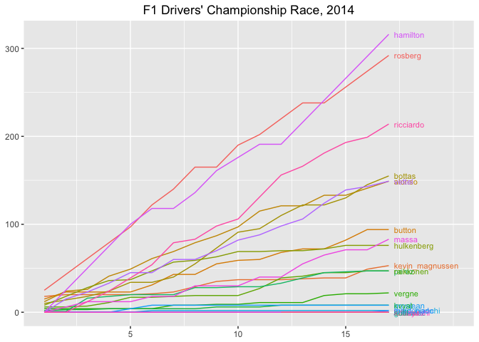
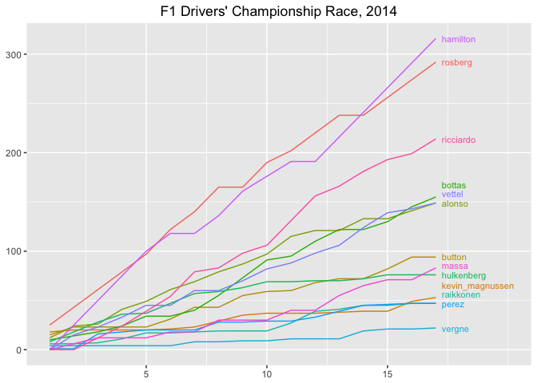
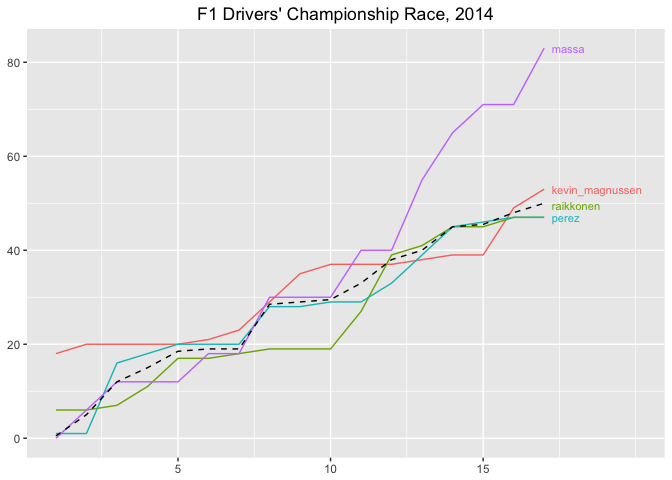
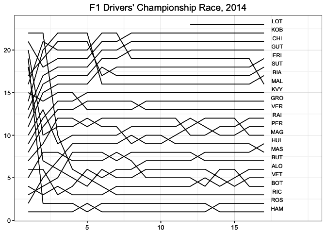
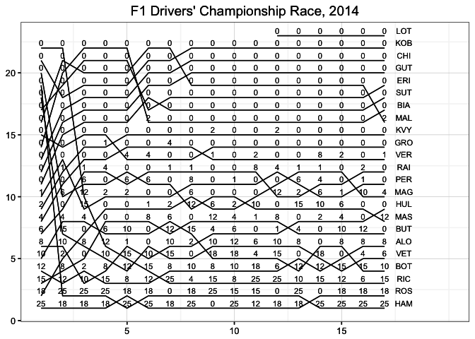
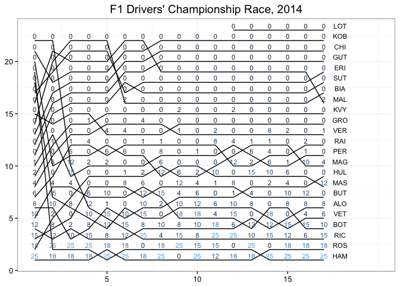
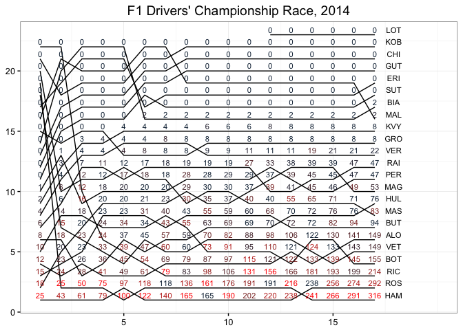

---
output:
  html_document:
    keep_md: yes
---

#Charting the Championship Race

Chart types such as lapcharts and race history charts provide a useful, and conventional, way of summarising the evolution of a particular race. But as well as individual races, the seasonal structure of Formula One means we are also offered a championship race.

In this chapter, we'll explore how can we capture elements of the season long race using informative graphical displays. Many of the chart types will have a familiar feel to them, drawing as they do on the charts used to describe individual races. But that is no bad thing  - it means we can draw on the lessons we have learned previously when it comes to working out what stories the charts have to tell...

## Getting the Championship Data

Perhaps the most obvious way of charting the race to the championship in either the Drivers' or the Constructors' Championship is to plot the total number of points gained to date against each round of the championship for each driver or constructor.

Let's work through an example using the 2014 Championship up to and including round 17. We can pull in the data directly from the online *ergast API*.


```r
#Load in the core utility functions to access ergast API
source('ergastR-core.R')

#Get the standings after each of the first 17 rounds of the 2014 season
df=data.frame()
for (j in seq(1,17)){
  dft=seasonStandings(2014,j)
  dft$round=j
  df=rbind(df,dft)
}
#Data is now in: df
```

| year|driverId        |code | pos| points| wins|car      | round|
|----:|:---------------|:----|---:|------:|----:|:--------|-----:|
| 2014|rosberg         |ROS  |   1|     25|    1|mercedes |     1|
| 2014|kevin_magnussen |MAG  |   2|     18|    0|mclaren  |     1|
| 2014|button          |BUT  |   3|     15|    0|mclaren  |     1|

## Charting a Championship Points Race

To begin with, I'm going to define some basic chart elements to help with the display of the various charts described in this chapter.


```r
library(ggplot2)
library(directlabels)
#The label argument takes one of: code | driverId
#Data for seasons prior to 2005 or so may not include driver codes
championship_race_charter=function(g) {
  #Generate a line chart
  g = g + geom_line()
  #Remove axis labels and colour legend
  g = g + ylab(NULL) + xlab(NULL) + guides(color=FALSE)
  #Add a title
  g = g + ggtitle("F1 Drivers' Championship Race, 2014")
  #Add right hand side padding to the chart so the labels don't overflow
  g + scale_x_continuous(limits=c(1,20), breaks=c(5,10,15))
}
```

Let's now generate our first chart - a plot of points standing of each driver at the end of each round.


```r
#All the other elements of the chart definition are the same
g=ggplot(df,aes(x=round,y=points,colour=driverId))
g=championship_race_charter(g)
direct.label(g,list("last.points",cex=0.7,dl.trans(x=x+0.2)))
```



The `directlabels` library handles the placement of the driver code labels at the end of each line, although some of them are overlapping. The line colouring is rather confusing, but used in this case as the basis for grouping by the `direct.label()` function. (Setting the `fill` rather than the `colour` parameter should also satisfy the needs of `direct.label()`.)

What the chart does clearly show however, is how the championship has split into several different battles. At the top, Hamilton and Rosberg, with Ricciardo on his own third. The battle for fourth includes three drivers, although the clashing line colours and overlapping labels makes it hard to read this race clearly. The battle for 7th also includes three cars, but these are more clearly separated. Finally, the battle for 10th also includes three cars, but the points equivalence makes it really hard to see what's going on here. Using different dashed line styles might help to make this clearer, but the the problem of label overlap would still remain.

The `directlabels` package can be used to adjust the placement of labels in particular circumstances as the following example shows, where I have limited the display to drivers scoring at least 10 points. The `bump.up` placement prevents the labels from overlapping.


```r
df.tenUp=df[df$round==17 & df$points>=10,]$driverId

#All the other elements of the chart definition are the same
g=ggplot(df[df$driverId %in% df.tenUp,],aes(x=round,y=points,colour=driverId))
g= championship_race_charter(g) 
direct.label(g,list('last.bumpup',cex=0.7,dl.trans(x=x+0.2)))
```



We can now more clearly see the labels, although in situations where points totals in the final round are close there may still to be some ambiguity arising from the placing of the labels.

### Probing a Championship Race in More Detail - Adding Guide Lines

As well as charting the whole of a championship race, we can focus in more detail on a particular battle. The following chart shows how we can explore the battle for tenth. In constructing this chart, I have done two things:

* *filter the drivers associated with the battle.* In this example, filter the results to show just the drivers who were contending 10th place at the end of round 10 of the championship;
* *identified the mean number of points calculated over the 10th and 11th positions.*
This value then provides a guide line that helps us see how close to the tenth position, in points terms, the driver in 11th position is.


```r
library(plyr)
#Generate a guide that is the mean points value of 10th and 11th positions
dfx=ddply(df[df['pos']==10 | df['pos']==11,],
  .(round), summarize, points=mean(points))
#Set the driverId of this line to an empty string
dfx$driverId=''

#Identify the drivers fighting for 10th at the end of round 10
#Include other drivers contending this position earlier in the season
#Ideally, we would automatically identify the positions around this cluster
df.contending = df[df$round==10 & df$pos>=9 & df$pos<=12,'driverId']
#The following filter identifies drivers fighting for 10th after 17
##df.contending =df[df$round==17 & df$pos>=10 & df$pos<=12,'driverId']
df.battle=df[df$driverId %in% df.contending,]

#Base chart
g=ggplot(df.battle,aes(x=round,y=points,colour=driverId))
g=championship_race_charter(g)
g=direct.label(g,list('last.bumpup',cex=0.7,dl.trans(x=x+0.2)))
#Add in the guide line
g = g + geom_line(data=dfx, aes(x=round, y=points),
                  col='black', linetype="dashed")
g
```



Once again, the automatic colour selection leaves something to be desired. Using different line styles might also improve the clarity of the charts and make them "photocopy safe".

## Charting the Championship Race Standings

When displaying the championship race as a points race, it can be quite hard at times to see changes in actual position.

If we view the race as a rank based race, using a chart that in many respects resembles a lap chart as used to describe a single race, we can more clearly see changes in the standings by virtue of lines clearly crossing.

If we used the fixed size three letter driver codes, we can label the lines using a simple `geom_text()` method.


```r
#The lap chart style chart - plotting position rather than points
g = ggplot(df, aes(x=round, y=pos,group=driverId))
g = championship_race_charter(g)
#If we know the size of the labels, we can easily fashion our own placement
g = g + geom_text(data=df[df['round']==max(df['round']),],
              aes(x=round+0.9,label=code),size=3, vjust=-0.4)
g = g+theme_bw()
g
```



Although this chart clearly shows how *positions* change over the course of the season, it does not really give us any information about what happened in *points* terms during each round. We can address this by annotating the chart so that it communicates the following information:

* the number of points earned by each driver in a particular round;
* the points standing of each driver at the end of each round.

Let's start by considering the number of points won by each driver at each round. The call we made to the *ergast* API doesn't provide this information directly, but we can easily derive it: sort the data into increasing round then calculate the difference between consecutive points totals.


```r
#Sort by ascending round
df = arrange(df, round)
#Derive how many points each driver scored in each race
df = ddply(df, .(driverId), transform, racepoints=diff(c(0,points)))
```

| round| points| racepoints|
|-----:|------:|----------:|
|     1|     25|         25|
|     2|     43|         18|
|     3|     61|         18|

We can now use the *points scored per race* information to annotate the chart:


```r
g+geom_text(data=df,aes(label=racepoints),vjust=-0.4,size=3)
```



That's okay, insofar as it goes, but we could perhaps add in colour relative to the number of points scored in each race to highlight the higher values a little more clearly.


```r
g + geom_text(data=df, aes(label=racepoints, col=racepoints), vjust=-0.4, size=3)
```



The default colour scheme scales from black to light blue. The higher values look a little washed out and the graphic doesn't work particularly well when printed in black and white, so it might be worth exploring other colour mappings to highlight the higher values more clearly.

Annotating the chart with points scored per race helps us see how well each driver fared in a particular race, but the chart does not give us a sense of how many points separate drivers in the championship standings at the end of each round. We can address this by using the total number of championship points scored to date as the text label, preserving an indication of the number of points awarded for each race by using the colour dimension.


```r
g = g + geom_text(data=df, aes(label=points, col=racepoints), vjust=-0.4, size=3)
#Colour scheme for the points scored in each race
g + scale_color_continuous(high='red')
```



This chart now has the advantage of communicating standings over the course of the season (via the lines), standing changes (the crossed lines), the total number of championship points at the end of each round (from the numerical label), and a comparative indication of the points earned during each round (from the numerical label colour).

Looking down a column, we can compare the number of points separating drivers in the drivers championship at the end of each round. From the colour field we can see how drivers placed next to each other compared in terms of points awarded in each round. Looking along a line, we can (if necessary) calculate the number of points obtained in a particular round as a simple subtraction going from one round to the next.

## Summary

In this chapter, we have started to explore some of the ways in which we can graphically review a season in terms of the race for a Drivers' Championship. The combination of lapchart style graphics and text labels that record the accumulated championship points for each driver at the end of each round shows how close the championship was in terms of points scored across the season. The use of colour further helps to guide the eye towards points scoring drivers within each race.
