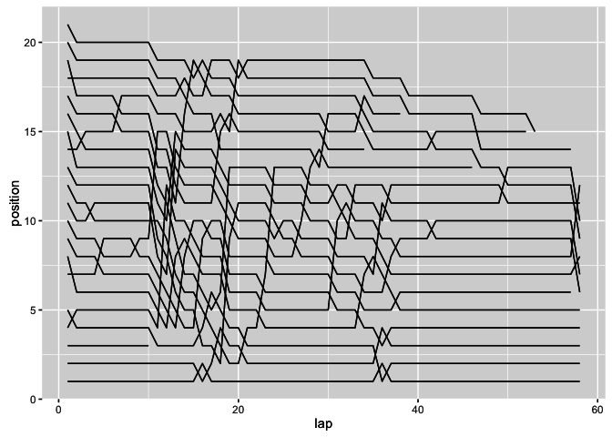
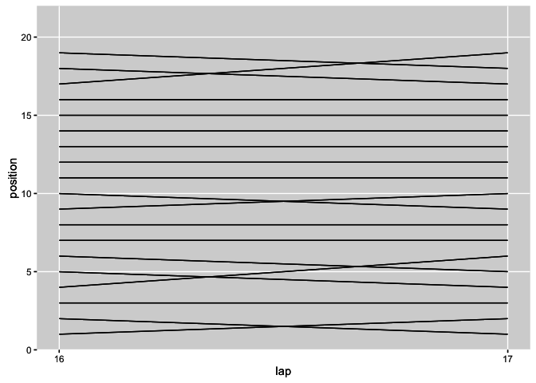
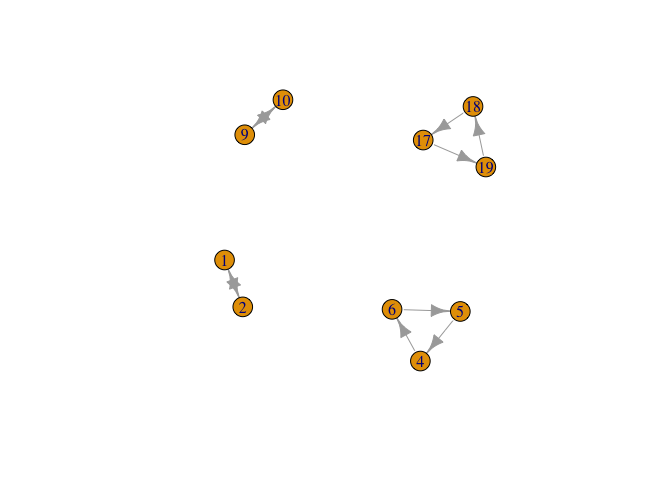
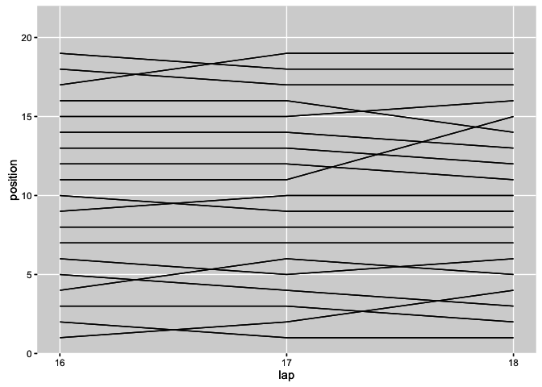
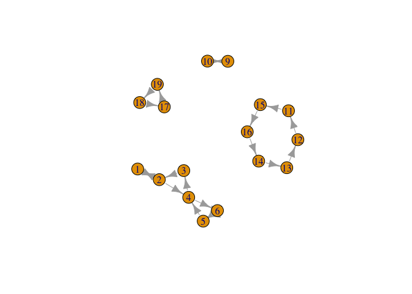

---
output:
  html_document:
    keep_md: yes
---

# Event Detection

When we look at a chart such as a lap chart, it is very clear to us when there is a change in position and which drivers were involved. But can we *automatically* detect which drivers have been involved in a series of position changes between each other over a particular series or laps?

Or consider the more complex race history chart: it's easy enough for us to see from the chart when drivers are close to each other in terms of their total race time up to any particular lap because their race lines are close to each other on the chart. But once again, can we *automatically* detect groups of drivers who are perhaps within a second or so of each other, increasing the chance of an overtake because of the likelihood that DRS will be enabled?

## Detecting Position Change Groupings

Let's grab some example data to explore how we might automatically identify such groupings or clusters amongst the drivers:


```r
library(DBI)
ergastdb =dbConnect(RSQLite::SQLite(), './ergastdb13.sqlite')

#Get a race identifier for a specific race
lapTimes=dbGetQuery(ergastdb,
                  'SELECT driverId, position, lap, milliseconds
                   FROM lapTimes l JOIN races r 
                   WHERE l.raceId=r.raceId AND year="2012" AND round="1"')
```

In the following lap chart sketch, each line represents the evolution of positions held by a particular driver over the course of a race.  Changes in position are identified by crossed lines.


```r
library(ggplot2)

g=ggplot(lapTimes)+geom_line(aes(x=lap,y=position,group=driverId))
g
```



If we zoom in, we can look in detail at the positions held - and that changed (the crossed lines) - over a couple of consecutive laps:


```r
g=g+ scale_x_continuous(breaks = c(16,17),limits=c(16,17))
g+theme( panel.grid.minor = element_blank() )
```



Many of the drivers do not change position at all, but there are position changes between four distinct groups of drivers: those in 1st and 2nd; those in 4th, 5th and 6th; those in 9th and 10th; and those in 17th, 18th and 19th.

How can we identify the positions that are being contested during a particular window of time, where a contested position means that the particular position was held by more than one person in that particular window?

Let's create a couple of new data columns to help us work through how we might identify position changes for each driver between each consecutive lap: a column that identifies the driver's position in the *previous* lap (*pre*), and a column that describes their change in position for the current lap given the previous lap position (*ch*). (Note that we will get an end effect at the start of the race; we really should use grid position as the first entry rather than the dummy 0 value.)

Filter the augmented data set to show just those rows where there is a difference between a driver's current position and previous position (the first column in the result just shows row numbers and can be ignored).


```r
library(plyr)

#Sort by lap first just in case
lapTimes=arrange(lapTimes,driverId,lap)

#Create a couple of new columns
#pre is previous lap position held by a driver given their current lap
#ch is position change between the current and previous lap
tlx=ddply(lapTimes,
          .(driverId),
          transform,
          pre=(c(0,position[-length(position)])),
          ch=diff(c(0,position)))

#Find rows where there is a change between a given lap and its previous lap
llx=tlx[tlx['ch']!=0 & tlx['lap']==17,c("pre","position")]

arrange(llx,pre,position)
```

```
##    pre position
## 1    1        2
## 2    2        1
## 3    4        6
## 4    5        4
## 5    6        5
## 6    9       10
## 7   10        9
## 8   17       19
## 9   18       17
## 10  19       18
```

From the data table, we see distinct groups of individuals who swap positions with each other between those two consecutive steps. So how can we automatically detect the positions that these drivers are fighting over?

An [answer](http://stackoverflow.com/a/25130575/454773) provided in response to a Stack Overflow question on [how to get disjoint sets from a list](http://stackoverflow.com/questions/25130462/get-disjoint-sets-from-a-list-in-r) gives us a nice solution: represent the connections between previous and current lap positions as connected nodes in a graph (that is, a network), and then find the connected components. These components will identify the positions where there was a position change.


A> ###Graph Theory
A>
A> Graph Theory is a branch of mathematics that focuses on ways of describing and analysing networks. A great example is the map of the London Underground network: tube stations are represented as *nodes* in the network, and are connected together by lines referred to as *edges*.
A>
A> *Graphs* (that is, *networks*) can be either *directed* or *undirected*. In a *directed graph*, the edges are represented using arrows and as such have a direction, going *from* one node *to* another. In an *undirected graph*, we represent edges using a simple line that has no direction - it just shows that two nodes are connected to each other.
A>
A> As well as direction, edges may also have a *weight* associated with them, often represented visually by the thickness of the line. The weight identifies the strength of the connection between the two nodes. Graph theory provides a very powerful and elegant way of representing relations between things in the world, and, as in the example described here, can be used in many not immediately obvious, yet still surprisingly useful, ways.
A>
A> Colour may also be applied to nodes and edges in order to highlight additional channels of information.
A>
A> The *igraph* R package contains a wide variety of tools for constructing, analysing and visualising networks and building up your own graph based representations.

Here's my working of the solution. Each row of the previously shown list of results that shows how a particular driver held different positions going from one lap to the next for a specific lap.

We can now create a graph in which nodes represent positions (that is, current lap (*position*) or previous lap (*pre*) values) and edges connect current and previous positions. If we plot the resulting graph, we notice that it is split into several components:


```r
#install.packages("igraph")
#http://stackoverflow.com/a/25130575/454773
library(igraph)
```

```
## 
## Attaching package: 'igraph'
```

```
## The following objects are masked from 'package:stats':
## 
##     decompose, spectrum
```

```
## The following object is masked from 'package:base':
## 
##     union
```

```r
par(bg="white")
plot(graph.data.frame(llx))
```



Notice how the nodes - representing positions - are connected to each other by arrows, showing how a car placed in one position moved to another position going from one particular lap to the next. So for example, we see that the cars in positions 9 and 10 changed place with each other, as did those in positions 1 and 2. The car in 19th went to 18th, the one in 18th to 17th, and the one in 17th fell back to 19th. And so so.

Visually, it's clear to us that the connected nodes form different groups, or clusters. The question we are now faced with is how to identify these distinct components of connected nodes *automatically*? Fortunately, there are well known methods for calculating such things, and the `igraph` package makes it easy for us to call on them:


```r
posclusters = function(edg) {
    g = graph.data.frame(edg)
    split(V(g)$name, clusters(g)$membership)
}

posGraph=posclusters(llx)
```

This gives the following clusters, and their corresponding members:


```r
#Find the position change battles
for (i in 1:length(posGraph))
  print(posGraph[[i]])
```

```
## [1] "1" "2"
## [1] "18" "19" "17"
## [1] "10" "9" 
## [1] "4" "5" "6"
```

How might we generalise this approach? Here are some things that came to my mind:

* allow a wider window within which to identify battles (this means we should be able to  look for clusters over groups of three or more consecutive laps);
* simplify the way we detect position changes for a particular driver; for example, if we take the set of positions held by a driver within the desired window (laps *M* to *M+3*, for example), if the size of the set (that is, its *cardinality*) is greater than one, then we have had at least one position change for that driver within that window. Each set of unique positions held by different drivers that has more than one member can be used to generate a set of distinct, unordered pairs that connect the positions (I think it only matters that they are connected, not that a driver specifically went from position x to position y going from one lap to the next?). If we generate the graph from the set of distinct unordered pairs taken across all drivers, we should then be able to identify the contested/driver change position clusters.

One downside of this approach, as applied over several laps, would be that we might lose information about each particular position change, or lose resolution about repeated changes of position back and forth.

### Extending the Approach to Larger Lap Windows

Rather than try to extend the approach as suggested above, let's just see how well the original method fares when we consider position changes over three laps rather than two. Here's an example of several sorts of position change that are possible within that time frame:


```r
g=g+ scale_x_continuous(breaks = c(16,17,18),limits=c(16,18))
g+theme( panel.grid.minor = element_blank() )
```



As before, we identify rows corresponding to drivers who experienced a position change going from one lap to another, in this case using data for laps 17 and 18 (thus including lap 16, the "pre" lap of column 17):


```r
llx3=tlx[tlx['ch']!=0 & (tlx['lap']==17 | tlx['lap']==18),c("pre","position")]
arrange(llx3,pre,position)
```

```
##    pre position
## 1    1        2
## 2    2        1
## 3    2        4
## 4    3        2
## 5    4        3
## 6    4        6
## 7    5        4
## 8    5        6
## 9    6        5
## 10   6        5
## 11   9       10
## 12  10        9
## 13  11       15
## 14  12       11
## 15  13       12
## 16  14       13
## 17  15       16
## 18  16       14
## 19  17       19
## 20  18       17
## 21  19       18
```

To generalise this approach, it is tempting to create a function that uses data from with a lap window specified by minimum and maximum lap values that can be used as a the basis of a sliding window applied across the race and from which "eventful" laps might be automatically identified.

The method might also be applied around laps that are likely to be eventful,such as the laps around which cars of interest enter the pits.

Visualising this data again as a *directed graph*, with edges (arrows) going *from* the previous lap position *to* the current lap position, we notice how the various graph components describe what position changes took place within the window:


```r
par(bg="white")
plot(graph.data.frame(llx3))
```



So for example, at some point in the window, we see that the cars in positions 9 and 10 swapped places at least once; we also see how the cars in 1st and 2nd swapped places, and then the car in 2nd fell back to 4th; at some point a car in 4th place car moved to 3rd and the 3rd placed car to 2nd; at possibly other points the car in 4th fell back, a car in 6th moved up to 5th and a car in 5th moved up to 4th. Just *when* these changes took place, or even the order in which they took place, we can't necessarily tell from the diagram.

Unlike the simple 2 lap case then, where we can read off the actual position changes, when we try to use this technique to visualise positions changes across 3 or more laps, we quickly lose track of what actually happened when. What we do know, though, is which positions were being contested and which changed hands in the course of the selected laps.


```r
posGraph3=posclusters(llx3)
for (i in 1:length(posGraph3))
  print(posGraph3[[i]])
```

```
## [1] "1" "2" "3" "4" "6" "5"
## [1] "18" "19" "17"
## [1] "15" "12" "13" "11" "16" "14"
## [1] "10" "9"
```


### What actually happened?

By visual inspection of the position change network charts, particular the single lap example, (that is, where we compare the current position with the position from the previous lap) we see there may be several sorts of pattern of behaviour that we can quickly read off: two drivers changing position with each other for example, or two or more cars moving up a position as another car falls out of position.

Based on these observations, we might be able to probe actual events further by looking at other sources of data. For example, if we have access to pit stop data and we see that a car falls back several positions, if we notice that it had pitted but the cars that moved up position in the cluster did not, the chances are that it was the pit stop that was responsible for the position change. It might also be worth exploring ways of trying to detect what strategy a driver is likely to be be on (in terms of numbers of stops, for example), or whether a driver appears to have changed strategy because of some event, from the online laptime data.

As well as detecting groupings based on position changes using the `ch` column derived from comparing current and previous lap positions, we can also identify a range of other flags to detect particular features. For example, if we order the drivers by lap and total cumulative lap time, we can calculate whether or not two drivers are within one second of each other at any particular lap, and as such whether DRS is likely to be available to the chasing (lower placed) driver. This can give us a set of graphs showing cars within likely DRS range of each other, and as such help us identify where possible battles may be about to take place.

## Detecting Undercuts

One of the events that race commentators have taken to mentioning in recent years is an *undercut*, a tactical ploy described by F1 journalist James Allen in [The secret of undercut and offset](http://www.ubs.com/microsites/formula1/en/james-allen/the-secret-of-undercut-and-offset.html).

An undercut occurs during a race when a Driver A, who is leading Driver B, is jumped by Driver B taking an early pit stop and a fresh set of tyres. As Driver A is ahead, he is unaware that the move is coming until it is too late to react and he has passed the pit lane entry.

On fresh tyres, Driver B drives a very fast outlap from the pits. Driver A will react to the stop and pit on the next lap, but his inlap time will have been set on old tyres, and will be correspondingly slower. As Driver A emerges from the pit lane after his stop, Driver B may be narrowly ahead of him into the first corner and an undercut has been achieved.

In logical terms, we might characterise this as follows:

* two drivers, `d1` and `d2`: `d1 !=d2`;
* `d1` pits on `lap X`, and drives an outlap on `lap X+1`;
* `d1`'s position on their pitlap (lap `X`) is greater than d2's position on the same `lap X`;
`d2` pits on `lap X+1`, with an outlap on `lap X+2`;
* `d2`'s position on their outlap (`lap X+2`) is greater than `d1`'s position on the same `lap X+2`.

We can generalise this formulation, and try to make it more robust, by comparing positions on the lap prior to `d1`'s stop (`lap A`) with the positions on `d2`'s outlap (`lap B`):

* two drivers, `d1` and `d2`: `d1 !=d2`;
* `d1` pits on lap `A+1`;
* `d1`'s position on their "prelap" (`lap A`), the lap prior to their pitlap (`lap A+1`), is greater than `d2`'s position on `lap A`; this condition tries to ensure that `d1` is behind `d2` as they enter the pit stop phase but it misses the effect on any first lap stops (unless we add a `lap 0` containing the grid positions);
* `d1`'s outlap is on `lap A+2`;
* `d2` pits on `lap B-1` within the inclusive range `[lap A+2, lap A+1+N]`: `N>=1`, (that is, within `N` laps of `d1`'s stop) with an outlap on `lap B`; the parameter, `N`, allows us to test for changes of position within a pit stop window, rather than requiring that `d2` pits on the lap immediately following d1's stop;
* `d2`'s position on their outlap (`lap B`, in the inclusive range `[lap A+3, lap A+2+N]`) is greater than `d1`'s position on the same `lap B`.

One way of implementing these constraints is to write a declarative style query that specifies the conditions we want the solution to meet, rather than writing a procedural programme to find such an answer. Using the `sqldf` package, we can use a SQL query to achieve just this result.

One way of writing the query is to create two situations, *a* and *b*, where situation *a* corresponds to a lap on which `d1` stops, and situation *b* corresponds to the driver `d2`'s stop. We then capture the data for each driver in each situation, to give four data states: `d1a`, `d1b`, `d2a`, `d2b`. These states are then subjected to the conditions specified above (using `N=5`).


```r
source('ergastR-core.R')
#First get laptime data from the ergast API
lapTimes=lapsData.df(2015,9)
 
#Now find pit times
p=pitsData.df(2015,9)
 
#merge pitdata with lapsdata
lapTimesp=merge(lapTimes, p, by = c('lap','driverId'), all.x=T)
 
#flag pit laps
lapTimesp$ps = ifelse(is.na(lapTimesp$milliseconds), F, T)
 
#Ensure laps for each driver are sorted
library(plyr)
lapTimesp=arrange(lapTimesp, driverId, lap)
 
#Create an offset on the laps that are pitstops for each driver
#to set outlap flags for each driver
lapTimesp=ddply(lapTimesp, .(driverId), transform, outlap=c(FALSE, head(ps,-1)))
 
#Identify the lap before a pit lap by reverse sorting
lapTimesp=arrange(lapTimesp, driverId, -lap)
#So we can do an offset going the other way
lapTimesp=ddply(lapTimesp, .(driverId), transform, prelap=c(FALSE, head(ps,-1)))
 
#Now we can run the SQL query to find the undercuts
#Use a 5 lap window to try to identify undercut opportunities
library(sqldf)
ss=sqldf('SELECT d1a.driverId AS d1, d2a.driverId AS d2,
            d1a.lap AS A, d1a.position AS d1posA, d1b.position AS d1posB,
            d2b.lap AS B, d2a.position AS d2posA, d2b.position AS d2posB
          FROM lapTimesp d1a, lapTimesp d1b, lapTimesp d2a, lapTimesp d2b
          WHERE d1a.driverId=d1b.driverId AND d2a.driverId=d2b.driverId
            AND d1a.driverId!=d2a.driverId
            AND d1a.prelap AND d1a.lap=d2a.lap AND d2b.outlap AND d2b.lap=d1b.lap
            AND (d1a.lap+3<=d1b.lap AND d1b.lap<=d1a.lap+2+5)
            AND d1a.position>d2a.position AND d1b.position < d2b.position')
```

|d1        |d2         |  A| d1posA| d1posB|  B| d2posA| d2posB|
|:---------|:----------|--:|------:|------:|--:|------:|------:|
|hamilton  |massa      | 18|      3|      2| 21|      1|      3|
|hamilton  |bottas     | 18|      3|      1| 22|      2|      3|
|kvyat     |hulkenberg | 17|      6|      9| 20|      5|     10|
|vettel    |bottas     | 42|      5|      3| 45|      4|      5|
|vettel    |massa      | 42|      5|      3| 45|      3|      4|
|vettel    |kvyat      | 13|      8|      8| 19|      7|     10|
|vettel    |hulkenberg | 13|      8|      7| 20|      6|     10|
|alonso    |ericsson   | 36|     11|     10| 42|     10|     11|
|alonso    |ericsson   | 36|     11|     10| 43|     10|     11|
|ricciardo |sainz      | 10|     11|     12| 13|     10|     13|
|merhi     |stevens    | 43|     13|     12| 46|     12|     13|

With a five lap window we have evidence that supports successful undercuts in several cases, including VET taking KVY and HUL with his early stop at lap 13+1 (KVY pitting on lap 19-1 and HUL on lap 20-1), and MAS and BOT both being taken first by HAM's stop at lap 18+1 and then by VET's stop at lap 42+1. (To make things easier to read, we may instead define `d1a.lap+1 AS d1Pitlap` and `d2b.lap-1 AS d2Pitlap`.)

The query doesn't guarantee that the pit stop was responsible for change in order, but it does at least gives us some prompts as to where we might look for further evidence that an undercut occurred.

## Summary

In this chapter, we have started to explore the notion of detecting events within the data, focusing initially on the detection of position change events and the identification of groups of drivers (or at least, race positions) that were involved in a position change. By representing the position changes using a graph based representation, we were able to cluster race positions that were successfully contested and which changed hands between drivers.

It is possible that additional information - such as pit information - might be brought to bear to help start explain why a particular event, such as a position change, might have occurred.

The possibility of detecting other signals that could be used to help us identify events, or situations, within the race, such as groups of cars where each consecutive car is likely within DRS range of the car ahead, was also identified.

Being able to identify tactical moves, such as undercuts, may be of some use when putting together race reports. As such, a method was explored for trying to identify potential undercuts within a rolling 5 lap window. The method itself was based on an SQL implementation, applied using the `sqldf` library to an R dataframe, derived from a logical description of an undercut situation.
