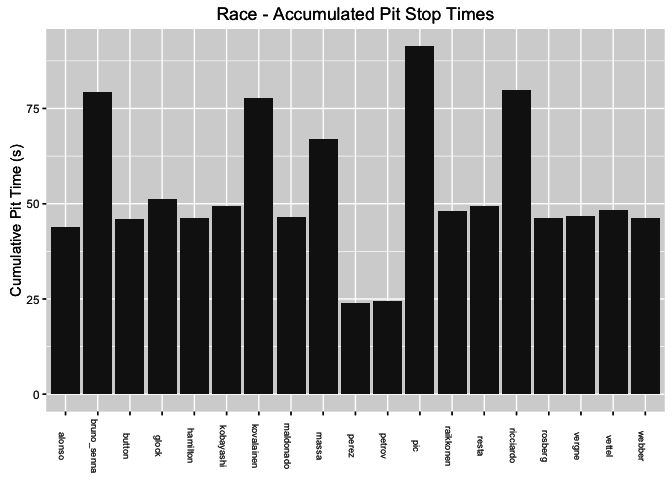
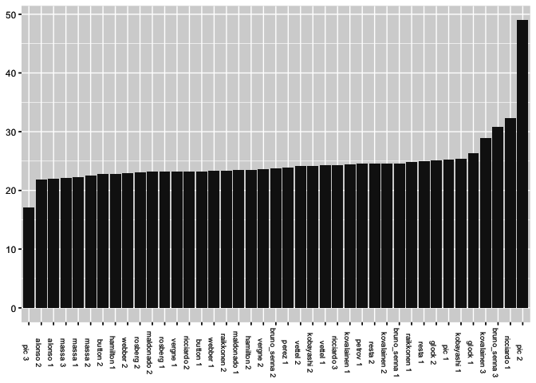
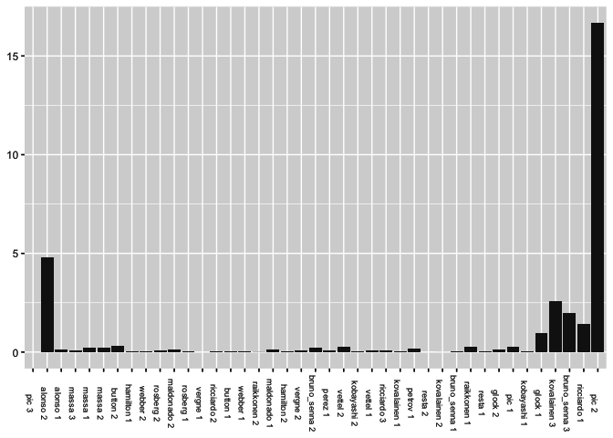
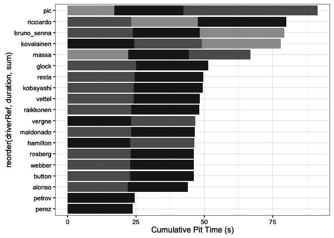
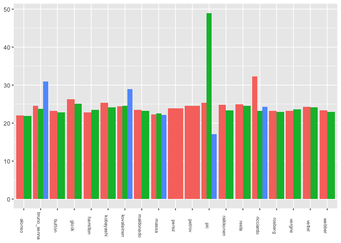
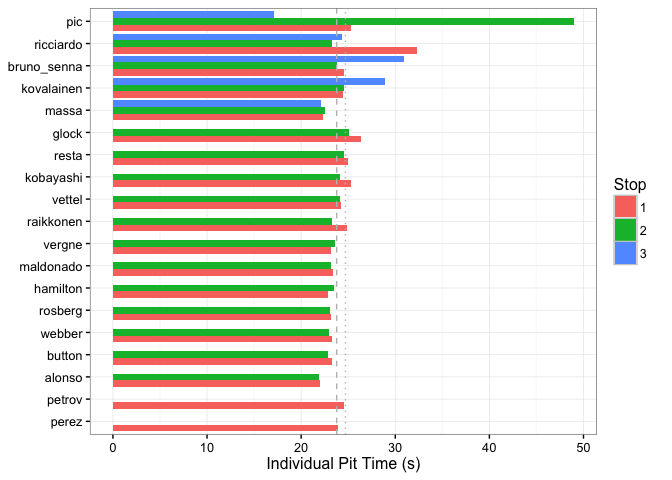
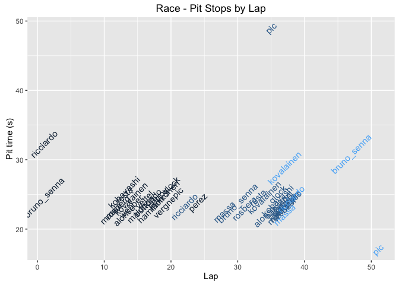
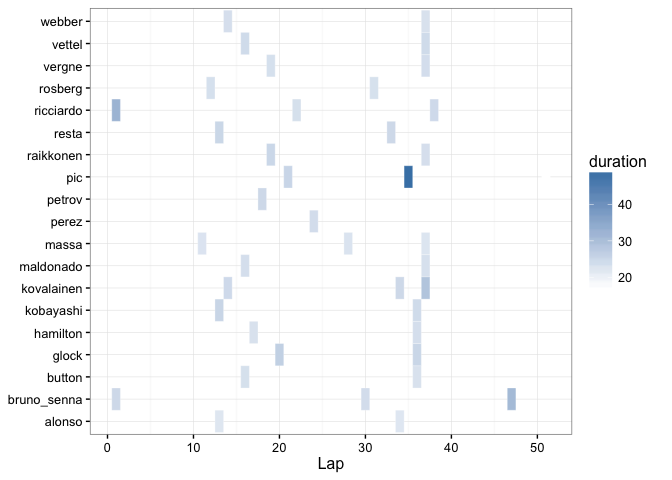

---
output:
  html_document:
    keep_md: yes
---

# Pit Stop Analysis

With the F1 race regulations such as they are in 2015, cars are required to run two tyre compounds during a dry race. This means that drivers are forced to pit at least once during a race in order to change tyres. In addition, at the request of Formula One Administration,  Pirelli have experimented in recent years with various tyre compounds in an attempt to add elements of "tyre jeopardy" to the race spectacle.

Whenever a car comes in to the pits, the lap time goes up. Associated with each pit stop there is a *pit loss time* compared to a flying lap time that accrues as a result of the car having to slow down as it makes its way through the pit lane. There are also time losses associated with slowing down to enter the pit lane on an in-lap, and time spent getting back up to speed and tyre temperature on the out-lap. These time losses, or costs, are all in addition to any time the car spends as it is stationary, along with the milliseconds spent actually entering and exiting a particular pit box.

At the current time, the FIA do not publicly publish the time a car is stationary, or explicit data about the reason a car has entered the pit lane. This means that we do not necessarily know whether a car has stopped for a procedural tyre change pit stop, or as part of a penalty such as a drive-through penalty or a stop/go penalty.

However, sources such as the *ergast* API do publish some information about the time each car spends within the pit lane each time it enters the pits. In this chapter, we will explore various ways of visualising pit behaviour and comparing the relative effectiveness of the teams at pitting. We will also explore several ways of sorting and reshaping the pit stop data as part of the process of generating charts that are capable of highlighting meaningful similarities and differences in both individual and grouped pit stop times.

## Pit Stop Data

Information about pit stop times can be found in the *pitStops* table of the *ergast* database and are also published as an official FIA timing sheet.

The *pitStops* table provides information on a race by race basis of includes the driver involved with a stop (`driverRef` and `driverId`), the time spent in the pit lane in seconds (`duration`) and as milliseconds (`milliseconds`), the pit number for that driver (that is, a count of the number of stops to date, including the current stop) and the time of day the pit event happened.

One way of using the pit stop data is to recognise the fact that a particular driver pitted on a particular lap, for example by annotating a session utilisation chart or lap chart with the fact that a pit stop occurred, or how long it took. Another way is to look to the data itself as a basis for comparison or analysis.

Let's grab some pit stop data for a particular race and preview the first few lines of the table that we obtain:


```r
library(DBI)
ergastdb =dbConnect(RSQLite::SQLite(), './ergastdb13.sqlite')

pitStops.df=dbGetQuery(ergastdb,
                       'SELECT d.driverRef, p.stop, p.lap, 
                                p.time, p.duration, p.milliseconds
                       FROM pitStops p, races r, drivers d 
                       WHERE r.name = "Australian Grand Prix" 
                        AND r.year=2012 
                        AND p.raceId=r.raceId 
                        AND p.driverId=d.driverId')
pitStops.df$duration=as.numeric(pitStops.df$duration)
```

```r
#Preview the contents of the pitStops table
kable(head(pitStops.df,5),format='markdown')
```


|driverRef   | stop| lap|time     | duration| milliseconds|
|:-----------|----:|---:|:--------|--------:|------------:|
|bruno_senna |    1|   1|17:05:23 |   24.599|        24599|
|ricciardo   |    1|   1|17:05:35 |   32.319|        32319|
|massa       |    1|  11|17:21:08 |   22.313|        22313|
|rosberg     |    1|  12|17:22:31 |   23.203|        23203|
|alonso      |    1|  13|17:24:04 |   22.035|        22035|

*It's not immediately obvious at what point of the pit procedure the timestamp is captured. If it is generated on entry to pit lane, and `duration` is calculated as the time between the pit entry and pit exit, we should be able to calculate whether there has been a change of position within the pits. For example, if the order of the entry time of day of two drivers pitting about the same time is different to the order of the entry time of day + pit duration, then a position change will presumably have taken place?*

*If the time is the entry time and the duration is the time between entry and exit, we can also calculate the pit exit time, and from that try to identify whether one driver enters the pit before another but exits after them. Note that the time only states the time in seconds, whereas the duration includes tenths of a second, so there may be a significant amount of error in calculating the exit time.*

{$$}t_{exit,i} = t_{entry,i} + t_{pit,i} {/$$}

If {$$}t_{entry,A} < t_{entry,B}{/$$} and {$$}t_{exit,A} > t_{exit,B}{/$$}, then {$$}A{/$$} entered the pit before {$$}B{/$$} but left after them.

### Total pit time per race

A typical report on  pitstop behaviour will give the cumulative time spent by each driver whilst pitting. The simplest chart we might create totals the pit time for each driver and displays it by driver. For driver {$$}i{/$$} who stops {$$}n{/$$} times, we have:

{$$}t_{total,i} = \sum\limits_{j=1}^n t_{stoptime,i,j}{/$$}


```r
library("ggplot2")
xRotn=function(s=7) theme(axis.text.x=element_text(angle=-90,size=s))

g=ggplot(pitStops.df,aes(x=driverRef,y=duration))
g=g+geom_bar(stat='identity')
g=g+ggtitle("Race - Accumulated Pit Stop Times")
g=g+ylab("Cumulative Pit Time (s)")
g+xRotn()+xlab(NULL)
```



To display each separate pitstop time independently, we need to create a dummy column that provides a unique *(driver, pitstop)* key. 


```r
#Create a new column by combing the driver identity with the pit stop number
pitStops.df$driverStop=paste(pitStops.df$driverRef,pitStops.df$stop)

head(pitStops.df$driverStop)
```

```
## [1] "bruno_senna 1" "ricciardo 1"   "massa 1"       "rosberg 1"    
## [5] "alonso 1"      "kobayashi 1"
```

A common challenge presented by bar chart views is the order in which we should present the bars. Where a factor is used as the basis of the x-axis, the order in which the items are displayed corresponds to the order of the factor levels. By default, this is based on alphabetical ordering. By choosing `driverRef` for the x-axis, we get an ordering (by default) of the drivers in alphabetical order of their surname. That is, by default, items are ordered based on the first character in surname (or whatever string/text field we are ordering on), then the second, then the third, and so on.

Ordering by surname is meaningful in many situations - we are familiar with the order of the alphabet, so we can use that knowledge to help us find a name that starts with a particular letter or combination letters quite quickly. But in Formula One, there are several other, rather more meaningful orderings, at least to people who follow the sport and are knowledgeable about the teams, drivers, the state of the championship, or the state of the current race weekend.

For the example of a simple bar chart of pit stop times, a sensible ordering might be to sort by pit stop durations.


```r
#Create a simple base theme to declutter sketch plots
theme_base = function () theme( 
  axis.title.x = element_blank(), 
  axis.title.y = element_blank(), 
  legend.position="none" )

#reorder() orders the driverStop axis according to the corresponding duration
g=ggplot(pitStops.df, aes(x=reorder(driverStop, duration), y=duration))
#Set the chart type and tweak the theme
g + geom_bar(stat='identity') + xRotn() + theme_base()
```



Looking at the chart ordered in this way, any outliers immediately become obvious. We note that outliers may take an inordinately long time, perhaps because of a problem; or they may appear to be much shorter than a typical pit stop time, perhaps because the pit time actually represents a drive-through or stop-go penalty. One way of trying to identify outliers might be to identify significant step changes in pit stop time by charting the first difference:


```r
library(plyr)
#Order the pitstop times dataframe in order of increasing stop time
pitStops.df=arrange(pitStops.df, duration)

#Create a first difference column between consecutive, ordered pit times
pitStops.df$tmp_diff=c(0,diff(pitStops.df$duration))

#Plot the chart
g = ggplot(pitStops.df, aes(x=reorder(driverStop, duration), y=tmp_diff))
#Set the chart type and tweak the theme
g + geom_bar(stat='identity') + xRotn() + theme_base()
```



We can then use this information to identify just those pitstop times that appear to be competitive.

Other, more complex, orderings and groupings of the original chart are also possible. For example, we might order the drivers according to a driver's racing number and group the pitstops separately by driver; or we might choose to group the drivers by team and order the teams according to Constructors' Championship standing from the previous year.

### Grouping Pit Stop Times
One problem presented by the pit time charts above is that we can't readily see how individual pit stops contributed to the overall (that is, accumulated) pit stop time for a driver, or the relative duration of them by driver.

A *stacked bar chart* where the individual components receive their own colour fill is one way of breaking down the cumulative pit stop time into component parts whilst retaining an indication of that total time.

By using a *stacked bar chart* with each bar segment coloured according to the pit stop number for each driver, not only is the number of pit stops is made visible, but we can also see how each pit stop contributed that particular driver's overall pit time. If we rotate the chart to give a horizontal layout, we get a more natural positioning of the driver identifiers.

We can further order the bars according to the total pit time, as given by the summed values of the individual pit stop times for each driver.


```r
race.plot.pits.cumulativeTime=function(.racePits){
  #The reorder() function sums the durations for stops grouped by driverRef
  #The grouping operation results from setting the fill parameter
  g=ggplot(.racePits,aes(x=reorder(driverRef,duration,sum),y=duration,fill=factor(stop)))
  g=g+geom_bar(stat='identity')
  #Do we want a legend identifying pitstop number or not?
  #g=g+guides(fill=guide_legend(title="Stop"))
  g=g+guides(fill=FALSE)
  #Add some styling - colour the bars and simplify the background
  g=g+scale_fill_grey(start=0.4,end=0.8)+theme_bw()
  #Work on the labeling
  g=g+ylab("Cumulative Pit Time (s)")
  #Flip the chart to a horizontal bar chart
  g+coord_flip()
}

race.plot.pits.cumulativeTime(pitStops.df)
```



One problem with this sort of chart is that we can't easily compare each individual pit stop time. A *dodged bar chart* gets around this problem by allowing us to compare the time taken for each separate pitstop by driver whilst still grouping the stops by driver.

Generating this view presents two challenges as the following base chart demonstrates:


```r
#For each driver, use fill colour to identify stop number
g=ggplot(pitStops.df,aes(x=driverRef,y=duration,fill=factor(stop)))
#Generate a dodged bar chart where bar height represents stop time
g+geom_bar(stat='identity',position='dodge') + xRotn() + theme_base()
```



Firstly, we need to find a more sensible way of ordering the drivers. Secondly, in the default chart, the width of the bar for drivers who have only one or two pitstops takes up the whole plot area for the driver (as for example in the case of Perez and Raikkonen in the chart above). What we would really like to see is equal width bars, with spaces for drivers that complete fewer than the maximum number of pit stops for a single driver for a particular race.

To force the plotting of the "empty" bars, we need to reshape the data. First, we generate a wide format data frame with columns for each pit stop number and then identify whether each driver had such a stop.


```r
library(reshape2)
driverStop=pitStops.df[,c('driverRef','stop')]

driverStop.wide=dcast(driverStop, driverRef ~ stop,
                      fun.aggregate = length,
                      value.var="stop")
```

```
##     driverRef 1 2 3
## 1      alonso 1 1 0
## 2 bruno_senna 1 1 1
```
Then we melt this data frame to generate a long form dataset representing the same data.

```r
driverStop.long=melt(driverStop.wide,
                     id.vars = "driverRef",
                     measure.vars = c("1","2","3"),
                     variable.name = "stop")
```

```
##     driverRef stop value
## 1      alonso    1     1
## 2 bruno_senna    1     1
```
We can now merge the duration of the corresponding stops back in; setting `all.x=TRUE` ensures that we retain the 0 values for pit stop numbers that a driver did not avail himself of.

```r
driverStopDur=merge(driverStop.long,
           pitStops.df[,c('driverRef','stop',"duration")],
           by=c("driverRef","stop"),all.x=TRUE)
```

```
##   driverRef stop value duration
## 1    alonso    1     1   22.035
## 2    alonso    2     1   21.910
```

If we calculate the total pit stop time for each driver, we can use that as a the basis for ordering the drivers in the actual chart.


```r
tot.pitstop=aggregate(duration~driverRef,driverStopDur,sum)
```

```
##     driverRef duration
## 1      alonso   43.945
## 2 bruno_senna   79.264
```

The ordering is achieved by order the factor levels of the `driverRef` attribute.


```r
driverStopDur$driverRef=factor(driverStopDur$driverRef,
                               levels=tot.pitstop[order(tot.pitstop$duration),
                                                  "driverRef"])
```

We can now plot a dodged bar plot with empty bars where appropriate, and drivers ordered according to their total pit stop time.

The chart is further annotated with lines showing the median (dashed line) and mean (dotted line) pit stop times.


```r
race.plot.pits.dodged=function(.racePits){
  g=ggplot(.racePits,aes(x=driverRef,y=duration))
  g=g+geom_bar(aes(fill=factor(stop)),stat='identity',position='dodge')
  #Annotate the chart with mediam and mean pit stop times, ignoring null values
  g=g+geom_hline(yintercept=mean(na.omit(.racePits$duration)),
                 linetype='dotted',colour='grey')
  g=g+geom_hline(yintercept=median(na.omit(.racePits$duration)),
                 linetype='dashed',colour='grey')
  g=g+guides(fill=guide_legend(title="Stop"))
  g=g+ylab("Individual Pit Time (s)")
  g+coord_flip()+xlab(NULL)+theme_bw()
}

race.plot.pits.dodged(driverStopDur)
```



We can also generate a *tabular data report* to summarise this information, identifying the number of times each driver passed through the pit lane during the race, along with the total time spent there.

## Pit Stops Over Time

One of the problems with the total pit time summary reports is that they mask information about *when* the drivers were pitting. One possible macroscopic view over all the pitstop data for a particular race would be to use a text plot to display the duration of each pit stop event for each named driver using lap number or time of day for the x-axis. (Time of day is a proxy for race time, and allows us to zoom in on the actual times that drivers pitted during the race. We can generate time of day from lap time data if we know the time at the start of the race, or at the end of the first lap, for example.)


```r
#Need newer db - update driverRef to TLID
race.plot.pits.stopsByLap=function(.racePits){
  g=ggplot(.racePits)+geom_text(aes(x=lap,y=duration,label=driverRef,col=stop),
                                size=4,angle=45)
  g=g+ggtitle("Race - Pit Stops by Lap")+xlab("Lap")
  g=g+ylab("Pit time (s)")
  g=g+theme(legend.position="none")
  g
}

race.plot.pits.stopsByLap(pitStops.df)
```



As we have seen in several charts previously, pit stop information may also be used to annotate a wide range of alternative chart types. One efficient way of doing this on a lap chart style display is to use a form of heatmap layer where driver/lap cells are coloured using a `geom_tile()` mapping according to the amount of time spent in the pits.


```r
g=ggplot(pitStops.df, aes(lap,driverRef))
g=g+geom_tile(aes(fill=duration),colour = "white")
g=g+scale_fill_gradient(low="white",high="steelblue")
g+xlab('Lap')+ylab(NULL)+theme_bw()
```



Placing this layer on a lower layer, with additional symbols overprinted, provides an indication of the amount of time spent in the pit without adding textual clutter.


## From Pitstops to Stints
During the course of a race in constant weather conditions, the two major influences on driver laptime are the mass of the car (which decreases over time as fuel is used up) and the state of the tyres. A *stint* is a sequence of continuous laps that are uninterrupted by an intervening pitstop that typically changes either of these variables (for example, a tyre change or refueling) or other aspects of the car's set-up.  A trivial way of marking a driver's race into a set of stints is to split their race into notional blocks based on the actual record of when the driver pitted from their pit stop  report. This forms part of the approach that was taken to identify stints during practice sessions that were highlighted during the development of the practice session utilisation charts.

Stints may also be identified by lap time analysis, in that laps in which a pit stop takes place are likely to result in inlap and outlap lap times that are markedly different from typical racing laps. (That we may be able to reliably identify pit-behaviour from laptime data is mentioned to reinforce the idea that we should be able to identify pitting situations and hence separate stints if the *only* data we have to hand is lap time data.)

Both these approaches are likely to associate stint markers with drive through penalties or certain stop-go penalties that cannot be combined with a service related stops (that is, pit events that do not allow a tyre change; we typically associate the idea of a stint *as a stint on a particular set of tyres*). However, they still provide a good first approximation at how we can subdivide a race for each driver into a discrete set of phases.

Another avenue that may be worth exploring is a graphical approach that helps illustrate possible undercut strategies as described in the chapter on *Event Detection*.

## Summary
In this chapter, we have started to explore some of the ways of displaying individual and aggregated pit stop time using a range of bar charts, as well as providing an overview of when different drivers plotted using a text plot. By stacking or dodging bars, we can generate different summary or breakdown views over the data. We also explored a variety of ways of manipulating the sort order of bars and groups of bars based on individual pit stop times and aggregated pit stop times.
