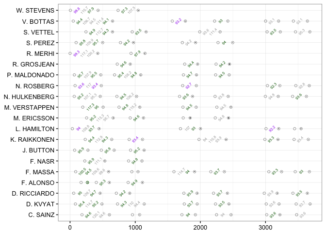
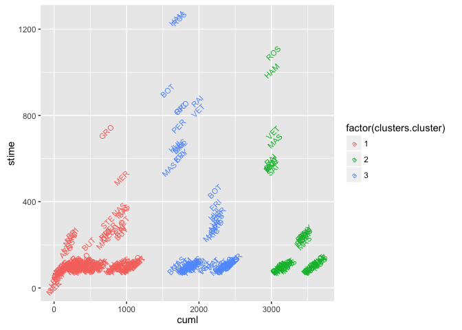
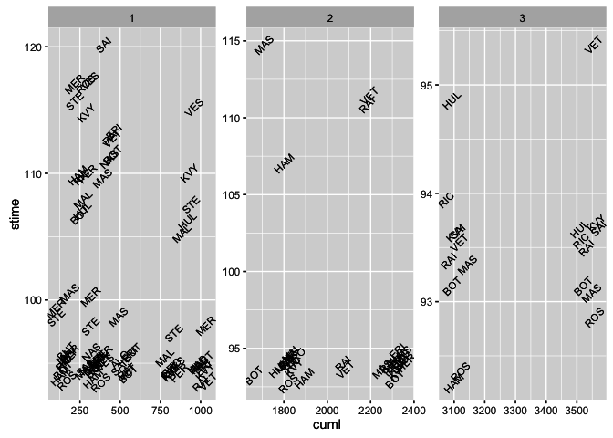
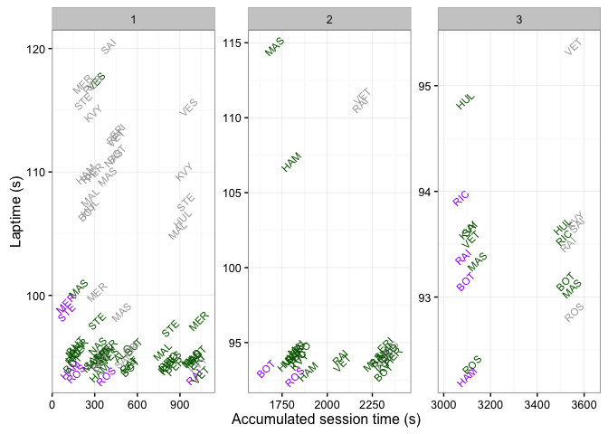
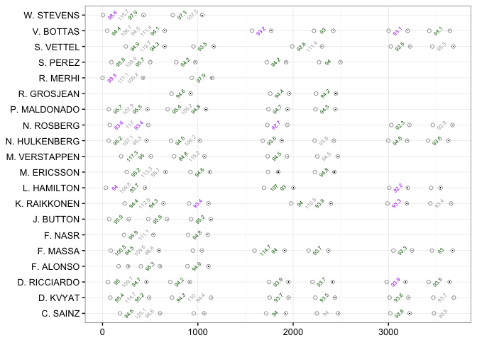
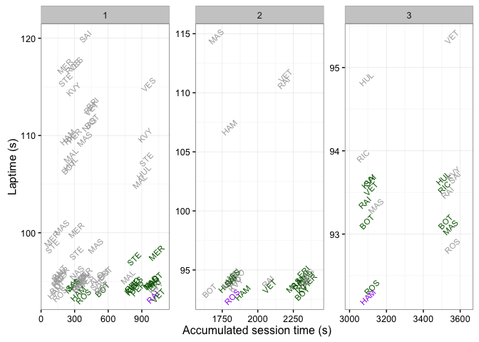
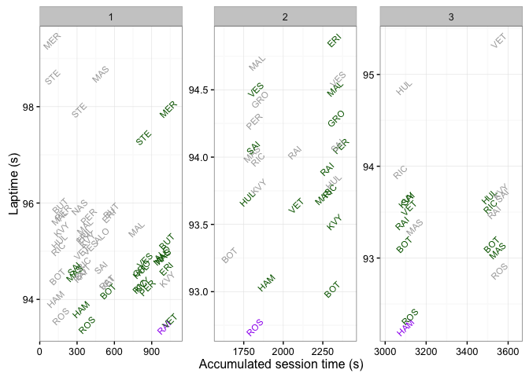
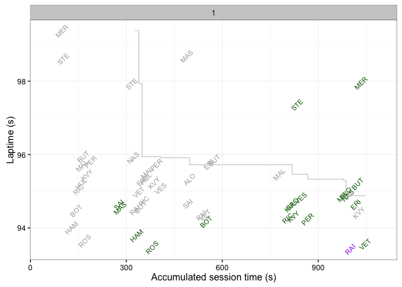
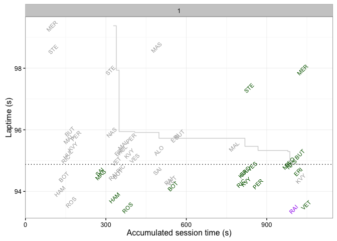
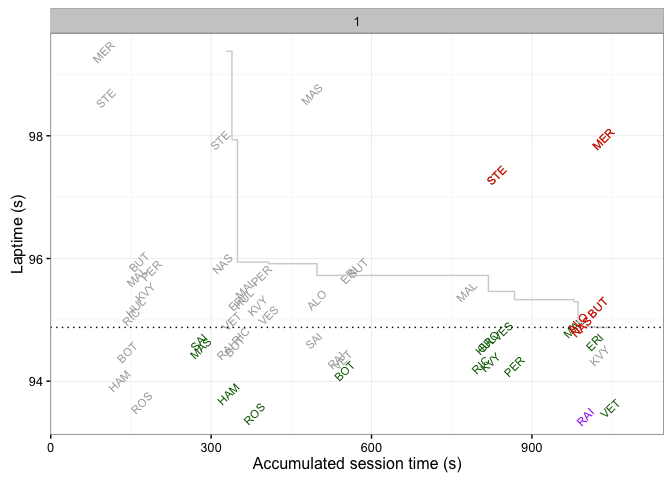

---
output:
  html_document:
    keep_md: yes
---


#A Further Look at Qualifying 

As with the practice sessions, we can use qualifying session laptime data to chart how each of the drivers makes use of the qualifying session, noting that not all drivers will be allowed to pass through into the second and third rounds of qualifying.

At first glance, it might seem as if we could simply reuse the functions developed to chart practice session utilisation to reveal how each driver made use of qualifying. (As before, the session laptimes are obtained by scraping timing information sheets published by the FIA.) However, this approach would result in  purple and green laptimes be calculated across all three qualifying sessions, rather than being calculated from a clean slate within each qualifying session, as the following chart demonstrates.

For this chapter, we will use qualifying times for the 2015 British Grand Prix scraped from the official FIA timing sheets ([data file link](https://gist.githubusercontent.com/psychemedia/11187809/raw/gbr_2015_qualilaptimes.csv)).


```r
#Data file available at:
#https://gist.githubusercontent.com/psychemedia/11187809/raw/gbr_2015_qualilaptimes.csv
f12015test=read.csv("~/Dropbox/wranglingf1datawithr/src/gbr_2015_qualilaptimes.csv")
```

The data takes the following form:


| lapNumber|laptime  |name         | number|pit   |   stime|
|---------:|:--------|:------------|------:|:-----|-------:|
|         1|00:00:56 |D. RICCIARDO |      3|False |  56.000|
|         2|1:35.047 |D. RICCIARDO |      3|False |  95.047|
|         3|1:49.740 |D. RICCIARDO |      3|False | 109.740|

This is the same form as the laptime data used to plot the session utilisation charts, so it's a simple enough matter to generate session utilisation charts that show how the track was used during qualifying.


```r
#Load in the laptime annotation and session utilisation plot functions
## described in the Practice Session Utilisation chapter
#These can be found in the file:
#https://gist.githubusercontent.com/psychemedia/11187809/raw/practiceQualiLaps.R
source('practiceQualiLaps.R')

f12015test=rawLap_augment_laptimes(f12015test)
plot_session_utilisation_chart(f12015test)
```



Unlike the practice session, however, the qualifying session is split into three parts. This suggests that rather than generate purple and green times relative to the qualifying session as a whole, we should really calculate those times relative to each part of qualifying. This means we need to find a way to identify the separate phases of qualifying from the laptime data itself, before finding purple and green times within each part of qualifying.

## Clustering Qualifying Laptime by Session 

Several well known algorithms exist that are capable of clustering data elements that are in some way alike in an unsupervised way (that is, without reference to some sort of training set in which a known mapping exists from particular data points into particular groups or clusters).

One of the simplest and most widely used techniques is *k-means analysis*. When we run such an analysis over the 1-dimensional laptime data, specifying the number of means (or groups into which the data should be clustered) as 3, one for each part of qualifying, this is what we get as a result:


```r
# Attempt to identify qualifying session using K-Means Cluster Analysis
#Specify 3 means (3 sessions)
clusters = kmeans(f12015test['cuml'], 3)

# get cluster means - summary report
#aggregate(f12015test,by=list(clusters$cluster),FUN=mean)

f12015test = data.frame(f12015test, clusters$cluster)
ggplot(f12015test)+geom_text(aes(x=cuml,y=stime,label=code,
                                 colour=factor(clusters.cluster)),
                             angle=45,size=3)
```



*Good attempt - but no cigar...* Whilst all the Q3 laptimes have been grouped together, and all of the Q2 laptimes have been grouped together, some of the Q1 laptimes have also been clustered with Q2 laptimes. This approach demonstrates how a naive or simplistic application of a powerful statistical clustering technique may not have the desired result...

Perhaps a less sophisticated, more cunning strategy might work instead?

The [F1 regulations](https://www.formula1.com/content/fom-website/en/championship/inside-f1/rules-regs/Practice_qualifying_and_race_start_procedure.html) suggest there are at least seven minutes between qualifying sessions. Using this information, if we look for at least a five minute gap, say, between consecutive laptimes, and assume that such a gap is unlikely to occur *within* a session (that is, we assume there will never be more than five minutes between two cars crossing a timing line while a session is running), we can identify stints on that basis.


```r
#Order by accoumulated laptime
f12015test=arrange(f12015test,cuml)
#Find the gap between consecutively recorded accumulated laptimes
f12015test['gap']=c(0,diff(f12015test[,'cuml']))
#If the gap exceeds a certain threshold value, assume it's the intersession gap
f12015test['gapflag']= (f12015test['gap']>=300)
#Run an accumulated count of identified gaps to give the session number
f12015test['qsession']=1+cumsum(f12015test[,'gapflag'])
```

(Note that if a session is red flagged for a period of time, we might incorrectly identify this period as an inter-session gap.)

We can now use the `qsession` number to separate out the laptimes from the different sessions, limiting the data to show complete laps (that is, not laps that are inlaps or outlaps).


```r
g=ggplot(f12015test[!f12015test['outlap'] & !f12015test['pit'],])
g=g+geom_text(aes(x=cuml,y=stime,label=code),angle=45,size=3)
g+facet_wrap(~qsession,scale="free")
```



To make these charts easier to read, we need to do something about the labels overflowing the margins, and perhaps use a cleaner theme.

## Purple and Green Laptimes in Qualifying

Having identified the different phases of qualifying and associated individual laptimes with the appropriate qualifying session (Q1, Q2 or Q3), we can now calculate the purple and green laptimes *within* those separate sessions.

There are several different ways we can report on purple and green times. For example:

- keeping a running tally of purple and green times as they are recorded through a session (an *online* algorithmic approach);
- displaying just the session best laptime for each driver as the green time (or, for the fastest lap in the session overall, just a single purple laptime per session). This approach represents an *offline* algorithmic process, in that *all* the laptimes from a session are required before the overall session best green and purple times can be calculated.

### Online (Evolving) Purple & Green Qualifying Session Lap Times

To begin with, we can consider the online algorithmic approach. Let's create a function that will identify the current best time within a session for each driver as the session evolves, treating these as green times. Taking the cumulative minimum driver best time over each session gives us the evolving purple times within a session. We can then use a nested conditional statement to assign an appropriate colour to each time.


```r
quali_purplePatch=function(df){
  #Order the drivers by name and lapnumber
  df=arrange(df,name, lapNumber)
  #Group by session and driver, and record each driver's evolving best laptime
  #as their cumulative minimum laptime
  df=ddply(df,.(qsession,name),transform,
           driverqbest=cummin(c(9999,stime[2:length(stime)])))
  #Now order by accumulated laptime
  df=arrange(df,cuml)
  #Group by session and find the cumulative minimum laptime (current purple)
  df=ddply(df,.(qsession),transform,qpurple=cummin(driverqbest))
  #Colour code the laptime
  #The colourx colouring scheme is the online colouring scheme
  df['colourx']=ifelse(df['stime']==df['qpurple'],
                       'purple',
                       ifelse(df['stime']==df['driverqbest'] & !df['pit'] & !df['outlap'],
                              'green',
                              'black'))
  df=arrange(df,name, lapNumber)
  df
}
```

This online colouring scheme requires the chart to be read left to right, as time evolves. The colours show how as each time is recorded, it may set a new personal or overall best laptime in the session so far.


```r
f12015test=quali_purplePatch(f12015test)

qsession_plot=function(f12015test,col='colourx'){
  g=ggplot(f12015test[!f12015test['outlap'] & !f12015test['pit'],])
  g=g+geom_text(aes_string(x='cuml',y='stime',label='code',
                         colour=paste('factor(',col,')',sep='')),
              angle=45,size=3)
  g=g+facet_wrap(~qsession,scale="free")
  #Expand the x axis to prevent plotted labels overflowing the margins
  g=g+ scale_x_continuous(expand=c(0,100))
  g=g+scale_colour_manual(values=c('darkgrey','darkgreen','purple','red'))
  #Tidy up the axis labels
  g=g+xlab('Accumulated session time (s)')+ylab('Laptime (s)')
  g+ guides(colour=FALSE) +theme_bw()
}
qsession_plot(f12015test)
```



The online approach captures how best laptimes evolved over the course of a session. However, this chart can become quite cluttered with green times and it can be hard to see which of the green times is actually the final best laptime recorded for any particular driver by the end of the session.

To capture that information, we need to follow an offline approach where *all* the laptime information is available to us so that we can spot the best overall laptimes.

#### Revisiting the Session Utilisation Chart

With purple and green times calculated relative to each part of qualifying, we can now revisit the session utilisation chart to using a colouring scheme that treats the times recorded in each part of qualifying separately.


```r
#Note that f12015test has now been patched with session relative colourx values
plot_session_utilisation_chart(f12015test)
```



In this case, where the marks are all well spaced, we can use the online times to show how green and purple times were recorded across each part of the qualifying session.


### Offline (Session Best) Purple & Green Qualifying Session Lap Times

To find the session best times, we need to identify the best overall laptime for each driver within each session, and final session purple time either as the last recorded purple time or the best purple time. Once again, we can use a bit of logic to determine an appropriate colour label.


```r
#Identify as "flying laps" those laps that arenlt outlaps or inlaps
df_flying=f12015test[!f12015test['outlap'] & !f12015test['pit'],]
#Group by driver and session to find the best (minimum) laptime for each driver
df_flying=ddply(df_flying, .(code,qsession), transform,
                driverqsbest=min(driverqbest))
#Find the overall session best (purple) time
df_flying=ddply(df_flying,.(qsession),transform,qspurple=min(qpurple))
#The coloury colouring scheme is the offline colouring scheme
df_flying['coloury']=ifelse(df_flying['stime']==df_flying['qspurple'],
                            'purple',
                            ifelse(df_flying['stime']==df_flying['driverqsbest'],
                                   'green', 'black'))
```

Using this colouring scheme, it's far easier to see when each driver recorded their best laptime and when the session best laptime was recorded.


```r
qsession_plot(df_flying,'coloury')
```



### Applying a 107% cutoff limit to a chart laptime axis

To make the laptime related charts easier to read, we might want to automatically limit the displayed area to some multiple of the the session best laptime, such as the 107% limit, also suppressing inlap and outlap times.


```r
session107=function(df){
  sessionbest=ddply(df[!df['pit'] & !df['outlap'],],
              .(qsession),
              summarise,
              sbest=min(stime),
              sb107=1.07*sbest)
  df=merge(df,sessionbest,by='qsession')
  df[!df['outlap'] & !df['pit'] & df['stime']<=df['sb107'],]
}

qsession_plot(session107(df_flying), 'coloury')
```



This chart summarises the best recorded laptimes within a session that are within the 107% cutoff time. But where did the actual final cutoff time for the session fall?

## How do Session Cut-off Times Evolve Over the Course of Qualifying?

Within each qualifying session, the cut-off time for the session evolves as the drivers record improved laptimes. To calculate the cut-off time at any particular point in a particular session of qualifying, with a cut-off of N drivers going from one session to the next, we cannot simply look at the N'th best laptime in the session because it might be the case that one (or more) particular driver achieved more than one of the N fastest laptimes recorded to date.

Instead, as the session progresses, we need to identify the fastest laptime recorded by each driver so far in the session, and then find the Nth best drivers' best laptime to give us the current cutoff time. (We shall define the cutoff time to be the time of the Nth best driver for a cutoff of N drivers. This is then the time that must be beaten in order to make it into one of the top N positions.)

If we order the laptimes by the cumulative time in session, and then group by session and driver, we can find the minimum laptime so far in the session for each driver. At any point, if the number of drivers recording a laptime in a session exceeds the number of cars that can make it through the session (the cutoff number, N), we record the best laptime so far of the N'th ranked driver in the session as the current session cutoff time.


```r
#cutoffvals identifies how many cars make it through each session
cutoffTimes=function(df,cutoffvals=c(15,10,1)) {
  df=arrange(df,cuml)
  dfc=data.frame()
  #Work through each laptime in the order they were recorded
  for (r in 1:nrow(df)) {
    #For each driver, track their evolving session best laptime
    dfcc=ddply(df[1:r,],.(qsession,code),summarise,dbest=min(stime))
    #Find the session number for the current laptime
    session=df[r,]$qsession
    #For the current session, sort the drivers by their best laptime
    dfcc=arrange(dfcc[dfcc['qsession']==session,],dbest)
    N=cutoffvals[df[r,]$qsession]
    #If there are more driver best times recorded than the cutoff number, N
    #record the best time of the N'th best driver as the current cutoff time
    if (nrow(dfcc) >=N){
      dfc=rbind(dfc,data.frame(df[r,]['qsession'],
                               df[r,]['code'],
                               df[r,]['cuml'],
                               dfcc[N,]['dbest']) )
    }
  }
  dfc
}
```

We can now use display how a session's cutoff time evolves across the session. The `geom_step()` function connects plotted points using "stairs" that run horizontally and then vertically. That is, the step change appears at the point a laptime is recorded that causes the cutoff time to change, otherwise it continues to run horizontally.


```r
q1session=session107(df_flying[df_flying['qsession']==1,])
g=qsession_plot(q1session,'coloury')+geom_step(data=cutoffTimes(q1session),
                                               aes(x=cuml,y=dbest),
                                               colour='lightgrey',
                                               direction = "hv")
g
```



One final annotation we might make to the chart is to include a dotted line that shows the final cutoff time:


```r
dfdd=ddply(cutoffTimes(q1session),.(qsession),summarise,cutoffdbest=min(dbest))
g=g+geom_hline(data=dfdd,
               aes(yintercept=cutoffdbest),linetype='dotted')
g
```



### Identifying Drivers That Missed the Cutoff

Finally, let's further annotate the chart to more clearly identify those driver's best laptimes that missed the cutoff.


```r
dfx=merge(q1session,dfdd,by='qsession')
g+geom_text(data=dfx[dfx['stime']==dfx['driverqsbest'] & dfx['driverqsbest']>dfx['cutoffdbest'],],
              aes(x=cuml,y=stime,label=code,colour=factor('red')),
              angle=45,size=3)
```



Now we can even more clearly see which drivers' best times missed the cutoff.

Note: it might also make sense to explore the use of the `ggrepel` library function `geom_text_repel()` to try to improve the legibility of the chart in terms of moving overlapping labels.

## Summary

In this chapter, we have explored several ways of analysing laptimes associated with a particular qualifying session (Q1, Q2, Q3), such as identifying purple and green laptimes calculated relative to a particular phase of qualifying using both an online and an offline algorithmic approach

We have also described how to track the evolution of the cutoff time across a session by maintaining a running order of the current fastest laptimes recorded to data by each driver and then tracking the top N'th time as a cutoff time.

We can make further use of the overall cut-off time as a threshold value for identifying drivers whose session best laptimes failed to make the cut.
