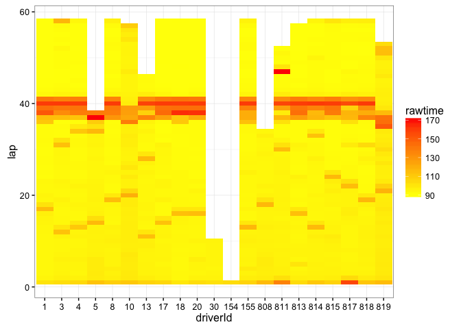
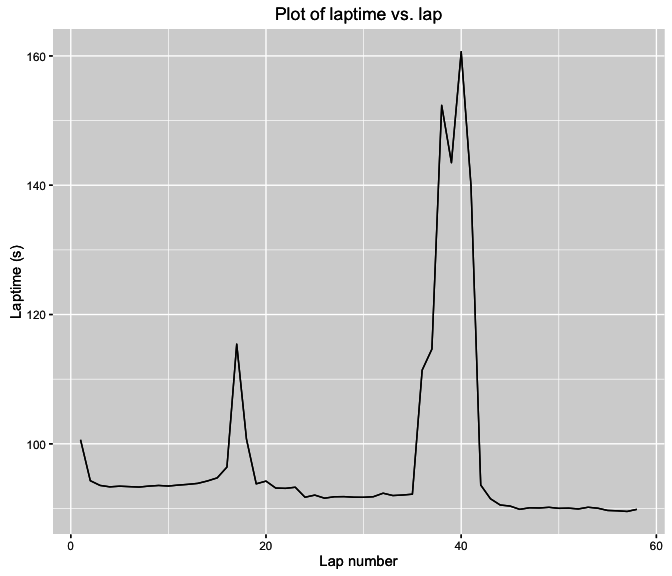
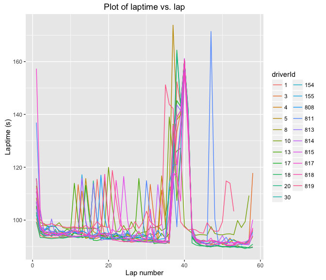
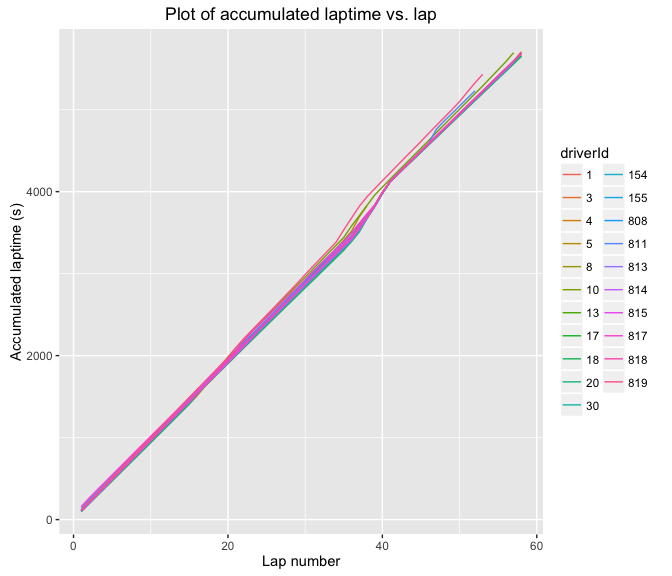
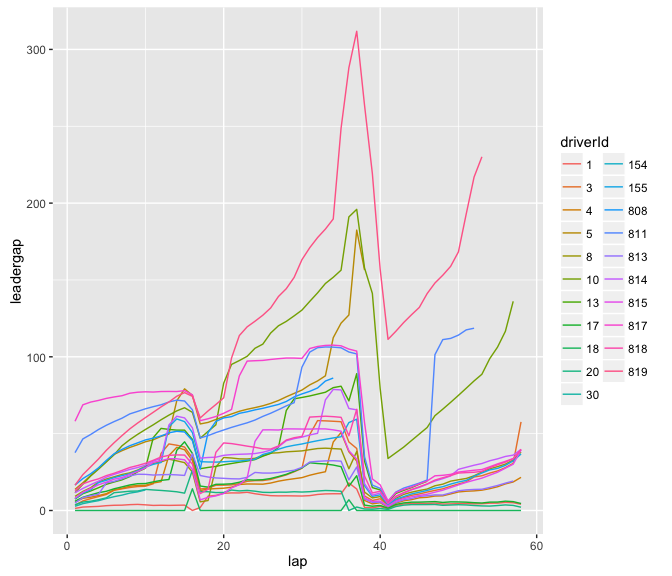
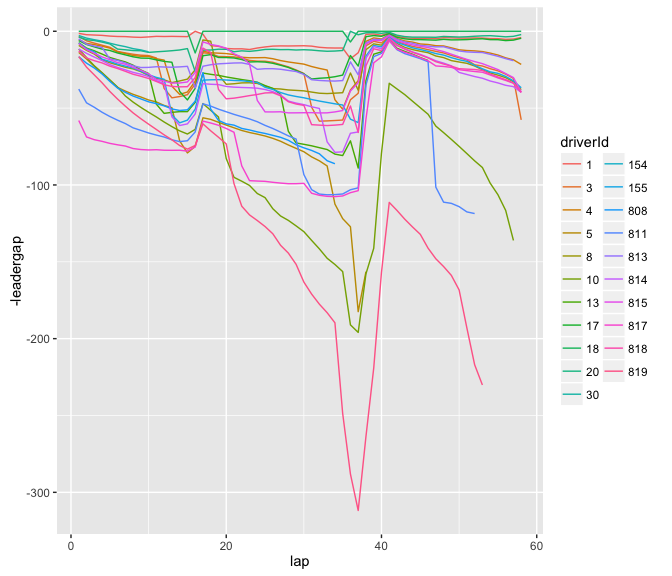
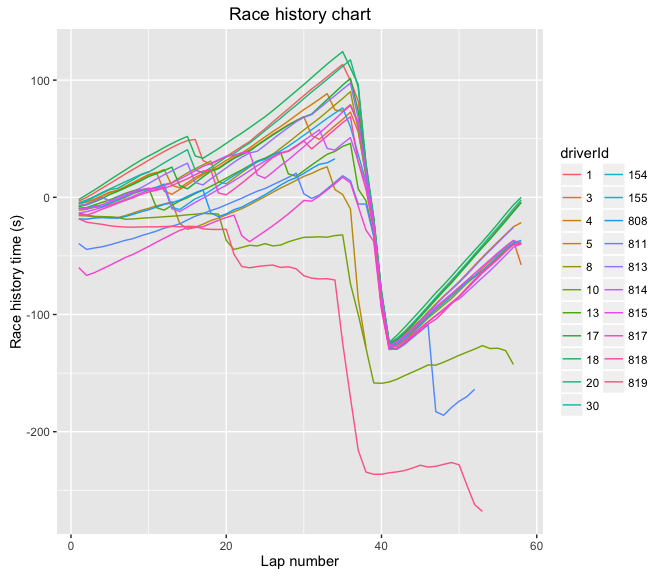
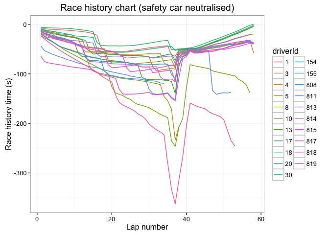

---
output:
  html_document:
    keep_md: yes
---

# Race History Charts

If you wanted a chart that summarised a race from the perspective of lap times, what sort of chart would you produce? In many racing circles, a *race history chart* is often used to present this data.

However, at first thought, it might seem as if a simple plot of the laptime recorded by each driver for each lap of the race might do the job. So let's construct just such a chart for a single driver in a single race using data from the *ergast* database.

Let's remind ourselves of what tables are available, and how to refer to them:


```r
library(DBI)
ergastdb =dbConnect(RSQLite::SQLite(), './ergastdb13.sqlite')
tbs=dbGetQuery(ergastdb,'SELECT name FROM sqlite_master WHERE type = "table"')
tbs
```

```
##                    name
## 1              circuits
## 2    constructorResults
## 3  constructorStandings
## 4          constructors
## 5       driverStandings
## 6               drivers
## 7              lapTimes
## 8              pitStops
## 9            qualifying
## 10                races
## 11              results
## 12              seasons
## 13               status
```

We can access the laptime data for a particular race in a given year from the *races* table. I'm going to pick round 1 of 2012 for this example:


```r
#Load in data relating to the lapTimes for a particular race

#When querying the database, we need to identify the raceId.
#This requires the year and either the round, circuitId, or name (of circuit)
raceId=dbGetQuery(ergastdb,'SELECT raceId FROM races WHERE year="2012" AND round="1"')

#There should be only a single result from this query,
# so we can index its value directly.
q=paste('SELECT * FROM lapTimes WHERE raceId=',raceId[[1]])
lapTimes=dbGetQuery(ergastdb,q)
#Note that we want the driverId as a factor rather than as a value
lapTimes$driverId=factor(lapTimes$driverId)

#We want to convert the time in milliseconds to time in seconds
#One way of doing this is to take the time in milliseconds colument
lapTimes$rawtime = lapTimes$milliseconds/1000
```


### Getting a Feel for Laptimes Over the Course of a Race - Heatmaps

*Heatmaps* are widely used technique for visualising correlated features in a dataset. In a heatmap, a colour gradient is mapped onto a normalised range of values, allowing the values of multiple (normalised) variables to be compared on a colour basis.

The following sketch shows a simple heatmap representation of the laptimes for each driver over the course of a single race.


```r
library(ggplot2)

g=ggplot(lapTimes)+ geom_tile(aes(x=driverId, y=lap, fill = rawtime))
g+scale_fill_gradient(low="yellow",high="red")+theme_bw()
```



The yellow colour represents faster times and the red colour slower times. The orange/red banding around lap 40 - slow times for all the cars - suggests the presence of a safety car. The other (darker) red marks tend to show the laps on which each driver pitted.

The presence of the slow safety car laps skews the colour mappings, as perhaps do the slow laptimes from the first lap, starting as it did from a standing start. If we could remove the slow first lap, pit and safety car laps, to give a smaller range of laptimes, we would be able to distinguish between those times on a colour basis much more clearly.

The heatmap provides an at a glance view of laptime trends across the course of the race, or at least, helps us easily spot the slow laps!), but it's quite hard to make comparisons of the actual times recorded and all but impossible to work out how drivers were placed relative to each other over the course of the race.

So starting from this data, and other data values, derived from it, how can we work towards the construction of a *race history chart* that does let us compare the race histories of all the drivers?

## The Simple Laptime Chart

What sort of chart do we get if we simply plot laptime against lap number for a particular driver?


```r
g=ggplot(subset(lapTimes,driverId==1))
g=g+geom_line(aes(x=lap,y=rawtime))
g+labs(title='Plot of laptime vs. lap',x='Lap number', y='Laptime (s)')
```



After a relatively slow first start (from a standing start, and with the confusion of the first few corners), the laptimes appear (at this scale) to show a slight downward trend (decreasing/improving laptime as the fuel burns off), apart from when the driver pits around about lap 18 and something more significant happens around lap 40. In fact, there are likely to be two opposing factors influencing the laptime - a *decrease* in laptime associated with the car using fuel as it goes round the track, becoming lighter as it does so; and a likely *increase* in laptime associated with tyre wear. (In fact, the tyre model is likely to be more complicated than that, as the tyres may improve for a few laps  - and hence tend to *reduce* laptime - as they come into their optimal operating window for temperature and pressure.)

By inspection of the laptimes in general, we see that there are two slow laps associated with the pit event:

* the *in-lap*, from which the driver *enters* the pits, and 
* the *out-lap*, which beings with the driver leaving the pits.

The chart also shows a prolonged period of slow laps around about lap 40, laps that are almost a minute slower per lap than the racing laps. This pattern in the laptime chart is typical of a safety car, rather than a sudden weather change, for example, because after the period of slow laps, the racing laps recover to (and even improve on by almost a second a lap) their previous times.

To plot the laptimes for each driver on a single plot, we might group each driver's times and then highlight them using colour.


```r
g=ggplot(lapTimes)
g=g+geom_line(aes(x=lap,y=rawtime, group=driverId, colour=driverId))
g+labs(title='Plot of laptime vs. lap',x='Lap number', y='Laptime (s)')
```



This chart is very cluttered and doesn't really help us see the relative race positions of each driver. However, it does confirm that the really slow laps around lap 40 applied to all cars in the field and can definitely be accounted for by the presence of a safety car. That all cars are not affected equally by the safety car (that is, they do not all have the same, or even similar, lap times under the safety car, although the times are all slower than the racing laps) shows how the drivers can make up significant amounts of time under the safety car as they catch it up.

In this example, there is also a closing up of laptimes as the pack bunches up at the end of the safety car period.

## Accumulated Laptimes

To explore the relative race positions of each driver, we might consider looking at the *accumulated race time* over laps for each driver.

We already have the laptime data in lap order, so what we need to do now is sum the *rawtime* (that is, the raw laptime) for each driver over the increasing lap count. Using the split-apply-combine recipe, we run a cumulative sum of their laptimes for each driver and add it to a new column, *acctime*: 


```r
#install.packages("plyr")
library(plyr)
lapTimes=ddply(lapTimes, .(driverId), transform, acctime=cumsum(rawtime))
head(lapTimes,n=3)
```

```
##   raceId driverId lap position     time milliseconds rawtime acctime
## 1    860        1   1        2 1:40.622       100622 100.622 100.622
## 2    860        1   2        2 1:34.297        94297  94.297 194.919
## 3    860        1   3        2 1:33.566        93566  93.566 288.485
```

We can then plot this accumulated laptime against lap for each driver.


```r
g=ggplot(lapTimes)
g=g+geom_line(aes(x=lap,y=acctime, group=driverId, colour=driverId))
g+labs(title='Plot of accumulated laptime vs. lap',
       x='Lap number', y='Accumulated laptime (s)')
```



Hmmm.. this chart is hard to read and doesn't seem to be that interesting. The lines for each driver do diverge, but it's hard to see the divergence clearly. One way we can try to introduce some separation between the lines is to take the average laptime to date. That is, divide the accumulated laptime by the lap number.


```r
g=ggplot(lapTimes)
g=g+geom_line(aes(x=lap,y=acctime/lap, group=driverId, colour=driverId))
g+labs(title='Plot of average laptime to date vs. lap',x='Lap number', y='Average laptime to date (s)')
```


Now perhaps we're starting to get somewhere: there's definitely some definition starting to appear between the different drivers and the lines aren't so noisy as the lines were in the simple laptime chart - the averaging process is smoothing out the curves somewhat. We're also starting to see something of a more marked decreasing trend in laptime over the course of each stint than in the simple *laptime vs lap number* chart.

## Gap to Leader Charts

How about if we try to plot how far behind the lead driver each driver is at the end of each lap? *Silicon Alchemy* twists this idea slightly on the [Lapalyzer website](http://www.lapalyzer.com/) by charting the *session gap*, that is, the difference in accumulated laptime at the end of each lap between each driver and the accumulated laptime of the driver that provisionally won the race (that is, that finished the last lap in first position).

Before we work out how to plot that chart, let's consider something simpler: the accumulated time difference at the end of each lap between the race leader at the end of that lap and each individual driver. The lap count we will use us the lap number recorded for each driver, rather than the lead lap count at a particular accumulated race time. We can calculate that gap in several ways, but here's one way that gives us some additional information. It proceeds in two steps:

* firstly, calculate the *gap* - that is, the difference in accumulated laptime - between each driver and the driver ahead of him ahead of him at the end of each lap;
* secondly, for each driver on each lap, calculate the sum of the gap times for the drivers ahead. This gives an overall *gap to leader*.

As before, we can use *ddply* to create new columns containing these values. Note that the *diff()* function finds the difference between consecutive values presented to it. For N drivers, there are thus N-1 gap values. We define the initial gap to be 0, and add this as the first gap value (that is, the gap for the driver in first position on that lap).


```r
#Order laptimes by lap and position
lapTimes=lapTimes[order(lapTimes$lap,lapTimes$position),]
#For each lap, find the difference (the gap) between the accumulated 
# laptimes of consecutively place drivers
lapTimes = ddply(lapTimes, .(lap), transform, gap=c(0,diff(acctime)) )
#Now calculate the summed gaps for all drivers ahead of a particular driver 
lapTimes = ddply(lapTimes, .(lap), transform, leadergap=cumsum(gap) )

head(lapTimes[,c('driverId','lap','position','acctime','gap','leadergap')],n=3)
```

```
##   driverId lap position acctime   gap leadergap
## 1       18   1        1  99.264 0.000     0.000
## 2        1   1        2 100.622 1.358     1.358
## 3       30   1        3 102.002 1.380     2.738
```

We can then plot the gap to the current leader on a lap by lap basis:


```r
ggplot(lapTimes)+geom_line(aes(x=lap,y=leadergap,group=driverId, colour=driverId))
```



A more conventional way of presenting this sort of chart is to show drivers that are behind further down the chart. So let's flip the y-axis to show the amount of time *behind* the eventual lap leader each driver was at the end of each lap, with the leader at the end of each lap aligned along the top of the chart:


```r
ggplot(lapTimes)+geom_line(aes(x=lap,y=-leadergap,group=driverId, colour=driverId))
```



One useful feature of this sort of chart is that we can see whether there is a change in leadership (the line at the top of the chart) by noting changes to the line at the top of the chart, with gap 0, at the end of each lap.

## The Lapalyzer Session Gap

Looking back at the *Lapalyzer* site, the session gap is subtly different to this - it measures the accumulated time difference at the end of each lap between each driver and the driver who eventually finished the last lap in first position. So how do we frame the data in this case? We need to find the cumulative time at the end of each lap for the eventual first place finisher of the race, and then the delta to this time from the accumulated time for each driver at the end of each corresponding lap.

In the corresponding chart, if the eventual first place finisher was not in lead position at any stage of the race, the lines would show a negative lead time (that is, a "positive" time) ahead of the eventual winner for the laps on which the eventual winner was not in the lead position.


## Eventually: The Race History Chart
We're now almost in a position to plot a *race history chart*. This sort of chart is widespread in motorsport, and is used to show how the lap times for each driver compare to that of the winner. Again, an averaging method is used, though this time based on the average laptime of the winner taken over the whole of the race.

The 'race history time' for each driver at the end of each lap is given as:

**( (winner mean laptime) * laps ) - (accumulated lap time)**

(If we are plotting the race history chart in real time, a so-called *online* algorithmic approach, we use the accumulated time of the lead car divided by the number of laps completed so far.)

James Beck, on the [Intelligentf1 blog](http://intelligentf1.wordpress.com/the-intelligentf1-model/), describes the race history chart as follows:

  *The horizontal axis is lap number, and the vertical axis shows the time each car is in front of (or behind) a reference average race time. This reference average time is often taken as the race time for the winner, such that the line representing the winner finishes at zero ... . As this reference time is arbitrary, it can be set to different values to best view the race performances of different cars - this has the effect of shifting the lines up and down the graph.*


```r
#Let's fudge a way of identifying the winner.
#The winner will be the person in position 1
# at the end of the last (highest counted) lap
winner = with( lapTimes,
               lapTimes[lap==max(lapTimes$lap) & position==1,'driverId'][[1]] )

winnerMean = mean( lapTimes[ lapTimes$driverId==winner,'rawtime' ] )
lapTimes$raceHistory=winnerMean*lapTimes$lap - lapTimes$acctime
```

Let's see what that looks like:


```r
g=ggplot(lapTimes)
g=g+geom_line(aes(x=lap,y=raceHistory, group=driverId, colour=driverId))
g=g+labs(title='Race history chart',x='Lap number', y='Race history time (s)')
g
```



In contrast to many typical race history charts, where the lines are predominantly below the origin line, the increased lap time introduced by the safety car has clouded the clarity of this chart in terms of helping us see the underlying pace of the cars.

### Neutralising Safety Car Laps Within the Lap Chart

In the *intelligentF1* blog post for the same race [Australian Grand Prix [2012]: Story from the Data](http://intelligentf1.wordpress.com/2012/03/19/australian-grand-prix-story-from-the-data/), a more traditional chart can be seen in which the safety car laps have been "normalised" (should this be "neutralised"?), although no method for achieving this is described.

As a first attempt at correcting for the safety car period, we can find the difference between the lap time of the leader from the start of the safety car period and the laptime just prior to the safety car, then subtract this value from every driver's laptime during the safety car period. This corrected laptimes can then be used for the calculation of the safety car adjusted race history chart.


```r
#Find the leader's laptime just before the safety car
base=lapTimes[ lapTimes$position==1 & lapTimes$lap==35,'rawtime' ]
#Create a neutralisation function that uses difference between leader's laptime
#and leader's laptime prior to the safety car, as a corrective delta
neutralise=function(x,y){if (x>35 & x<42) return(y - base) else return(0)}
corrective=data.frame(corr=mapply(neutralise,
                                  lapTimes[ lapTimes$position==1,'lap' ],
                                  lapTimes[ lapTimes$position==1,'rawtime' ]))

#Apply the correction term to every driver's laptime
lapTimes=ddply(lapTimes,"driverId",mutate,corrt=rawtime-corrective[lap,])

#Calculare the correected race history times
lapTimes=ddply(lapTimes, .(driverId), transform, corracctime=cumsum(corrt))
corrleaderMean = mean( lapTimes[ lapTimes$driverId==winner,'corrt' ] )
lapTimes$corrraceHistory=corrleaderMean*lapTimes$lap - lapTimes$corracctime
```

If we now generate the race history chart with the safety car laps neutralised, we see the evolution of the race far more clearly.


```r
g=ggplot(lapTimes)
g=g+geom_line(aes(x=lap,y=corrraceHistory, group=driverId, colour=driverId))
g+labs(title='Race history chart (safety car neutralised)',
       x='Lap number', y='Race history time (s)') + theme_bw()
```



To finish off this chart, we should really use driver codes for the legend rather than `driverId`, perhaps even adding the labels to the chart directly.

## Summary

Despite being a mainstay of race charts, with its ability to show the relative pace of cars and time distances between them across a race, as well as pit events and, on a careful reading, safety car periods (although these may sometimes be confused with slowdowns due to weather events), the race history chart can often appear cluttered and hard to read. Interactive chart approaches, in which a user can select which traces to highlight, and perhaps compare, often improve matters, and similar highlighting techniques can also be used for emphasis in static charts.

However, race history charts don't clearly show where cars are *on track* at any particular time, or whether a lapped car is causing some sort of obstacle between two otherwise racing cars.
