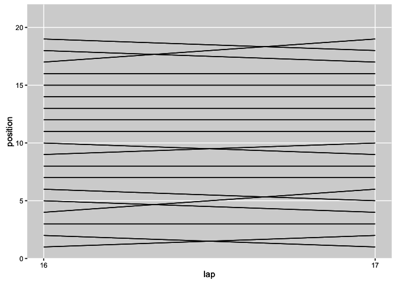
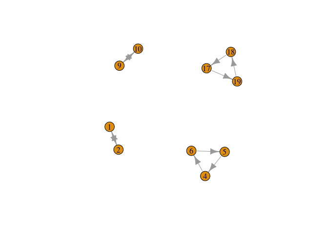
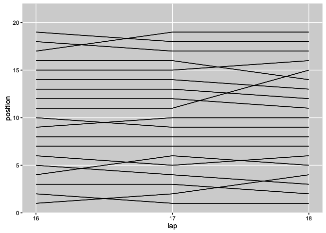
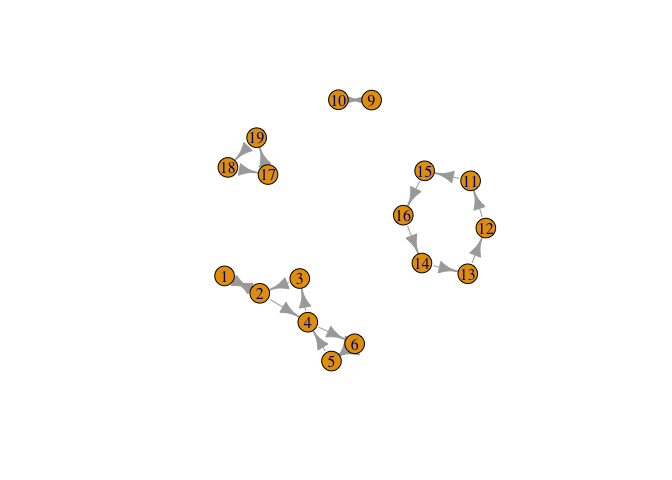

# Event Detection

When we look at a chart such as a lap chart, it is very clear to us when there is a change in position and which drivers were involved. But can we *automatically* detect which drivers have been involved in a series of position changes between each other over a particular series or laps?

Or consider the more complex race history chart: it's easy enough for us to see from the chart when drivers are close to each other in terms of their total race time up to any particular lap becuase their race lines are close to each other on the chart. But once again, can we *automatically* detect groups of drivers who are perhaps within a second or so of each other, increasing the chance of an overtake becuase of the likelihood that DRS will be enabled?

## Detecting Position Change Groupings

Let's grab some example data to explore how we might automatically identify such groupings or clusters amongst the drivers:


```r
library(DBI)
ergastdb =dbConnect(RSQLite::SQLite(), './ergastdb13.sqlite')

#Get a race identifier for a specific race
lapTimes=dbGetQuery(ergastdb,
                  'SELECT driverId, position, lap, milliseconds FROM lapTimes l JOIN races r 
                   WHERE l.raceId=r.raceId AND year="2012" AND round="1"')
```

In the following lap chart sketch, each line represents the evolution of positions held by a particular driver over the course of a race.  Changes in position are identified by crossed lines.


```r
library(ggplot2)

g=ggplot(lapTimes)+geom_line(aes(x=lap,y=position,group=driverId))
g
```

 

If we zoom in, we can look in detail at the positions held - and that changed (the crossed lines) - over a couple of consecutive laps:


```r
g=g+ scale_x_continuous(breaks = c(16,17),limits=c(16,17))
g+theme( panel.grid.minor = element_blank() )
```

 

Many of the drivers do not change position at all, but there are position changes between four distinct groups of drivers: those in 1st and 2nd; those in 4th, 5th and 6th; those in 9th and 10th; and those in 17th, 18th and 19th.

How can we identify the positions that are being contested during a particular window of time, where a contested position means that the particular position was held by more than one person in a particular window of time?

Let's create a couple of new columns to help us work through how we might identify position changes for each driver between each consecutive lap: a column that identifies the driver's position in the previous lap (*pre*), and a column that describes the change in position for the current lap give the previous lap position (*ch*). (Note that we will get an end effect at the start of the race; we really should use grid position as the first entry rather than the dummy 0 value.)

Filter the augmented data set to show just those rows where there is a difference between a driver’s current position and previous position (the first column in the result just shows row numbers and can be ignored).


```r
library(plyr)

#Sort by lap first just in case
lapTimes=arrange(lapTimes,driverId,lap)

#Create a couple of new columns
#pre is previous lap position held by a driver given their current lap
#ch is position change between the current and previous lap
tlx=ddply(lapTimes,
          .(driverId),
          transform,
          pre=(c(0,position[-length(position)])),
          ch=diff(c(0,position)))

#Find rows where there is a change between a given lap and its previous lap
llx=tlx[tlx['ch']!=0 & tlx['lap']==17,c("pre","position")]

arrange(llx,pre,position)
```

```
##    pre position
## 1    1        2
## 2    2        1
## 3    4        6
## 4    5        4
## 5    6        5
## 6    9       10
## 7   10        9
## 8   17       19
## 9   18       17
## 10  19       18
```

From the data table, we see distinct groups of individuals who swap positions with each other between those two consecutive steps. So how can we automatically detect the positions that these drivers are fighting over?

An [answer](http://stackoverflow.com/a/25130575/454773) provided in response to a Stack Overflow question on [how to get disjoint sets from a list](http://stackoverflow.com/questions/25130462/get-disjoint-sets-from-a-list-in-r) gives us a nice solution: represent the connections between previous and current lap positions as connected nodes in a graph (that is, a network), and then find the connected components. These components will identify the positions where there was a position changed.


A> ###Graph Theory
A>
A> Graph Theory is a branch of mathematics that focusses on ways of describing and analysing networks. A great example is the map of the London Underground network: tube stations are represented as *nodes* in the network, and are connected togther by lines referred to as *edges*.
A>
A> *Graphs* (that is, *networks*) can be either *directed* or *undirected*. In a *directed graph*, the edges are represented uising arrows and as such have a direction, going *from* one noe *to* another. In an *undirected graph*, we represent edges using a simple line that has no direction - it just shows that two nodes are connected to each other.
A>
A> As well as direction, edges may also have a *weight* associated with them, often represented visually by the thickness of the line. The weight identifies the strength of the connection between the two nodes.
A>
A> The *igraph* R package contains a wide variety of tools for constructing, analysing and visualising neworks and building up your own graph based representations.

Here's my working of the solution. Each row of the previuously shown list of results that show how a particular driver held different positions in the selected window (that is, within a set of contiguous laps).

We can now create a graph in which nodes represent positions (position or pre values) and edges connect a current and previous position. If we plot the resulting graph, we notice that it is split into several components:


```r
#install.packages("igraph")
#http://stackoverflow.com/a/25130575/454773
library(igraph)
par(bg="white")
plot(graph.data.frame(llx))
```

 

Notice how the nodes - representing positions - are connected to each other by arrows, showing how a car placed in one position moved to another position. So for example, we see that the cars in positions 9 and 10 changed palce with each other, as did those in positions 1 and 2. The car in 19th went to 18th, the one in 18th to 17th, and the one in 17th fell back to 19th. And so so.

Visually, it's clear to use that the connected nodes form different groups, or clusters. The question we are now faced with is how to identify these distinct components of connected nodes *automatically*? Fortunately, there are well known methods for calculating such things, and the `igraph` package makes it easy for us to call on them:


```r
posclusters <- function(edg) {
    g <- graph.data.frame(edg)
    split(V(g)$name, clusters(g)$membership)
}

posGraph=posclusters(llx)
```
This gives the following clusters, and their corresponding members:

```r
#Find the position change battles
for (i in 1:length(posGraph))
  print(posGraph[[i]])
```

```
## [1] "1" "2"
## [1] "18" "19" "17"
## [1] "10" "9" 
## [1] "4" "5" "6"
```

How might we generalise this approach? Here are some things that came to my mind:

* allow a wider window within which to identify battles (this means we should be able to  look for clusters over groups of three or more consecutive laps);
* simplify the way we detect position changes for a particular driver; for example, if we take the set of positions held by a driver within the desired window, if the size of the set (that is, its *cardinality*) is greater than one, then we have had at least one position change for that driver within that window. Each set of unique positions held by different drivers that has more than one member can be used to generate a set of distinct, unordered pairs that connect the positions (I think it only matters that they are connected, not that a driver specifically went from position x to position y going from one lap to the next?). If we generate the graph from the set of distinct unordered pairs taken across all drivers, we should then be able to identify the contested/driver change position clusters.

One downside of this approach, as applied over several laps, would be that we lose information about each particular position change.

### Extending the Approach to Larger Windows

Rather than try to extend the approach as suggested above, let's just see how well the original method fares when we consider position changes over three laps rather than two.


```r
g=g+ scale_x_continuous(breaks = c(16,17,18),limits=c(16,18))
g+theme( panel.grid.minor = element_blank() )
```

 

As before, we identify rows corresponding to drivers who experienced a position change going from one lap to another, in this case using data for laps 17 and 18 (thus including lap 16, the "pre" lap of column 17):


```r
llx3=tlx[tlx['ch']!=0 & (tlx['lap']==17 | tlx['lap']==18),c("pre","position")]
arrange(llx3,pre,position)
```

```
##    pre position
## 1    1        2
## 2    2        1
## 3    2        4
## 4    3        2
## 5    4        3
## 6    4        6
## 7    5        4
## 8    5        6
## 9    6        5
## 10   6        5
## 11   9       10
## 12  10        9
## 13  11       15
## 14  12       11
## 15  13       12
## 16  14       13
## 17  15       16
## 18  16       14
## 19  17       19
## 20  18       17
## 21  19       18
```

Visualising this data again as a *directed graph*, with edges (arrows) going *from* the previous lap position *to* the current lap position, we notice how the various graph components describe what position changes took place within the window:


```r
par(bg="white")
plot(graph.data.frame(llx3))
```

 

So for example, at some point in the window, we see that the cars in positions 9 and 10 swapped places; we also see how the cars in 1st and 2nd swapped places, and then the car in 2nd fell back to 4th; at some point a car in 4th place car moved to 3rd and the 3rd placed car to 2nd; at possibly other points the car in 4th fell back, a car in 6th moved up to 5th and a car in 5th moved up to 4th. Just *when* these changes took place, or even the order in which they took place, we can't necessarily tell from the diagram.

Unlike the simple 2 lap case then, where we can read off the actial position changes, when we try to use this technique to visualise positions changes across 3 or more laps, we quickly lose track of what actually happened well. What we do know, though, is which positions were being contested and changed hands in the course of those laps.


```r
posGraph3=posclusters(llx3)
for (i in 1:length(posGraph3))
  print(posGraph3[[i]])
```

```
## [1] "1" "2" "3" "4" "6" "5"
## [1] "18" "19" "17"
## [1] "15" "12" "13" "11" "16" "14"
## [1] "10" "9"
```


### What actually happened?

By visual inspection of the position change network charts, particular the single lap example, (that is, where we compare the current position with the position from the previous lap) we see there may be several sorts of pattern of behaviour that we can quickly read off: two drivers changing position with each other for example, or two or more cars moving up a position as another car falls out of position.

Based on this observations, we might be able to explain them by looking at other sources of data. For example, if we have access to pit stop data and we see that a car falls back several positions, if we notice that it had pitted but the cars that moved up position in the cluster did not, the chances are that it was the pit stop that was responsible for the position change. (Knowing this, we might be able to build up a model of which strategic race a particular driver might be in at an early or mid-stage of the race, for example against people on a similar strategy (a one-stop or two-stop pit strategy, for example).

As well as detecting groupings based on position changes using the `ch` column derived from comparing current and previous lap positions, we can also identify a range of other flags to detect particular features. For example, if we order the drivers by lap and total cumulative lap time, we can calculate whether or not two drivers are within one second of each other at any particular lap, and as such whether DRS is likely to be available to the chasing (lower placed) driver. This can give us a set of graphs showing cars within likely DRS range of each other, and as such help us identify where possible battles may be about to take place.

## Summary
In this chapter, we have started to explore the notion of detecting events within the data, focussing initially on the detection of position change events and the identification of groups of drivers (or at least, race positions) that were involved in a position change. By representing the position changes using a graph based representation, we were able to cluster race positions that were successfully contested and which changed hands between drivers.

It was suggested that additional information - such as pit information - might be brought to bear to help start explain why a paritucular event, such as a position change, might have occurred.

We also opened the possibility of detecting other signals that could be used to help us identify events, or situations, within the race, such as groups of cars where each consecutive car is likely within DRS range of the car ahead.
