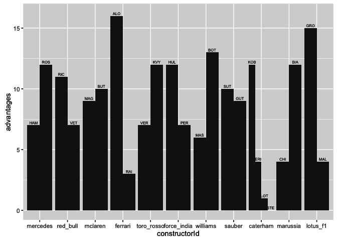
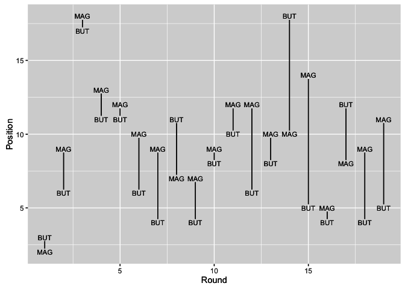
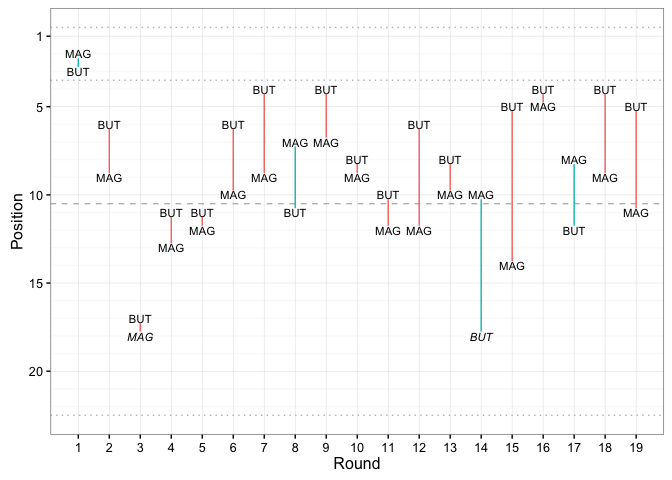

# Comparing Intra-Team Driver Performances

One of the strongest comparisons we can make about driver performances within F1, as within many areas of motorsport, is between drivers on the same team. Teams run cars of a similar specification and design, and performance data is shared between the team members and their engineering teams. Where drivers within the same team are free to race, we can therefore compare their performances in order to gain some idea of relative ranking between them.

Over the years, drivers tend to move between teams, and join up with different team partners along the way. This provides us with an opportunity to start to piece together a ranking that can rate drivers relative to other specific drivers at particular stages of their respective careers to generate a more complete ranking.

In this chapter, we will start to explore how drivers within a particular team compare with each other over the course of a single season.

## Intra-Team League Tables

Trivially, we can put together simple tables that compare the performances of drivers within a particular team on what we might refer to as pointwise mini-competitions between the drivers each race weekend. For example, we might compare:

* the number of times that one driver beat the other in qualifying;
* the average (mean) gap between drivers in qualifying (for example, in the last session both drivers made in to);
* the number of times one driver beat the other in the race; we might additionally restrict this comparison to races where both drivers were classified;
* the number of times one driver started behind the other on the grid but went on to rank higher in the final classification, perhaps limited to situations where both drivers were classified;
* the number of races in which each driver had a fastest racing lap faster than their team mate;
* the average (mean) gap between drivers' fastest laps in the race, perhaps limited to situations where both drivers completed the race;
* the total number of laps one driver led the other.


### Qualifying Performance

Let's start off by pulling some qualifying session results data directly from the *ergast* online API for a specific team in a specific year.


```r
source('ergastR-core.R')
qualiResults=qualiResults.df(2014,constructorRef='mercedes')
```

We can reshape the data to generate a dataframe with two columns - one for each driver in the team - that gives their qualifying position in a given race. We shall call such a dataframe a *faceoff* dataframe.


```r
library(reshape2)

faceoff=dcast(qualiResults[,c('code','position','round')],round~code,value.var='position')
```

```
##   round HAM ROS
## 1     1   1   3
## 2     2   1   3
## 3     3   2   1
```

We can directly count how many times each driver beats the other based on summing the results of an inequality test applied across the driver columns, labeling the result appropriately. This approach relies on being able to count a `TRUE` result as a 1, and a `FALSE` result as a 0. We index into the columns of the *faceoff* dataframe to compare the driver results, before grabbing the driver names from the appropriate columns in the original dataframe as the labels for the corresponding columns in the new dataframe.


```r
df=data.frame(sum(faceoff[,2] < faceoff[,3]),
              sum(faceoff[,2] > faceoff[,3]))
names(df)=c(names(faceoff)[2],names(faceoff)[3])
df
```

```
##   HAM ROS
## 1   7  12
```

In order to report on the battles across all the teams, we need to take a slightly different approach. Let's pull down all the qualifying results from the 2014 season from the *ergast* API, and then see if we can generate a report that counts the number of times a particular driver beat their team mate during qualifying. 


```r
qualiResults2=qualiResults.df(2014)

#The advantage function decides who took the advantage in a particular faceoff
#It takes a list of rounds and for each driver returns a count of the rounds
#  in which they had the advantage
adv=function(faceoff){
  dfx=data.frame(code=character(),advantages=numeric())
  #The first faceoff column is the round; then we have the drivers
  #In this example a driver has the advantage if their position is the same as
  #  the minumum position across the driver columns for that round.
  #We need to generate advantage reports for each driver in the round
  for (i in 2:ncol(faceoff)){
    dfx=rbind(dfx,
              data.frame(code=names(faceoff)[i],
                         advantages=sum((i-1)==apply(faceoff[,-1],1,which.min))))
  }
  dfx
}

#Generate a faceoff dataframe that has rows as rounds and one column for each driver
#The cell value gives the position for a driver in a given round
#Note that some teams fielded more than two different drivers over the season,
#  which means that for some teams there will be more than two driver columns
advrep=function(x){
  faceoff=dcast(x[,c('code','position','round')],
                round~code,
                value.var='position')
  adv(faceoff)
}

#We do the counts for each team
teamcounts=ddply(qualiResults2,.(constructorId),function(x) advrep(x))
teamcounts
```

```
##    constructorId code advantages
## 1       mercedes  HAM          7
## 2       mercedes  ROS         12
## 3       red_bull  RIC         12
## 4       red_bull  VET          7
## 5        mclaren  MAG          9
## 6        mclaren  BUT         10
## 7        ferrari  ALO         16
## 8        ferrari  RAI          3
## 9     toro_rosso  VER          7
## 10    toro_rosso  KVY         12
## 11   force_india  HUL         12
## 12   force_india  PER          7
## 13      williams  MAS          6
## 14      williams  BOT         13
## 15        sauber  SUT         10
## 16        sauber  GUT          9
## 17      caterham  KOB         12
## 18      caterham  ERI          4
## 19      caterham  LOT          1
## 20      caterham  STE          0
## 21      marussia  CHI          4
## 22      marussia  BIA         12
## 23      lotus_f1  GRO         15
## 24      lotus_f1  MAL          4
```

The approach taken to generate the above is rather laboured, and in part reflects the way the data data is tabulated.

Sometimes, it can be easier to construct a query using an alternative approach. For example, we can load the `qualiResults2` data from the *ergast* API into a SQLite database and then generate a similar report to the one above with the following SQL query:


```r
library(DBI)
con = dbConnect(RSQLite::SQLite(), ":memory:")
tmp=dbWriteTable(con, "qualiResults2", qualiResults2, row.names = FALSE)

dbGetQuery(con,
           'SELECT q1.constructorId,q1.code,COUNT(*) 
            FROM qualiresults2 q1 JOIN qualiresults2 q2 
            WHERE q1.constructorId=q2.constructorId 
              AND q1.round=q2.round
              AND q1.position<q2.position 
              AND q1.code!=q2.code 
            GROUP BY q1.constructorId, q1.code')
```

```
##    constructorId code COUNT(*)
## 1       caterham  ERI        4
## 2       caterham  KOB       12
## 3       caterham  LOT        1
## 4        ferrari  ALO       16
## 5        ferrari  RAI        3
## 6    force_india  HUL       12
## 7    force_india  PER        7
## 8       lotus_f1  GRO       15
## 9       lotus_f1  MAL        4
## 10      marussia  BIA       12
## 11      marussia  CHI        3
## 12       mclaren  BUT       10
## 13       mclaren  MAG        9
## 14      mercedes  HAM        7
## 15      mercedes  ROS       12
## 16      red_bull  RIC       12
## 17      red_bull  VET        7
## 18        sauber  GUT        9
## 19        sauber  SUT       10
## 20    toro_rosso  KVY       12
## 21    toro_rosso  VER        7
## 22      williams  BOT       13
## 23      williams  MAS        6
```

To my mind, this is a much more convenient way of getting the result, although the tabular form of the report is still hard to digest.

We can generate a quick to skim graphical review of the results using a dodged bar plot, grouped by team, with distinct bars representing the different drivers in each team.


```r
library(ggplot2)

g=ggplot(teamcounts,aes(x=constructorId,group=code,y=advantages))
g=g+geom_bar(stat="identity",position="dodge",width=0.9)
g=g+geom_text(aes(y=advantages+0.2,label=code),
              position=position_dodge(width=0.9),
              size=2)
g
```

 

This is actually quite a brutal chart - surely there must be a better way of representing this information?

## Race Performance

Before asking very particular questions about how drives compared in terms of their race performances during a season, let's have a look at how the drivers compare. We can pull the race results down for a particular driver directly from the *ergast* API.


```r
button=driverResults.df('2014','button')
magnussen=driverResults.df('2014','kevin_magnussen')
```

|driverId |code |constructorId | grid| laps| position|positionText | points|status   | season| round|
|:--------|:----|:-------------|----:|----:|--------:|:------------|------:|:--------|------:|-----:|
|button   |BUT  |mclaren       |   10|   57|        3|3            |     15|Finished |   2014|     1|
|button   |BUT  |mclaren       |   10|   56|        6|6            |      8|Finished |   2014|     2|
|button   |BUT  |mclaren       |    6|   55|       17|17           |      0|Clutch   |   2014|     3|

We can now generate a *raceoff* dataframe that contains the results for the two drivers so we can compare them directly.


```r
raceoff.df=function(d1,d2){
  raceoff=merge(d1[,c('code','position','positionText','round')],
                d2[,c('code','position','positionText','round')],
                by='round')
  raceoff$topd2=(raceoff$position.x>raceoff$position.y)

  #The dNpos arguments identify the max and min positions
  raceoff=ddply(raceoff, .(round),transform,
                d1pos=max(position.x,position.y),
                d2pos=min(position.x,position.y))
  raceoff
}

raceoff=raceoff.df(button,magnussen)
```

We can generate a quick sketch of how the drivers fared relative to each other in each round by plotting their respective positions in each round, connected by a line to highlight the distance between them.


```r
#Create the base plot
g=ggplot(raceoff,aes(x=round))
#Add text labels showing the position of each driver in each round
g=g+geom_text(aes(y=position.x,label=code.x),size=3)
g=g+geom_text(aes(y=position.y,label=code.y),size=3)
#Add a line between the two labels for each round to connect them together
g=g+geom_segment(aes(x=round,xend=round,y=d1pos-0.25,yend=d2pos+0.25)) 
g+xlab('Round')+ylab('Position')
```

 

Working from this sketch, we can start to elaborate on the design. For example, we might add in guides that distinguish podium positions or points gaining positions; we can colour the line to highlight even further which driver was higher placed; and we might italicise driver labels where the position went unclassified. Finally, adding a clear theme and inverting the y-axis scale so the highter placed driver is at the top of the chart produces a chart like the following.


```r
driverPos=function(raceoff){
  #Base chart
  g=ggplot(raceoff,aes(x=round))
  #Guides to highlight podium and points positions, and the back of the field
  g=g+geom_hline(yintercept=3.5,colour='grey',linetype='dotted')
  g=g+geom_hline(yintercept=10.5,colour='grey',linetype='dashed')
  g=g+geom_hline(yintercept=0.5,colour='grey',linetype='dotted')
  g=g+geom_hline(yintercept=22.5,colour='grey',linetype='dotted')
  #Add the driver labels.
  #Set the fontface according to whether the driver retired or not
  g=g+geom_text(aes(y=position.x,
                    fontface=ifelse((positionText.x=='R'), 'italic' , 'plain'),
                    label=code.x),size=3)
  g=g+geom_text(aes(y=position.y,
                    fontface=ifelse((positionText.y=='R'), 'italic' , 'plain'),
                    label=code.y),size=3)
  g=g+xlab('Round')+ylab('Position')
  #Add in the lines, colouring them by whcih driver was higher placed
  g=g+geom_segment(aes(x=round,xend=round,y=d1pos-0.25,yend=d2pos+0.25,col=topd2))
  #Tidy up the scales and grid lines
  g=g+scale_x_continuous(breaks = 1:22,minor_breaks=NULL)
  g=g+scale_y_reverse(breaks = c(1,5,10,15,20),minor_breaks=1:22)
  #Tidy up the theme
  g=g+guides(colour=FALSE)+theme_bw()
  g
}

driverPos(raceoff)
```

 

The chart clearly demonstrates how closely the drivers are placed in each race, along with information about whether they were on the podium or in the points, and whether or not they retired.

If we further annotate these charts with a text label that identifies the qualifying and grid position of each driver, we could provide an even more complete summary of how the drivers compared over the qualifying and race sessions. To maximise the use of space, we might even drop the name labels and instead just rely on the colour field to identify which driver was higher placed at the end of the race.

## Summary

In this chapter we have started to explore various ways of comparing the performances of drivers within a team. In future updates, we will explore how to use these charts, with asscoiated commentary, as part of a season report. 
