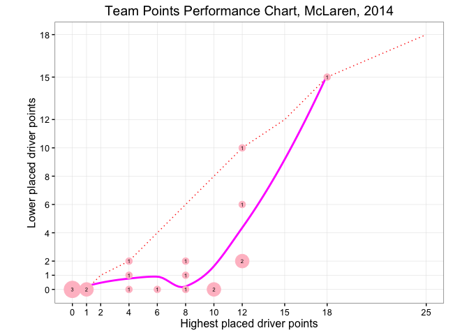
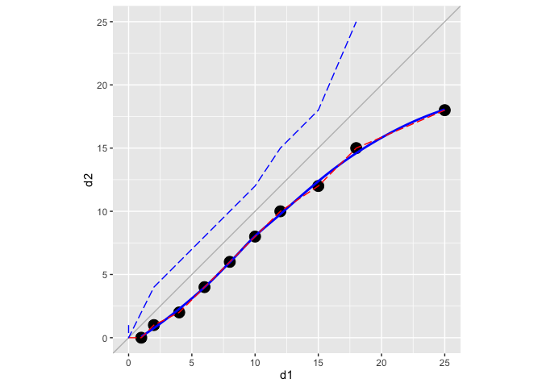

# Points Performance Charts

Knowing the likely payoff for different grid positions based on the number of points a car starting in that position is likely to attain is one-way of putting points-and-positions data to work. Another way in which we can look at points data is to use it to compare the performance of two different drivers, such as two drivers in the same team.

In this chapter, we'll explore *points performance charts*, a novel graphical technique for comparing not just driver performances, but also the extent to which a team maximises its points haul when the lead driver attains a particular points scoring position.

This approach is very much a work a progress whose usefulness - or otherwise - is yet to be proven. What it will demonstrate, nevertheless, is how we can construct our own graphical chart types as tools that help us probe our understanding of the data in novel ways.

The origins of the *points performance chart* begin with a question surrounding the extent to which teams maximise their points haul given the finishing position of their highest placed driver in each race. So let's start there...

## Maximising Team Points Hauls

Since the 2010 season, the top ten classified positions have scored championship points (25 for first, 18 for second, 15 for third, then 12, 10, 8, 6, 4, 2 and finally 1 point for 10th) ([FIA F1 Regulations](http://www.fia.com/sport/regulations?f%5B0%5D=field_regulation_category%3A82)). A tweak to the 2014 regulations makes double points now available in the final race of the season.

If a team's highest classified car finishes in the top 9 positions, the team will maximise its points haul if the other car is placed in the next position. If the highest placed car wins the race, scoring the maximum 25 points (unless it's the last race of the season in 2014 and perhaps onwards), the team will obviously maximise its points haul if the other car is placed second. In fact, this is the ultimate points haul - *25 + 18 = 43* points for the team from a single race.

Let's start by grabbing some data, joining together two copies of the results table on `raceId`, `driverId` and `constructorId` but distinct `driverId` and recording the results of the higher-placed driver in the team (*r1*) and the lower placed driver (*r2*). We'll also grab the total points haul for each team in each race.


```r
library(DBI)
library(ggplot2)
ergastdb =dbConnect(RSQLite::SQLite(), './ergastdb13.sqlite')

#Find results for pairs of drivers in the same team and the same race
#At least one driver must score points
#r1 is placed ahead of r2 in terms of points haul
results=dbGetQuery(ergastdb,
                   'SELECT  year, constructorRef AS team,
                            r1.position AS r1pos,
                            r2.position AS r2pos, 
                            r1.points AS r1points, 
                            r2.points AS r2points, 
                            (r1.points+r2.points) AS points 
                   FROM results r1 JOIN results r2 JOIN races r JOIN constructors c 
                   WHERE r1.raceId=r2.raceId 
                        AND r1.constructorId=r2.constructorId 
                        AND c.constructorId=r2.constructorId 
                        AND r.raceId=r1.raceId 
                        AND r1.driverId!=r2.driverId 
                        AND r1.points>r2.points 
                        AND year >=2010')
```

We can use a box plot to show the distribution of team points across a series of races where at least one team member was in the points, illustrating the extent to which teams maximised their points haul during each race.


```r
points=c(25,18,15,12,10,8,6,4,2,1)

pos.points=data.frame(position=seq(10),
                      points=points,
                      maximiser.points=c(points[-1],0),
                      max.pts=points+c(points[-1],0))
                
teamPerformance=function(results){
  g= ggplot(results,aes(x=factor(r1pos),y=points))
  g= g+ geom_boxplot(aes(group=r1pos)) 
  g= g+ geom_line(data=pos.points, aes(x=position, y=max.pts), colour='blue')
  g= g+ geom_line(data=pos.points, aes(x=position, y=points), colour='grey')
  g=g+stat_sum(aes(size = ..n..))
  g= g+ stat_smooth(aes(x=r1pos), colour='magenta',se=FALSE)
  g =g+ xlab('Position of highest placed driver in team')
  g= g + ylab('Total team points')
  g
}

g=teamPerformance(results)
g
```

 

The blue line shows the maximum points available; the magenta line is a fitted line on the distribution of total points received per ranking position of the highest (or only) placed driver in the team; the grey line shows the minimum points haul (that is, just the number of points scored by the highest placed driver). The filled circles are proportionally sized according to the number of times a particular team points haul was recorded given the position of the highest ranked team member. In this example, data comes from all teams for the seasons 2010-2013.

If each team maximised its points (given a particular classification for the lead driver) in every race, there would be a single large circle on the blue line for each finishing position.

In the boxplot itself, the horizontal bar depicts the *median* value of the total points scored by a team for each finishing position of the highest placed driver in the team. The box itself shows the range of the first to the third quartile and the lines extend out to the highest and lowest values that lie within 1.5 times the interquartile range. Which all sounds very complicated, but basically describes the distribution of the points scores and allows outliers to be highlighted specifically. (In this case, there are no outliers.)

A faceted chart allows us to summarise the ability of different teams to maximise their points hauls.


```r
g+facet_wrap(~team)
```

 

The closeness of the magenta line to the blue line is an indicator of the extent to which the team members were keeping each other honest and the team was maximising its points haul. The closeness of the magenta line to the grey line is an indicator of the extent to which the points haul was solely down to the highest placed driver in each race.

If we limit the data to driver performances from a particular team, we can see how well that team fared over several years.


```r
teamPerformance(results[results['team']=='mclaren',])+facet_wrap(~year)
```

 

This chart shows how McLaren had a good year in 2011 with its leading car always placed in the top 4 (at least, when the lead car was in a points scoring position; the chart could perhaps be modified to show a count of races where both cars are out of the points with an 11+ position?)

But the following chart shows how Red Bull dominated that season even more convincingly:


```r
teamPerformance(results[results['team']=='red_bull',])+facet_wrap(~year)
```

 

We can look at summary statistics of the distribution of total points scores more exactly by looking at some key values in a tabular format, in particular the mean and median number of points scored by the teams. The following table summarises results across all teams and all races for the 2010 to 2013 seasons inclusive.


```r
library(plyr)

teamPerformance.table=function(results){
  teamPerformance =ddply(results,'r1pos',summarise,
                       mean_pts=mean(points), 
                       med_pts=median(points),
                       mean_r2pts=mean(r2points),
                       med_r2pts=median(r2points),
                       mean_r2pos=mean(r2pos,na.rm=TRUE),
                       med_r2pos=median(r2pos,na.rm=TRUE))
  teamPerformance['pts']=points
  teamPerformance['maxPts']=pos.points$max.pts
  teamPerformance['r2maxpts']=c(points[-1],0)
  teamPerformance
}
```

| r1pos| maxPts| mean_pts| med_pts| pts| r2maxpts| med_r2pts| mean_r2pts|
|-----:|------:|--------:|-------:|---:|--------:|---------:|----------:|
|     1|     43|    34.75|      37|  25|       18|        12|       9.75|
|     2|     33|    25.78|      26|  18|       15|         8|       7.78|
|     3|     27|    19.98|      20|  15|       12|         5|       4.98|
|     4|     22|    16.12|      14|  12|       10|         2|       4.12|
|     5|     18|    12.21|      11|  10|        8|         1|       2.21|
|     6|     14|    10.11|       9|   8|        6|         1|       2.11|
|     7|     10|     7.08|       6|   6|        4|         0|       1.08|
|     8|      6|     4.45|       4|   4|        2|         0|       0.45|
|     9|      3|     2.09|       2|   2|        1|         0|       0.09|
|    10|      1|     1.00|       1|   1|        0|         0|       0.00|

From this table we can see how far teams in general tend to fall short in terms of their ability to maximise points given the position of their highest placed driver. The discrete nature of the number of points awarded suggests that the median points score may give a more useful indicator of the "central" behavior of the second placed car in the team than the real valued mean points score.

As well as comparing points, we can also compare the typical positions acheived by the second placed driver in a team. This shows rather more directly how close in support the second driver was to the first placed driver in the team.


| r1pos| med_r2pos| mean_r2pos|
|-----:|---------:|----------:|
|     1|       4.0|       5.05|
|     2|       5.0|       5.98|
|     3|       6.0|       7.73|
|     4|       6.0|       7.60|
|     5|       9.0|       9.87|
|     6|      10.0|      10.50|
|     7|      10.0|      10.93|
|     8|      11.0|      11.97|
|     9|      13.0|      13.06|
|    10|      13.5|      13.82|

Over the course of several seasons, we see that there must have been some rotation of teams on the podium: the median position for teammates of podium finishers was three places behind. Furthermore, if a driver finishes in the top 7, it's as likely as not that his team-mate will also finish in the top 10.

## Intra-Team Support

We can get a better idea of how the team mates supported each other by plotting their respective positions on a jittered scatter plot. In the plot on the left, each point relates to a result for a particular team.  In the plot on the right, the dots reflect the number of results with that points profile. The horizontal x-axis is the position of the higher classified driver, the vertical y-axis the classification of their lower placed team mate.


```r
library(gridExtra)

teampoints.dualchart=function(results){
  g=ggplot(results,aes(x=r1points,y=r2points))
  g=g+stat_smooth(se=FALSE,colour='blue')
  g=g+geom_line(data=pos.points,aes(x=points,y=maximiser.points),col='red')
  g=g+geom_line(data=teamPerformance,aes(x=pts,y=med_r2pts),col='magenta')
  g=g+xlab(NULL)+ylab(NULL)

  g1=g+geom_jitter()
  g2=g+stat_sum(aes(size = ..n..))
  grid.arrange( g1, g2, ncol=2,widths=c(1.1,1.32))
}

teampoints.dualchart(results)
```

 

The red line is the upper bound on the points the lower classified driver within a team can score. The blue line is a fit that models the typical points contribution made by the second placed driver compared to their higher placed teammate. The magenta line plots the median number of points scored by the lower placed driver.

The above chart shows the behaviour for all teams over the sample period, but it doesn't really allow us to compare anything with anything much, other than perhaps noting a tendency for drivers to well support each other *if* they both finish in the points.

If we limit the sample to just those situations where a team placed *both* its drivers in the points, we can get a clearer view of how many points a team might expect to earn if it places both drivers.


```r
teampoints.dualchart(results[results['r2points']>0,])
```

 

If you win, you expect your team mate to finish in the top 4. If you take third, it looks as if your team mate stands a good chance of being fourth or sixth. Does this tell us anything about race psychology?! The chart also shows how well teams do seem to maximise their points hauls.


## Points Performance Charts - One-Way

Trying to get a feel for how teams maximise points in general is one thing, but can we develop this chart style to produce an instrument that gives us a useful indication about how well a particular team is faring in terms of points maximisation?

A *one-way points performance chart* can be used to show how well drivers within a team are supporting each other (or by extension, how closely two drivers from different teams are competing).

The chart will plot counts of how many races each combination of points finishes was attained. In the one-way chart, we aren't interested in which driver was higher placed. The chart will be annotated with a line that shows the maximum possible points haul, give the points take of the highest placed driver.

We'll use a clean design for the chart, with squared off axes, and set the grid lines to reflect the actual points scores that are possible.


```r
NEWPOINTS =c(25,18,15,12,10,8,6,4,2,1)

#The newpoints dataframe has two columns
#The first column indicates points available, in order
#The second column is the maximum number of points the lower placed driver could score
newpoints=data.frame(x=c(NEWPOINTS,0),y=c(NEWPOINTS[-1],0,0))

baseplot_singleWay=function(g){
  g=g+geom_line(data=newpoints,aes(x=x,y=y),col='red',linetype='dotted')
  g=g+xlab('Highest placed driver points')+ylab('Lower placed driver points')
  g=g+scale_y_continuous(breaks = newpoints$x,minor_breaks=NULL) 
  g=g+scale_x_continuous(breaks = newpoints$x,minor_breaks=NULL)
  g=g+coord_fixed()
  g=g+guides(size=FALSE)+theme_bw()
  g
}

baseplot_singleWay(ggplot())
```

 

A> ### Line Guides
A> Line guides can be added to a chart to help split up the chart area and provide a cue that helps us read more sense into the placement of particular marks. I don't know to what extent the Red Arrows pilots use the explosive canopy cords (which various commentators suggest they are) to help them sight their formations, but I think I'd make use of the visual cues they provide...
A>
A> 
A>
A> *Canopy view from Red Arrows cockpit*

To generate our points position chart, we'll get the driver results for the drivers we want to compare and then annotate it with the higher and lower of the race positions and points scored by the drivers in each race. A flag is also set to identify whether or not the second listed driver was higher placed than the first.


```r
raceoff_d1d2 = function(d1,d2) {
  raceoff=merge(d1[,c('points','position','positionText','round')],
                d2[,c('points','position','positionText','round')],
                by='round')
  #Is the second listed driver higher placed than the first?
  raceoff$topd2=(raceoff$position.x>raceoff$position.y)

  #Hack final round points for the 2014 season
  raceoff[raceoff['round']==19,]$points.x=raceoff[raceoff['round']==19,]$points.x/2
  raceoff[raceoff['round']==19,]$points.y=raceoff[raceoff['round']==19,]$points.y/2
  #d1 refers to the higher placed driver
  #d2 refers to the lower placed driver
  raceoff=ddply(raceoff, .(round),transform,
                d1pos=max(position.x,position.y),
                d2pos=min(position.x,position.y),
                d1points=max(points.x,points.y),
                d2points=min(points.x,points.y))
}
```

We can now generate a raceoff datatable from the race results of two drivers. As an example, let's see how the two McLaren drivers, Jenson Button and Kevin Magnussen, supported each other in the 2014 season.


```r
#We're going to use data from the live ergast API for these charts
source('ergastR-core.R')

button=driverResults.df('2014','button')
magnussen=driverResults.df('2014','kevin_magnussen')

#Generate the raceoff dataframe for two drivers
raceoff=raceoff_d1d2(button,magnussen)

#Summarise the counts of higher/lower points allocation combinations
raceoff.team.summary=ddply(raceoff,.(d1points,d2points),summarise,
                           cnt=length(round))
```

We can then plot this data onto our base chart, using a symbol size proportional to the count of how many races a particular points combination was received in, and further labelled with the same count value.


```r
pointsPerformanceChart=function(raceoff,raceoff.team.summary,constructorRef){
  g=ggplot(raceoff.team.summary,aes(x=d1points,y=d2points))
  g=baseplot_singleWay(g)
  g=g+stat_smooth(data=raceoff,aes(x=d1points,y=d2points),se=F,col='magenta')
  g=g+geom_point(aes(size=cnt),col='pink')
  g=g+geom_text(aes(label=cnt),size=2)
  g=g+scale_size_continuous(range=c(3,8))
  g=g+ggtitle(constructorRef)
  
  g
}

pointsPerformanceChart(raceoff,raceoff.team.summary,'Team Points Performance Chart, McLaren, 2014')
```

 

The closer the magenta best fit line is to the dashed red maximum points haul line, the closer the team members were terms of points finishes within each race. In this example, we see that there were only three races in which both drivers finished in the points in consecutive places and thus maximised the team points haul.

There are two main weaknesses with this chart. Firstly, we don't know whether one driver in particular dominated the other. Secondly, we don't know how the points finishes evolved over the course of the season. We will address the first point in an extension to the idea of the points performance chart below, by considering a *two way* rather than a *one-way* chart. As for tracking the evolution of the points distribution over time, one approach might be to generate a sequence of charts and animate the construction of the chart across the races in a particular season.

## Points Performance Charts - Two-Way

To get round the problem of the one-way points performance chart's inability to distinguish which, if either, of the team's drivers was dominating the points haul, we can generate a two-way chart in which each axis represents the points taken in a particular race by a particular driver.

In this chart, we can plot two guides that indicate the maximum points haul depending on which driver is higher placed.


```r
baseplot_twoway=function(g,d1="Driver 1 Race points", d2="Driver 2 Race Points"){
  g=g+geom_line(data=newpoints,aes(x=x,y=y),col='red',linetype='dotted')
  g=g+geom_line(data=newpoints,aes(x=rev(y),y=rev(x)),col='blue',linetype='dotted')
  g=g+stat_abline(col='grey')
  g=g+scale_y_continuous(breaks = newpoints$x,minor_breaks=NULL) 
  g=g+scale_x_continuous(breaks = newpoints$x,minor_breaks=NULL)
  g=g+xlab(d1)+ylab(d2)
  g=g+coord_fixed()
  g=g+theme_bw()
  g=g+guides(size=FALSE)
  g
}

baseplot_twoway(ggplot())
```

 

The red dashed line shows the maximum points haul line if *Driver 1* on the x-axis was higher placed in a particular race; the blue dashed line shows the maximum points haul line if *Driver 2* on the y-axis was higher placed.

We now need to generate a suitable summary dataset that counts the number of races where each particular combination of points was recorded.


```r
#Summary table counting how well each particular driver fares against the other
raceoff.summary=ddply(raceoff, .(points.x,points.y), summarise,
                      cnt=length(round))
```

This data can be overplotted onto the base two-way points performance chart.


```r
pointsDualPerformanceChart=function(raceoff,raceoff.summary,title,d1,d2){
  g=ggplot(raceoff.summary,aes(x=points.x,y=points.y))
  g=baseplot_twoway(g,d1,d2)
  g=g+stat_smooth(data=raceoff,aes(x=d1points,y=d2points),se=F,col='magenta')
  g=g+geom_point(aes(size=cnt),col='pink')
  g=g+geom_text(aes(label=cnt),size=2)
  g=g+scale_size(range=c(2,6),name="Count")
  g=g+ggtitle(title)
  
  g
}
```

Once again, we use a proportionally sized symbol overplotted with a value to denote points combination counts and make use of a best fit or model line to highlight the general performance.


```r
pointsDualPerformanceChart(raceoff,raceoff.summary,"Driver Points Performance Chart, McLaren, 2014",'BUT','MAG')
```

 

In this case, we see that the results are typically placed *off the maximum points lines*, showing that points take is not being maximised; and the marks are placed in the *lower right quadrant below the red dashed line*, signifying that the driver on the horizontal x-axis (in this case, Jenson Button (BUT)) tended to score more points that Kavin Magnussen (MAG) whose points scores are represented on the vertical y-axis. 

If the marks tended to appear in the upper left quadrant above the blue dashed line, it would denote that the driver represented on the y-axis tended to outperform the driver represented on the x-axis.

Note that this chart does not require that drivers are members of the same team, only that they drove in the same races.

### Exploring the Behaviour of the Two-Way Points Performance Chart

The *points performance charts* are a novel chart type that use maximum points haul guide lines to help us read sense into the marks placed on them. As a new chart type, it makes sense to use some extreme case dummy data to see what limiting cases look like.

Let's create a simple function to sketch a crude two-way points perfromance chart.


```r
twowayPointsPerfSketch=function(df){
  g=ggplot(df,aes(x=d1,y=d2))+stat_sum(aes(size = ..n..))
  g=g+stat_abline(col='grey')
  g=g+stat_smooth(se=F,colour='blue')
  g=g+geom_line(data=newpoints,aes(x=x,y=y),col='red',linetype='longdash')
  g=g+geom_line(data=newpoints,aes(x=y,y=x),col='blue',linetype='longdash')
  g + coord_fixed() +guides(size=FALSE)
  }
```

We'll now consider several extreme cases of points take. First, for *twenty* races, where one driver scores each position in the top 10 twice, beating his team mate, who maximises points below by taking the next position in each race.


```r
subpoints=c(NEWPOINTS[-1],0)
df=data.frame(d1=numeric(),d2=numeric())
for (i in seq(length(NEWPOINTS))) {
  df=rbind(df,data.frame(d1=NEWPOINTS[i],d2=subpoints[i]))
}
df=rbind(df,df)

twowayPointsPerfSketch(df)
```

 

In this case, all the points lie on a single points haul maximisation line. The best fit model line closely follows the points maximisation line.

Second, for *twenty* races, where each driver scores each position in the top 10 once, beating his team mate, who once again maximises points below.


```r
df=data.frame(d1=numeric(),d2=numeric())
for (i in seq(length(NEWPOINTS))) {
  df=rbind(df,
           data.frame(d1=NEWPOINTS[i],d2=subpoints[i]),
           data.frame(d1=subpoints[i],d2=NEWPOINTS[i]))
}

twowayPointsPerfSketch(df)
```

 

If we add in another best fit line, this time for a simple linear model, we can get a feel for how closely it tend towards the grey equal points line.


```r
twowayPointsPerfSketch(df)+stat_smooth(se=F,method='lm',colour='magenta')
```

 

Third, this time for just *ten* races, where points are maximised and drivers alternate in terms of who scores the most points.


```r
df=data.frame(d1=numeric(),d2=numeric())
for (i in seq(1,length(NEWPOINTS),2)) {
  df=rbind(df,
           data.frame(d1=NEWPOINTS[i],d2=subpoints[i]),
           data.frame(d1=subpoints[i+1],d2=NEWPOINTS[i+1]))
}

twowayPointsPerfSketch(df)+stat_smooth(se=F,method='lm',colour='magenta')
```

 

Once again, we see how the best fit lines stay *within* the inner bounds of the points maximisation lines. Generally, if the team is maximising points, the best fit line will be in this inner space in the two-way chart.

## Summary
In this chapter, we have explored the extent to which teams maximise their points hauls, both in general terms by summarising results across all teams and several seasons, and in more detailed way by considering the performance of a single team in a single season.

A *one way points performance chart* can be used to plot a count of team points hauls for a set of races against the points scored by the highest placed driver in the team in each race. A line guide shows the maximum points haul possible given the position of the highest placed driver. The *one way* chart *does not* identify which driver was the higher placed.

A *two way points performance chart* plots a count of points combinations given the (x,y) pairing of points scored by each driver across the specified races. The two way plot *does* identify which driver scored better across the races. In the two way plot, *two* line guides identify the maximum possible points haul in a given race given the number of points scored by the higher placed driver *and* which driver it was.

One problem with both one-way and two-way points performance charts is that they don't reveal which races were responsible for which points hauls, or whether the relative balance of driver superiority evolved over the course of a season.
