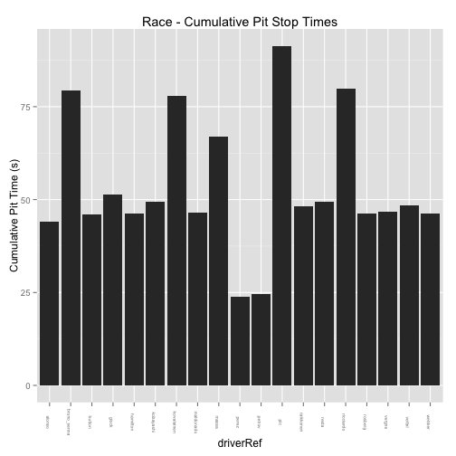
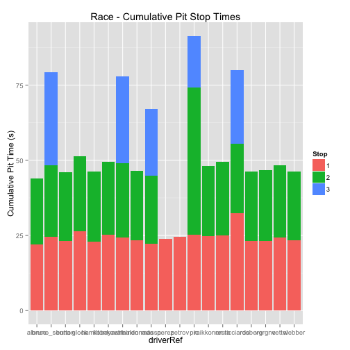
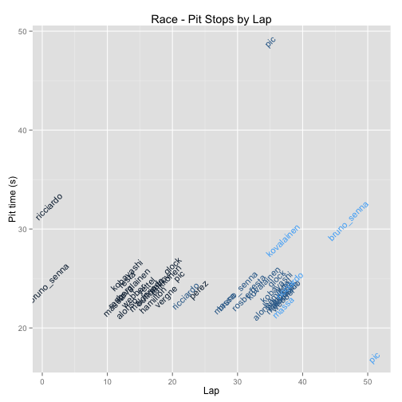

# Chapter - Pit Stop Analysis

With the F1 race regulations such as they are, cars are forced to pit at least once during each race in order to change tyres. (?No requirement to stop in wet race?)

In addition, recent years have seen Pirelli, at the request of Formula One Administration, experiment with various tyre compounds in order to improve the race spectacle.

Whenever a car comes in to the pits, there is an associated *pit loss time* compared to a flying lap time that accrues as a result of the car having to slow down as it makes its way through the pit lane. There are also time losses associated with slowing down to enter the pit lane on an in-lap, and time spent getting back up to speed and tyre temperature on the out-lap. These time losses, or costs, are all in addition to any time the car spends as it is stationary, along with the milliseconds spent actually entering and exiting a particular pit box.

At the current time, the FIA do not publicly publish the time a car is stationary, or explicit data about the reason a car has entered the pit lane. This means that we do not necessarily know whether a car has stopped for a procedural tyre change pit stop, or as part of a penalty such as a drive-through penalty or a stop/go penalty. **Footnote - regulations on penalties

However, sources such as the ergast API do publish some information about the time each car spends within the pit lane each time it enters it. In this chapter, we will explore various ways of visualising pit behaviour and comparing the relative effectiveness of the teams at pitting.


## Pit Stop Data

Information about pit stop times can be found in the *pitStops* table of the ergast database.

The *pitStops* table provides information on a race by race basis of includes the driver involved with a stop (`driverRef` and `driverId`), the time spent in the pit lane in seconds (`duration`) and as milliseconds (`milliseconds`), the pit number for that driver (that is, a count of the number of stops to date, including the current stop) and the time of day the pit event happened*

* footnote: though I'm not sure at what point of the pit procedure exactly this time is captured? If it's entry to pit lane, and `duration` is calculated from pit entry to pit exit, we should be able to calculate whethe there has been a change of position within the pits? That is if the order of the entry time of day of two drivers pitting about the same time is different to the order of the entry time of day + pit duration, then a position change will presumably have taken place.


```r
require("ggplot2")
```

```
## Loading required package: ggplot2
```

```r
require("RSQLite")
```

```
## Loading required package: RSQLite
## Loading required package: DBI
```

```r
setwd("/Users/ajh59/code/f1/f1TimingData/f1djR/ergastdb")
f1 = dbConnect(drv = "SQLite", dbname = "ergastdb.sqlite")
# need regular expression on eg 'Australian'
get.raceId.q = function(db, year, name) {
    paste("SELECT raceId FROM races WHERE year=", year, " AND name=\"", name, 
        "\"", sep = "")
}


# Need newer db - update driverRef to TLID
get.pitStops.q = function(raceId) {
    paste("SELECT p.raceId, p.driverId, p.stop, p.lap, p.time, p.duration, p.milliseconds, d.driverRef FROM pitStops p, races r, drivers d WHERE r.raceId=", 
        raceId, "AND p.raceId=r.raceId AND p.driverId=d.driverId")
}

get.pitStops = function(db, raceId) {
    df = dbGetQuery(f1, get.pitStops.q(860))
    df$duration = as.numeric(df$duration)
    # df$time=
    df
}

pitStops.df = get.pitStops(f1, 860)

# Preview the contents of the pitStops table
kable(head(pitStops.df, 5))
```

```
## |  raceId|  driverId|  stop|  lap|time      |  duration|  milliseconds|driverRef    |
## |-------:|---------:|-----:|----:|:---------|---------:|-------------:|:------------|
## |     860|       811|     1|    1|17:05:23  |     24.60|         24599|bruno_senna  |
## |     860|       817|     1|    1|17:05:35  |     32.32|         32319|ricciardo    |
## |     860|        13|     1|   11|17:21:08  |     22.31|         22313|massa        |
## |     860|         3|     1|   12|17:22:31  |     23.20|         23203|rosberg      |
## |     860|         4|     1|   13|17:24:04  |     22.04|         22035|alonso       |
```


We can also load the same?? information in from the ergast API directly:


## Total pit time per race

A typical report on  pitstop behaviour will give the cumulative time spent by each driver in the pitlane.

The simplest chart we might create totals the pit time for each driver and displays it by driver.


```r
xRot = function(g, s = 5, lab = NULL) g + theme(axis.text.x = element_text(angle = -90, 
    size = s)) + xlab(lab)
xRotn = function(s = 5) theme(axis.text.x = element_text(angle = -90, size = s))
```


```r
g = ggplot(pitStops.df, aes(x = driverRef, y = duration))
g = g + geom_bar(stat = "identity")
# g=xRot(g)
g = g + ggtitle("Race - Cumulative Pit Stop Times")
g = g + ylab("Cumulative Pit Time (s)")
g + xRotn()
```

 


Oftentime we see this sort of chart presented as a horizontal bar chart. We can realign the chart simply by ??

??horizontal bar chart??

A common challenge presented by both these views is the order in which we should present the bars.

Where a factor is used as the basis of the x-axis, the order in which the items are displayed corresponds to the order of the factor levels. By default, this is based on alphabetical ordering. By choosing `driverRef` for the x-axis, we get an ordering (by default) of the drivers in alphabetical order of their surname. That is, by default items are ordered based on the first character in surname (or whatever string/text field we are ordering on), then the second, then the third, and so on.

Ordering by surname is meaningful in many areas - we are familiar with the order of the alphabet so we can use that knowledge to help us find a name that starts with a particular letter or combination letters quite quickly. But in Formula One, there are several other, rather more meaningful orderings, at least to people who follow the sport and are knowledgeable about the teams, drivers, the state of the championship, or the state of the current race weekend.

For example, we might choose to order

** orderings, what we expect, different ordering may help us spot different surprises, and surprises are possible sotires, or at least may lead to questions..

Another issue presented by the summed charts shown above is the 


```r
race.plot.pits.cumulativeTime = function(.racePits) {
    g = ggplot(.racePits, aes(x = driverRef, y = duration, fill = factor(stop)))
    g = g + geom_bar(stat = "identity")
    g = g + guides(fill = guide_legend(title = "Stop"))
    # g=xRot(g)
    g = g + ggtitle("Race - Cumulative Pit Stop Times")
    g = g + ylab("Cumulative Pit Time (s)")
    g
}

race.plot.pits.cumulativeTime(pitStops.df)
```

 


In making comparisons across these summed pit times, the stacking of the bars may mask????making comparison difficult ??what sortt of comparision?
If we *dodge* the bars for each driver, we can

??
is the idea of a *macroscope* that allows us to look at *all* the data in a particular data view. (Sometimes this is referred to an *N=all* approach.)
???

We can also generate a tabular data report to summarise this information, identifying the number of times each driver passed through the pitlane during the race, along with the total time spent there.


## Pit Stops Over Time

One of the problems with the total pit time summary reports is that they mask information about when the drivers were pitting. One possible "N=all" view over the pitstop data for a particular race. For example, we can use a text plot to display the duration of each pitStop event for each named driver using lap number or time of day for the x-axis. (Time of day is  proxy for race time, and allows us to zoom in on the actual times that drivers pitted during the race. This contrasts to a lap time base, where we do not know the order in which drivers pitted or how closely in time they pitted,)


```r

# Need newer db - update driverRef to TLID
race.plot.pits.stopsByLap = function(.racePits) {
    g = ggplot(.racePits) + geom_text(aes(x = lap, y = duration, label = driverRef, 
        col = stop), size = 4, angle = 45)
    g = g + ggtitle("Race - Pit Stops by Lap") + xlab("Lap")
    g = g + ylab("Pit time (s)")
    g = g + theme(legend.position = "none")
    g
}

race.plot.pits.stopsByLap(pitStops.df)
```

 


## Estimating pit loss time

In order to win a race, a driver must complete the race distance in the shortest overall time. Since time is lost whenever a car enters the pits, teams must trade off pit loss times against the benefits of quicker laptimes that come from running newer tyres.

## Tyre Change Data
One of the major reasons for pitting is to change tyres. At the current time, neither the FIA nor the tyre suppliers publish details about the tyres used on each car in each stint.

?Footnote: information about other items covered by the regulations that may be chnaged between races or over the course of the race weekend, such as engines and gearboxes, is also hard to come by.

2=dbGetQuery(f1,"SELECT sum(duration)/count(duration) av,min(duration) min,r.circuitId,r.name FROM pitStops o JOIN races r WHERE o.raceId=r.raceId GROUP BY r.circuitId")
> ps2$d=ps2$min-ps2$av


**Footnote When in-race refuelling was still allowed, race time simulations also had to take into account the time penalties associated from running cars with heavier fuel loads: typically, each additionaly kilogram of fuel added of the order ???s to the laptime (for example, depending on circuit length), so teams were faced with a range of trade offs:

- lighter cars run faster so you want to run more stints with fewer laps in each stint;
- more stints require more pitstops; as each pitstop has a pit loss time penalty associated with it you want to minimse the number of pitstops;
- fresher tyres tend to run faster than degraded ones - the longer the stint, the more the tyre degrades and the more performance suffers;
- for tyres that have completed more than a certain number of lap, their continued perfomance may fall off very quickly;
- tyres may behave differently depending on the mass of the car (and hence fuel load).
For an example of how run race simulations based around choosing optimal fuel strategies, see ??? mclaren RAeng


race.plot.pits.teamDistribution=function(.racePits){
  g=ggplot(.racePits)+geom_boxplot(aes(x=team,y=pitTime))
  g=g+ggtitle(mktitle(paste(event,"Race - Pit Stop distribution by team")))+xlab("Lap")
  g=g+ylab("Pit time (s)")
  g=xRot(g,7)
  g=g+theme(legend.position="none")
  g
}

race.plot.pits.DeltaFromOverallBest=function(.racePits){
  g=ggplot(.racePits)+geom_bar(aes(x=TLID,y=pdelta),stat="identity")
  g=g+facet_wrap(~stops)
  g=xRot(g,7)
  g=g+ggtitle(mktitle(paste(event,"Race - Pit Stop Deltas from Overall Best Pit")))
  g=g+ylab("Pit Deltas (s)")
  g
}

race.plot.pits.DeltaFromOverallBest2=function(.racePits){
  g=ggplot(.racePits)+geom_bar(aes(x=TLID,y=pdelta,fill=factor(stops)),stat="identity")
  g=xRot(g)
  g=g+guides(fill=guide_legend(title="Stop"))
  g=g+ggtitle(mktitle(paste(event,"Race - Pit Stop Deltas from Overall Best Pit")))
  g=g+ylab("Cumulative Pit Deltas (s)")
  g
}
