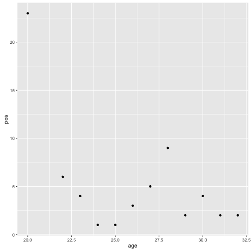
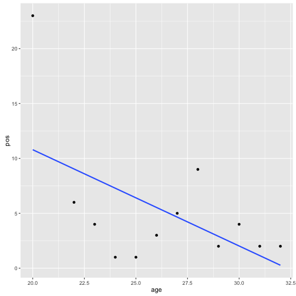
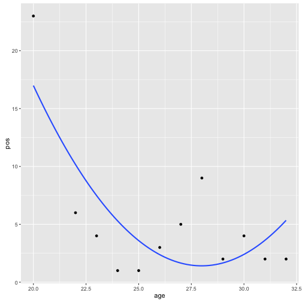
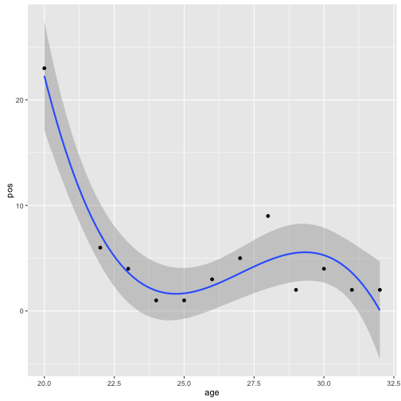

# Career Trajectory

*This chapter was originally inspired by the **Career Trajectories** chapter of **[Analyzing Baseball Data with R](http://baseballwithr.wordpress.com/about/)** (2013) by Max Marchi & Jim Albert.*

With ever younger drivers entering Formula One, and a culture in which certain teams drop drivers before they really have time to mature, an interesting to question to ask is what sort of career trajectory, or profile, do longlasting drivers tend to have? Did early success guarantee them a long dotage on the grid? Or have they been better than average journeymen, good team players who were always thereabouts in the top 10 but rarely actually there on the podium? Or did they begin as outperformers in a lowly team and steadily make their way up the grid to later success?

In this chapter we'll explore various ways of looking at - and modeling - career trajectories. Some statistical modeling is involved, but it will be presented in mainly a graphical form.

The data we're going to use comes from the *ergast* database, and represents the career history of selected drivers. 


```r
library(DBI)
ergastdb=dbConnect(RSQLite::SQLite(), './ergastdb13.sqlite')

#Helper function to display database query result as a formatted table
kdb=function(q){ kable(dbGetQuery(ergastdb,q)) }
```

```r
list( dbGetQuery(ergastdb,'SELECT name FROM sqlite_master WHERE type = "table"') )
```

[[1]]
                   name
1              circuits
2    constructorResults
3  constructorStandings
4          constructors
5       driverStandings
6               drivers
7              lapTimes
8              pitStops
9            qualifying
10                races
11              results
12              seasons
13               status

The data we need is spread across several tables in the local database. For example, the *drivers* table includes the date of birth, which allows us to calculate a driver's age, and nationality. Knowing a driver's nationality allows us to make comparisons with the nationality of any teams the driver competes for to see if there are any effects on performance there; or with the country in which a particular race takes place to see if there appears to be a "home race" effect on performance.


```r
kdb('SELECT * FROM drivers limit 3')
```


| driverId|driverRef |code |forename |surname  |dob        |nationality |url                                         |
|--------:|:---------|:----|:--------|:--------|:----------|:-----------|:-------------------------------------------|
|        1|hamilton  |HAM  |Lewis    |Hamilton |1985-01-07 |British     |http://en.wikipedia.org/wiki/Lewis_Hamilton |
|        2|heidfeld  |HEI  |Nick     |Heidfeld |1977-05-10 |German      |http://en.wikipedia.org/wiki/Nick_Heidfeld  |
|        3|rosberg   |ROS  |Nico     |Rosberg  |1985-06-27 |German      |http://en.wikipedia.org/wiki/Nico_Rosberg   |

The *driverStandings* table contains the Drivers' Championship standing of each driver at the end of each year, which allows us to keep track of how well they performed overall across several seasons. To know which team a driver was competing for, we'd need to reference yet another table.

If we access the *ergast* API directly, some of the linking and annotation work is done for us. For example, the *driverStandings* API call ([example](http://ergast.com/api/f1/drivers/alonso/driverStandings)) includes information about the constructor a driver (primarily?) drove for, along with the driver's championship position at the end of each round, the number of their wins and the number of points they collected.


```r
#ergastR-core.R contains utility functions for accessing the ergast API
#and returning the results in a dataframe
source('ergastR-core.R')
alonso = driverCareerStandings.df('alonso')
kable(alonso)
```


| year|driverId |code | pos| points| wins|car     |
|----:|:--------|:----|---:|------:|----:|:-------|
| 2001|alonso   |ALO  |  23|      0|    0|minardi |
| 2003|alonso   |ALO  |   6|     55|    1|renault |
| 2004|alonso   |ALO  |   4|     59|    0|renault |
| 2005|alonso   |ALO  |   1|    133|    7|renault |
| 2006|alonso   |ALO  |   1|    134|    7|renault |
| 2007|alonso   |ALO  |   3|    109|    4|mclaren |
| 2008|alonso   |ALO  |   5|     61|    2|renault |
| 2009|alonso   |ALO  |   9|     26|    0|renault |
| 2010|alonso   |ALO  |   2|    252|    5|ferrari |
| 2011|alonso   |ALO  |   4|    257|    1|ferrari |
| 2012|alonso   |ALO  |   2|    278|    3|ferrari |
| 2013|alonso   |ALO  |   2|    242|    2|ferrari |
| 2014|alonso   |ALO  |   6|    161|    0|ferrari |

For convenience, we can create a local temporary table that includes much of the same information. To start with, we need to identify the final round of each championship year - the *CREATE TEMPORARY VIEW* SQL command creates a temporary table that we can work with as if it were any other table.


```r
dbGetQuery(ergastdb,
           'CREATE TEMPORARY VIEW lastRounds AS 
           SELECT s.year, r.raceId, r.round, r.name, s.maxRound 
           FROM (SELECT year, MAX(round) maxRound FROM races GROUP BY year) s 
           JOIN races r 
           WHERE r.round=s.maxRound AND r.year=s.year')
```

```r
kdb('SELECT * from lastRounds LIMIT 3')
```


| year| raceId| round|name                 | maxRound|
|----:|------:|-----:|:--------------------|--------:|
| 2009|     17|    17|Abu Dhabi Grand Prix |       17|
| 2008|     35|    18|Brazilian Grand Prix |       18|
| 2007|     52|    17|Brazilian Grand Prix |       17|

We can then generate a view similar to the API championship *driverStandings* results. Note that the team affiliation is the team the driver was competing for in the last round of the championship, rather than the team they competed for most in the season, for example.


```r
dbGetQuery(ergastdb,
           'CREATE TEMPORARY VIEW driverChampionship AS 
           SELECT year, ds.driverId, driverRef, constructorRef,
                  ds.points, ds.position AS pos, wins
           FROM driverStandings ds 
              JOIN drivers d 
              JOIN lastRounds lr 
              JOIN results r 
              JOIN constructors c
           WHERE ds.driverId=d.driverId 
              AND r.driverId=ds.driverId 
              AND ds.raceId=lr.raceId 
              AND r.raceId=lr.raceId 
              AND r.constructorId=c.constructorId')
```

```r
kdb('SELECT * from driverChampionship WHERE driverRef="alonso"')
```


| year| driverId|driverRef |constructorRef | points| pos| wins|
|----:|--------:|:---------|:--------------|------:|---:|----:|
| 2001|        4|alonso    |minardi        |      0|  23|    0|
| 2003|        4|alonso    |renault        |     55|   6|    1|
| 2004|        4|alonso    |renault        |     59|   4|    0|
| 2005|        4|alonso    |renault        |    133|   1|    7|
| 2006|        4|alonso    |renault        |    134|   1|    7|
| 2007|        4|alonso    |mclaren        |    109|   3|    4|
| 2008|        4|alonso    |renault        |     61|   5|    2|
| 2009|        4|alonso    |renault        |     26|   9|    0|
| 2010|        4|alonso    |ferrari        |    252|   2|    5|
| 2011|        4|alonso    |ferrari        |    257|   4|    1|
| 2012|        4|alonso    |ferrari        |    278|   2|    3|
| 2013|        4|alonso    |ferrari        |    242|   2|    2|

## The Effect of Age on Performance

At first glance, it might seem that asking whether performance appears to track age appears to be a relatively simple and straightforward question: *is a driver's performance somehow related to his age?*

But what do we mean by *age*? If we're using "number of years old" as our age figure when keeping track of how well a driver performs in a particular season, is that their age (in years) at the start of the season? Or the end of the season? Or midway through the season? Would age in months be better? For example, does the time of year in which their birthday falls make a difference? Or how about if we want to compare the career performance of drivers with birthdays in early January, mid-July and late December? Or is age more a function of their "F1 age", the number of years they have been competing at that level, or the number of races they have competed in, or finished?

To start with, let's try to keep things as simple as possible and consider the career in terms of season standings of a single driver, in this case Fernando Alonso. As his age, will we use the number of years between his year of birth and championship years.


We could get the driver data back from the API using a function with the following form:


```r
getYearFromDate=function(date){
  as.numeric(format(as.Date(date), "%Y")) 
}

driverData.list=function(driverRef){
  dURL=paste(API_PATH,'drivers/',driverRef,'.json',sep='')
  drj=getJSONbyURL(dURL)
  dd=drj$MRData$DriverTable$Drivers[[1]]
  list(
    dateOfBirth=as.Date(dd$dateOfBirth),
    driverId=dd$driverId,
    nationality=dd$nationality,
    yearOfBirth=getYearFromDate(as.Date(dd$dateOfBirth))
  )
}

driverData.list('alonso')
```

$dateOfBirth
[1] "1981-07-29"

$driverId
[1] "alonso"

$nationality
[1] "Spanish"

$yearOfBirth
[1] 1981

The *getYearFromDate()* function extracts the birth year from the date of birth.

Alternatively, we can call the local database and then annotate the result with the birth year:


```r
driverData=function (driverRef){
  q= paste('SELECT * FROM drivers WHERE driverRef== "',driverRef,'"',sep='')
  df=dbGetQuery(ergastdb,q)
  df$yearOfBirth=getYearFromDate(as.Date(df$dob))
  df
}
kable( driverData('alonso') )
```


| driverId|driverRef |code |forename |surname |dob        |nationality |url                                          | yearOfBirth|
|--------:|:---------|:----|:--------|:-------|:----------|:-----------|:--------------------------------------------|-----------:|
|        4|alonso    |ALO  |Fernando |Alonso  |1981-07-29 |Spanish     |http://en.wikipedia.org/wiki/Fernando_Alonso |        1981|

We can then use the birth year to find the age of a driver (at least, approximately) in each year of their career, calculated as *championship year - birth year*.


```r
drivercareer.aug=function(driverRef){
  ##API equivalent calls:
  #drivercareer=driverCareerStandings.df(driverRef)
  #driverdata=driverData.list(driverRef)
  q=paste('SELECT * from driverChampionship WHERE driverRef="',driverRef,'"',sep='')
  drivercareer=dbGetQuery(ergastdb, q)
  driverdata=driverData(driverRef)
  drivercareer$age=drivercareer$year-driverdata$yearOfBirth
  drivercareer
}

drivercareer=drivercareer.aug('alonso')
kable( drivercareer )
```


| year| driverId|driverRef |constructorRef | points| pos| wins| age|
|----:|--------:|:---------|:--------------|------:|---:|----:|---:|
| 2001|        4|alonso    |minardi        |      0|  23|    0|  20|
| 2003|        4|alonso    |renault        |     55|   6|    1|  22|
| 2004|        4|alonso    |renault        |     59|   4|    0|  23|
| 2005|        4|alonso    |renault        |    133|   1|    7|  24|
| 2006|        4|alonso    |renault        |    134|   1|    7|  25|
| 2007|        4|alonso    |mclaren        |    109|   3|    4|  26|
| 2008|        4|alonso    |renault        |     61|   5|    2|  27|
| 2009|        4|alonso    |renault        |     26|   9|    0|  28|
| 2010|        4|alonso    |ferrari        |    252|   2|    5|  29|
| 2011|        4|alonso    |ferrari        |    257|   4|    1|  30|
| 2012|        4|alonso    |ferrari        |    278|   2|    3|  31|
| 2013|        4|alonso    |ferrari        |    242|   2|    2|  32|

For Fernando Alonso, let's see how his career faired according to age by plotting his driver championship position against his age in years.


```r
require(ggplot2)
ggplot(drivercareer)+geom_point(aes(x=age,y=pos))
```

 

## Statistical Models of Career Trajectories

When it comes to trying to *model* career trajectories in baseball, Marchi and Albert suggested using a linear model of the form:

{$$}y = A + B(Age - 30) + C(Age-30)^2{/$$}

That may sound a little complicated, but that's statisticians for you - hiding simple, yet powerful, ideas amidst arcane terminology!;-)

Let's break down that equation a little. It says that championship position (*y*) can be modelled as a mathematical function of the age of the driver. We actually use the *(Age - 30)* in the equation so that the value *A* is a prediction of the championship position for the driver aged 30.

The equation itself defines a best fit curve through the data. The values of *A*, *B* and *C* are chosen so to minimise the difference or distance (also referred to as error, or residual value) between each data point and the line.

Before looking at how well that line fits the data, let's consider a simpler case: 

{$$}y = A + B(Age - 30){/$$}

This sort of equation defines a straight line as the line of best fit:


```r
g=ggplot(drivercareer,aes(x=age,y=pos))
g=g+stat_smooth(method = "lm", formula = y ~ I(x-30) , se=FALSE) 
g+geom_point()
```

 

The problem with this sort of line is that it it is a straight line, suggesting that a career can only go in one direction.

In the model Marchi and Albert suggest, the squared ("quadratic") term means we expect a curved line with a single hump in it; this allows for careers to go up and then down, or down and then up. We might also fit such a curve so that it only goes up, or only goes down within particular limits. Let's see how well a curve with that sort of shape fits our data:


```r
g=ggplot(drivercareer,aes(x=age,y=pos))
g=g+stat_smooth(method = "lm", formula = y ~ I(x-30) +I( (x-30)^2 ), se=FALSE) 
g+geom_point()
```

 

We can add increasing numbers of terms to the model, but the effect of these higher powered terms is often negligible. For example, if we ad a cubic term (power 3), we allow the line to have a couple of wiggles (that is, changes of direction).

We can also add confidence limits to the line (by default) to show how confident we are that a point is modelled by the line, subject to some amount of random variation in the values of the actual data points.


```r
g=ggplot(drivercareer,aes(x=age,y=pos))
g=g+stat_smooth(method = "lm", formula = y ~ I(x-30) +I( (x-30)^2 ) + I( (x-30)^3 ) ) 
g+geom_point()
```

 

Let's go back to Marchi and Albert's model: 

{$$}y = A + B(Age - 30) + C(Age-30)^2{/$$}

As well as using the graphical approach to see how well this model fit, we can run some numbers.


```r
lm(pos ~I(age-30) + I( (age-30)^2 ), data=drivercareer)
```


Call:
lm(formula = pos ~ I(age - 30) + I((age - 30)^2), data = drivercareer)

Coefficients:
    (Intercept)      I(age - 30)  I((age - 30)^2)  
         2.4003           0.9820           0.2441  

The *(Intercept)* value is the coefficient that corresponds to the value of *A* in the model - that is, the expected championship position for that driver aged 30. The other two values (corresponding to *B* and *C* in the equation) are harder to decipher, although C does indicate how "curved" the line is (that is, how quickly the driver reaches his peak, and then falls from it (or *vice versa*)).

However, we can do some sums with them. In fact, we can do some *calculus* with them to find the age at which the model suggests the driver is supposed to be performing at their peak (or, if the curve is the other way up, their low point).

We can find this point by locating the point on the graph at which it changes direction (a so called *stationary point*). This point is the point at which the gradient is zero. We can find the gradient of the line by differentiating it (which is where the calculus comes in).

{$$}\frac{dy}{dAge}  = B + 2C(Age - 30){/$$}

The gradient is zero when {$$}\frac{dy}{dAge} = 0{/$$}. Rearranging, we get:

{$$} -B = 2C(Age_{peak} - 30){/$$}

then:

{$$}\frac{-B}{2C} = Age_{peak} - 30{/$$}

and hence:

{$$}Age_{peak} = 30 - \frac{B}{2C}{/$$}

which is the age at which we expect the performance to be best (or worst).

We can also predict expected championship position at this age as:

{$$}y_{peak} = A + B(Age_{peak}-30) + C(Age_{peak}-30)^2{/$$}

which is to say:

{$$}y_{peak} = A + B( 30 - \frac{B}{2C}-30) + C(Age_{peak}-30)^2{/$$}

This comes out as:

{$$}y_{peak} = A-\frac{B^2}{2C}+ \frac{CB^2}{4C^2}{/$$}

which after a bit of cancelling and subtraction gives:

{$$}y_{peak} = A-\frac{B^2}{4C}{/$$}

Marchi and Albert suggest the following function to capture these values:


```r
fit.model= function(d){
  fit = lm(pos ~I(age-30) +I((age-30)^2),data=d)
  b=coef(fit)
  age.max=30-b[2]/b[3]/2
  y.peak=b[1]-b[2]^2/b[3]/4
  list(fit=fit,age.max=age.max,y.peak=y.peak)
}

fit.model(drivercareer)
```

$fit

Call:
lm(formula = pos ~ I(age - 30) + I((age - 30)^2), data = d)

Coefficients:
    (Intercept)      I(age - 30)  I((age - 30)^2)  
         2.4003           0.9820           0.2441  


$age.max
I(age - 30) 
    27.9884 

$y.peak
(Intercept) 
   1.412555 

A> ## Confidence limits
A>  *TO DO* - a note on reading confidence limits


For a more robust, which is to say, general, model, we might take the data from a large number of drivers who have had several years experience in F1 and see what that tells us about career profiles.

We can do this in two ways - one to use the age in years, the other to use the number of years in F1.

So how can we find longlasting drivers, and how can we find their final rank in the championship for each year they competed?

In our local *ergast* database, the *driverStandings* table includes the championship position at the end of every race. We can find the championship position at the end of a season by looking up the final race of the season (the one with the highest *round* number in that year). This also gives us a *raceId* which we can use to look up drivers' standings.

We can then select driver standings from the last rounds of each year, given the *raceId* of those rounds and filter the results based on the number of final rounds the driver has a standing in. To plot the career chart, let's get data for drivers who competed in at least 10 seasons.


```r
longstanding=dbGetQuery(ergastdb, 
                        'SELECT d.driverId, d.driverRef, d.dob, COUNT(*) years 
                        FROM driverStandings ds JOIN drivers d 
                        WHERE raceId IN (SELECT raceId FROM lastRounds) 
                        AND d.driverId=ds.driverId 
                        GROUP BY ds.driverId 
                        HAVING years>=10 
                        ORDER BY years DESC')

kable( head(longstanding,n=5) )
```


| driverId|driverRef          |dob        | years|
|--------:|:------------------|:----------|-----:|
|       22|barrichello        |1972-05-23 |    19|
|       30|michael_schumacher |1969-01-03 |    19|
|      289|hill               |1929-02-15 |    18|
|      119|patrese            |1957-04-17 |    17|
|      347|bonnier            |1930-01-31 |    16|

Let's create a temporary table - *firstchampionship* - that shows the year in which a driver first competed.


```r
dbGetQuery(ergastdb,
           'CREATE TEMPORARY VIEW firstchampionship AS 
           SELECT ds.driverId, driverRef, dob, MIN(year) AS firstYear 
           FROM driverStandings ds JOIN races r JOIN drivers d 
           WHERE r.raceId=ds.raceId 
           AND d.driverId=ds.driverId 
           GROUP BY ds.driverId')
```

```r
kdb('SELECT * FROM firstchampionship LIMIT 3')
```


| driverId|driverRef |dob        | firstYear|
|--------:|:---------|:----------|---------:|
|        1|hamilton  |1985-01-07 |      2007|
|        2|heidfeld  |1977-05-10 |      2000|
|        3|rosberg   |1985-06-27 |      2006|

We can then modify the *longstanding* query to include year in which a driver first competed. 


```r
dbGetQuery(ergastdb,
           'CREATE TEMPORARY VIEW longstanding AS
              SELECT d.driverId, d.driverRef, d.dob, firstYear, COUNT(*) years 
              FROM driverStandings ds JOIN drivers d JOIN firstchampionship fc 
              WHERE raceId IN (SELECT raceId FROM lastRounds) 
                    AND d.driverId=ds.driverId 
                    AND d.driverId=fc.driverId 
              GROUP BY ds.driverId 
              HAVING years>=10 
              ORDER BY years DESC')
```

```r
kdb('SELECT * FROM longstanding LIMIT 3')
```


| driverId|driverRef          |dob        | firstYear| years|
|--------:|:------------------|:----------|---------:|-----:|
|       22|barrichello        |1972-05-23 |      1993|    19|
|       30|michael_schumacher |1969-01-03 |      1991|    19|
|      289|hill               |1929-02-15 |      1958|    18|

?should really normalise the points by the number of starts?


## The Age-Productivity Gradient

The relationship between age and performance is also explored in *The age-productivity gradient: evidence from a sample of F1 drivers* by Fabrizio Castellucci, Giovanni Pica, Mario Padula, Labour Economics 18.4 (2011): 464-473 (also available as [Ca’ Foscari University of Venice, Department of Economics, Working Paper No. 16/WP/2009](http://www1.unive.it/media/allegato/DIP/Economia/Working_papers/Working_papers_2009/WP_DSE_castellucci_pica_padula_16_09.pdf)).

*To do: replicate elements of this paper*

## Summary
In this chapter, we have started to explore something of the relationship between a driver's age and his performace. In updates to this chapter, and additional chapters, we will explore additional models, as well as considering performance related to their "F1 age" - the number of years a driver has spent in F1 - not just their physical age.
