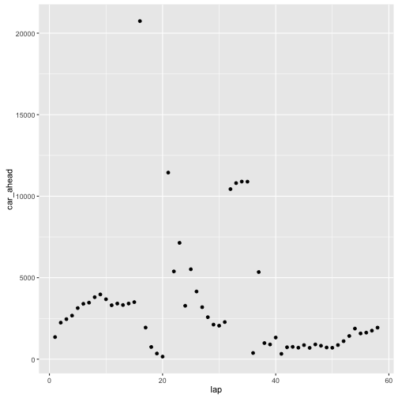
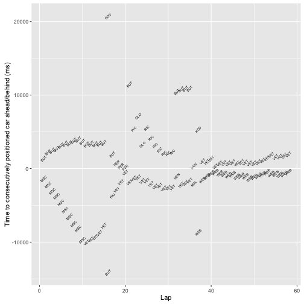
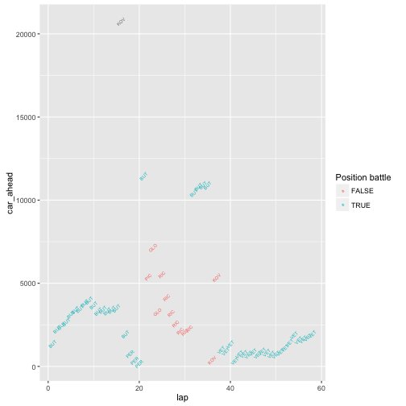
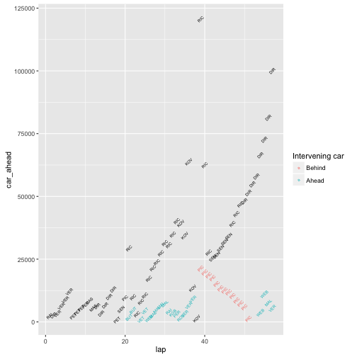
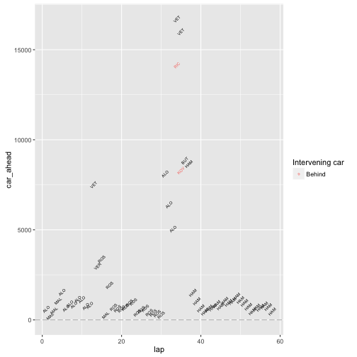
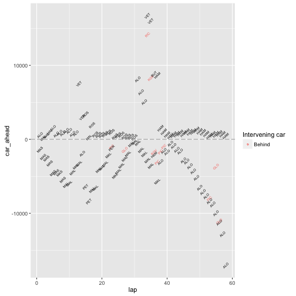
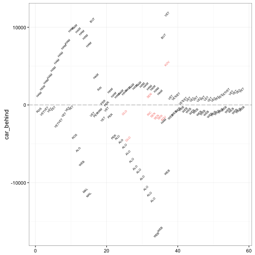
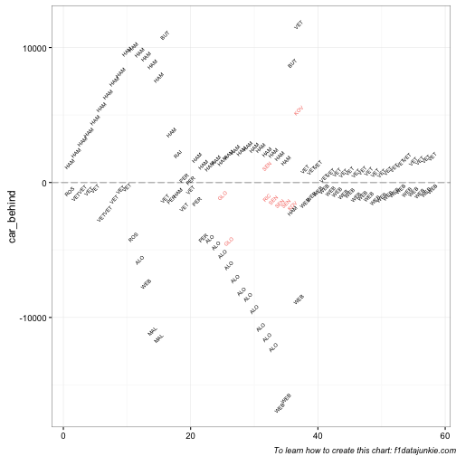
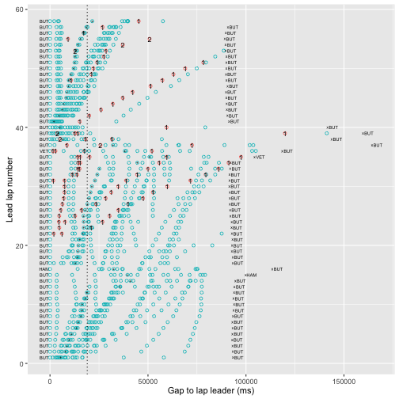

---
output:
  html_document:
    keep_md: yes
---

#From Battlemaps to Track Position Maps

*Battlemaps* are a custom chart style designed to illustrate the competition between a particular driver and the cars in race positions immediately ahead or behind them at a particular stage in a race. Battlemaps can also be used to display the battle for a particular race position over the course of a race.

As well as revealing the gap to the car immediately ahead or behind in race position terms, *battlemap* displays also include cars on a different race lap (either backmarkers, or race leaders on laps ahead when considering lower placed positions) that have a track position in between that of a target vehicle and car in the race position either immediately or behind one position. (The aim here is to illustrate whether there are any off-lap vehicles that may interfere with any positional battles.)

As the graphic relies on information about track position as well as race position, we need to have access to data that reveals this information or that can be used to generate it. One way of obtaining this information is to derive it from the laptime data published as part of the *ergast* database.

## Identifying Track Position From Accumulated Laptimes

Given a set of laptime data for a particular race, how can we identify track position information from it?

The first observation we might make is that a race track is a closed circuit; the second that the accumulated race time to date is the same for each driver, given that they all start the race at the same time. (The race clock is not started as each driver passes the start finish line - the race clock starts when the lights go green. To this extent, drivers lower placed on the grid serve a positional time penalty compared to cars further up grid. This effective time penalty corresponds to the time it takes a lower placed car to physically get as far up the track as the cars in the higher placed grid positions.) 

Let's start by getting hold of all of the lap time data for a particular race:


```r
library(DBI)
ergastdb =dbConnect(RSQLite::SQLite(), './ergastdb13.sqlite')

#There should be only a single result from this query,
# so we can index its value directly.
q=paste('SELECT d.driverId,d.driverRef,d.code, l.lap,l.position,l.time,l.milliseconds
        FROM drivers d JOIN lapTimes l JOIN races r
        WHERE year="2012" 
          AND round="1" 
          AND r.raceId=l.raceId 
          AND d.driverId=l.driverId')
lapTimes=dbGetQuery(ergastdb,q)
#Note that we want the driverId as a factor rather than as a value
lapTimes$driverId=factor(lapTimes$driverId)
```

The laptimes are described as a time in milliseconds. At first glance it might appear to be more convenient to work in seconds, calculated by dividing the milliseconds time by 1000.


```r
#We want to convert the time in milliseconds to time in seconds
#One way of doing this is to take the time in milliseconds colument
lapTimes$rawtime = lapTimes$milliseconds/1000
```

However, in practice we see that when calculating differences between values represented in this way as floating point numbers, we get floating point errors in the smaller decimal positions. Working instead with milliseconds allows us to do integer arithmetic which incurs no such arithmetical precision errors.

In order to find the track position of a car, we first need to identify which leader's lap each driver is on and then use this as the basis for deciding whether a car is on the same lap - or a different one - compared with any car immediately ahead or behind on track. One way of doing this is on the basis of accumulated race time. If we order the laps by the accumulated race time, and flag whether or not a particular driver is the leader on particular lap, we can count the accumulated number of "lap leader" flags to give us the current lead lap count for each driver on each lap irrespective of how many laps a given driver has completed.


```r
library(plyr)

#For each driver, calculate their accumulated race time at the end of each lap
lapTimes=ddply(lapTimes, .(driverId), transform,
               acctime=cumsum(milliseconds))

#Order the rows by accumulated lap time
lapTimes=arrange(lapTimes,acctime)
#This ordering need not necessarily respect the ordering by lap.

#Flag the leader of a given lap - this will be the first row in new leader lap block
lapTimes$leadlap= (lapTimes$position==1)
head(lapTimes[lapTimes$position<=3,c('driverRef','leadlap')],n=5)
```

```
##             driverRef leadlap
## 1              button    TRUE
## 2            hamilton   FALSE
## 3  michael_schumacher   FALSE
## 22             button    TRUE
## 23           hamilton   FALSE
```

A Boolean `TRUE` value has numeric value 1, a Boolean `FALSE` numeric value 0.


```r
#Calculate a rolling count of leader lap flags.
#Recall that the cars are ordered by accumulated race time.
#The accumulated count of leader flags is the lead lap number each driver is on
lapTimes$leadlap=cumsum(lapTimes$leadlap)
#The lapsbehind count is how many laps behind the leadlap a driver is
lapTimes$lapsbehind=lapTimes$leadlap-lapTimes$lap 
head(lapTimes[lapTimes$position<=3,c('driverRef','leadlap')],n=6)
```

```
##             driverRef leadlap
## 1              button       1
## 2            hamilton       1
## 3  michael_schumacher       1
## 22             button       2
## 23           hamilton       2
## 24 michael_schumacher       2
```

Let's now calculate the track position for a given lead lap, where the leader in a given lap is in both race position and track position 1, the second car through the start/finish line is in track position 2 (irrespective of their race position), and so on. (In your mind's eye, you might imagine the cars passing the finish line to complete each lap, first the race leader, then either the car in second, or a lapped back marker, and so on.) Specifically, we group by  lead lap *and then* accumulated race time within that lap, and assign track positions in incremental order.


```r
lapTimes=arrange(lapTimes,leadlap,acctime)
lapTimes=ddply(lapTimes,.(leadlap),transform,
               trackpos=1:length(position))
head(lapTimes[lapTimes$leadlap==33,
         c('code','lap','position','acctime','leadlap','trackpos')],n=10)
```

```
##     code lap position acctime leadlap trackpos
## 616  BUT  33        1 3100735      33        1
## 617  HAM  33        2 3111538      33        2
## 618  VET  33        3 3113745      33        3
## 619  SEN  32       16 3115035      33        4
## 620  RIC  32       17 3115829      33        5
## 621  ALO  33        4 3125951      33        6
## 622  WEB  33        5 3131009      33        7
## 623  MAL  33        6 3133006      33        8
## 624  RAI  33        7 3141269      33        9
## 625  KOB  33        8 3147051      33       10
```

In this example, we see Timo Glock (GLO) has only completed 32 laps compared to 33 for the race leader and the majority of the field. *On track*, he is placed between Kobyashi (KOB) and Perez (PER).

## Calculating DIFF and GAP times

As well as calculating track positions, we can also calculate various gap times, such as the standard GAP to leader and the +/- DIFF times to any car placed directly ahead or behind a particular car, either in race position terms *or* in terms of track position.

The GAP (time to leader) is calculated as the difference between the accumulated race time of the race leader at the end of a lap and the accumulated race time of driver when they complete the same race lap.

For a driver, *d* on lap *l* with laptime {$$}t_{d,l}{/$$}, the accumulated race time {$$}t_{d,N}{/$$} for a driver *d* on lap *N* is then given as:

{$$}t_{d,N}=\sum_{l=1}^{N}t_{d,l}{/$$}

For the leader on lap *N*, declare {$$}d=L{/$$} to give the accumulated race time for the leader at the end of lap *N* as {$$}t_{L,N}{/$$}.

The GAP between a driver *d* after *N* laps and the leader at the end of lap *N* for {$$}d \neq L{/$$} is given as:

{$$}GAP_{d,N}=t_{d,N,GAP}=t_{d,N}-t_{L,N}{/$$}

Alternatively, we can calculate the gap as the sum of differences between consecutively placed drivers between *d* and the race leader. The interval or DIFF between drivers in positions *m* and *n* at the end of *N* laps, where *m* is ahead of *n* (that is, *m < n*) is given as:

{$$}DIFF_{n,m,N}=t_{n,N}-t_{m,N}{/$$}

The GAP between a driver in position *P* and the leader *L=1* is then:

{$$}t_{P,N,GAP}=DIFF_{2,1,N}+D_{3,2,N}+..+DIFF_{P,P-1,N}{/$$}

and where {$$}GAP_{L,N}=t_{L,N,GAP}=0{/$$}.

We can write this more succinctly as:

{$$}GAP_{P,N}=t_{P,N,GAP}=\sum_{p=2}^{P}DIFF_{p,p-1,N}=\sum_{p=2}^{P}\left ( t_{p,N}-t_{p-1,N} \right ){/$$}

We can implement these calculations directly as follows:


```r
#Order the drivers by lap and position
lapTimes=arrange(lapTimes,lap,position)
#Calculate the DIFF between each pair of consecutively placed cars
# at the end of each race lap
#Then calculate the GAP to the leader as the sum of DIFF times
lapTimes=ddply(lapTimes, .(lap), mutate,
               diff=c(0,diff(acctime)),
               gap=cumsum(diff)  )
```

For completeness, we might also want to capture the DIFF to the car behind, which we shall represent as `chasediff`, further requiring that it is a negative quantity. That is, we have {$$}CHASEDIFF_{q,r}=-DIFF_{r,q}{/$$} for race positions {$$}r > q{/$$} (that is, *q* is ahead of *r*).


```r
#Order the drivers by lap and reverse position
lapTimes=arrange(lapTimes,lap, -position)
#Calculate the DIFF between each pair of consecutively reverse placed cars at the end of each race lap
lapTimes=ddply(lapTimes, .(lap), mutate,
               chasediff=c(0,diff(acctime)) )

#Print an example
head(lapTimes[lapTimes$lap==35,c('code','lap','diff','chasediff')],n=5)
```

```
##     code lap  diff chasediff
## 658  PIC  35 92327         0
## 659  GLO  35 34462    -92327
## 660  KOV  35 14749    -34462
## 661  RIC  35  1281    -14749
## 662  SEN  35 25011     -1281
```

Typically, timing sheets do not show the GAP to the leader for cars other than those cars on the lead lap. Instead, they provide a count of the number of laps behind the race leader that a driver is. If required, we can generate this sort of view from our extended laptime data set.


```r
lapTimes$tradgap=as.character(lapTimes$gap)
#Define a function to find gap time to leader
# or number of laps behind if not on lead lap
lapsbehind=function(lap,leadlap,gap){
  if (lap==leadlap) return(gap)
  paste("LAP+",as.character(leadlap-lap),sep='')
}
  
lapTimes$tradgap=mapply(lapsbehind,lapTimes$lap,lapTimes$leadlap,lapTimes$gap)

#Print an example
lapTimes[lapTimes$lap==35,c('code','lap','leadlap','tradgap')]
```

```
##     code lap leadlap tradgap
## 658  PIC  35      37   LAP+2
## 659  GLO  35      36   LAP+1
## 660  KOV  35      36   LAP+1
## 661  RIC  35      36   LAP+1
## 662  SEN  35      36   LAP+1
## 663  MAS  35      35   80864
## 664  DIR  35      35   78460
## 665  VER  35      35   60621
## 666  ROS  35      35   57772
## 667  PER  35      35   51594
## 668  ALO  35      35   50737
## 669  KOB  35      35   47972
## 670  RAI  35      35   39980
## 671  MAL  35      35   32088
## 672  WEB  35      35   28514
## 673  VET  35      35   12514
## 674  HAM  35      35   10890
## 675  BUT  35      35       0
```

Here we see that the drivers up to and including Massa (MAS) are on the lead lap, and as such an explicit time gap to the leader is reported. For Bruno Senna (SEN) and the lower placed drivers, they are one lap behind the leader, except for Charles Pic, who is two laps down.

### Calculating the time between cars based on track position

To calculate the time difference to the car ahead on track (`car_ahead`) and the car behind on track (`car_behind`), we can simply calculate the differences between accumulated laptimes for appropriately ordered rows.


```r
#Arrange the drivers in terms of increasing accumulated race time
lapTimes = arrange(lapTimes, acctime)
#For each car, calculate the DIFF time to the car immediately ahead on track
lapTimes$car_ahead=c(0,diff(lapTimes$acctime))
#Identify the code of the driver immediately ahead on track
lapTimes$code_ahead=c(NA,head(lapTimes$code,n=-1))
#Identify the race position of the driver immediately ahead on track
lapTimes$position_ahead=c(NA,head(lapTimes$position,n=-1))

#Now arrange the drivers in terms of decreasing accumulated race time
lapTimes = arrange(lapTimes, -acctime)
#For each car, calculate the DIFF time to the car immediately behind on track
lapTimes$car_behind=c(0,diff(lapTimes$acctime))
#Identify the code of the driver immediately behind on track
lapTimes$code_behind=c(NA,head(lapTimes$code,n=-1))
#Identify the race position of the driver immediately behind on track
lapTimes$position_behind=c(NA,head(lapTimes$position,n=-1))

#Put the lapTimes dataframe back to increasing acculamated race time order.
lapTimes = arrange(lapTimes, acctime)
```

Notice how the `diff()` function finds the difference between column values on consecutive rows working down the column. To find the gap to the car ahead, we sort on *increasing* accumulated race time and then apply the `diff()` function. To find the gap to the car behind, we reverse the order, sorting on *decreasing* accumulated lap time, before applying the `diff()` function.

Having calculated the time to car ahead - or the car behind - on track, we can use a simple scatter plot to show the time in milliseconds to the car ahead, for each lap .


```r
library(ggplot2)
#Display the car one position ahead of a named driver
g=ggplot(lapTimes[lapTimes['code']=='HAM',])
g+geom_point(aes(x=lap,y=car_ahead))
```



If instead we use a text plot, we can identify which driver in particular was in the car ahead or behind on track.


```r
#Display the positioned and identity of cars immediately ahead of and behind
#the named driver
g=g+geom_text(aes(x=lap,y=car_ahead,label=code_ahead),angle=45,size=2)
g=g+geom_text(aes(x=lap,y=car_behind,label=code_behind),angle=45,size=2)
g+xlab('Lap')+ylab('Time to consecutively positioned car ahead/behind (ms)')
```



Here we see that Hamilton draws away from Michael Schumacher at a constant rate over the first 10 laps of the race,  dropping behind Jenson Button over that same period, then keeps pace with him between laps 10 and 15.

Note that the driver codes specified refer to the driver immediately ahead or behind on the track, irrespective of whether they are on the same lap. The chart would perhaps be more informative if we could identify whether the car immediately ahead or behind is actually on the same *racing lap* as our selected driver.

One way to approach this is to generate new columns that identify the driver immediately ahead or behind each car in terms of race position, rather than track position. This new information will allow us to test whether the car ahead or behind on track is in a battle for position with the selected driver.

In the battlemap, we shall refer to the driver about whom (that is, *for whom*) the map is drawn as the *target driver*.


```r
#Sort the laptimes by increasing lap and position
lapTimes = arrange(lapTimes, lap, position)
#Find the code of the driver ahead
lapTimes = ddply(lapTimes, .(lap), transform,
                          code_raceahead=c(NA,head(code,n=-1)))
#Reverse the sort order to decreasing lap and position
lapTimes = arrange(lapTimes, -lap, -position)
#Find the code of the driver behind
lapTimes = ddply(lapTimes, .(lap), transform,
                           code_racebehind=c(NA,head(code,n=-1)))
#Put the sort order back to increasing accumaulated time
lapTimes = arrange(lapTimes, acctime)
```

The test is one simply of equality: *is the driver one place ahead on track the driver in one place ahead in terms of race position?* The answer to this test allows us to visually distinguish between whether there is a battle for position going on with the car directly ahead on track:


```r
battlesketch1=function(driverCode){
  g=ggplot(lapTimes[lapTimes['code']==driverCode,])
  g=g+geom_text(aes(x=lap,
                  y=car_ahead,
                  label=code_ahead,
                  #Test whether we are in a direct battle with the car ahead
                  col=factor(code_ahead==code_raceahead)),
              angle=45,size=2)
  g+guides(col=guide_legend(title="Position battle"))
}
battlesketch1('HAM')
```



A useful side effect here is that if `code_raceahead` is undefined (because the selected driver is in the lead at the start of a particular lap), the `code_ahead==code_raceahead` test is also undefined, no colour is set, and the text label color defaults to grey.

It would be useful to further refine the chart so that it additionally shows the driver immediately ahead (or behind) in terms of *race* position if the car ahead on track is not the car immediately ahead in terms of position.

We can achieve this by adding another layer:


```r
battlemap_ahead=function(driverCode){
  g=ggplot(lapTimes[lapTimes['code']==driverCode,])  
  #Plot the offlap cars that aren't directly being raced
  g=g+geom_text(data=lapTimes[(lapTimes['code']==driverCode)
                              & (lapTimes['code_ahead']!=lapTimes['code_raceahead']),],
                aes(x=lap,
                  y=car_ahead,
                  label=code_ahead,
                  col=factor(position_ahead<position)),
              angle=45,size=2)
  #Plot the cars being raced directly
  g=g+geom_text(aes(x=lap,
                  y=diff,
                  label=code_raceahead),
              angle=45,size=2)
  g=g+scale_color_discrete(labels=c("Behind","Ahead"))
  g+guides(col=guide_legend(title="Intervening car"))
}
battlemap_ahead('GLO')
```



In this case, cars on the same lap are coloured black, and cars in a track position that is out of race position is coloured either aqua (if it is in a race position ahead of the selected car) or orange if it is on at least one lap behind. From the chart, we notice how the target driver, Timo Glock, falls behind the car he is racing time and time again (the waves of activity that go up and to the right). The only car he gains on over a series of laps is that of Charles Pic, from about lap 39 onwards. Every so often, cars at least one lap ahead (coloured aqua), are in the space ahead between Timo Glock and the car in the race position ahead of him.

Let's now try to put the pieces together in a full battle map showing the state of the race immediately ahead of a particular driver in track position *and* race position terms, as well as immediately behind them, throughout the course of a race. We'll also add in a guide that identifies the DRS (drag reduction system) range of one second (1000ms).

We can further generalise the battle map charter so that it can plot just the battles with the cars ahead or behind. In the following example, we plot just the battle ahead.


```r
dirattr=function(attr,dir='ahead') paste(attr,dir,sep='')

#We shall find it convenient later on to split out the initial data selection
battlemap_df_driverCode=function(driverCode){
  lapTimes[lapTimes['code']==driverCode,]
}

battlemap_core_chart=function(df,g,dir='ahead'){
  car_X=dirattr('car_',dir)
  code_X=dirattr('code_',dir)
  factor_X=paste('factor(position_',dir,'<position)',sep='')
  code_race_X=dirattr('code_race',dir)
  if (dir=='ahead') diff_X='diff' else diff_X='chasediff'
  
  if (dir=="ahead") drs=1 else drs=-1
  g=g+geom_hline(aes_string(yintercept=drs),linetype=5,col='grey')
  
  #Plot the offlap cars that aren't directly being raced
  g=g+geom_text(data=df[df[dirattr('code_',dir)]!=df[dirattr('code_race',dir)],],
                aes_string(x='lap',
                  y=car_X,
                  label=code_X,
                  col=factor_X),
              angle=45,size=2)
  #Plot the cars being raced directly
  g=g+geom_text(data=df,
                aes_string(x='lap',
                  y=diff_X,
                  label=code_race_X),
              angle=45,size=2)
  g=g+scale_color_discrete(labels=c("Behind","Ahead"))
  g+guides(col=guide_legend(title="Intervening car"))
  
}

battle_WEB=battlemap_df_driverCode("WEB")
g=battlemap_core_chart(battle_WEB,ggplot(),'ahead')
g
```



And then we can add in any threats that are coming up from behind:


```r
battlemap_core_chart(battle_WEB,g,dir='behind')
```



Here we see how at the start of the race Mark Webber kept pace with Alonso, albeit around about a second behind, at the same time as he drew away from Massa. In the last third of the race, he was closely battling with Hamilton whilst drawing away from Alonso.

##Battles for a particular position

As well as charting the battles in the vicinity of a particular driver, we can also chart the battle in the context of a particular race position. We can reuse the chart elements and simply need to redefine the filtered dataset we are charting.

For example, if we filter the dataset to just get the data for the car in third position at the end of each lap, we can then generate a battle map of this data.


```r
battlemap_df_position=function(position){
  lapTimes[lapTimes['position']==position,]
}

battleForThird=battlemap_df_position(3)

g=battlemap_core_chart(battleForThird,ggplot(),dir='behind')+xlab(NULL)+theme_bw()
g=battlemap_core_chart(battleForThird,g,'ahead')+guides(col=FALSE)
g
```



In this case we see how in the opening laps of the race, the battle for third was coming from behind, with Vettel challenged for position from fourth, as the second placed driver (Lewis Hamilton) pulled away. In the middle third of the race, the car in third kept pace with 2nd placed Hamilton but pulled away from fourth placed Alonso. And in the last third of the race, the car in third is battling hard with Vettel ahead and defending hard against Webber behind.

One thing this chart does not show is which driver was in third position on each lap. We might naturally think to add a layer on to the chart that displays the driver in the position we are charting around along the x-axis (that is, at y=0) but this is likely to lead to a very cluttered chart. It may make more sense to try to align this information in a marginal area at the bottom of the chart.

Finally, we observe that another sort of battle we might wish to depict is a battle between two particular drivers. However, with just two drivers to compare, we would need to think carefully about how to display this information - would one of the driver's details be aligned along the horizontal x-axis, and the gap to the other driver charted accordingly? Or should the x-axis represent the mid-point of the difference between the two drivers?

### Adding Footnotes to a Chart

At times, we may wish to annotate a chart with a footnote, such as a copyright notice or further information notice. One way of doing this is to use a `textGrob()` object from the the `grid` library, positioning it with a `grid.arrange()` call from the `gridExtra` package.


```r
library(grid)
library(gridExtra)
grid.arrange(g, nrow=1,
             #top="My title", 
             bottom = textGrob("To learn how to create this chart: f1datajunkie.com",
                               gp = gpar(fontface=3, fontsize=9),
                               hjust=1, x=1))
```



Annotating charts in this way makes a graphic a standalone item that can be shared as an image file whilst still retaining things like attribution information embedded within it.

## Generating Track Position Maps

A lot of the data manipulation work we have to do when piecing together the battlemaps relates to identifying the gap *on track* between different cars. We can use this derived data to plot a chart that shows how the cars are arranged on track according to each lead lap.

For each lap, we find the accumulated race time of the leader and use that as a reference point to offset the time of every other car. We then need to find the 'on track' time distance between each car and the leader.


```r
#Ensure that the laptimes are arranged according to elapsed time
lapTimes=arrange(lapTimes, acctime)
#Find the accumulated race time for the race leader at the start of each lap
lapTimes=ddply(lapTimes,.(leadlap),transform,lstart=min(acctime))
 
#Find the on-track gap to leader
lapTimes['trackdiff']=lapTimes['acctime']-lapTimes['lstart']
```

We can also identify the time distance between the leader of the current lap and the leader of the next lap - this gives us an estimate of the "time width" of the lap.


```r
#Construct a dataframe that contains the difference between the 
#leader accumulated laptime on current lap and next lap
#i.e. how far behind current lap leader is next-lap leader?
ll=data.frame(t=diff(lapTimes[lapTimes['position']==1,'acctime']))
#Generate a de facto lap count
ll['n']=1:nrow(ll)
#Grab the code of the lap leader on the next lap
ll['c']=lapTimes[lapTimes['position']==1 & lapTimes['lap']>1,'code']
```

For each lead lap, we can now plot the distance between each car and the lap leader, as well as showing the position of the leader of the next lap. We identify lapped cars by overplotting the chart with an indication of how many laps behind the lap leader each lapped car is. Additional overplotting can be used to highlight a specified driver, in this case, Alonso.


```r
#Plot the on-track gap to leader versus leader lap
g = ggplot(lapTimes)
#Plot a marginal item on the left hand side naming the lap leader for each lap
g=g+geom_text(data=lapTimes[lapTimes['position']==1,],
              aes(x=-3000,y=leadlap,label=code),size=2)
#Plot markers for each car using colour to identify cars on lead lap
g = g + geom_point(aes(x=trackdiff,y=leadlap,col=(lap==leadlap)), pch=1)
#Track the progress of a particular driver
g = g + geom_point(data=lapTimes[lapTimes['driverRef']=='alonso',],
                  aes(x=trackdiff,y=leadlap), pch='+')
#Display a count of how many laps behind lapped drivers are
g = g + geom_text(data=lapTimes[lapTimes['lapsbehind']>0,],
                  aes(x=trackdiff,y=leadlap, label=lapsbehind),size=3)
#Show the position of the next lap leader along with an offset name label
g = g + geom_point(data=ll,aes(x=t, y=n), pch='x')
g = g + geom_text(data=ll,aes(x=t+3000, y=n,label=c), size=2)
#Set an elapsed time amrker (19000ms) to indicate pit stop loss
g = g + geom_vline(aes(xintercept=19000), linetype=3)
g+ guides(colour=FALSE)+xlab('Gap to lap leader (ms)')+ylab('Lead lap number')
```



The dotted line can be set at a value around the pit loss time to indicate where a lap leader may return to the race after pitting.

Battles can be identified through the close proximity of two or more drivers within a lap, across several laps. The ‘next-lap-leader’ time at the far right shows how close the leader on the next lead lap is to the backmarker (on track) on the current lead lap.

By highlighting one or more specific drivers, we can compare how their races evolved, perhaps highlighting different strategies used within a race that eventually bring the drivers into a close competitive battle in the last few laps of a race.

## Summary

In this chapter, we have demonstrated how to processed the laptime data in order to identify track position as well as race position, generating standard GAP and DIFF values between cars, as well as the DIFF to the car in the race position behind, and the time to the cars ahead and behind *on track*.

A new type of chart, the *battle map*, was introduced that shows how close a selected driver is to the cars immediately ahead of, and behind them, on each lap, in terms of both race position and track position. The battle map can be used to show how a race evolved from the perspective of a particular driver.

A variant of the battle map was also introduced that showed the battle that took place around a particular race position. This still needs further work, however, in terms of identifying which driver was in the position being fought over on each lap.

Finally, the gap between cars on track was  used as the basis of a second novel chart type, a *track position map*. This shows, for each lead lap, the distribution of other cars on track and can be used to give an overview of how the cars were separated *on track* throughout the race.
