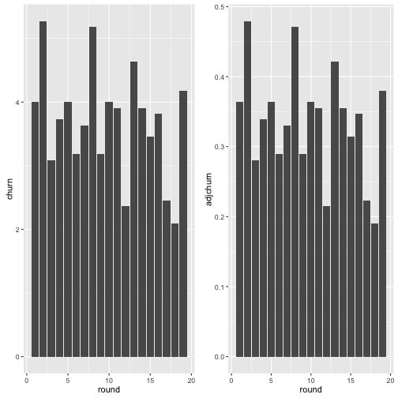
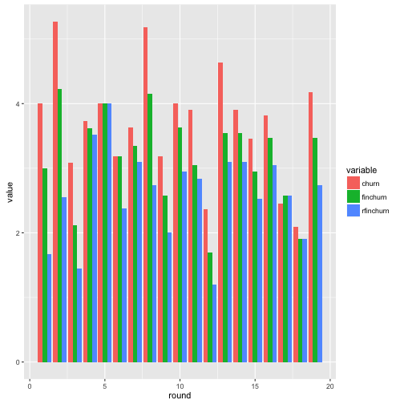
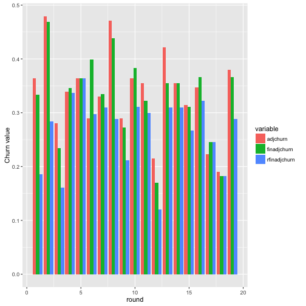
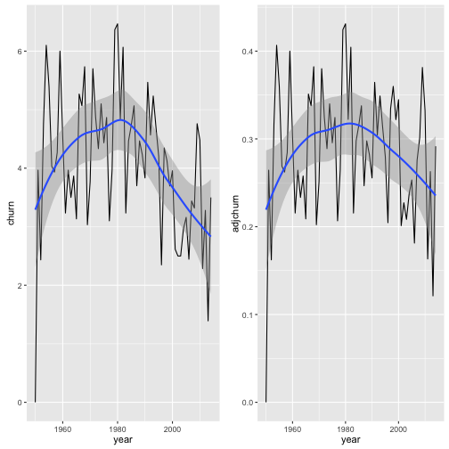
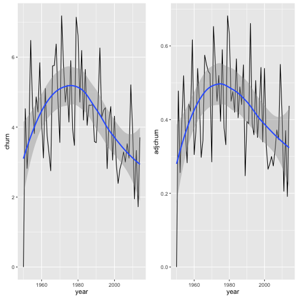
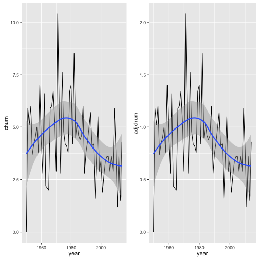
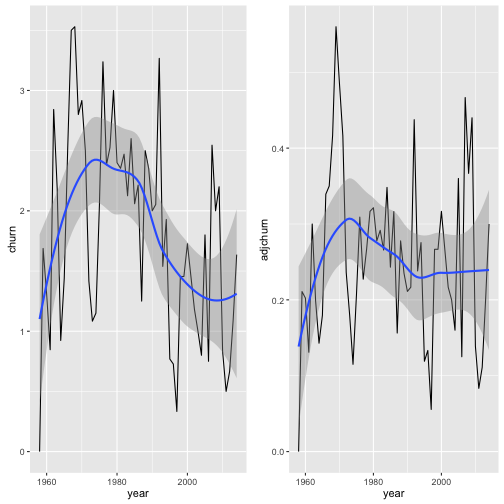

---
output:
  html_document:
    keep_md: yes
---

# Keeping an Eye on Competitiveness - Tracking Churn

If every race was a processional race, and every season saw the same teams finishing in the same order year on year, we might start to doubt that Formula One was in any way competitive, at least in the sense of being a points based competition between teams or drivers (we might still argue there is competition for a team to better its own laptimes, for example, or reduce its pit stop times).

One way of trying to measure competitiveness within a sport is to look at position *churn*,  or the change in relative standings or rankings of competitors over a period of time. Churn was developed as a measure of competitiveness within professional sports leagues across seasons by Mizak at al. (2007) (Mizak, D, Neral, J & Stair, A (2007) *The adjusted churn: an index of competitive balance for sports leagues based on changes in team standings over time.* [Economics Bulletin, Vol. 26, No. 3 pp. 1-7](http://core.kmi.open.ac.uk/download/pdf/6420748.pdf)), originally using the context of Major League Baseball.

One of the ways in which the churn indicator has been used is to model the extent to which "competitiveness" influences audience interest: organised competitive sports are businesses and as such economists are interested in how competitiveness translates to  - or detracts from - an economic take on the sport. From a sports reporting or data journalism point of view, we are perhaps more interested in the extent to which it might signal some element of "interestingness" or "newsworthiness", or help us identify particularly noteworthy races.

According to Mizak at al. (2007), *churn* is defined as follows:

{$$}
C_t =  \frac{\sum_{i=1}^{N}\left|f_{i,t} - f_{i,t-1}\right|}{N}
{/$$}

where {$$}C_t{/$$} is the churn in team standings for year {$$}t{/$$}, {$$}\left|f_{i,t} - f_{i,t-1}\right|{/$$} is the absolute value of the {$$}i{/$$}-th team's change in finishing position going from season {$$}t-1{/$$} to season {$$}t{/$$}, and {$$}N{/$$} is the number of teams.

The *adjusted churn* is defined as an indicator with the range 0..1, calculated by dividing the churn, {$$}C_t{/$$}, by the maximum churn, {$$}C_{max}{/$$}. The value of the maximum churn depends on whether there is an even or odd number of competitors:

{$$}C_{max} = N/2 \text{, for even N}{/$$}

{$$}C_{max} = (N^2 - 1) / 2N \text{, for odd N}{/$$}

As Berkowitz et al. (2011) describe in their paper on race outcome uncertainty in NASCAR races, "[a]t least three levels of outcome uncertainty have been defined in the literature: event-level, season-level, and inter-season uncertainty." That is, there may be competition *in the context of a particular race*, competition across races *within a season*, and competition *across seasons* (Berkowitz, J. P., Depken, C. A., & Wilson, D. P. (2011). *When going in circles is going backward: Outcome uncertainty in NASCAR.* Journal of Sports Economics, 12(3), 253-283).

In recognition of these different aspects of competitiveness, Berkowitz et al. reconsidered churn as applied to an individual NASCAR race (that is, at the event level). In this case, {$$}f_{i,t}{/$$} is the position of driver {$$}i{/$$} at the end of race {$$}t{/$$}, {$$}f_{i,t-1}{/$$} is the starting position of driver {$$}i{/$$} at the beginning of that race (that is, race {$$}t{/$$}) and {$$}N{/$$} is the number of drivers participating in the race. Once again, the authors recognise the utility of normalising the churn value to give an *adjusted churn* in the range 0..1 by dividing through by the maximum churn value.

Taking a similar line of reasoning, we might also define the lap-on-lap churn by treating {$$}f_{i,t}{/$$} as the position of driver {$$}i{/$$} at the end of lap {$$}t{/$$}, {$$}f_{i,t-1}{/$$} as their position at the start of that lap (that is, at the end of lap {$$}t-1{/$$}) and {$$}N{/$$} is the number of drivers completing that lap. A time series view of this indicator across all laps in a race may help us identify turbulent periods within a race when there significant position changes occurring (such as during pit stop windows). This approach might also be compared to the one briefly introduced in the chapter on *Lapcharts*, where we generated a table of *position change counts* that could act as an estimate of how much position change activity took place within a race. 

Across a season, we might denote churn with reference to position in the championship standings at the start and end of a particular championship round. Within a race, we might additionally consider *first lap churn* (churn between the grid positions and the positions at the end of lap 1) or churn between qualifying position and final race position.

## Calculating Adjusted Churn - Event Level

Following Berkowitz et al. (2011), let's begin by considering the adjusted churn across races for a single F1 season, in particular the 2013 season. We'll measure the churn at the level of individual drivers. To do this, we need the starting (grid) and finishing positions of each driver for each round.


```r
library(DBI)
ergastdb = dbConnect(RSQLite::SQLite(), './ergastdb13.sqlite')

q=paste('SELECT round, name, driverRef, code, grid, 
                position, positionText, positionOrder
          FROM results rs JOIN drivers d JOIN races r
          ON rs.driverId=d.driverId AND rs.raceId=r.raceId
          WHERE r.year=2013',sep='')
results=dbGetQuery(ergastdb,q)
```

We can define functions to calculate the churn and adjusted churn values from a set of rank positions.


```r
#The modulus function (%%) finds the remainder following a division
is.even = function(x) x %% 2 == 0
churnmax=function(N)
  if (is.even(N)) return(N/2) else return(((N*N)-1)/(2*N))

churn=function(d) sum(d)/length(d)
adjchurn = function(d) churn(d)/churnmax(length(d))
```

Using these functions, it's straightforward enough to calculate the churn for each race based on the absolute difference (*delta*) between the grid position and final position of each driver. 


```r
library(plyr)
results['delta'] =  abs(results['grid']-results['positionOrder'])

churn.df = ddply(results[,c('round','name','delta')], .(round,name), summarise,
            churn = churn(delta),
            adjchurn = adjchurn(delta)
            )
```

| round|name                     |    churn|  adjchurn|
|-----:|:------------------------|--------:|---------:|
|     1|Australian Grand Prix    | 4.000000| 0.3636364|
|     2|Malaysian Grand Prix     | 5.272727| 0.4793388|
|     3|Chinese Grand Prix       | 3.090909| 0.2809917|
|     4|Bahrain Grand Prix       | 3.727273| 0.3388430|
|     5|Spanish Grand Prix       | 4.000000| 0.3636364|
|     6|Monaco Grand Prix        | 3.181818| 0.2892562|
|     7|Canadian Grand Prix      | 3.636364| 0.3305785|
|     8|British Grand Prix       | 5.181818| 0.4710744|
|     9|German Grand Prix        | 3.181818| 0.2892562|
|    10|Hungarian Grand Prix     | 4.000000| 0.3636364|
|    11|Belgian Grand Prix       | 3.909091| 0.3553719|
|    12|Italian Grand Prix       | 2.363636| 0.2148760|
|    13|Singapore Grand Prix     | 4.636364| 0.4214876|
|    14|Korean Grand Prix        | 3.909091| 0.3553719|
|    15|Japanese Grand Prix      | 3.454546| 0.3140496|
|    16|Indian Grand Prix        | 3.818182| 0.3471074|
|    17|Abu Dhabi Grand Prix     | 2.454546| 0.2231405|
|    18|United States Grand Prix | 2.090909| 0.1900826|
|    19|Brazilian Grand Prix     | 4.181818| 0.3801653|

One way of displaying this tabular information graphically is to use bar charts.


```r
library(ggplot2)
library(gridExtra)

g1 = ggplot(churn.df)+geom_bar(aes(x=round,y=churn),stat='identity')
g2 = ggplot(churn.df)+geom_bar(aes(x=round,y=adjchurn),stat='identity')
grid.arrange(g1, g2, ncol=2)
```



So what sorts of thing might we learn from these results? By inspection, we notice that rounds 2 and 8, the Malaysian and British Grand Prix rounds had a significant change in rankings from the original grid positions to the final result, whereas the Italian, Abu Dhabi and United States Grands Prix rounds saw far less difference between the starting and finishing positions. *(We really should confirm this graphically, for example using start/finish slopegraphs to compare those two races by eye.)*

We can also display the time series using line charts. In this case, we get a slight visual indication of a possible trend in decreasing churn across the course of the season although the effect (if any) looks to be highly uncertain.


```r
g1 = ggplot(churn.df,aes(x=round,y=churn))+geom_line()+geom_smooth()
g2 = ggplot(churn.df,aes(x=round,y=adjchurn))+geom_line()+geom_smooth()
grid.arrange(g1, g2, ncol=2)
```


X> ### Are Some Circuits Less Competitive than Others?
X>
X> By comparing average churn values for each circuit over several seasons, we may get some indication of the likelihood with which significant churn may occur, compared to circuits that appear to encourage rather less competition. Facet a set of year-on-year churn data by circuit to explore whether different circuits appear to have churn values that are markedly different from the churn values of other circuits. How reliable an indicator do you think churn might be as a way of identifying circuits that appear to offer races whose results do not appear to be predetermined by the initial grid positions?

X> ### Does the Weather Affect Competitiveness?
X>
X> Another comparison we might make is to consider churn relative to the prevalent weather conditions, for example to explore whether or not a wet race is likely to have and influence on race competitiveness. See if you can identify a source of prevailing weather information for each Grand Prix in a given period, and then explore the extent to which particular weather types either do or do not appear to influence churn.
X> It may be worth further grouping results based on both the circuit *and* the prevailing weather conditions. 

### Churn Indicators that Reflect Drivers Retiring from the Race

One of the problems with the approach to calculating churn described above is that we calculate position changes for all drivers rather than just those based on drivers that are classified in a particular race. That is, the *positionOrder* results value used as the final position value returns an integer value for each driver that is used to rank all drivers irrespective of whether they were actually classified in a race. However, we might also wish to calculate churn based solely on drivers that do make it far enough into the race to guarantee that they *are* classified. In this case, the size of the competitive field is naturally given by the number of classified drivers; but how should we calculate the magnitude of the change in position? If a car that starts 22nd on the grid is classified in 15th position because seven cars that started ahead of it on the grid drop out, is the position change seven, or zero?

In this section, we'll sketch out what difference, if any, this might make, although for now we will avoid any consideration about the rationale for *not* using the simplistic approach originally described, and avoid any detailed exploration about how we might interpret any differences in the results of each model.

We will consider three different scenarios:

* the original model (*churn*, *adjchurn*), described above, where position changes are calculated as the absolute difference between the grid position and the final rank position, as given in news reports. This includes cars that were not classified;
* a modification of the original model (*finchurn*, *finadjchurn*) using a limited set of driver results, specifically including just results from drivers that were classified, but using their original grid position to classify the position changes. (This may break the adjusted churn calculation, because a position changes may be calculated from a grid position that is greater than the number of cars that appear in the final classification. In addition, the size of the field that is awarded a final classification may vary significantly race on race.);
* a further modified model (*rfinchurn*, *rfinadjchurn*) that considers just those drivers that were classified in a race, but adjusts the grid position to the rank of the original grid position amongst the classified drivers to give a new `gridrank` position. So for example, in a field in which two cars are not classified, the driver at the back of the grid (for example, in grid position 22) that *is* classified will have a re-ranked grid position of 20 when calculating the position change.


```r
#Start by filtering the dataframe to contain only classified drivers
#Then calculate the ranked grid position equivalent for the classified drivers
classresults=ddply(results[!(is.na(results['position'])),],
                   .(round), mutate,
                   delta=abs(grid-positionOrder),
                   gridrank=rank(grid),
                   rankdelta=abs(gridrank-positionOrder)
                   )

#Calculate the churn values for the classified and gridranked drivers
churn2.df=ddply(classresults[,c('round','delta','rankdelta')],
                .(round), summarise,
                finchurn=churn(delta),
                finadjchurn=adjchurn(delta),
                rfinchurn=churn(rankdelta),
                rfinadjchurn=adjchurn(rankdelta)
                )

#Merge the results with the original results
churn3.df=merge(churn.df,churn2.df,by='round')
```

To plot the data, we will reshape it into a long form that allows us to readily group the data based on which model we are applying.


```r
library(reshape2)
churnData=melt(churn3.df, id.vars='round', measure.vars=c('churn','finchurn','rfinchurn'))
adjChurnData=melt(churn3.df, id.vars='round', measure.vars=c('adjchurn','finadjchurn','rfinadjchurn'))
```

By inspection of the following charts, we note that the rank order of the churn and adjusted churn values for the races differs for the different population and grid/gridrank value combinations.


```r
ggplot(churnData) + geom_bar(aes(x=round, y=value, fill=variable),
                             stat='identity', position='dodge')
```




```r
g=ggplot(adjChurnData) + geom_bar(aes(x=round, y=value, fill=variable),
                                  stat='identity', position='dodge')
g+ ylab("Churn value")
```



Note that the different measures behave differently with respect to each other in different races. For example, in round 1, *adjchurn > finadchurn > rfinadchurn*, whereas in rounds 4, 5 and 19 all values are the same or more or less the same, and in rounds 10 and 16 *finadchurn > adjchurn > rfinadchurn*.

It may be worth exploring whether any of the patterns in how the different measures compare with each other in a given race are indicative of any particular features about the race. *This is left for future exploration.*

## Calculating Adjusted Churn - Across Seasons

So far, we have been focusing on churn in the context of position changes in the standings of the Drivers' Championship. In this section, where we consider churn from one season to the next over the lifetime of the F1 World Championship, we will additionally consider churn insofar as it relates to standings in the Constructors' Championship.

But first, let's see how churn affected the Drivers' Championship.

### Year-on-year Churn - Drivers' Championship

The data source we will use for this exploration is the online *ergast* API. We can pull down the results for championship standings for each year we require, combining the results into a single data frame.


```r
source('ergastR-core.R')

seasons=data.frame()
#Earliest 1950
for (year in seq(1950,2014,1)){
  seasons=rbind(seasons,seasonStandings(year))
}
```

*Note that this routine hits the ergast API 65 times in constructing the final data frame.*

In calculating the churn in standings from one championship year to the next, we need to draw on the difference between a driver's standing in one year and their standing in the previous year.


```r
seasons=ddply(seasons,.(driverId),transform,delta=c(0,abs(diff(pos))))
```

We can than apply the churn function to these differences, summarising the data for each year of interest.


```r
churner = function(df) ddply(df, .(year), summarise,
                             churn = churn(delta),
                             adjchurn = adjchurn(delta)
                             )

season.churn.df = churner(seasons)
```


```r
g1 = ggplot(season.churn.df,aes(x=year,y=churn))+geom_line()+geom_smooth()
g2 = ggplot(season.churn.df,aes(x=year,y=adjchurn))+geom_line()+geom_smooth()
grid.arrange(g1, g2, ncol=2)
```



As well as calculating the churn and adjusted churn values as calculated across all drivers, we can also limit the results to show the churn amongst just the points scoring drivers, or amongst the top 10 drivers as classified at the end of each year.

The trendlines suggest that competitiveness - at least as measured by positional churn in the Drivers' Championship - peaked around 1980 and has been in decline ever since.


```r
season.churn.points.df = churner( seasons[seasons['points']>0,] )

g1 = ggplot(season.churn.points.df,aes(x=year,y=churn))+geom_line()+geom_smooth()
g2 = ggplot(season.churn.points.df,aes(x=year,y=adjchurn))+geom_line()+geom_smooth()
grid.arrange(g1, g2, ncol=2)
```



A similar effect is suggested when we consider the churn amongst points scoring drivers (above) and top 10 placed drivers at the end of each year (below).


```r
season.churn.top10.df = churner( seasons[seasons['pos']<11,] )

g1 = ggplot(season.churn.top10.df,aes(x=year,y=churn))+geom_line()+geom_smooth()
g2 = ggplot(season.churn.top10.df,aes(x=year,y=adjchurn))+geom_line()+geom_smooth()
grid.arrange(g1, g2, ncol=2)
```



*Note how the adjusted churn measure is very obviously broken in this model, with the maximum value exceeding the desired upper limit for this indicator of 1.0. This arises because the absolute position change values, calculated as a difference from a championship position possibly outside the top 10 from a previous year, may be greater than the number of competitors (10) used to calculate the adjusted churn value. It is left to further work or explore whether these filtered population measures are useful, and if so how to modify the adjusted churn metric so that it stays within the desired 0..1 bounding limits.*

Despite possible issues with certain filtered variants of the adjusted churn measure, all the charts would seem to suggest that competitiveness has been decreasing amongst the drivers. But does the same story hold true of competitiveness amongst the teams? In the next subsection we'll look at churn across the Constructors Championship standings.

### Year-on-year Churn - Constructors' Championship

The method for calculating the churn across seasons based on the Constructors' Championship closely follows that used for the Drivers' Championship.

For example, start by grabbing down the end-of-season constructor standings and then calculate the difference year-on-year for each team.


```r
constructorSeasons=data.frame()
#Earliest 1958
for (year in seq(1958,2014,1)) {
  constructorSeasons=rbind(constructorSeasons,constructorStandings.df(year))
}

constructorSeasons=ddply(constructorSeasons,.(constructorId),transform,
                         delta=c(0,abs(diff(pos))))
```

*Once again, take note that this approach calls the ergast API quite hard in a short period of time.*


```r
constructor.churn.df = churner( constructorSeasons )

g1 = ggplot(constructor.churn.df,aes(x=year,y=churn))+geom_line()+geom_smooth()
g2 = ggplot(constructor.churn.df,aes(x=year,y=adjchurn))+geom_line()+geom_smooth()
grid.arrange(g1, g2, ncol=2)
```



In contrast the the Drivers' Championship, competitiveness as measured by churn appears to have peaked in the mid-1970s, several years earlier than the peak in driver competitiveness, declining until the mid-1990s and then (on trend at least) remaining relatively consistent ever since. However, the wild swings in churn values in recent years suggests the story is not so simple...

X> ### Exercise  - Do Rule Changes Have Any Influence on Competitiveness?
X>
X> Try to find a source of information about major technical rule changes in Formula One over the year. (A useful starting point may be the Wikipedia page [History of Formula One regulations](http://en.wikipedia.org/wiki/History_of_Formula_One_regulations)). Do periods of significant change appear to have an influence on competitiveness as measured by churn in championship standings?

One final thing to note is that teams evolve, occasionally changing name whilst still retaining the same personnel, factory, design philosophy and racing DNA. However, such changes are likely to *increase* the churn indicator value, since they force change into rankings even if there has been no real change...


## Taking it Further

The following ideas may be used to develop the notion of churn in the F1 context a bit further.

###Calculating Adjusted Churn Within a Race

Although originally defined by  Mizak at al. (2007) as a measure of competitive balance moving from one season to the next, and appropriated by Berkowitz et al. (2011) to track the evolution of competitive balance across a season, we might also explore the extent to which churn and adjusted churn might be used to provide an indication of the competitive evolution of a race itself, based on the position of each driver at the end of each lap.

### Churn In Drivers' Careers

To what extent might we apply the churn measure to the standings achieved by a particular driver during their career? Does the churn indicator tend to suggest changes in fortune when a driver changes teams or acquires a new team mate?

##Summary

In this chapter, we have explored the notion of churn in standings at the individual and constructor level in a variety of contexts, including within a season and across seasons. Churn is often used as an indicator within models of audience interest (not explored here), although it remains to be seen whether we might also use it as an indicator of *interestingness* when it comes to identifying stories about various forms of competitiveness within F1.
