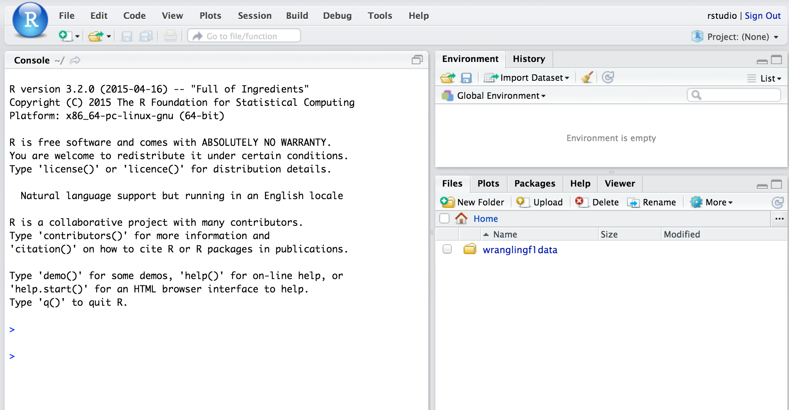
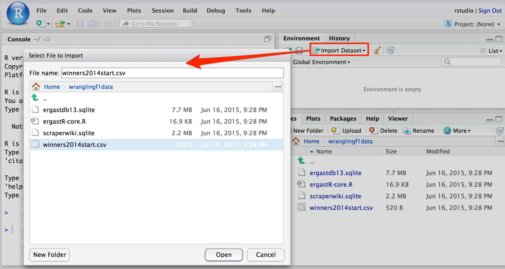
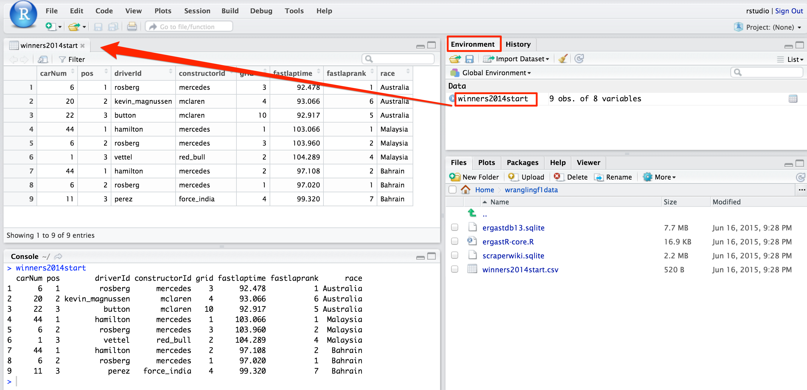
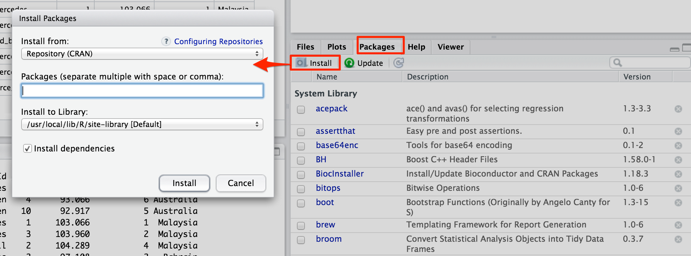

---
output:
  html_document:
    keep_md: yes
---

# An Introduction to RStudio and R dataframes

In this chapter you will get to meet the RStudio interactive development environment and start to explore the R language. Whilst this book is not intended to take on the role of teaching you how to become a professional R programmer, you will hopefully learn enough to be able to read and write simple bits of R code yourself, as well as learning how to use some powerful R libraries such as the `ggplot2` graphics library to produce your own data visualisations.

In the majority of cases, wherever a data table, data visualisation or data analysis appears in this book, it will be preceded by the code required to generate it. This in part is a result of the workflow I have chosen to generate the book. Each chapter is written as a an "R markdown" (*Rmd*) formatted document that combines free text styled using the simple *markdown* language and blocks of R code. The *Rmd* document can then be processed so that each block of R code is executed and the results that it generates, such as a table or chart, are then included in the manuscript.

If you want to replicate any of the charts or analyses included in this book, you should be able to just copy the appropriate preceding bits of code and run them in your own version of RStudio.

## Getting Started with RStudio

RStudio is a free, open source, cross-platform application that runs on Apple OS/X, Microsoft Windows and Linux operating systems. It can also be run as a service on a virtual or cloud hosted machine and accessed remotely via a web browser.

To get RStudio up and running, you need to:

* **download and install R** from the [R Project for Statistical Computing](http://www.r-project.org/). The [download area](http://cran.r-project.org/mirrors.html) requires you to select a "CRAN mirror". *CRAN* is the *Comprehensive R Archive Network* which hosts the R source code and a wide selection of community developed packages that cover a huge range of statistical analysis and data visualisation techniques. CRAN services are located all round the world, so choose a location that is convenient for you.
* **download and install the desktop edition of RStudio** from [RStudio.org](https://www.rstudio.com/ide/download/). 
* **download and run the F1DataJunkie docker container** from [wranglingf1data-docker](https://github.com/psychemedia/wranglingf1data-docker/blob/master/README.md)

Once you have installed RStudio and got it running, you should be presented with something like this:



## Getting Started with R

As a programming language, R uses a syntax that has many resemblances to other programming languages (as well as a few quirks of its own!). In this section, we will review some of the features of the R language that are particularly useful when it comes to working with data. Where appropriate, we will review particular techniques in more detail in later chapters where the technique plays a key role in wrangling the data so that we can visualise or analyse it. For now, the following whirlwind tour should give you an idea of some of the sorts of the thing that are possible, along with a glimpse of how we might achieve them.

*Note that there is no trickery involved in this book - the data table and chart outputs are generated by running only and exactly the code shown prior to them. Indeed, it is the output from running each code block that is automatically inserted into the original manuscript of this book as the manuscript is "compiled".*

### Functions for everything...

One of the key ideas of many programming languages is the idea of a *function*. A function can be used to run one or more operations over a data set that is passed to it. We *call* a function by writing its name followed by a pair of brackets - for example *getwd()*. This function *returns* the name of, and path to, the directory we're currently  working in.


```r
getwd()
```

```
## [1] "/Users/ajh59/Dropbox/wranglingf1datawithr/src"
```

In this case, I am working in the `src` subfolder of the `wranglingf1datawithr` directory in my Dropbox folder.

To get some help information about a function, in the RStudio console enter a ? immediately followed by the function name. For example, we can look up what the complementary `setwd()` function does by entering `?setwd`:


That is, we can use `setwd()` to set the current working directory.

When working with data, we often want to be able to create a list of values. The function `c()` accepts a list of comma separated values that it will then use to construct a vector or a list:


```r
c("Hamilton","Rosberg","Vettel","Ricciardo","Alonso","Raikkonen","Button","Magnussen")
```

```
## [1] "Hamilton"  "Rosberg"   "Vettel"    "Ricciardo" "Alonso"    "Raikkonen"
## [7] "Button"    "Magnussen"
```

The margin numbers in the output identify the index number, or list count number, of the first item in each row of the display. In this case, I can see (or quickly work out) that there are 8 elements in the list.

As most of the datasets we're going to be working with come in the form of two dimensional data tables (the sort of layout you may be familiar with from looking at a simple spreadsheet), the *data frame* is the data structure you're likely to spend most of your time working with. 

In many respects, dataframes can be thought of in much the same way as a two-dimensional tabular data set contained in a worksheet in a spreadsheet application. The data is arranged in rows and columns, each of which can be individually identified. In addition, each cell in the dataframe/worksheet can be uniquely addressed by giving its row and column "co-ordinates".

The style of computation used by R is often referred to as *vectorised* computation, and is reminiscent of the column based computing that will be familiar to many spreadsheet users. Such a computational style means that the same operation is often applied to each cell in a particular column simply by applying the operation to the column as a whole. For example, a single command can let you add the same number to each cell in a particular column, or add the values across two columns in the same row together.

To explore some of the features of a dataframe, I have produced a sample dataset that contains data from the first three races of the 2014 season, identifying who was on the podium for each race along along with their finishing position.

The data is currently stored in a CSV - comma separated variable/value - file, a simple text based file format for sharing tabular data that you can find here: [winners2014start-csv.csv](https://gist.github.com/psychemedia/11187809#file-winners2014start-csv). You can view the raw data file by clicking on the <> icon in the file title bar.

If you download the raw data to your computer, and take note of the location where you actually saved the file to, you can load the data into RStudio:



You can also use the `read.csv()` function to load the data in yourself and assign it to a *variable*, in this case the variable `winners`:


```r
# "Comments" are preceded by a hash symbol
# Comments are unexecuted text within a code area.
# They are provided as a commentary to aid the reader / programmer

#Use the read_csv() function to read in the contents of a CSV file as a dataframe
#Data file available at:
#https://gist.githubusercontent.com/psychemedia/11187809/raw/winners2014start.csv
#Assign the dataframe to the variable: winners
winners=read.csv('~/Dropbox/wranglingf1datawithr/src/winners2014start.csv')

#Display the contents of the variable
winners
```

```
##   carNum pos        driverId constructorId grid fastlaptime fastlaprank
## 1      6   1         rosberg      mercedes    3      92.478           1
## 2     20   2 kevin_magnussen       mclaren    4      93.066           6
## 3     22   3          button       mclaren   10      92.917           5
## 4     44   1        hamilton      mercedes    1     103.066           1
## 5      6   2         rosberg      mercedes    3     103.960           2
## 6      1   3          vettel      red_bull    2     104.289           4
## 7     44   1        hamilton      mercedes    2      97.108           2
## 8      6   2         rosberg      mercedes    1      97.020           1
## 9     11   3           perez   force_india    4      99.320           7
##        race
## 1 Australia
## 2 Australia
## 3 Australia
## 4  Malaysia
## 5  Malaysia
## 6  Malaysia
## 7   Bahrain
## 8   Bahrain
## 9   Bahrain
```

I> ####Variables
I> A variable is like a named container into which you can place, and then retrieve, different things, such as a single particular value - the name of a driver who won the Driver Championship in a particular year for example - up to a complete set of data, such as the laptime for every driver in a particular race.

In this case, the `winners` variable contains the data that identifies the podium finishers from the first three races of 2014.

Note that in R the operator used to assign a value or an object (such as the output of the `read.csv()` function), to a *variable*, such as `winners` is traditionally written as <-, as in:


```r
winners <- read.csv('~/Dropbox/wranglingf1datawithr/src/winners2014start.csv')
winners
```

```
##   carNum pos        driverId constructorId grid fastlaptime fastlaprank
## 1      6   1         rosberg      mercedes    3      92.478           1
## 2     20   2 kevin_magnussen       mclaren    4      93.066           6
## 3     22   3          button       mclaren   10      92.917           5
## 4     44   1        hamilton      mercedes    1     103.066           1
## 5      6   2         rosberg      mercedes    3     103.960           2
## 6      1   3          vettel      red_bull    2     104.289           4
## 7     44   1        hamilton      mercedes    2      97.108           2
## 8      6   2         rosberg      mercedes    1      97.020           1
## 9     11   3           perez   force_india    4      99.320           7
##        race
## 1 Australia
## 2 Australia
## 3 Australia
## 4  Malaysia
## 5  Malaysia
## 6  Malaysia
## 7   Bahrain
## 8   Bahrain
## 9   Bahrain
```

However, I prefer to use the equally valid assignment operator `=` which is conventionally used in many other programming languages.

As you can see, if we just enter the name of a variable, such as `winners`, the R interpreter will print out the contents of that variable.

Dataframes are a common currency in R for representing tabular data. In many respects, a dataframe resembles a worksheet in a spreadsheet application, with individual records organised in rows and particular aspects of each record arranged in columns.  

Within a dataframe, if we want to reference just the values in a single column of a data frame as a vector of values, we can reference the column as follows:

* `DATAFRAME['COLNAME']`: for example, *winners['driverId']*


```r
winners['driverId']
```

```
##          driverId
## 1         rosberg
## 2 kevin_magnussen
## 3          button
## 4        hamilton
## 5         rosberg
## 6          vettel
## 7        hamilton
## 8         rosberg
## 9           perez
```

This form of indexing returns another dataframe, albeit one with just a single column. We can also use the column number, with the leftmost column counting as column 1, to index the column: `winners[3]`, for example.

We can also get what essentially amounts to a *list* of the values contained within a column several other ways:

* `DATAFRAME[['COLNAME']]`: for example, *winner[['driverId']]*
* `DATAFRAME$COLNAME`: for example, *winners$driverId*
* `DATAFRAME[[COLNUMBER]]`: for example, *winner[[3]]* 


```r
winners[['driverId']]
```

```
## [1] rosberg         kevin_magnussen button          hamilton       
## [5] rosberg         vettel          hamilton        rosberg        
## [9] perez          
## Levels: button hamilton kevin_magnussen perez rosberg vettel
```

We can also index into rows as well as columns. The notation `DATAFRAME[ROWS, COLUMNS]` allows you to select rows by index value and column number, or name.

If we wish to inspect the contents of a dataframe in particular in a more convenient way, we can using the viewing area of RStudio. The easiest way to do this is to identify which data object you wish to inspect via the *Environment* tab, then click on it to launch it into a tab in the viewing area:



Alternatively, via the RStudio console, you can execute the `View()` function applied to the required dataframe object directly (for example, `View(winners)`).

We can get different sorts of summary about a data from by using the `str()` and `summary()` commands.

To review the structure of a dataframe, use `str()`:


```r
str(winners)
```

```
## 'data.frame':	9 obs. of  8 variables:
##  $ carNum       : int  6 20 22 44 6 1 44 6 11
##  $ pos          : int  1 2 3 1 2 3 1 2 3
##  $ driverId     : Factor w/ 6 levels "button","hamilton",..: 5 3 1 2 5 6 2 5 4
##  $ constructorId: Factor w/ 4 levels "force_india",..: 3 2 2 3 3 4 3 3 1
##  $ grid         : int  3 4 10 1 3 2 2 1 4
##  $ fastlaptime  : num  92.5 93.1 92.9 103.1 104 ...
##  $ fastlaprank  : int  1 6 5 1 2 4 2 1 7
##  $ race         : Factor w/ 3 levels "Australia","Bahrain",..: 1 1 1 3 3 3 2 2 2
```

In this case, we see that several columns have been *typed* as having **int**eger value contents, (for example, the *carNum* and *pos* columns), *fastlaptime* has been identified as a **num**eric, and the *driverId*, *constructorId* and *race* columns as *Factors* (that is, categorical variables). Since the adoption of personalised, permanent driver numbers for cars at the start of the 2014 season, the *carNum* is less an integer than a categorical variable or factor. We can convert it to a factor as follows:


```r
winners$carNum=factor(winners$carNum)
```

If you rerun the `str()` command you will see that the *carNum* is now a factor with 6 levels:


```r
str(winners$carNum)
```

```
##  Factor w/ 6 levels "1","6","11","20",..: 2 4 5 6 2 1 6 2 3
```

If appropriate, we can also cast columns to integer values (with *as.integer()*), numerical values (floats/reals, *as.numeric()*) and to characters/strings (*as.character()*). Note that when casting something detected as a factor to an integer or numeric, we first need to cast it to a character string. So for example, to cast the *winners$carNum* from a factor back to an integer, we would use the construction *as.integer(as.character(winners$carNum))*.

We can inspect the different values take by a categorical variable using the `levels()` function as applied to a column associated with a dataframe (*dataframe$column*):


```r
levels(winners$race)
```

```
## [1] "Australia" "Bahrain"   "Malaysia"
```

To get summary statistics back about the contents of a dataframe, which may or may not be *meaningful* summary statistics, use `summary()`:


```r
summary(winners)
```

```
##  carNum      pos               driverId     constructorId      grid       
##  1 :1   Min.   :1   button         :1   force_india:1     Min.   : 1.000  
##  6 :3   1st Qu.:1   hamilton       :2   mclaren    :2     1st Qu.: 2.000  
##  11:1   Median :2   kevin_magnussen:1   mercedes   :5     Median : 3.000  
##  20:1   Mean   :2   perez          :1   red_bull   :1     Mean   : 3.333  
##  22:1   3rd Qu.:3   rosberg        :3                     3rd Qu.: 4.000  
##  44:2   Max.   :3   vettel         :1                     Max.   :10.000  
##   fastlaptime      fastlaprank           race  
##  Min.   : 92.48   Min.   :1.000   Australia:3  
##  1st Qu.: 93.07   1st Qu.:1.000   Bahrain  :3  
##  Median : 97.11   Median :2.000   Malaysia :3  
##  Mean   : 98.14   Mean   :3.222                
##  3rd Qu.:103.07   3rd Qu.:5.000                
##  Max.   :104.29   Max.   :7.000
```

The `read.csv()` function can also load data in from a URL, rather than a path that specifies local file on your own computer. However, if the data file is being served from a secure *https* link, rather than a simpler *http* web address, we need to do a workaround by loading the data in using a function that is contained in the *RCurl* R package. If your R installation does not have the RCurl package installed, you will need to install it yourself. In RStudio, you can install a package from the *Packages* tab:



We can also define a simple function that will check to see whether a package is installed before we try to load it in; if it's missing, the package installer will be run first:


```r
#Lines preceded by a # are comments that are not executed as R code

# This simple recipe takes in a list of packages that need to be loaded,
# checks to see whether they are installed, installs any that are missing,
# including their dependencies, and then loads them all in

#The list of packages to be loaded
list.of.packages = c("RCurl","ggplot2")

#You should be able to simply reuse the following lines of code as is
new.packages = list.of.packages[!(list.of.packages %in% installed.packages()[,"Package"])]
if(length(new.packages)) install.packages(new.packages)
lapply(list.of.packages,function(x){library(x,character.only=TRUE)})
```

```
## [[1]]
##  [1] "RCurl"     "bitops"    "gridExtra" "grid"      "ggplot2"  
##  [6] "plyr"      "knitr"     "RSQLite"   "DBI"       "stats"    
## [11] "graphics"  "grDevices" "utils"     "datasets"  "methods"  
## [16] "base"     
## 
## [[2]]
##  [1] "RCurl"     "bitops"    "gridExtra" "grid"      "ggplot2"  
##  [6] "plyr"      "knitr"     "RSQLite"   "DBI"       "stats"    
## [11] "graphics"  "grDevices" "utils"     "datasets"  "methods"  
## [16] "base"
```

So how can we use the RCurl package to load in data from a secure URL? The following recipe provides and example of loading a raw data file from a Github gist: 


```r
urlstub='https://gist.githubusercontent.com/psychemedia'

#The actual path may be different - check the actual link from
## https://gist.github.com/psychemedia/11187809#file-winners2014start-csv
urlpath='11187809/raw/38295d24d5e2e35e0b92cb2cf4082a500a691ffd/winners2014start.csv'

#Join the filepath to the urlstub with a / between the parts
url=paste(urlstub,urlpath,sep='/')
url
```

```
## [1] "https://gist.githubusercontent.com/psychemedia/11187809/raw/38295d24d5e2e35e0b92cb2cf4082a500a691ffd/winners2014start.csv"
```

The `paste()` command concatenates a comma separated list, joining values in the order presented with a separator specified by the `sep=''` parameter; use `sep=''` for a seamless join.


```r
library(RCurl)
data = getURL(url)
winners = read.csv(text = data)
winners
```

```
##   carNum pos        driverId constructorId grid fastlaptime fastlaprank
## 1      6   1         rosberg      mercedes    3      92.478           1
## 2     20   2 kevin_magnussen       mclaren    4      93.066           6
## 3     22   3          button       mclaren   10      92.917           5
## 4     44   1        hamilton      mercedes    1     103.066           1
## 5      6   2         rosberg      mercedes    3     103.960           2
## 6      1   3          vettel      red_bull    2     104.289           4
## 7     44   1        hamilton      mercedes    2      97.108           2
## 8      6   2         rosberg      mercedes    1      97.020           1
## 9     11   3           perez   force_india    4      99.320           7
##        race
## 1 Australia
## 2 Australia
## 3 Australia
## 4  Malaysia
## 5  Malaysia
## 6  Malaysia
## 7   Bahrain
## 8   Bahrain
## 9   Bahrain
```

If we want to pass one or more variables into a function, we put it inside the brackets. The order in which the values are included is determined for required values; optional values appear in any order if we explicitly identify which parameter we are referring to. For example, the *head()* function can take in a dataframe and then display the first few lines of the dataframe (for example, `head(winners)`). The *head()* function can also accept further arguments, or *parameters*, that are placed within the brackets, and separated by commas. For example, by default, *head()* previews the first 10 rows of a data frame. We can change this number by means of the *n* parameter. To display just the first three (3) lines of the `winners` dataframe, we would write *head(winners, n=3)*.


```r
head(winners, n=3)
```

```
##   carNum pos        driverId constructorId grid fastlaptime fastlaprank
## 1      6   1         rosberg      mercedes    3      92.478           1
## 2     20   2 kevin_magnussen       mclaren    4      93.066           6
## 3     22   3          button       mclaren   10      92.917           5
##        race
## 1 Australia
## 2 Australia
## 3 Australia
```

If you look up the documentation for a function by entering the function name preceded by a `?`, it should clearly identify the parameters associated with the function.

We can also look at the final few lines of a data frame using a complementary function, *tail()*; once again, the *n* parameter can be used to specify how many lines to display.

For the purposes of this book, I am using a further function - `kable()` - that tidies up the display of each data table. *(`kable()` can be found in the `knitr` library that is preinstalled in RStudio when working with R markdown.Rmd files.)* If you are trying out the code yourself, omit the `kable()` function from it unless you particularly want to print it out using the markdown format.


```r
kable( head(winners), row.names=F, format="markdown")
```


| carNum| pos|driverId        |constructorId | grid| fastlaptime| fastlaprank|race      |
|------:|---:|:---------------|:-------------|----:|-----------:|-----------:|:---------|
|      6|   1|rosberg         |mercedes      |    3|      92.478|           1|Australia |
|     20|   2|kevin_magnussen |mclaren       |    4|      93.066|           6|Australia |
|     22|   3|button          |mclaren       |   10|      92.917|           5|Australia |
|     44|   1|hamilton        |mercedes      |    1|     103.066|           1|Malaysia  |
|      6|   2|rosberg         |mercedes      |    3|     103.960|           2|Malaysia  |
|      1|   3|vettel          |red_bull      |    2|     104.289|           4|Malaysia  |

As you should see, the presentation style of this table is much improved over the raw printout styling.

If you have done any programming before, you will probably be familiar with the notion of variable *types*. For example, a variable may be of an *integer* type (that is, it only and must take on whole number values), a *character* type (often referred to as a *string*) or a real or floating point number. For the vector based computations used to process R dataframes, each column in a data frame should be capable of being represented as a *vector* in which all the values take on the same data type.

We can inspect the structure of the table using the command *str()* which gives us some summary information about the type of each column in a dataframe:


```r
str(winners)
```

```
## 'data.frame':	9 obs. of  8 variables:
##  $ carNum       : int  6 20 22 44 6 1 44 6 11
##  $ pos          : int  1 2 3 1 2 3 1 2 3
##  $ driverId     : Factor w/ 6 levels "button","hamilton",..: 5 3 1 2 5 6 2 5 4
##  $ constructorId: Factor w/ 4 levels "force_india",..: 3 2 2 3 3 4 3 3 1
##  $ grid         : int  3 4 10 1 3 2 2 1 4
##  $ fastlaptime  : num  92.5 93.1 92.9 103.1 104 ...
##  $ fastlaprank  : int  1 6 5 1 2 4 2 1 7
##  $ race         : Factor w/ 3 levels "Australia","Bahrain",..: 1 1 1 3 3 3 2 2 2
```

You will notice that in this dataframe, the columns are made up of *integer* types and *factors*. Remember, factors can be thought of as *categorical variables*, where the values come from an enumerated list of legitimate possible values.

Sometimes, it can be more convenient to preview a dataframe by just looking at the column names. The *colnames()* function is a handy way of doing that.


```r
colnames(winners)
```

```
## [1] "carNum"        "pos"           "driverId"      "constructorId"
## [5] "grid"          "fastlaptime"   "fastlaprank"   "race"
```

### Vectorised Computation

As in a spreadsheet, R dataframes also support *vectorised computation*, in that a particular operation can be applied to each cell in a particular column by applying that function *as if* we were applying it to just the column. One of the reasons that vectorised computation is useful because it can be be efficiently scaled across multiple processors. Whilst we will not be processing huge datasets, it is often worth remembering that choices about how data is represented can often determine how quickly or efficiently it can be processed.

#### Adding New Columns

As an example of vectorised computation, let's see how to add new columns to a dataframe.

In the first case, consider adding a column that contains the same constant value in each cell. Using a notion known as *broadcast*, we can set the contents of a new column to a single value (a vector of the required length is generated using the value in each location); or we can create vectors of the correct length to add to the dataframe by other means:


```r
tmp.df=data.frame(origcol=c('a','b','c'))
tmp.df['newcol']=1
#The nrow() function gives the length (number of rows) of a dataframe
#The seq() function generates a sequence of values
#of a specified length over a required range, by default 1 to N for seq(N)
tmp.df$newcol2 = seq(nrow(tmp.df))

tmp.df
```

```
##   origcol newcol newcol2
## 1       a      1       1
## 2       b      1       2
## 3       c      1       3
```

Alternatively, we can create a new column in the dataframe from the values contained in one or more of the other columns. Let's create a new column, *posdelta*, that contains an integer value that reports on the the number of positions gained, or lost, by each driver going from their starting position on the grid to their final classified position (I'll create a copy of the `winners` dataframe to work with...):


```r
winners2=winners

winners2['posdelta']=winners['grid']-winners['pos']
#The following is also valid
winners2['posdelta']=winners['grid']-winners$pos

head( winners2, n=3)
```

  carNum pos        driverId constructorId grid fastlaptime fastlaprank
1      6   1         rosberg      mercedes    3      92.478           1
2     20   2 kevin_magnussen       mclaren    4      93.066           6
3     22   3          button       mclaren   10      92.917           5
       race posdelta
1 Australia        2
2 Australia        2
3 Australia        7

In many programming languages, *packages* or *libraries* are used to collect together functions that are related in some particular way, such as their usefulness for a particular range of tasks, or for processing a particular sort of data. For example, this book makes considerable use of Hadley Wickham's `ggplot2` library for generating graphics. Other libraries, such as `plyr`, contain a range of functions that help us reshape a dataset.

For example, the `transform` function in the `plyr` package provides an alternative way of achieving the same thing:


```r
#Load in the plyr package
library(plyr)

winners3 = transform(winners, posdelta = grid - pos )
head( winners3, n=3)
```

  carNum pos        driverId constructorId grid fastlaptime fastlaprank
1      6   1         rosberg      mercedes    3      92.478           1
2     20   2 kevin_magnussen       mclaren    4      93.066           6
3     22   3          button       mclaren   10      92.917           5
       race posdelta
1 Australia        2
2 Australia        2
3 Australia        7

The `transform` function actually allows us to specify multiple columns in the same call:


```r
winners4 = transform(winners, posdelta = grid - pos, poslapdelta = fastlaprank - pos )
head( winners4, n=3)
```

  carNum pos        driverId constructorId grid fastlaptime fastlaprank
1      6   1         rosberg      mercedes    3      92.478           1
2     20   2 kevin_magnussen       mclaren    4      93.066           6
3     22   3          button       mclaren   10      92.917           5
       race posdelta poslapdelta
1 Australia        2           0
2 Australia        2           4
3 Australia        7           2

If you want to create a column that is used in turn to define a further column within the same function call, use the `mutate()` function rather than `transform()`.

Another useful `plyr` function is `count()` that will count the number of occurrences of unique values of within a dataframe column or set of columns.

Being able to transform a dataset is often an important step in getting the data into a shape that allows us to readily generate a visual representation of it. In later parts of the book, you will see how we can also apply transformations to particular *subgroups* of a dataframe generated as a result of grouping rows based on some common property.

### Filtering data in a dataframe

We can filter a dataframe to show just a subset of the data it contains in a variety of ways:

* we can limit the number of rows we want to display
* we can limit the number of columns we want to display
* we can limit the number of rows and the number of columns we want to display

Let's see how to do each of these in turn using two different, but equivalent, techniques: a "cryptic"" way, and a more verbose way.

We'll start with the verbose way, using the `subset()` function:

`subset(winners, subset=(pos==2 | pos==3))`


```r
kable( subset(winners, subset=(pos==2 | pos==3)), row.names=FALSE )
```


| carNum| pos|driverId        |constructorId | grid| fastlaptime| fastlaprank|race      |
|------:|---:|:---------------|:-------------|----:|-----------:|-----------:|:---------|
|     20|   2|kevin_magnussen |mclaren       |    4|      93.066|           6|Australia |
|     22|   3|button          |mclaren       |   10|      92.917|           5|Australia |
|      6|   2|rosberg         |mercedes      |    3|     103.960|           2|Malaysia  |
|      1|   3|vettel          |red_bull      |    2|     104.289|           4|Malaysia  |
|      6|   2|rosberg         |mercedes      |    1|      97.020|           1|Bahrain   |
|     11|   3|perez           |force_india   |    4|      99.320|           7|Bahrain   |

*Remember, `kable()` simply styles the output value of the function it encloses in a "prettified" way. The `row.names=FALSE` parameter suppresses the display of any index values.*

The `subset()` function accepts a dataframe, with a *subset* parameter that applies a rule that identifies which rows to include in the returned subset. In this case, I select rows where the *pos* column value equals (==) the number 2 *or* the number 3.

I> ###Boolean Operators
I>
I> The | symbol is a logical (Boolean) operator that represents the operation OR; `A | B` reads *A or B* and is true if either `A` *or* `B` *or* `A and B` is true. We can test for inequality using the != operator. We can also test for Boolean *and*ed conditions using the operator *&*. Numerical operators can also be applied as a the basis of a comparison that returns a Boolean (true/false) response; for example, setting the filtering parameter *subset=(pos>=2)* would give the same result as shown in the example above.
I>
I> Typically, we enclose logical (Boolean) statements such as `pos>=2` within a set of round brackets - `(pos>=2)` that we assume returns a Boolean `TRUE` or `FALSE` result.

Operationally, we can achieve the same thing by passing in a "truth vector" that says whether or not a logical test applied to each row is "TRUE" and should be included in the output dataframe:


```r
winners[winners['pos']!=1,]
```

```
##   carNum pos        driverId constructorId grid fastlaptime fastlaprank
## 2     20   2 kevin_magnussen       mclaren    4      93.066           6
## 3     22   3          button       mclaren   10      92.917           5
## 5      6   2         rosberg      mercedes    3     103.960           2
## 6      1   3          vettel      red_bull    2     104.289           4
## 8      6   2         rosberg      mercedes    1      97.020           1
## 9     11   3           perez   force_india    4      99.320           7
##        race
## 2 Australia
## 3 Australia
## 5  Malaysia
## 6  Malaysia
## 8   Bahrain
## 9   Bahrain
```

Let's unpick that a little. Firstly, we define the "truthiness" of a row condition:


```r
winners['pos']!=1
```

```
##         pos
##  [1,] FALSE
##  [2,]  TRUE
##  [3,]  TRUE
##  [4,] FALSE
##  [5,]  TRUE
##  [6,]  TRUE
##  [7,] FALSE
##  [8,]  TRUE
##  [9,]  TRUE
```

Passing this True/False vector into the column slot of the dataframe selects which rows to include in the result (we return the TRUE rows and drop the FALSE ones from the result): *dataframe[rowSelectionVector, columnSelectorList]*. Passing a blank *columnSelectorList* in means return *all* the rows.

Recalling the ability to select rows and columns by explicitly indexing into a dataframe, `df`, using the formulation `df[ROWSELECTOR, COLUMNSELECTOR]`, we cab select just a subset of the output columns by passing in a list of the names of the columns we want to select as index values:


```r
winners[,c('driverId','race','pos')]
```

```
##          driverId      race pos
## 1         rosberg Australia   1
## 2 kevin_magnussen Australia   2
## 3          button Australia   3
## 4        hamilton  Malaysia   1
## 5         rosberg  Malaysia   2
## 6          vettel  Malaysia   3
## 7        hamilton   Bahrain   1
## 8         rosberg   Bahrain   2
## 9           perez   Bahrain   3
```

Using the subset function, we can identify the columns we want to select using the *select=* parameter.


```r
kable( subset(winners,select=c(driverId,race,pos)) )
```


|driverId        |race      | pos|
|:---------------|:---------|---:|
|rosberg         |Australia |   1|
|kevin_magnussen |Australia |   2|
|button          |Australia |   3|
|hamilton        |Malaysia  |   1|
|rosberg         |Malaysia  |   2|
|vettel          |Malaysia  |   3|
|hamilton        |Bahrain   |   1|
|rosberg         |Bahrain   |   2|
|perez           |Bahrain   |   3|

We can also select the columns that we *do not* want to include in the output:


```r
kable( subset(winners,select=-c(driverId,race,pos)) )
```


| carNum|constructorId | grid| fastlaptime| fastlaprank|
|------:|:-------------|----:|-----------:|-----------:|
|      6|mercedes      |    3|      92.478|           1|
|     20|mclaren       |    4|      93.066|           6|
|     22|mclaren       |   10|      92.917|           5|
|     44|mercedes      |    1|     103.066|           1|
|      6|mercedes      |    3|     103.960|           2|
|      1|red_bull      |    2|     104.289|           4|
|     44|mercedes      |    2|      97.108|           2|
|      6|mercedes      |    1|      97.020|           1|
|     11|force_india   |    4|      99.320|           7|

To both *select* a set of columns and *subset* the rows, we can pass in both arguments:


```r
kable( subset(winners,subset=(pos==1),select=c(driverId,race)) )
```


|   |driverId |race      |
|:--|:--------|:---------|
|1  |rosberg  |Australia |
|4  |hamilton |Malaysia  |
|7  |hamilton |Bahrain   |

Or more cryptically:


```r
kable( winners[winners['pos']==1,c('driverId','race')] )
```


|   |driverId |race      |
|:--|:--------|:---------|
|1  |rosberg  |Australia |
|4  |hamilton |Malaysia  |
|7  |hamilton |Bahrain   |

By carefully choosing the criteria that we use to filter dataframes by row and/or column we can start to have a conversation with a dataframe based on the values contained within it.

X> ####Exercises
X>
X> In the `winners` dataframe, what levels are associated with the *constructorId* and *driverId* factors?
X>
X> Filter the `winners` data frame to generate another dataframe that contains the rows for just the Force India and Mercedes teams. Further limit the derived dataframe to only show the `driverId` and `fastlaptime` columns.

### Sorting dataframes

We can also use a variety of sorting operations to sort the data in a dataframe. The `arrange()` function from the `plyr` package provides what is perhaps the easiest way of sorting the rows in a dataframe.


```r
#As we have previously loaded the plyr package we should not need to load it again
#library(plyr)

#The arrange function accepts a dataframe and then
#a list of columns to sort on.
arrange(winners[,c('carNum','driverId','race')],carNum)
```

```
##   carNum        driverId      race
## 1      1          vettel  Malaysia
## 2      6         rosberg Australia
## 3      6         rosberg  Malaysia
## 4      6         rosberg   Bahrain
## 5     11           perez   Bahrain
## 6     20 kevin_magnussen Australia
## 7     22          button Australia
## 8     44        hamilton  Malaysia
## 9     44        hamilton   Bahrain
```

We can sort on multiple columns, in either ascending (*asc*) or descending (*desc*) directions:


```r
arrange(winners[,c('carNum','driverId','race')],desc(carNum),race)
```

```
##   carNum        driverId      race
## 1     44        hamilton   Bahrain
## 2     44        hamilton  Malaysia
## 3     22          button Australia
## 4     20 kevin_magnussen Australia
## 5     11           perez   Bahrain
## 6      6         rosberg Australia
## 7      6         rosberg   Bahrain
## 8      6         rosberg  Malaysia
## 9      1          vettel  Malaysia
```

To specify the reverse, or descending, order direction, use the - (minus) operator. (In fact, using the minus sign retains the sort order, we just reverse the number line we are sorting against.)

### Merging Dataframes

If we need to merge dataframes, we can do so about a common column. For example, if we split the winners dataframe into two separate, smaller dataframes, we can then merge them back together with the `merge()` function.


```r
winners.sub1=winners[,c('driverId','pos')]
winners.sub2=winners[,c('driverId','grid')]
winners.sub.merge=merge(winners.sub1,winners.sub2,by='driverId')
kable(head(winners.sub.merge, n=5))
```


|driverId | pos| grid|
|:--------|---:|----:|
|button   |   3|   10|
|hamilton |   1|    2|
|hamilton |   1|    1|
|hamilton |   1|    2|
|hamilton |   1|    1|

The merge will work even if the values contained within the columns are ordered differently. It can also cope with unmatched entries. If the "merge column" has different names in the two dataframes to be merged, specify the names explicitly using *by.x=* for the name of the merge column in the first dataframe, and *by.y=* for the name of the merge column in the second.

Another form of sorting is to sort the *levels* associated with a factor. The `reorder()` function allows us to reorder the levels of one categorical variable/factor based on the values of a second variable. We will see how to apply this form of sorting throughout the book.

### Reshaping Data

Sometimes we may just have a single, long list of data values in an ordered fashion that we want to cast into a tabular format.

In such cases, the following rather handy function will take in the single ordered list of values, along with a list of desired column names, and shape a dataframe for us. The ordered value list should contain a single series of items, with the values across a row listed next to each other.


```r
colify=function(datalist,cols){
  df=data.frame(matrix(datalist, 
                       nrow=length(datalist)/length(cols), 
                       byrow=T))
  names(df)=cols
  df
}

#Example:
#An ordered list of drivers by name, code and manufacturer
ll=c('hamilton','HAM','Mercedes','rosberg','ROS','Mercedes')

#Now let's make a table, specifying the column names we want to apply
colify(ll,c('Name','TLID','Manufacturer'))
```

```
##       Name TLID Manufacturer
## 1 hamilton  HAM     Mercedes
## 2  rosberg  ROS     Mercedes
```

Several libraries have been developed to help with the reshaping of R dataframes. If you've never really worked with datasets before, it may surprise you to think that a single data set can take on many different shapes. But it can... 

For example, consider this dataframe, which contains the *ergast* driverId and positions of the podium finishers:


```r
winners.lite=winners[,c('driverId','race','pos')]
head(winners.lite,n=3)
```

```
##          driverId      race pos
## 1         rosberg Australia   1
## 2 kevin_magnussen Australia   2
## 3          button Australia   3
```

This data is in a so-called *long* form; but there is another equally valid shape that this data can take, often referred to as a *wide* format, in which we have separate columns corresponding to each race, with the values in those columns representing the race winners. To reshape the data, we will use a function from the appropriately named `reshape2` library, which we will need to load in first.


```r
# You may need to download and install the reshape2 package before
# trying to load it in for the first time.

#Once the library is installed, we can load it in
library(reshape2)

wide.df = dcast(winners.lite, driverId ~ race)
```

```
## Using pos as value column: use value.var to override.
```

```r
head( wide.df, n=3 )
```

```
##          driverId Australia Bahrain Malaysia
## 1          button         3      NA       NA
## 2        hamilton        NA       1        1
## 3 kevin_magnussen         2      NA       NA
```

The sense of this is to reshape the dataset so that each row identifies a driver by `driverId` and each column represents a different race.

I> ####Long, Wide and Tidy Datasets
I>
I> Conventionally, *wide* data is though of as data in which each row represents an entity and the columns represent properties associated with that entity. In a *long* (sometimes referred to as *narrow*) dataset, each row represents the value of particular property of a given entity. In a long dataset, there is typically a key or index column, a "variable" column that identifies a particular property, and a "value" column containing the value of that property for that variable.
I> As Hadley Wickham suggests in [Wickham, H, *Tidy Data*, Journal of Statistical Software, August 2014, Volume 59, Issue 10](http://www.jstatsoft.org/article/view/v059i10), the notions of *wide* and *long* format are imprecise, although I still find them convenient!
I> Instead, Wickham promotes the idea of *tidy* data, formally identified in the database literature as data organised according to Codd's third normal form (3NF).

In reshaping the data, the `dcast` function identifies the unique values in the the *race* column, and uses these as new column names. It then inspects each row in the original dataframe, looking for unique *driverId* values to act as unique row identifiers in the wide dataframe, then uses (by default) the contents of the rightmost column as the values of the new data cells (in this case, the `pos` column; use `value.var=` to specify another column). If there is no combination of the the row name and new column name in the original dataset, a *not available* NA designator is used.

We can also transform data from *wide* to *long* format, this time using the `melt()` function, which is also contained in the `reshape2` package.


```r
#The melt function is also contained within the reshape package.
#If we've already loaded the package in, we don't need to load it again
head(melt( wide.df ), n=3)
```

```
## Using driverId as id variables
```

```
##          driverId  variable value
## 1          button Australia     3
## 2        hamilton Australia    NA
## 3 kevin_magnussen Australia     2
```

We can also pass in some additional parameters to the `melt()` function that tidy up the resulting data frame, at the same time making it rather more explicit as to how exactly we want to reshape the dataset.


```r
melt( wide.df, id.vars=c("driverId"),
      variable.name = "race",
      value.name = "pos",
      na.rm=T )
```

```
##           driverId      race pos
## 1           button Australia   3
## 3  kevin_magnussen Australia   2
## 5          rosberg Australia   1
## 8         hamilton   Bahrain   1
## 10           perez   Bahrain   3
## 11         rosberg   Bahrain   2
## 14        hamilton  Malaysia   1
## 17         rosberg  Malaysia   2
## 18          vettel  Malaysia   3
```

(The *na.rm=T* (or equivalently, *na.rm=TRUE*) parameter setting can be clumsily read as *NA remove is true*, which is to say, *remove rows for which it is true that the value is NA*.)


### Split-Apply-Combine

The "split-apply-combine" recipe identified by Hadley Wickham as a widely used technique for extracting groups of a data from a dataset, operating on them, and then combining the results back together, is well supported using his `plyr` R package. (See for example, [Wickham, H. The Split-Apply-Combine Strategy for Data Analysis, *Journal of Statistical Software*, April 2011, Volume 40, Issue 1](http://www.jstatsoft.org/article/view/v040i01).)

It can be quite a puzzle getting your head round some of the transformations, but there is a logic to it, honestly!

Let's use the `winner` dataframe again, and find the average (mean) position recorded by each team. To do that, we need to *split* the data frame into groups of rows by team, find the average (mean) position for each team (that is, for each separate group of rows) by *applying* the `mean()` function and then create a new dataframe by *combining* rows that contain the names of the teams and their average position. That is, we need to *split - apply - combine*. To do that, we use the `ddply()` function to *summarise* the data:


```r
ddply(winners,.(constructorId), summarise, meanpos=mean(pos))
```

```
##   constructorId meanpos
## 1   force_india     3.0
## 2       mclaren     2.5
## 3      mercedes     1.4
## 4      red_bull     3.0
```

In a *summarise* operation, the number of rows in the resulting data frame (that is, the *length* of the data frame) is the same as the number of groups we are summarising.

Another way of using `ddply` is to *transform* or *mutate* a dataframe. We have already met the `transform` and `mutate` operations, as applied to a column across all the rows within a dataframe. When applied using `ddply()`, these operations are called relative to the rows of particular groupings (that is, subsets of rows) contained within the dataframe.


In this case, we can apply a function to each group and use the result in the definition of a new column on the original dataframe (note: the original dataframe is not changed; we need to assign the output of `ddply` to a new variable, or back to the original dataframe):


```r
winners.new=ddply(winners[,c('carNum','constructorId','pos')],
                  .(constructorId),
                  mutate,
                  meanTeamPos=mean(pos))

winners.new=ddply(winners.new,
                  .(constructorId),
                  mutate,
                  meanTeamPosDelta=pos-mean(pos))

kable(winners.new)
```


| carNum|constructorId | pos| meanTeamPos| meanTeamPosDelta|
|------:|:-------------|---:|-----------:|----------------:|
|     11|force_india   |   3|         3.0|              0.0|
|     20|mclaren       |   2|         2.5|             -0.5|
|     22|mclaren       |   3|         2.5|              0.5|
|      6|mercedes      |   1|         1.4|             -0.4|
|     44|mercedes      |   1|         1.4|             -0.4|
|      6|mercedes      |   2|         1.4|              0.6|
|     44|mercedes      |   1|         1.4|             -0.4|
|      6|mercedes      |   2|         1.4|              0.6|
|      1|red_bull      |   3|         3.0|              0.0|

`ddply` is a very powerful function for executing *split-apply-combine* style data transformations. If you have ever used spreadsheet pivot tables, you may notice some resemblance to the *summarise* mode of operation. The *mutate* function additionally allows us apply the results of group based summaries to row based operations within each group of rows.

## Summary

This chapter has provided a very quick introduction to the RStudio environment and the R programming language.

RStudio is a very powerful tool and can be used to author a wide range of document types that incorporate executable R code and the results of its execution. For example, you can use RStudio to produce slideshows that incorporate R code and the results of running it, or HTML or PDF documents generated from reusable templates. RStudio can also be used to support the development of R packages, which is something I need to learn how to do! To learn more about RStudio, check out the [RStudio documentation](https://support.rstudio.com/hc/en-us/categories/200035113-Documentation), or one of the increasing number of [books on RStudio](http://www.amazon.co.uk/s/ref=nb_sb_noss_1?url=search-alias%3Dstripbooks&field-keywords=rstudio&tag=ouseful-21).

As to the R language itself, we have introduced many of the key techniques and functions that will be used throughout the rest of this book: how to construct dataframes and read data in from CSV files, how to filter dataframes, how to sort (or *arrange*) them, *transform* them, reshape them from wide to long form and back again (*melt* and *dcast*), and process them by group using the *split-apply-combine* method via the `ddply` function.

Over the coming chapters, you will see more of the R language, in particular how it can be used to reshape data to get it into a format where we can easily visualise it. I will also introduce another powerful library produced by Hadley Wickham, the `ggplot2` charting library, which provides a powerful set of tools for generating common, as well as bespoke, data visualisations.
