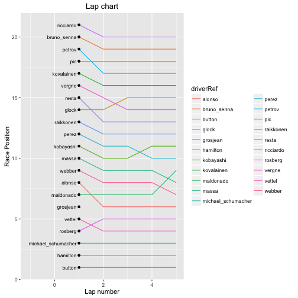

---
output:
  html_document:
    keep_md: yes
---

# Lapcharts and the Race Slope Graph

The lap chart is one of the iconic motor racing charts, describing for each driver, as represented by a separate coloured line, their race position at the end of each lap. Using a design style strikingly reminiscent of the clean coloured lines of Harry Beck's London Underground map, the lap chart combines a rank based y-axis identifying race position with an x-axis corresponding to lap number to describe the changing position of each car lap on lap over the course of the race. This style of rank tracking chart is often referred to as a *bumps chart* (occasionally corrupted to *bump chart*) following Edward Tufte's reference to it in his book *Beautiful Evidence* (2006) as a way of displaying the results of many years of University of Cambridge "bumps" rowing races.

Along with the lap chart, we'll also look at radically simplified version of it, the *race slope graph*, that just indicates the positions changes going from the grid to the end of the first lap, and the end of the first lap to the end of the race. This chart can also be used as an extension of the slope graphs that show progression through qualifying, or even practice and then qualifying.

## Creating a Lap Chart

One of the problems with a lapchart is that it may become hard to read during those periods of the race when many pit stops are taking place and significant position changes appear to have occurred for a lap or two. On the other hand, how confused the chart appears to be in terms of crossed lines that indicate position changes gives an idea, *at a glance*, of how frequently positions changed over the course of a race (at least, as recorded at the end of each lap!), where in the field they took place, and even how processional the race was.

The chart also shows how quickly cars dropped out and the laps on which they did so.

The data we need in to produce a basic lap chart is quite straightforward, comprising just the race positions for each driver at the end of each lap and the lap number.

One source of this information is the downloaded *ergast* database:


```r
library(DBI)
ergastdb =dbConnect(RSQLite::SQLite(), './ergastdb13.sqlite')

#Load in data relating to drivers' positions on each lap for a particular race

#When querying the database, we need to identify the raceId.
#This requires the year and either the round, circuitId, or name (of circuit)
raceId=dbGetQuery(ergastdb,
                  'SELECT raceId FROM races WHERE year="2012" AND round="1"')
#There should be only a single result from this query,
# so we can refer to its value directly.
q=paste('SELECT driverRef, l.driverId AS driverId, lap, position 
          FROM lapTimes l JOIN drivers d
          ON l.driverId=d.driverId
          WHERE raceId=',raceId[[1]])
lapPos=dbGetQuery(ergastdb,q)
#Set the driverRef to be a factor
lapPos$driverRef=factor(lapPos$driverRef)
```

*We can also obtain the data directly from the ergast API using the `lapsData.df()` function call, as well as from raw laptime data, though in the latter case we need to take care when calculating race positions from total (summed) elapsed laptime for drivers not on the lead lap.*

From this data, we can simply plot the position of each driver against lap, using a separate and differently coloured line to identify each driver.


```r
library(ggplot2)
g=ggplot(lapPos)
#The simplest lap chart simply plots each driver's position as a coloured line
g=g+geom_line(aes(x=lap, y=position, col=driverRef))
g=g+labs(title='Lap chart',x='Lap number', y='Race Position')
```


Changes in race position result in lines crossing each other. Long straight lines show a driver held race position for an extended period.

A step down in the trace that marks out the position of the lowest ranked driver on any given lap shows that at least one other driver dropped out on that lap. If you look closely at the example chart you can see where a particular driver's trace stops short of finishing the race, indicating the lap number of the last lap completed by that driver. We can zoom in to the chart by limiting the axis ranges to show such an example:


```r
g+xlim(30,40)+ylim(13,19)
```


One issue with using the lap data is that cars that do not make it to the end of the second lap are not identified. If you look at the original chart, you should notice that that is no mark in position 6 for the first lap - the driver who finished the first lap in sixth did not make the end of the second lap so no line can be drawn. 

We can get round this problem by using an additional layer that plots a point showing that there is indeed a driver positioned in a particular place at the end of the first lap even if they didn't make it to the end of the second. We can further clarify which driver is which at the end of the first lap by adding a *geom_text()* label at the start of the chart, the *hjust* parameter setting the right hand side alignment of these labels.


```r
#Identify each driver line by name
g + geom_text(data=lapPos[lapPos['lap']==1,],
              aes(x=0.9, y=position, label=driverRef), hjust=1, size=3) +
  geom_point(data=lapPos[lapPos['lap']==1,],
             aes(x=1,y=position)) + 
  xlim(-1.1,5)
```



Now we can see that Grosjean was in sixth at the end of the first lap but did not make is as far as the end of the second.

A second problem is that we have no hint from this chart about whether any cars that did make it to the grid failed to make the end of the first or the second lap. Indeed, the lap data has nothing to say about the grid position, so there is no way we can chart this from the lap data in and of itself.

### Ordering the Lap Chart Axes

In certain respects, the orientation of the lap chart's vertical y-axis may be perceived as a matter of personal or practical preference. For example, F1 journalist Joe Saward maintains a lap chart for each race that, presumably for convenience, has the lead driver at the top of the chart (*Joe Blogs F1* post on [Lap Charts](http://joesaward.wordpress.com/2011/04/14/lap-charts/)).

We can achieve this effect simply by reversing the direction of the vertical y-axis, placing the driver in *first position* at the *top* of the chart and the driver in last position at the bottom:


```r
g=g+scale_y_reverse()
```


### Annotated Lapcharts

To emphasise those situations where a driver retires or is forced to retire, we can annotate the plot with an additional marker. If we look at the *ergast* database *results* table, we see there is a *statusId* column that identifies the status of each race result. The interpretation of each *statusId* is given in the *status* table.


```r
#First five statusId interpretations
dbGetQuery(ergastdb,'SELECT * FROM status limit 5')
```

```
##   statusId       status
## 1        1     Finished
## 2        2 Disqualified
## 3        3     Accident
## 4        4    Collision
## 5        5       Engine
```

If we grab the interpretations of the *statusId*s into a dataframe, we can merge these with the race results.  We could do that using a SQL `JOIN` in the following query, or we could do it by grabbing the results into an R dataframe from a separate query and merging them with the dataframe containing the original query results.

We can also pull in the three letter code used to identify each driver (this may not be true for some of the older historical data in the *ergast* database) which is perhaps a slightly tidier way of identifying each driver.


```r
q=paste('SELECT driverRef, code, rs.driverId AS driverId,
                grid, position, laps,statusId 
          FROM results rs JOIN drivers d
          ON rs.driverId=d.driverId
          WHERE raceId=',raceId)
results=dbGetQuery(ergastdb,q)
#Again, we want the driverRef to have factor levels
#results$driverRef=factor(results$driverRef)
status=dbGetQuery(ergastdb,'SELECT * FROM status')
results=merge(results,status, by='statusId')
```

Unfortunately, where drivers are not classified, the race results table shows a *position* of NA, which corresponds to the driver's official classification, rather than giving the race position at the time the driver withdrew. In order to annotate the lap chart using information gleaned from the *status* table using the *position* value for a driver's final lap of the race, we need to merge that information with the lap data information.

The rows we want to annotate amongst the lap data correspond to the laps referenced in the results data for each driver. If we grab the *driverRef* and *laps* data along with the *status*, we can then inject the *status* into the lap data based on *driverRef* and *lap(s)* count (that is, the last lap associated with the driver).


```r
results.status=subset(results,select=c('driverRef','status','laps'))
lapPos.status=merge(lapPos,
                    results.status,
                    by.x=c('driverRef','lap'),
                    by.y=c('driverRef','laps'))
```

Having enriched our data set, we can now overplot onto the lap chart. For example, we might highlight all those final laps completed by a driver where the result *status* is **not** *Finished*, as well as adding driver codes to each row based on their final classification position and a cross symbol (`pch=4`) to denote a non-finisher.


```r
g=g+geom_text(data=results,
             aes(x=60, y=position, label=code, col=driverRef),
             hjust=0,size=3) + xlim(0,65) + guides(colour=FALSE)
#Add a cross symbol to identify non-finishers
g+geom_point(data=subset(lapPos.status, status!='Finished'),
             aes(x=lap, y=position), pch=4, size=2, col='blue')
```


Note how the driver codes are only given for values where the *position* value in the *results* table is set to a non-NA value - that is, a valid final classification. The names of drivers who were unclassified are not listed by this printing method. In addition, as the above chart shows, the placement of the labels at the end of the chart may lose their clear relationship to the driver lines they are supposed to be associated with. This may occur if there are sudden position changes at the end of the race caused by one or more incidents, perhaps, that result in some classified non-finishers that are hard to distinguish between.

The final classification may include drivers who did not in fact finish the race but did complete enough of it to merit classification. It would perhaps be even more informative to distinguish between drivers who were classified but did not finish from those who did not finish and were not classified, perhaps by overprinting the non-finisher cross with an empty circle to denote the one from the other.

Another way of annotating the chart is with a label describing the reason why a driver failed to finish.


```r
#Explicitly identify why a driver failed to finish
g=g+geom_text(data=subset(lapPos.status,status!='Finished'),
            aes(x=lap,y=position,label=status),
            size=3,
            angle=45,
            col='red', alpha=0.5)
```


### Pit Stop Annotations

A further annotation that is likely to help us identify one of the major reasons for a position change is a pit stop annotation that highlights the lap or laps on which each driver pitted.


```r
q=paste("SELECT driverRef, p.driverId AS driverId, lap 
          FROM pitStops p JOIN drivers d
          ON p.driverId=d.driverId
          WHERE raceId=",raceId)
pitStops=dbGetQuery(ergastdb,q)
pitStops=merge(pitStops,lapPos[,c("driverRef","lap","position")],
               by=c("driverRef","lap"))
g+geom_point(data=pitStops,aes(x=lap,y=position,colour=factor(driverId)),alpha=0.6)
```


Using this sort of annotation, we can clearly see that changes in first position resulted from pit stop activity even if they lost the position only briefly.

A successful undercut would be shown by a driver pitting one lap before the driver immediately ahead, and taking that position from the driver originally ahead, once the current round of pit stops are completed.

Undercuts are considered in more detail in the section on *Event Detection*.

### Extending the Lap Chart - Including Grid Positions

One of the shortcomings with the simple lap chart is that it does not show whether there were any positions changes off the grid. Ideally, we should have added the grid position data prior to the first lap. If we set the grid position at "lap -1" rather than "lap 0", it gives us some clear separation between the grid positions and the lap positions at the end of lap 1, reinforcing the special, and often incident filled, nature of the first lap, along with the fact that it begins with a standing start.


```r
#Create a grid position item at lap number -1
fullRacePos=lapPos[,c('driverRef','lap','position')]
gridPos=results[,c('driverRef','grid')]
gridPos$lap=-1
names(gridPos)=c('driverRef','position','lap')
#Add the grid positions to the race position data
fullRacePos=rbind(fullRacePos,gridPos)

g=ggplot(fullRacePos)
g=g+geom_line(aes(x=lap,y=position,group=driverRef,col=driverRef))
g+geom_vline(xintercept=0,colour='grey')
```


By adding in a vertical start line, we can also emphasise the idea that a change right at the start of the race is a change potentially straight off the grid, or at least on that arose during the first lap.

### A Lap Charter Function

Let's now repackage what we've done in the form of a lapcharter function that can accept a championship year and round number and generate an annotated lapchart for it directly.


```r
library(DBI)
library(ggplot2)
library(plyr)

getLapPos=function(ergastdb,year,round){
  q=paste('SELECT driverRef, l.driverId AS driverId, d.code AS code, lap, position 
          FROM lapTimes l JOIN drivers d JOIN races r
          ON l.driverId=d.driverId AND l.raceId=r.raceId
          WHERE year=',year,' AND round="',round,'"',sep='')
  lapPos=dbGetQuery(ergastdb,q)
  #Set the driverRef to be a factor
  lapPos$driverRef=factor(lapPos$driverRef)
  lapPos
}

getResults=function(ergastdb,year,round){
  q=paste('SELECT driverRef, code, rs.driverId AS driverId, grid, position, laps, statusId 
          FROM results rs JOIN drivers d JOIN races r
          ON rs.driverId=d.driverId AND rs.raceId=r.raceId
          WHERE r.year=',year,' AND r.round="',round,'"',sep='')
  results=dbGetQuery(ergastdb,q)
  #Again, we want the driverRef to have factor levels
  #results$driverRef=factor(results$driverRef)
  status=dbGetQuery(ergastdb,'SELECT * FROM status')
  merge(results,status, by='statusId')
}

getPitStops=function(ergastdb,year,round){ 
  q=paste('SELECT driverRef, p.driverId AS driverId, d.code AS code, lap 
          FROM pitStops p JOIN drivers d JOIN races r
          ON p.driverId=d.driverId AND p.raceId=r.raceId
          WHERE r.year=',year,' AND r.round="',round,'"',sep='')
  pitStops=dbGetQuery(ergastdb,q)
  pitStops
}

getFullRacePos=function(lapPos,results){
  fullRacePos=lapPos[,c('driverRef','code','lap','position')]
  gridPos=results[,c('driverRef','code','grid')]
  gridPos$lap=-1
  names(gridPos)=c('driverRef','code','position','lap')
  #rbind can align the columns by name
  #The columns do not need to be presented in the same order
  fullRacePos=rbind(fullRacePos,gridPos)
  arrange(fullRacePos,code,lap)
}

lapCharter.chart=function(year,round){
  ergastdb =dbConnect(RSQLite::SQLite(), './ergastdb13.sqlite')
  
  results=getResults(ergastdb,year,round)
  lapPos= getLapPos(ergastdb,year,round) 

  fullRacePos=getFullRacePos(lapPos,results)
  
  pitStops=getPitStops(ergastdb,year,round)
  pitStops=merge(pitStops,
                 lapPos[,c("driverRef","code","lap","position")],
                 by=c("driverRef","code","lap"))

  results.status=subset(results,select=c('driverRef','status','laps'))
  lapPos.status=merge(lapPos,
                      results.status,
                      by.x=c('driverRef','lap'),
                      by.y=c('driverRef','laps'))
  
  g=ggplot(fullRacePos)
  g=g+geom_line(aes(x=lap,y=position,group=code,col=code))
  g=g+geom_vline(xintercept=0,colour='grey')
  g=g+geom_point(data=pitStops,aes(x=lap,y=position,colour=factor(code)),alpha=0.6)
  g=g+geom_text(data=subset(lapPos.status,status!='Finished'),
                aes(x=lap,y=position,label=status),
                size=3,
                angle=45,
                col='red', alpha=0.5)
  g+theme_bw()+xlab("Position")+ylab("Lap")
}
```

We can now call the lapcharter function with a specific year and race round.


```r
lapCharter.chart(2012,1)
```


This code can be found in the file [*lapCharter.R*](https://gist.githubusercontent.com/psychemedia/11187809/raw/lapCharter.R) and loaded in with the command *source("lapCharter.R")*.

The chart might be further annotated by drawing on inspiration from the session summary annotations applied to the practice session utilisation charts.

## Lap Trivia
With data to hand, there are plenty of opportunities to engage in lap related statistics Inspired by the lapchart, what else might we be able to learn from the lap data?

### Laps Led
The number of *laps led* is one of the season long indicators that may be used to help rank drivers at the end of the year. To calculate this popular sports statistic for a single race, we might count the number of laps for each driver where the driver was actually leading the race as they crossed the start/finish line (rather than holding first place briefly in the middle of sector 2 on a single lap, for example). The calculation itself is quite straightforward: all we need to do is group the laps by driver and then count the number of laps for which the driver was in first position.

Let's start by counting the number of laps led by each driver in the 2012 Australian Grand Prix.


```r
library(plyr)
#Count the number of laps led by each driver
lapsled=ddply(lapPos,.(driverRef),summarise,num=sum(position==1))

#Limit the result to only drivers who led at least one lap
lapsled=lapsled[lapsled['num']>0,]

#Order the result in terms of decreasing count
lapsled[order(-lapsled$num),]
```

```
##    driverRef num
## 3     button  56
## 6   hamilton   1
## 20    vettel   1
```

We can also calculate the number of laps led as a proportion, for example, of the number of laps completed by a driver during a season, or during a single race.


```r
driverLaps=ddply(lapPos,.(driverRef),summarise,driverLaps=length(position))
lapsled=merge(lapsled,driverLaps,by='driverRef')
#Calculate laps led as a proportion of the number of laps completed by the driver
lapsled$percent=100.0*lapsled$num/lapsled$driverLaps
lapsled[order(-lapsled$percent),]
```

```
##   driverRef num driverLaps   percent
## 1    button  56         58 96.551724
## 2  hamilton   1         58  1.724138
## 3    vettel   1         58  1.724138
```

### Counting Laps Led Using a Single SQL Query

A single SQL query can also be used for counting the number of laps led by a particular driver in a range of scenarios. For example, to count the number of laps led by each driver during the 2012 season, we can use a query of the following form:


```r
dbGetQuery(ergastdb,
           'SELECT driverRef, COUNT(*) AS lapsled
              FROM lapTimes l, drivers d, races r
              ON d.driverId=l.driverId AND r.raceId=l.raceId
              WHERE year=2012 AND position=1
              GROUP BY driverRef
              ORDER BY COUNT(*) DESC')
```

```
##     driverRef lapsled
## 1      vettel     368
## 2    hamilton     229
## 3      alonso     216
## 4      button     136
## 5      webber      66
## 6     rosberg      48
## 7   raikkonen      44
## 8   maldonado      37
## 9  hulkenberg      30
## 10      perez      12
## 11   grosjean       4
## 12      massa       1
## 13      resta       1
```

Were the data available, we could then adapt this sort of query to find the five drivers with the highest counts of laps led to date. At the current time, the *ergast* database only has laptime data starting from the 2011 season. The results below are also calculated using the 2013 version of the database (that is, containing results to the end of the 2013 season).


```r
dbGetQuery(ergastdb,
           'SELECT driverRef, COUNT(*) AS lapsled
              FROM lapTimes l, drivers d, races r
              ON d.driverId=l.driverId AND r.raceId=l.raceId
              WHERE position=1
              GROUP BY driverRef
              ORDER BY COUNT(*) DESC
              LIMIT 5')
```

```
##   driverRef lapsled
## 1    vettel    1791
## 2  hamilton     445
## 3    alonso     373
## 4    button     232
## 5    webber     194
```

A fuller treatment of laps led calculations and visualisations is provided in the chapter *Laps Completed and Laps Led*.

As well as the *total* number of laps led in a race, season, or career, we can also calculate the number of *consecutive* laps led. See the chapter on *Streakiness* for examples of how to calculate runs and streaks that you can then apply to the laps led data. 

## Lap Position Status Charts
For each driver, we can summarise the count of how many laps they completed in each particular race position, not just at the front of the race, using a *lap position status chart* (or perhaps, *lap position summary chart*).


```r
#Count the number of laps each driver held each position for
posCounts=ddply(lapPos, .(driverRef,position),
                summarise, poscount=length(lap))

#Set the transparency relative to the proportion of the race in each position
alpha=function(x) 100*x/max(lapPos$lap)
#Rotate the x-tick labels
xRotn=function(s=7) theme(axis.text.x=element_text(angle=-90,size=s))

g=ggplot(posCounts)
#For each driver, plot the number of laps in each race position
g=g+geom_text(aes(x=driverRef,y=position,label=poscount,alpha=alpha(poscount)),
              size=4)
g+theme_bw()+xRotn()+xlab(NULL)+ylab(NULL)
```


The default ordering of the x-axis on this chart is alphabetical. A better ordering might be one based on final classification.

In many respects, this sort of chart may be thought of as a form of *semi-graphic display*. Semi-graphic displays were a display technique in which text-mode characters could be used to approximate graphical displays from a time when non-alphanumeric graphical displays were still hard to programme. In this particular example, we are using a primarily text based representation combined with a spatial layout to provide a graphical effect. Additional emphasis is provided through the use of font size, along with font weight modeled using transparency.

> "If we are going to make a mark, it may as well be a meaningful one. The simplest - and most useful - meaningful mark is a digit." John W Tukey, "Some Graphic and Semigraphic Displays", commenting on stem-and-leaf plots, in T A Bancroft,ed., Statistical Papers in Honor of George W Snedecor,1972, p296, also quoted in Edward R. Tufte, Envisioning Information, 1990, p46.

To make this chart a little more meaningful to read, it makes sense to reorder the drivers by their final rank. For drivers that finished the race, this corresponds to their final classification. For drivers that don't finish the race, we order them according to who got furthest into the race and, for ties, who was higher placed on their final lap for two drivers who went out of the race on the same lap.

We also need to add in any drivers who started but did not make it to the end of the first lap, in which case we should probably order by grid position.


```r
#Add drivers who didn't make the end of the first lap
firstLapOuts=results[results['laps']==0 & results['status']!='Did not qualify',
                     c('driverRef','driverId','laps','position')]
names(firstLapOuts)[names(firstLapOuts) == 'laps'] = 'lap'
lapPos=rbind(lapPos,firstLapOuts)
#Generate a ranking based laps completed and position on driver's last lap
finalPos=ddply(lapPos, .(driverId), tail, 1)
finalPos=arrange(finalPos,-lap,position)
finalPos$finalPos=1:nrow(finalPos)
```

We can extend this data frame to include other useful information. For example, the grid position of each driver:


```r
finalPos=merge(finalPos,results[,c('driverId','grid','position')],
               by='driverId',all.x=TRUE)
#Rename the columns
names(finalPos)[names(finalPos) == 'position.x'] = 'position'
names(finalPos)[names(finalPos) == 'position.y'] = 'classification'
```

Let's also add in the position each driver was in at the end of the first lap.


```r
finalPos=merge(finalPos,lapPos[lapPos['lap']==1,c('driverId','position')],
               by='driverId',all.x=TRUE)
#Rename the columns
names(finalPos)[names(finalPos) == 'position.x'] = 'position'
names(finalPos)[names(finalPos) == 'position.y'] = 'lap1pos'
```

And finally, the status of each driver in the final classification.

```r
finalPos=merge(finalPos,results[,c('driverId','status')],
               by='driverId',all.x=TRUE)
```

| driverId|driverRef  | lap| position| finalPos| grid| classification| lap1pos|status     |
|--------:|:----------|---:|--------:|--------:|----:|--------------:|-------:|:----------|
|        1|hamilton   |  58|        3|        3|    1|              3|       2|Finished   |
|        3|rosberg    |  58|       12|       12|    7|             12|       4|Finished   |
|        4|alonso     |  58|        5|        5|   12|              5|       8|Finished   |
|        5|kovalainen |  38|       16|       18|   18|             NA|      17|Suspension |
|        8|raikkonen  |  58|        7|        7|   17|              7|      13|Finished   |

In addition to ordering the drivers, we can overlay additional information on to the chart. In the following example, we add:

- *grid position*: identified using an empty grey square;
- *race position after the first lap*: identified using an empty grey circle;
- *race position on each driver's last lap*: y-value (position) of corresponding pink circle;
- *points cutoff line*: a faint grey dotted line to show which positions are inside - or out of - the points;
- *number of laps completed by each driver*: size of pink circle;
- *total laps completed by each driver*: greyed annotation at the bottom of the chart;
- *whether a driver was classified or not*: the total lap count is displayed using a bold font for classified drivers, and in italics for unclassified drivers;
- *finishing status of each driver*: classification statuses other than *Finished* are also recorded at the bottom of the chart.


```r
#Reorder the drivers according to a final ranked position
g=ggplot(finalPos,aes(x=reorder(driverRef,finalPos)))
#Highlight the points cutoff
g=g+geom_hline(yintercept=10.5,colour='lightgrey',linetype='dotted')
#Highlight the position each driver was in on their final lap
g=g+geom_point(aes(y=position,size=lap),colour='red',alpha=0.15)
#Highlight the grid position of each driver
g=g+geom_point(aes(y=grid),shape=0,size=7,alpha=0.2)
#Highlight the position of each driver at the end of the first lap
g=g+geom_point(aes(y=lap1pos),shape=1,size=7,alpha=0.2)
#Provide a count of how many laps each driver held each position for
g=g+geom_text(data=posCounts,
              aes(x=driverRef,y=position,label=poscount,alpha=alpha(poscount)),
              size=4)
#Number of laps completed by driver
g=g+geom_text(aes(x=driverRef,y=-1,label=lap,
                  fontface=ifelse(is.na(classification), 'italic' , 'bold')),
              size=3,colour='grey')
#Record the status of each driver
g=g+geom_text(aes(x=driverRef,y=-2,label=ifelse(status!='Finished', status,'')),
              size=2,angle=30,colour='grey')
#Styling - tidy the chart by removing the transparency legend
g=g+theme_bw()+xRotn()+xlab(NULL)+ylab("Race Position")+guides(alpha=FALSE)
```


Viewing the chart, we see that whilst Maldonado was classified in the the middle of the order (13th), he actually made it a long way into the race (from the size of the pink circle), before exiting the race in sixth position. He literally "fell out" of the order due to an accident in the last lap of the race. The chart also shows how Rosberg's race fell to pieces at the very end of the race after a start that saw him move from 7th on the grid to 4th at the end of the first lap.

To identify drivers in the points, we need to look along the dotted line to find the last scoring position at the end of the race, and then drop down to the driver names. Adding rank position numbers would add to much additional clutter, I think?

The chart clearly shows how both Hamilton and Vettel each completed a significant number of laps in both second and third positions. However, this chart *does not* tell us whether these laps were grouped in long runs (for example, Hamilton ahead in the first part of the race, Vettel in the latter part), or whether the drivers were battling throughout and changing position every few laps. To learn that, we need to look to another indicator that is more indicative of position changes.

However, one thing the race summary chart does not show is the effect of any grid penalties. If a driver qualified well but suffered a grid penalty, we might expect them to make a charge from their position on the grid. It could therefore make sense to further annotate the chart with a small device showing where each driver's qualifying session classification.

## The Race Summary Chart

One way of demonstrating how the race evolved on a lap by lap basis is to use *colour* to represent the lap number and a jittered scatterplot to place marks for each driver showing their position by (coloured) lap. Setting a low alpha level makes the dots semi-transparent, which  means a large collection of dots will present a more solid appearance.


```r
#The jitter plot spreads out multiple points with the same co-ordinates
g+geom_jitter(data=lapPos,aes(driverRef,position,colour=lap),alpha=0.2)+
  scale_colour_gradientn(colours = rainbow(5))
```


In the coloured view of this chart, we can now see that Vettel was running in fourth in the early stages of the race, then third for a while, then second for the latter part of the race; Hamilton started off in second (a faint hint of red marks, with the more concentrated marks of the green middle stage of the race on a higher graphical layer), and then ran in third for the later stages. From the apparent late stage running of Kobyashi to Maldonado, compared to the final classification, it seems that an accident to Maldonado at the end of the race may have had a significant effect on the final result?!

Tweaking the transparency levels and colours of all the layers could possibly improve the legibility of this chart further. It might also be interesting to flip the x and y axes, with the higher placed drivers at the top of the chart and the lower placed drivers at the bottom, to see if it makes reading off the performance of each individual driver any easier.

Another form of colouring may also help to draw out the story of the race: colouring by stint rather than lap.

## Position Change Counts

A simple indicator for highlighting how many times a position changed hands is a count of driver changes between consecutive laps for each position.

Calculating the difference from the laptime data is straightforward enough, but we should also bear in mind the need to count any changes between grid position and the position at the end of the first lap.

We'll start by finding changes in position that occur between consecutive laps.


```r
#Work about this in a roundabout way
#Start by ordering the lap times by position and lap
#For each position, find laps where the driverId is different to the previous one
poschange=ddply(arrange(lapPos, position,lap),
                .(position),
                transform,
                change=(diff(c(-1,driverId))!=0))
```

One problem with this is that the first *change* value is actually a dummy value. We really want it to state whether there was a change from the grid position.

Let's create a dataframe that allows us to detect changes between grid position and the position at the end of the first lap.


```r
firstLap=merge(poschange[poschange["lap"]==1,],
               results[,c('driverId','grid')], by='driverId')
#The position changed after the first lap if it differs from the grid position
firstLap$change= (firstLap$grid != firstLap$position)
```

| driverId|driverRef | lap| position|change | grid|
|--------:|:---------|---:|--------:|:------|----:|
|        1|hamilton  |   1|        2|TRUE   |    1|
|        3|rosberg   |   1|        4|TRUE   |    7|
|        4|alonso    |   1|        8|TRUE   |   12|

We can now set the original dummy value for the change state at the end of the first lap to correctly reflect whether there was a change in position at the end of the first lap from the original grid start.


```r
poschange[poschange["lap"]==1,]$change = arrange(firstLap,position)$change
```

We can now simply count how many position changes there were in each race position across the race as a whole.


```r
#For each position, count the number of changes
dch=ddply(poschange,.(position),summarise,changes=sum(change))
#Plot them as a scatter plot
g=ggplot(dch)+geom_point(aes(x=position,y=changes))
g+ylab("Number of position changes")
```


This tells us, for example that first position changed hands 5 times during the race. However, looking back at one of the previous lap charts, we see that several of these were quick succession changes associated with pitting. To get a more useful measure of churn, we perhaps need to consider alternative metrics, for example by paying more heed to the number of laps a driver held a position, or taking note of whether a driver lost a position temporarily due to a pit stop. In other words, perhaps we need to take a more considered view around lap position *streaks* or *runs*. This in turn might suggest additional ways of re-presenting the *Lap Position Status/Summary Chart*. See the chapter *Keeping an Eye on Competitiveness - Tracking Churn* for measuring churn in rankings within and across seasons that might also be used to track churn within a race.

*As well as simply tracking position changes, it might also be worth distinguishing those position changes that arise from one or more cars exiting from the race. For example, if the car leading the race is forced to retire, every other car still in the race will benefit from a position change on that lap.*

## The Race Slope Graph

A simplification of the lap chart as a *slope graph* connects the starting and finishing rank positions of each driver with a single straight line. Crossed lines show how one driver changed order relative to another when comparing their grid and final classification positions.


```r
#Let's use a clean white theme
slopeblank=theme(panel.border=element_blank(),panel.grid.major=element_blank(),
                 panel.grid.minor=element_blank(),
                 axis.line=element_blank(),axis.ticks=element_blank(),
                 axis.text = element_blank())

g=ggplot(results[results['grid']>0,])
g=g+geom_text(aes(x=0.98,y=grid, label=driverRef),hjust=1,size=4)
g=g+geom_text(aes(x=2,y=position,label=driverRef),hjust=0,size=4)
g=g+geom_segment(aes(x=1,xend=1.95,y=grid,yend=position,group=driverRef))
g+theme_bw()+xlim(0,3) +xlab(NULL)+ylab(NULL)+slopeblank
```


Adding the grid position and final classification as a explicit labels may help further improve the glanceability of this chart, as might using standard three letter driver codes rather than driver name labels.

Slope graphs are often presented using real number interval scales, rather than rank based scales, as a means of demonstrating the distance between grouped elements on each axis as well as the extent of the change in values from one situation to the next for each element. Although axis lines and regular tick marks are omitted as part of the very clean, minimal aesthetic of the chart, the y-values associated with each element are displayed alongside each element and as such are easily read.

We can extend the technique to show the relative rank positions of each driver going from the grid to the end of the first lap and from their first lap position to their final rank position.


```r
raceHighlights=merge(results[,c('driverRef','code','grid','position')],
                     lapPos[lapPos['lap']==1,c('driverRef','position')],
                     by='driverRef',all.x=TRUE)
g=ggplot(raceHighlights[raceHighlights['grid']>0,])
#Place the labels
g=g+geom_text(aes(x=0.98,y=grid, label=code),hjust=1,size=3)
g=g+geom_text(aes(x=2.0,y=position.y,label=code),,size=3)
g=g+geom_text(aes(x=4.02,y=position.x,label=code),hjust=0,size=3)
#And then place the line segments
g=g+geom_segment(aes(x=1,xend=1.87,y=grid,yend=position.y,group=code))
g=g+geom_segment(aes(x=2.13,xend=4,y=position.y,yend=position.x,group=code))
#Finally, render the chart using the clean theme
g+theme_bw()+xlim(0,5)+xlab(NULL)+ylab(NULL)+slopeblank+scale_y_reverse()
```


If we add additional text labels to the chart, we can increase the amount of information communicated without overloading it too much. For example, we might add text annotations that identify the number of pit stops each driver had, the number of laps in the lead position, the number of consecutive laps the driver held their classified position for at the end of the race, or the lap number at which a driver retired. We might also include another rank ordered column depicting the qualifying position of each driver to identify any drivers who took a grid penalty going in to the race.

We can also *back refer* information traces. For example, we could use italics to emphasise a driver in the grid column who did not make the end of the first lap, or highlight drivers in the end of lap 1 column who were not classified at the end of the race. (This column may be the appropriate place to record the lap on which a retired driver retired.)

The slope graph could also be extended by adding a semi-transparent lower layer showing how far into the race each unclassified driver got and the position they were in at the end of their race by projecting lines into the space between the end of lap and final classification columns.

In the same way that the race slope graph reapplies the techniques used to create the qualifying slope graph, the same idea can be further extended to generate "race weekend" slope graphs. These could show the final classification at the end of each practice session, after each part of qualifying, the grid position (after any grid penalties, for example), positions at the end of the first lap and the end of the race, and the final official classification. Dotted vertical lines could be used to identify those transitions where position changes were due to stewards' actions, or the application of penalties in order to distinguish them from driver performance measures.

## Further Riffs on the Lapchart Idea
In a post from April 2011 on [Lap charts...](http://joesaward.wordpress.com/2011/04/14/lap-charts/), F1 journalist Joe Saward gives a couple of examples of lap charts he had made during the course of a particular race.

If you look closely at the lapcharts shown in that post, you will see how lines are used to highlight position changes; this suggests a style of chart where lines are *only* used to show position changes. The easiest way to plot this would be to generate a *position change* dataset within which each row specified a particular driver, their previous lap position and their current lap position *if the two positions are different*.

We can quickly doodle a sketch to get a feel for what such a chart might look like. Firstly, let's just record the drivers as they change position:


```r
fullRacePos.df=function(year,round){
  ergastdb =dbConnect(RSQLite::SQLite(), './ergastdb13.sqlite')
  results=getResults(ergastdb,year,round)
  lapPos= getLapPos(ergastdb,year,round) 
  getFullRacePos(lapPos,results)
}

fullRacePos = fullRacePos.df(2012,1)

#A position change for a driver is identified if there is difference
#in position at the end of consecutive laps
poschange=ddply(arrange(fullRacePos, code,lap),
                .(code),
                transform,
                change=(diff(c(-1,position))!=0))

g=ggplot(poschange[poschange['change']==TRUE,])
g+geom_text(aes(x=lap,y=position,label=code),size=2,angle=45)
```


This chart shows just the position changes for each driver over the course of the race; the leftmost labels correspond to grid positions, the other marks record the lap on which a driver attained a particular position.

Emphasising losses in position using italicised labels, or pit stop laps though the use of an underline, would add further richness to this chart. Adding the final race positions to the right hand margin would also improve the utility of this chart as a race summary device.

### Further Ideas

Joe Saward's lapchart notes also identify other techniques that we might be able to draw on, as well as some thoughts on the personal design of an effective lapchart:

> A list of numbers does not tell the whole story; it does not indicate the gaps between the cars or any incidents that might occur. So lap charters develop their own personal systems to record the action on a given lap. On my personal chart there are different marks and squiggles each of which record a particular point. If a car is catching the one in front, for example, I will often put an arrow. When cars are close together this becomes a line. When cars are nose to tail, there may be two lines to indicate a battle. If there are three lines it usually indicates that an accident is about to happen as the fight is getting out of control. You will also see small horizontal lines in places between numbers, which indicate gaps, although I do not always include these. A circled number indicates a car which has pitted. A puff of smoke beside a number indicates that a car has blown up or is trailing smoke. A circular arrow around a number or initials indicate a spin... When there is a passing manoeuvre I tend to put in a pair of crossed lines so I can see what happened on what lap. 
> ...
> ... At the bottom of the chart you see a line which indicates the cars that have been lapped, or in some cases, lapped twice. ...
>
> Joe Saward, [*Lap Charts*](http://joesaward.wordpress.com/2011/04/14/lap-charts/)

If you haven't already read it, the post is well worth reading in full.

### Lap Charts as Network Graphs
Several years ago I started to explore the idea of representing the laptimes and positions of each driver within a race as disconnected components of a graph (in the sense of Graph Theory, that is, as a network) with each lap representing a node and consecutive laps as nodes connected by a directed edge showing which lap preceded the other. *See the section on __Event Detection__ for an example of how we might use graph theory to detect a particular sort of event.*

This approach led to some of the chart styles described at bottom of a blog post entitled [Thoughts on a Couple of Possible Lap Charting Apps](http://blog.ouseful.info/2011/04/30/thoughts-on-a-couple-of-lap-charting-apps/). The use of graph theory ideas is potentially a very rich one, with opportunities for representing values as edge weights that can be used to influence the layout of connected nodes, as well as node attributes that can be visualised using colour or size.

This area is left as a topic for future exploration...

## Summary
In this chapter, we have explored the construction of one of the iconic racing charts, the *lap chart*, as a means of recording driver positions at the end of each lap. These charts can be annotated to display additional information, such as pit stop laps, as well as the reason for any early finish. A slope graph was also presented as an idealisation of certain key points in the lapchart (grid position, position at end of first lap, position at end of race), with the observation that a "race weekend" slope graph might usefully summarise classifications across all sessions, as well as highlighting any position changes due to stewards' actions.

We also used laptimes to generate some alternative charts: *lap position status charts* provide a summary count of how many laps each driver spent in each position, with additional annotations also capturing grid position and the position at the end of both the first lap and the end of the race; *race summary charts* used an additional colour field to try to capture when in the race each driver held a particular position.

A simple *position change count chart* hinted at positions where changes were occurring, but it's not clear how effective this metric really is at identifying the most competitive areas of the race. A *position change text plot* was also demonstrated that identifies when each driver moved into a particular position; though tricky to read at first, the use of emphasis and the addition of final classification information might improve the informational value of this chart.

Use creatively, hopefully you'll see how raw laptime data on it's own can be put to a multitude of purposes!
