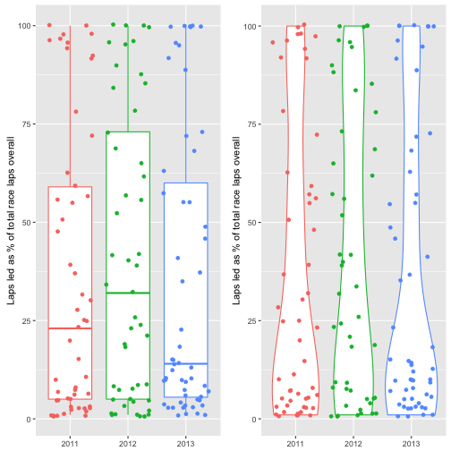
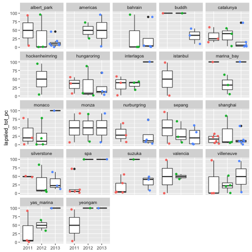
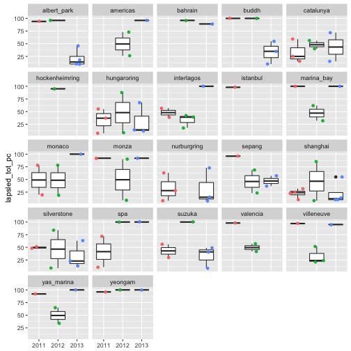
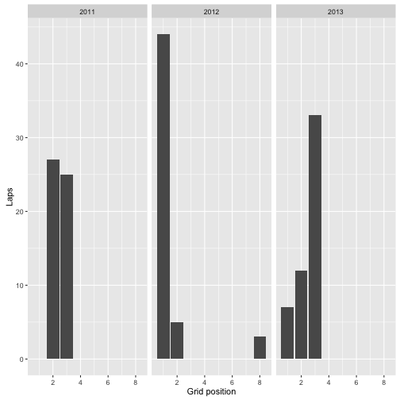
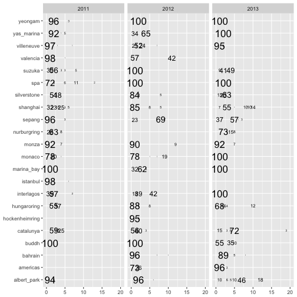
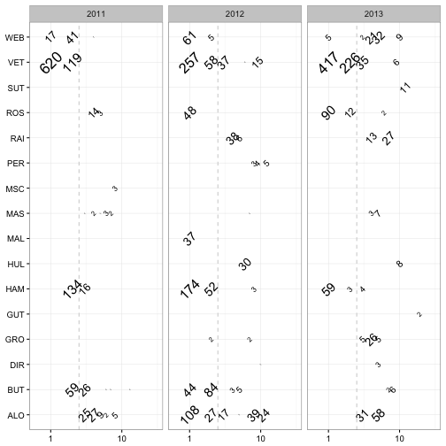

---
output:
  html_document:
    keep_md: yes
---

# Laps Completed and Laps Led

One informal metric of success used to rank drivers' race performances is a tally of the number of laps on which they have been race leader, either given as a raw count or as a percentage of the number of racing laps they have completed either within a season or across their career.

Using the `lapTimes` table in the *ergast* database, which records race position, as well as lap time, for each driver on each lap of each race from 2012 onwards, we can easily generate several different sorts of "laps led" count.

To begin with, let's consider the number of laps on which each driver has been in the lead *at any stage of a race*. We'll calculate these lead lap counts for all the seasons for which we have laptime data, and also report the total number of lead laps for each driver as a percentage of the number of laps they completed (that is, the number of laps we have lap times for).

* the `Laps` count is a count of the total number of laps completed by each driver;
* the `lapsled` value is effectively a count of the the number of laps where the driver was in first position;
* the `lapsled_completed_pc` column represents the percentage of laps completed where the driver was in first position. That is, *lapsled_completed_pc = 100 * lapsled / Laps* given as a percentage.


```r
library(DBI)
ergastdb = dbConnect(RSQLite::SQLite(), './ergastdb13.sqlite')

q=paste('SELECT d.driverRef,d.code,
            COUNT(l.lap) Laps, 
            SUM(l.position==1) lapsled,
            (100*SUM(l.position==1))/COUNT(l.lap) lapsled_completed_pc
        FROM drivers d JOIN lapTimes l JOIN races r
        WHERE year="2012" 
          AND r.raceId=l.raceId 
          AND d.driverId=l.driverId
          GROUP BY d.driverId ORDER BY lapsled DESC')
lapsled=dbGetQuery(ergastdb,q)
```

|driverRef |code | Laps| lapsled| lapsled_completed_pc|
|:---------|:----|----:|-------:|--------------------:|
|vettel    |VET  | 1162|     368|                   31|
|hamilton  |HAM  | 1045|     229|                   21|
|alonso    |ALO  | 1095|     216|                   19|
|button    |BUT  | 1105|     136|                   12|
|webber    |WEB  | 1131|      66|                    5|
|rosberg   |ROS  | 1036|      48|                    4|

The effective count of laps led works as follows: if a driver is in first position at the end of any lap, `l.position==1` evaluates `TRUE`. This logical value also evaluates as a numerical value of `1`. For other positions, the equivalence test fails, returning a logical `FALSE` value, which has a numerical value of `0`. For each driver (`GROUP BY d.driverId`), we can thus count the number of laps they were leading on as the sum of the laps in which a test of their position equal to 1 was true: `SUM(l.position==1)`. The total number of laps they completed is simply a count of the number of laps recorded for that driver (`COUNT(l.lap)`).

We have already calculated one percentage value for each driver in the form of the percentage of laps completed that he was also leading on. But we could also calculate the percentage of the number of laps summed over the full race distances of the races he competed in that he was also leading on; that is, rather than dividing through by a count of the number of laps a driver completed, we divide through by the total race distance for each of the races the driver competed in.

This second interpretation suggests the following useful measure: *percentage of race laps completed = laps completed / total race distance of races competed in*. (A further possible metric is *average number of laps led per race*, although this is likely to be a highly variable amount.)

We shall see in the following section how to calculate the percentages based on the total race lap counts.

The lack of historical laptime data in the *ergast* dataset, in which laptime data is only available from the start of the 2011 Championship season, makes it impossible to calculate career history counts of drivers who started their Formula One career *before* 2011 using this resource. However, given the data we *do* have, we can explore leader lap counts for particular races or across a particular season, for example, as an indicator of competitive balance, or across the last few seasons. We can also compare leader lap counts across the years for particular circuits, for example to get a crude indication of whether or not a track seems to result in processional races  or to get a feel for whether one particular driver or another has dominated on a particular track. In the case of a specific race, by supplementing a simple laps led counts by a churn analysis or streak length comparison, we may be able to get a much richer view of the race dynamics.

## Calculating Laps Completed and Laps Led Percentages

To calculate percentages relative to race distances, we need access to the race distance (in laps) of each race. We can get this information from the `results` table, by looking up the number of laps completed by the winner of each race. In particular, we generate an "as if" datatable containing two columns that pair a *raceId* with the number of race laps, given as the number of laps completed by the race winner: 


```r
q='SELECT raceId, laps AS racelaps FROM results WHERE position=1 LIMIT 3'
dbGetQuery(ergastdb,q)
```

```
##   raceId racelaps
## 1     18       58
## 2     19       56
## 3     20       57
```

We can use this value in our calculation of the percentage rates for the number of laps a driver completed, as well as the number of laps they led, taken over the total race distances of the races they competed in.

Putting all those elements together, we get a single query of the form:


```r
q='SELECT circuitRef, d.code Code, year,
                racelaps AS Racelaps,
                COUNT(l.lap) Laps, 
                SUM(l.position==1) AS lapsled,
                (100*SUM(l.position==1))/COUNT(l.lap) lapsled_comp_pc,
                (100*SUM(l.position==1))/RaceLaps AS lapsled_tot_pc
        FROM drivers d, lapTimes l, races r, circuits c,
              (SELECT raceId, laps AS racelaps FROM results WHERE position=1) rs
        WHERE r.raceId=l.raceId
          AND d.driverId=l.driverId
          AND r.raceId=rs.raceId AND c.circuitId=r.circuitId
          GROUP BY r.circuitId,d.driverId,year ORDER BY lapsled DESC'
cct_driver_lapsled=dbGetQuery(ergastdb,q)
```

This query dynamically creates an "as if" table, `rs`, that describes the `raceId` and number of race laps recorded for the winner of each race (`position=1`). This is the *de facto* race length for each race.


|circuitRef |Code | year| Racelaps| Laps| lapsled| lapsled_comp_pc| lapsled_tot_pc|
|:----------|:----|----:|--------:|----:|-------:|---------------:|--------------:|
|suzuka     |VET  | 2013|       53|   53|      22|              41|             41|
|sepang     |VET  | 2013|       56|   56|      21|              37|             37|
|buddh      |WEB  | 2013|       60|   39|      21|              53|             35|
|marina_bay |HAM  | 2012|       59|   22|      19|              86|             32|
|yas_marina |HAM  | 2012|       55|   19|      19|             100|             34|
|shanghai   |VET  | 2011|       56|   56|      18|              32|             32|
|catalunya  |ALO  | 2011|       66|   65|      17|              26|             25|

In the table above, we see in the case of Hamilton and Webber how a driver may have led on a high percentage of completed laps, but a far lower percentage when the comparison is made relative to the total number of race laps for the races each driver competed in. For example, at Marina Bay in 2012, Lewis Hamilton completed 22 laps of a 59 lap race, leading for 19 of them, to give an 86% laps led percentage for the laps he completed, and 32% for the whole race.

We can also calculate the percentage over the whole of a season (that is, the ratio of the number of laps led by a driver in a particular season relative to the total number of race laps in that season). Again, we can calculate these percentages based on the total number of race laps (the sum of race distances), or the number of laps actually completed by the driver.


```r
q=paste('SELECT d.code Code, rt.year as Year,
                racelapstot,
                COUNT(l.lap) AS Laps,
                (100*COUNT(l.lap))/racelapstot AS laps_pc,
                SUM(l.position==1) AS lapsled,
                (100*SUM(l.position==1))/COUNT(l.lap) lapsled_comp_pc,
                (100*SUM(l.position==1))/racelapstot AS lapsled_tot_pc
        FROM drivers d, lapTimes l, races r,
              (SELECT raceId, laps AS racelaps FROM results WHERE position=1) rs,
              (SELECT year, SUM(laps) AS racelapstot FROM results, races
                WHERE results.raceId=races.raceId AND position=1 GROUP BY year) rt
        WHERE r.raceId=l.raceId
          AND d.driverId=l.driverId
          AND r.raceId=rs.raceId
          AND rt.year=r.year
          GROUP BY d.driverId,r.year ORDER BY lapsled DESC')
cct_driver_lapsled_season=dbGetQuery(ergastdb,q)
```

|Code | Year| racelapstot| Laps| laps_pc| lapsled| lapsled_comp_pc| lapsled_tot_pc|
|:----|----:|-----------:|----:|-------:|-------:|---------------:|--------------:|
|VET  | 2011|        1133| 1079|      95|     739|              68|             65|
|VET  | 2013|        1131| 1120|      99|     684|              61|             60|
|VET  | 2012|        1192| 1162|      97|     368|              31|             30|
|HAM  | 2012|        1192| 1045|      87|     229|              21|             19|
|ALO  | 2012|        1192| 1095|      91|     216|              19|             18|
|HAM  | 2011|        1133| 1013|      89|     150|              14|             13|
|BUT  | 2012|        1192| 1105|      92|     136|              12|             11|
|ROS  | 2013|        1131| 1058|      93|     104|               9|              9|
|ALO  | 2013|        1131| 1076|      95|      89|               8|              7|
|BUT  | 2011|        1133| 1095|      96|      88|               8|              7|

Sorting by the percentages, we get a feel for the extent to which a particular season was dominated by any particular driver: in 2011 and 2013 Sebastien Vettel was in the lead *for over 60% of the total number of racing laps*. He also showed great reliability, completing 95% of all race laps in 2011 and 99% in 2012.

X> ### Exercise - Reliability Charts
X>
X> Another way of using lap completed counts is to use them as a measure of *reliability*.
X> 
X> Use the lap data to generate a bar chart showing the number of race laps completed by driver or driver grouped by team, as a percentage of race distance, to visualise many racing laps were completed by each of them across a season.

## Comparing laps led counts over seasons

If we view the laps led counts as indicators of competitiveness, we might want to explore how these values are distributed across seasons (to see whether the races in one season appear more or less competitive than another) or across circuits (for example, to see whether particular circuits appear to support races where there are likely to be several drivers with a significant lead lap count in each race, howsoever distributed, or whether the races appear to have a single leader throughout most of the race).

In the first case, we can plot a distribution of all laps led percentages for each of the races over the course of a season, ignoring the zero percentage values for people who led no laps in any particular race.


```r
library(ggplot2)
library(gridExtra)

g1=ggplot(cct_driver_lapsled[cct_driver_lapsled['lapsled']>0,],
          aes(x=factor(year), y=lapsled_tot_pc, col=factor(year)))
g1=g1+geom_boxplot()+geom_jitter()+guides(colour=FALSE)
g1=g1+xlab(NULL)+ylab('Laps led as % of total race laps overall')

g2=ggplot(cct_driver_lapsled[cct_driver_lapsled['lapsled']>0,],
          aes(x=factor(year), y=lapsled_tot_pc, col=factor(year)))
g2=g2+geom_violin()+geom_jitter()+guides(colour=FALSE)
g2=g2+xlab(NULL)+ylab('Laps led as % of total race laps overall')

grid.arrange(g1, g2, ncol=2)
```



The chart on the left is a box plot, overlaid by a scatter plot of laps led counts. The central bar in the box plot is the median laps led count. The chart on the right is a *violin plot*, a shaped box plot whose contours reflect the actual shape of the distribution of individual points. (The width of the violin plot at a given value on the y-axis reflects the extent to which the original data values have similar values of y. That is, where there is a large number of points with a particular y-value or value thereabouts, the plot will be wide; where there are few values, it will be narrow.)

For the current example, the resulting charts are not particularly informative - it is difficult to get even a gut feeling about the relative competitiveness of the different years, if any, over this period, albeit a period in which we know that Red Bull dominated.

## Comparing Laps Led Counts for Specified Circuits Across Several Years

An alternative approach is to further segment the data to see whether we spot any structure at a more refined level. For example, can we detect any differences in the likelihood of races being dominated by a single driver across circuits? That is, can we identify circuits where the race lead is historically unlikely to change over the course of a race, compared to circuits where the leadership does seem to be subject to change?

Let's start by looking at the distribution of lead lap counts for drivers who led any particular race for at least one lap. Although there is only a small number of points per track per year, a boxplot view emphasises the distribution of the points.


```r
g = ggplot(cct_driver_lapsled[cct_driver_lapsled['lapsled']>0,],
           aes(x=factor(year), y=lapsled_tot_pc))
g = g + geom_boxplot() + geom_jitter(aes(col=factor(year)))
#Facet the chart to show the distributions for separate races
g = g + facet_wrap(~circuitRef)
g + xlab(NULL) + guides(colour=FALSE)
```



We can tighten up this graphic by limiting the display of drivers to show only those who led for at least five laps in any particular race.


```r
g = ggplot(cct_driver_lapsled[cct_driver_lapsled['lapsled']>=5,],
           aes(x=factor(year), y=lapsled_tot_pc))
g = g + geom_boxplot() + geom_jitter(aes(col=factor(year)))
g + facet_wrap(~circuitRef) + xlab(NULL) + guides(colour=FALSE)
```



Statistically, this is not really an appropriate way to use the box plot because the number of scatter points used to calculate the box limits is too small. However, *pragmatically*, the boxes do provide a glanceable summary of how the laps led counts are distributed for each track in each particular year.

In particular, the charts suggest that if we want to see a race where the lead is not likely to be pre-determined for much of the race, Silverstone, Catalunya, the Hungaroring and Shanghai may be places to go, and Yeongam one to avoid.

One thing these charts do not indicate are how processional these races may or may not have been. For example:

* *in terms of race leader*: if two cars each led for 50% of a race, how was that distributed? Lap leader streakiness would help us identify that;
* *in terms of the general processional nature of a race*: an analysis of race position churn over the course of a race could start reveal how positions had changed throughout the course of a race.

## Laps Led From Race Position Start

One final analysis we might run is to look at the distribution of counts of laps led against the original grid position, again splitting these down by circuit. To do this, we need to identify drivers who led on at least one lap, and also identify their grid position.

Finding the counts is straightforward enough:


```r
q='SELECT circuitRef, grid, year, COUNT(l.lap) AS Laps 
    FROM (SELECT grid, raceId, driverId from results) rg,
        lapTimes l, circuits c, races r 
    WHERE c.circuitId=r.circuitId AND rg.raceId=l.raceId 
          AND rg.driverId=l.driverId AND l.position=1 AND r.raceId=l.raceId 
    GROUP BY grid, circuitRef, year 
    ORDER BY year'
lapsledfromgridposition=dbGetQuery(ergastdb,q)
```


```r
g = ggplot(lapsledfromgridposition[lapsledfromgridposition['circuitRef']=='silverstone',])
g = g + geom_bar(aes(x=grid,y=Laps,group=factor(year)),
                 stat='identity',position='dodge')
g + facet_wrap(~year) +xlab("Grid position") + ylab("Laps")
```



What this chart shows is how many laps were led by a driver starting in a particular grid position at Silverstone for the years 2011-2013. In 2011m the cars starting from 2nd or 3rd position dominated the laps led counts. In 2012, the car on pole took most of the led laps. In 2013, the cars on the front row of the grid both led for part of the race, but the driver starting from third led most laps.

X> ### Exercise - Laps Led By Grid Position Time Series
X> 
X> One of the disadvantages of laps led *counts* is that they don't provide any information about the way the leader laps are *distributed* by driver across the course of a race: a race in which drivers are frequently changing the lead may have the same laps led profile as one in which a different driver dominates different parts of the race.
X>
X> *How might you visualise the laps led by driver distribution over the course of a race?*
X>
X> One way might be to set a lap leader flag (set to `1`, or `TRUE` when a driver led a lap, `0` or `FALSE` otherwise) for each driver, by lap number, and then plot this against lap.
X>
X> The driver axis could arrange drivers sorted by grid position and offer two values (lap led / not led), tracing out a binary "timing diagram" style trace for each driver/grid position, showing the laps they led.

To make fair comparisons across races, we should use the percentage of race laps led by dividing though by the number of laps from each race (and making life easier for ourselves by reusing parts of the queries we have already developed, such as reusing the 'as if' table that reported the number of race laps):


```r
q='SELECT circuitRef, grid, year, COUNT(l.lap) AS Laps,
    (100*COUNT(l.lap))/racelaps AS laps_pc
    FROM (SELECT grid, raceId, driverId from results) rg,
        (SELECT raceId, laps AS racelaps FROM results WHERE position=1) rs,
        lapTimes l, circuits c, races r 
    WHERE c.circuitId=r.circuitId AND rg.raceId=l.raceId AND rs.raceId=rg.raceId
          AND rg.driverId=l.driverId AND l.position=1 AND r.raceId=l.raceId 
    GROUP BY grid, circuitRef, year 
    ORDER BY year, round'
lapsledfromgridpositionpc=dbGetQuery(ergastdb,q)
```


```r
g = ggplot(lapsledfromgridpositionpc)
g = g + geom_text(aes(x=grid, y=circuitRef, label=laps_pc, size=laps_pc))
g + facet_wrap(~year) + xlab(NULL) + ylab(NULL) + guides(size=FALSE) + xlim(0,20)
```



This chart is far from ideal, not least because it is difficult to see race position dominated because of the compressed nature of the x-axis. It might also be improved by sorting the y-axis in a more natural way, rather than the default reverse alphabetical ordering. For example, it is not clear whether races come to be more or less uncertain over the course of each season. If we ordered the circuits by round in each season, it would be easier to see whether competitiveness changed over the season. This is easy enough to do if the circuits maintain their round number each year, because we can compare both round and circuit as the same thing. However, if circuits change which round they represent, organising the y-axis ordering appropriately so that we can compare circuit behaviour with season progress may become more challenging.

X> ###Improving the chart
X>
X> The "laps led per grid position" text plot is rather scruffy. What problems in particular can you identify with it? How would you start to tidy it up?

### Laps Led By Driver from Particular Grid Position Starts

We can also generate a report to show the simple count of laps led by each driver from a particular grid position:


```r
q='SELECT code, grid, year, COUNT(l.lap) AS Laps 
    FROM (SELECT grid, raceId, driverId from results) rg,
        lapTimes l, races r, drivers d 
    WHERE rg.raceId=l.raceId AND d.driverId=l.driverId
          AND rg.driverId=l.driverId AND l.position=1 AND r.raceId=l.raceId 
    GROUP BY grid, driverRef, year 
    ORDER BY year, round'
driverlapsledfromgridposition=dbGetQuery(ergastdb,q)
```

To try to make it a little clearer to see what's going on from the front of the grid, we can use a *logarithmic* scale to provide a little more room at the left hand side of the chart to display the labels. Rotating the labels also helps to reduce overlap between the labels. To prevent the text from being pushed off the left hand side of the chart, we can *expand* the x-axis to prevent the labels overflowing the plot area. A faint dashed grey line at the "2.5" position on the logarithmic x-axis identifies marks out the cars starting out from the front row of the grid. Finally, the black and white theme makes the chart much cleaner.


```r
g = ggplot(driverlapsledfromgridposition)
g = g + geom_vline(xintercept = 2.5, colour='lightgrey', linetype='dashed')
g = g + geom_text(aes(x=grid, y=code, label=Laps, size=log(Laps), angle=45))
g = g + facet_wrap(~year) + xlab(NULL) + ylab(NULL) + guides(size=FALSE)
g + scale_x_log10(expand=c(0,0.3)) + theme_bw()
```



Once again, we could probably improve the ordering of the y-axis, such as by ordering according to the percentage of laps led, compared to total racing laps, completed across all displayed years. And although using the "stretchy" logarithmic x-axis does not really "make sense" in statistical terms, (we aren't trying to plot growth rates, for example), it does rather conveniently space out the text labels for  the higher placed grid positions, which are likely to be the starting positions from which lap leaders are likely to come.

X> ###Exercise - Laps Led per Team
X>
X> How would you display counts for the laps led by team and display it in an informative way? Remember, the `results` table contains details of the `constructorId` associated with each result, and the `constructors` table information about each constructor.

## Summary

In this chapter, we have explored the distribution of laps led over a season, across particular circuits, and based on grid position. It is not immediately clear (to me at least) what the most appropriate way of displaying the information in a graphical form might be. The distribution and amount of data available meant that box plots and violin plots, combined with a scatterplot, did not really produce much insight. However, the text plot combined with the use of a logarithmic scale to "stretch out" the distance between counts from the head of the grid did seem to provide quite a rich, if rather contrived, way of presenting information.
