# Reviewing the Practice Sessions

*In which we learn how to look at charts and go back to basics in terms of how to read them, as well as getting started with constructing some charts of our own.*


## The Weekend Starts Here

Whilst the focus of a race weekend are rightly the Saturday qualifying session and the Sunday race, the race weekend on track action currently begins with P1 and P2 (also referred to as FP1 and FP2), the two, ninety minute Friday free practice sessions (Thursday at Monaco), and the hour long third free practice (P3/FP3) session before qualifying, as specified in article 32 of the [FIA Formula One Sporting Regulations](http://www.fia.com/sport/regulations?f%5B0%5D=field_regulation_category%3A82). The practice sessions provide the teams with the essential track time they need to set up the cars, and in doing so provide a source of data that may help us identify which cars are likely to be competitive on any particular race weekend. In particular, second practice provides the teams with an opportunity to try some long run race simulations. (As the *intelligentf1* blog showed in previous years, analysis of the laptimes from these second practice long runs can often provide a good insight in the underlying race pace and performance of each car.) Third practice, occurring as it does a couple of hours before qualifying (article 32 of the 2014 regulations set third practice (P3) time between 11.00 and 12.00, with qualifying scheduled between 14.00 and 15.00) provides teams with a final chance to set the car up for qualifying.

The *ergast* database does not contain any data relating to the practice sessions, but we can get a certain amount of information from the FIA website (previously, the formula1.com results pages, which I archived, as described previously), as well as more detailed timing information from the FIA media centre. Prior to the 2014 season, the free (though login require) live timing application on the Formula One website also used to stream live sector times; using third party applications, this data could be scraped and archived from the live timing feed. However, the 2014 season has seen functionality on the free live timing app reduced, including the withdrawal of sector times. At the time of writing, third party developers have not publicly released reverse engineered applications capable of streaming (and logging) data from the paid for official Formula One live timing application. And if they did, I suspect that FOM would probably not be very happy about it!


A> ## Using Practice Laptime Data to Build Race Simulations
A> During 2012-13, the *intelligentf1.com* website provided a great example of how to make use of lap time data from the race simulations that are typically carried out by each team in second practice. On that site, James Beck used laptime data to calibrate a model that explored the relative competitiveness of each driver and give a feel for the relative tyre degradation rates experienced by each team.
A> More recently, applied mathematician Dr Andrew Phillips has described his approach to building a race simulation on his *F1Metrics* blog: [Building a Race Simulator](https://f1metrics.wordpress.com/2014/10/03/building-a-race-simulator/). Associated Matlab code can be found in the [syllogismos/F1Sim](https://github.com/syllogismos/F1Sim/) Github repository.

*Throughout this chapter, we will focus solely on data scraped originally from the Formula One website and, from the start of the 2015 season, from the FIA website. Slightly more comprehensive data can also be scraped from the official FIA timing sheets, although that will not be covered here.*

## Practice Session Data from the Official Formula One Website Prior up to 2014
To start with, we need to establish a connection to the database containing the scraped data.


```r
#If you haven't already installed the RSQLite package, you will need to do so.
#install.packages("RSQLite")
library(DBI)
f1 =dbConnect(RSQLite::SQLite(), './scraperwiki.sqlite')
```

The structure of each of the practice tables are the same. The tables containing results from a practice session take the following form:


```r
dbGetQuery(f1, ("SELECT * FROM p1Results LIMIT 5"))
```

```
##   driverNum   time laps year natGap   gap      race pos         driverName
## 1         3 87.560   11 2012  0.000 0.000 AUSTRALIA   1      Jenson Button
## 2         4 87.805   14 2012  0.245 0.245 AUSTRALIA   2     Lewis Hamilton
## 3         7 88.235   17 2012  0.675 0.675 AUSTRALIA   3 Michael Schumacher
## 4         5 88.360   21 2012  0.800 0.800 AUSTRALIA   4    Fernando Alonso
## 5         2 88.467   21 2012  0.907 0.907 AUSTRALIA   5        Mark Webber
##                      team  natTime
## 1        McLaren-Mercedes 1:27.560
## 2        McLaren-Mercedes 1:27.805
## 3                Mercedes 1:28.235
## 4                 Ferrari 1:28.360
## 5 Red Bull Racing-Renault 1:28.467
```

The practice session results include the name of each driver; their classification within that session; their team; the number of laps they completed; their best laptime as a natural time (using the format *minutes:seconds.milliseconds*) and as a time in seconds and milliseconds; and the natural gap (*natgap*)/*gap* (the *natgap* as seconds/milliseconds) to the best time in the session.

Q> What can we do with the practice session results data?
Q> Spend a few minutes sketching out what charts or analyses you think you might be able generate from this data. For example, which data columns can usefully be plotted against each other, and what would such visualisations show? How might data be grouped, either as the basis of point colouring or for within group comparisons or analysis? How might you combine - and visualise - data from all the practice sessions in a race weekend? What *derived data columns* can you generate from the data?

To start with, we will consider charts that correspond to data from a single session in a single race. Then we will have a look at what additional views we may get from the data by comparing and/or aggregating data from two or three practice sessions from the same race weekend.

Trivially, in the case of a single practice session from a single weekend, we might begin with:

* the best laptime by driver versus driver classification in a session;
* the number of laps completed by each driver;
* a single dimensional chart show the position of each driver's laptime along a timeline.

We can quickly sketch these as follows:


```r
#Get some data - P1 from Malaysia in 2012
dd=dbGetQuery(f1, ("SELECT * FROM p1Results WHERE year=2012 AND race='MALAYSIA'"))

#Check the column types
#str(dd)
#It may be the case that not all the columns that should be integers actually are...
#If necessary, here's a temporary fix...
#dd$pos=as.integer(dd$pos)
#dd$laps=as.integer(dd$laps)

library(ggplot2)
ggplot(dd) + geom_point(aes(x=pos,y=time,col=team)) 
```

<div class="figure">

<p class="caption">Raw, unordered scatterplot of laptime against rank position</p>
</div>

This chart shows how the times differ by rank. We use the colour attribute to help us spot whether there appears to be any sense of grouping around the times recorded by drivers from any particular team.

The simplest view over the lap count is a bar chart. The biggest question this initial sketch raises for me is how we should order the horizontal x-axis, which identifies each driver.


```r
ggplot(dd)+geom_bar(aes(x=driverNum,y=laps),stat='identity')
```

<div class="figure">
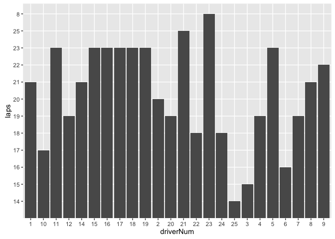
<p class="caption">Raw, unordered bar chart showing lap count against driver</p>
</div>

Q> ###What, if anything, is wrong with these charts?
Q> In both charts, the values on the x-axes are arranged in "alphabetical" rather than numerical order. In the case of driver number, this may make sense (the driver number is essentially an arbitrary, unique categorical label or identifier), but it is a nonsense as far as the position ordering goes.
Q> 
Q> In the laptime chart, the intention behind the x-axis ordering was to order times by position, which does not give us any information within the chart about which driver the time was associated with. (We may, however, get information about the team from the point colour.)
Q> 
Q> It is also worth noting in the laptime chart that the x-axis describes a *discrete* scale, with markers equally spaced horizontally, whereas the y-axis is a *continuous* scale, and where the vertical spacing between points is related to the actual difference in y-value represented by each point.
Q> 
Q> In the lap count chart, the y-axis values are also "alphabetically"" ordered. This really is a nonsense and shows how important it is to check your axis tick mark labels. To make this chart in any way meaningful, we need to ensure that the lap count is treated as a numerical quantity.

Insofar as as chart represents a particular quantity associated with a particular car or driver, what might the most appropriate ranking be? The first decision to take is whether the x-axis values are ordered based on the x-axis values *or the y-axis values*. Here are some possibilities:

* for the laptime chart, the most sensible classification is probably in rank order of position, which is also the rank order of the fastest laptime (the y-axis value);
* for the lap count chart, we could rank by driver number. This arguably made more sense using the numbering scheme that existed prior to 2014, when personal numbers were introduced, because drivers were essentially ranked based on performance of the team in the Constructors' Championship from the previous season and the nominal first driver/second driver ranking within each team). With personal driver numbers the numerical ordering is not really meaningful - the personal driver numbers are qualitative, categorical labels rather than numbers *per se*. A more useful ordering would probably be to order the x-axis values so that the y-values are in height order (that is, by increasing or decreasing lap count), relabeling the x-axis *driverNum* with the corresponding driver's name or identifier.
* we might arrange the bars into groups for each team so we see at a glance how much track time each team had. But if we do that, how do we order the groups, and the bars within each team? Should we dodge them, allowing us to compare drivers within a team? Or stack them, allowing us to more easily compare aggregated team results?

Whenever you have a categorical axis, such as driver identifiers in the case of the lap count chart, it's worth remembering that the ordering is essentially arbitrary, although some orderings may be more meaningful than others in terms of the semantic relationships between the different categorical values. For example, how might we group, or order drivers? Previous world champions vs rookies vs others is another possible grouping; and so on. Team members group well, but how should we order the teams? Or the drivers within a team? Different ordering choices may also help you see different patterns or structures within the data.

If we inspect the structure of the data, we see that the `pos` column is indeed identified as a character type, as are the `laps` and `driverNum` columns:


```r
str(dbGetQuery(f1, ("SELECT * FROM p1Results LIMIT 5"))[c('pos','laps','driverNum')])
```

```
## 'data.frame':	5 obs. of  3 variables:
##  $ pos      : chr  "1" "2" "3" "4" ...
##  $ laps     : chr  "11" "14" "17" "21" ...
##  $ driverNum: chr  "3" "4" "7" "5" ...
```

A> ## Constructing Charts With *ggplot*
A>
A> The `ggplot2` package, written by Hadley Wickham, is an implementation of Leland Wilkinson's *The Grammar of Graphics*. The grammar allows charts to be constructed as a series of mappings from data variables onto visual variables. By overlaying different layers onto a chart, data from one - or more - datasets can be used in the construction of a single chart. For a good introduction to The Grammar of Graphics, see Hadley Wickam's 2010 paper [*A layered grammar of graphics*, Journal of Computational and Graphical Statistics 19(1) pp.3-28](http://vita.had.co.nz/papers/layered-grammar.html)

If we recast the position to an integer, the laptime chart can be represented more intuitively (we can also take the opportunity to tidy up the chart labels and add a title to the chart itself):


```r
dd$pos=as.integer(dd$pos)

g=ggplot(dd)+geom_point(aes(x=pos,y=time,col=team)) 
g=g+xlab('Position')+ylab('Time (s)')

#Add in a chart title
g=g+ggtitle('F1 Malaysia, 2012: FP1 Laptimes')
# We can set the title of the legend, or remove it, as in this case.
# Note the default ordering in the legend is alphabetical and a default
# colour palette is used.
g=g+ guides(fill=guide_legend(title=NULL))
g
```

<div class="figure">
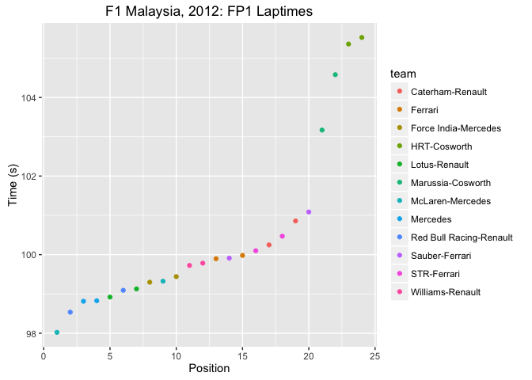
<p class="caption">Labelled chart showing laptimes against ranked position</p>
</div>

By eye, we can identify several different groupings in the data. Let's add some guide lines to the chart to separate out the groups: the first two cars are clear of cars in positions 3 to 10; cars 11 to 18, or perhaps 11 to 20 are in a group of their own, and then the four backmarkers are way off the pace.


```r
g2=g+geom_hline(yintercept=98.65,col='grey')
g2=g2+geom_hline(yintercept=99.6,col='grey')
g2=g2+geom_hline(yintercept=100.7,col='grey')
g2=g2+geom_hline(yintercept=101.3,col='grey')
g2
```

<div class="figure">

<p class="caption">Annotated chart showing laptime against ranked position, with horizontal "separation bars"" added manually</p>
</div>

One thing we might want to think about it how to identify clusters more reliably/algorithmically; but for now, we'll rely on making manual annotations.

Another way of viewing the same data is to look at the lap times in terms of the percentage they are over the fastest laptime. This allows us to make comparisons across sessions within a particular race weekend, where conditions may change day to day, or across races, where individual laptimes may differ significantly depending on the length and character of the circuit. The 107% value is meaningful in the sense of F1 regulations, because if a car does not record a time within 107% of the first placed car in qualification, it does not automatically qualify for the actual race.


```r
dd$percent=100*dd$time/min(dd$time)
g = ggplot(dd) + geom_point(aes(x=pos, y=percent),stat='identity') 
g = g + geom_hline(yintercept=107, col='grey') + ylim(100, 110)
g + xlab('Position') + ylab('Comparison with fastest laptime (%)')
```

<div class="figure">
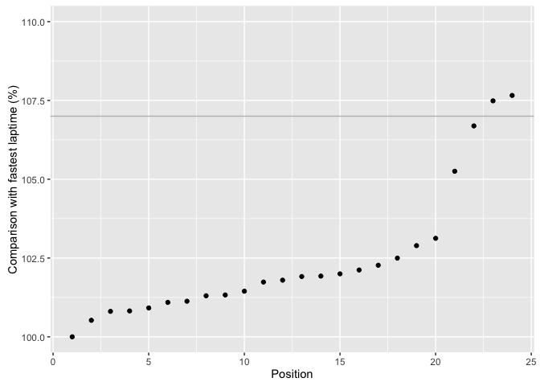
<p class="caption">Laptime shown as a percentage of the fastest lap time, with 107% line added</p>
</div>

To get a clearer view of the time differences between cars, we can look at the difference in time between each car and the car classified one position ahead of it by generating a `delta` column between their lap or gap to leader times. To do this, sort the data by position and then use the `diff()` function to find the lagged difference between consecutive times in the time/position ordered dataframe.


```r
library(plyr)
ddx=dd
ddx=arrange(ddx,pos)
ddx$delta=c(0,diff(ddx$natGap))

head(ddx,n=3)
```

```
##   driverNum   time laps year natGap   gap     race pos       driverName
## 1         4 98.021   19 2012  0.000 0.000 MALAYSIA   1   Lewis Hamilton
## 2         1 98.535   21 2012  0.514 0.514 MALAYSIA   2 Sebastian Vettel
## 3         8 98.813   21 2012  0.792 0.792 MALAYSIA   3     Nico Rosberg
##                      team  natTime  percent delta
## 1        McLaren-Mercedes 1:38.021 100.0000 0.000
## 2 Red Bull Racing-Renault 1:38.535 100.5244 0.514
## 3                Mercedes 1:38.813 100.8080 0.278
```

*The `diff()` function returns a list of differences between consecutive items in a list, which is to say it will return a list of `N-1`  difference values when presented with a list containing `N` items. We return a list of difference values containing `N` items by prepending the actual difference list with a coventional first value of 0. That is, we assume that a zero difference time is associated with the first item of the list. Another convention would be set it as `NA`.*

We can now plot these values as a bar chart, adding a line that helps us identify deltas of more than a quarter of a second, for example, between cars.


```r
g = ggplot(ddx) + geom_bar(aes(x=pos,y=delta),stat='identity') 
g = g + geom_hline(yintercept=0.25, col='grey')
g + xlab('Position') + ylab('Lap delta from car ranked one position ahead (s)')
```

<div class="figure">
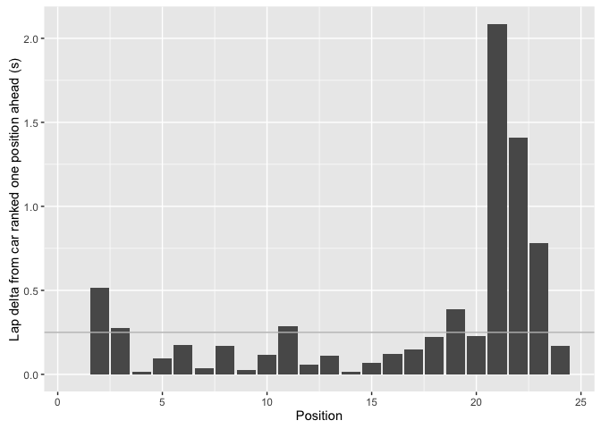
<p class="caption">Laptime deltas between consecutively ranked cars</p>
</div>

The guide line clearly shows those cars that are witin a quarter of a second of each other. Using a `color` aesthetic, it would also be possible to use colour to highlight cars whose best laptimes were within - or outside - a particular threshold value compared to the car classified one position ahead.

Note the way that *ggplot* constructs the chart by adding each consecutive element as a higher layer in the chart. If we want the horizontal line *below* the bars, we can simply reorder the way in which we add the layers to the chart. Let's also colour the outer edge of the bars differently depending on whether the delta to the next car is within the 0.25s boundary or not.


```r
g = ggplot(ddx) + geom_hline(yintercept=0.25, col='grey') 
g + geom_bar(aes(x=pos, y=delta, col=factor(delta<0.25)), stat='identity')
```

<div class="figure">
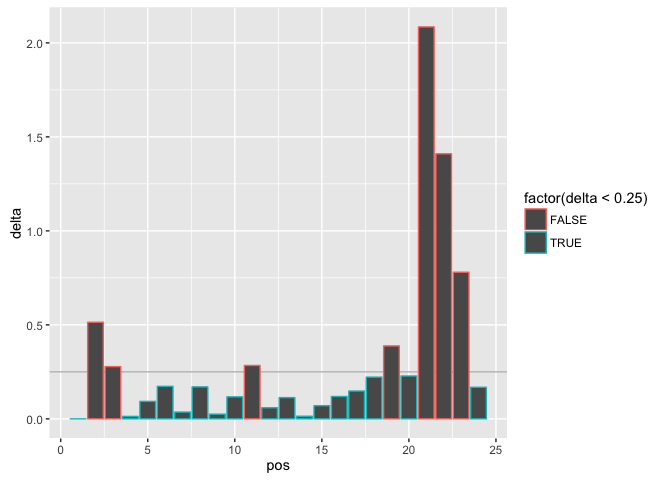
<p class="caption">Lap delta bar chart with coloured bar edges</p>
</div>

Returning to the laps count, how might we more correctly render that? Recall, the `laps` count wasn't being correctly rendered as a number, and we also needed to find a way to sort the x-axis values on the basis of the corresponding y-axis value. In the following example, we sort in terms of decreasing lap count.


```r
dd$laps = as.integer(dd$laps)
g = ggplot(dd) + geom_bar(aes(x=reorder(driverName,-laps), y=laps), stat='identity') 
g = g + theme(axis.text.x = element_text(angle = 45, hjust = 1))
g
```

<div class="figure">
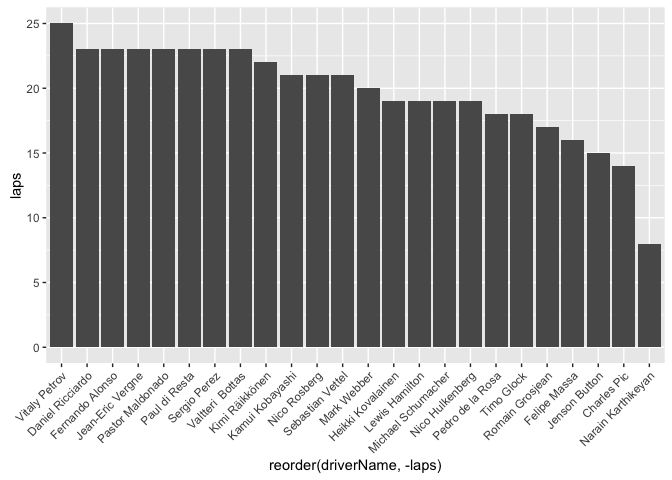
<p class="caption">Lap count bar chart ordered by lap count</p>
</div>

We can also rotate the chart to provide a horizontal bar chart view, which is arguably easier to read in this case.


```r
g + coord_flip() + xlab(NULL) +ylab('Number of laps')
```

<div class="figure">
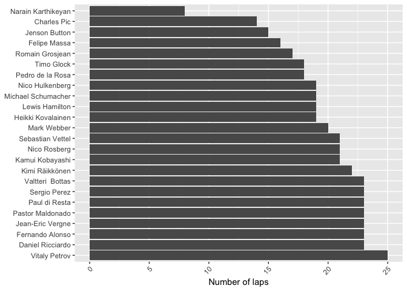
<p class="caption">Horizontal bar chart, with the original x/y axis labels flipped too</p>
</div>

Note how we can add additional transformations to the chart object without having to rebuild the chart from scratch.

In terms of looking for meaning in this chart, we might look to see how many laps the top 5 cars by laptime completed. We can highlight the drivers classified in the top 5, adopt a clean, minimal theme and then suppress the legend.


```r
#In part via http://stackoverflow.com/a/12910865/454773
dd[["top5"]] = ifelse(dd$pos <= 5, "top5", "notTop5")
g = ggplot(dd)
g = g + geom_bar(aes(x=reorder(driverName,-laps), y=laps, fill=top5), stat='identity')
g = g + coord_flip()+xlab(NULL) + ylab('Laps')
g = g + scale_fill_manual(values = c("top5" = "darkblue", "notTop5" = "lightgrey")) 
g + theme_classic() + theme(legend.position="none")
```

<div class="figure">
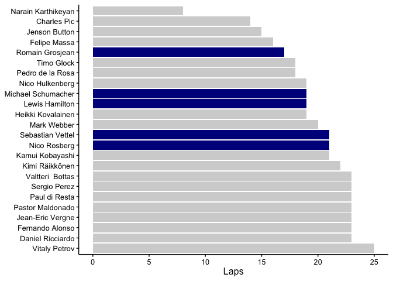
<p class="caption">Styled horizontal bar chart with top 5 ranked drivers highlighted</p>
</div>

If we want to compare the number of laps by team, we can group the bars on that basis. Prior to 2014, we could use driver number to identify which driver was the "first" driver in a team and which driver was the second ranked driver and then order drivers within teams on that basis. One way to do this for the current season might be to nominate the driver who was classified highest in the previous year's Drivers' Championship as the "first driver" within a team (with rookies being ranked lowest and a strategy for numbering drivers in teams with two rookies). In the chart below, it is ambiguous which driver corresponds to which bar within each team. For visual clarity, it might make sense to order the bars within each group in ascending order:


```r
#Order the driverName used for grouping within each team by number of laps
dd$driverName=reorder(dd$driverName,dd$laps)

g = ggplot(dd)
g = g + geom_bar(aes(x=team, y=laps, group=factor(driverName)),
                 stat='identity', fill='grey', position='dodge')
g = g + theme(axis.text.x = element_text(angle = 45, hjust = 1))
g + xlab(NULL) + ylab('Number of laps')
```

<div class="figure">
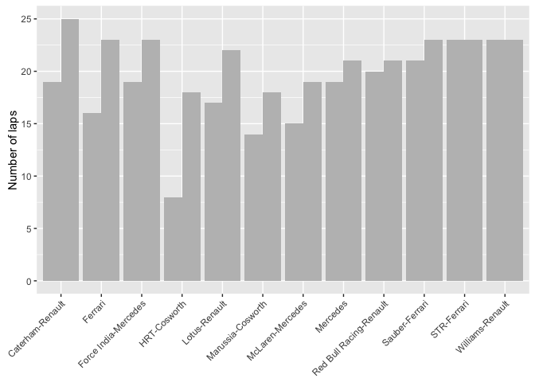
<p class="caption">Dodged bar chart showing lap count for drivers grouped by team</p>
</div>

To view the total number of laps by team, we can stack the bars, perhaps ordering the chart by the total number of laps completed by the team. *To order the bars by __descending__ total lapcount, rather than __increasing__ total lapcount, simply reorder by `-laps` rather than `laps`.*


```r
g = ggplot(dd)
g = g + geom_bar(aes(x=reorder(team, laps), y=laps),
                 stat='identity', fill='grey', position='stack')
g = g + theme(axis.text.x = element_text(angle = 45, hjust = 1))
g + xlab(NULL) + ylab('Laps')
```

<div class="figure">
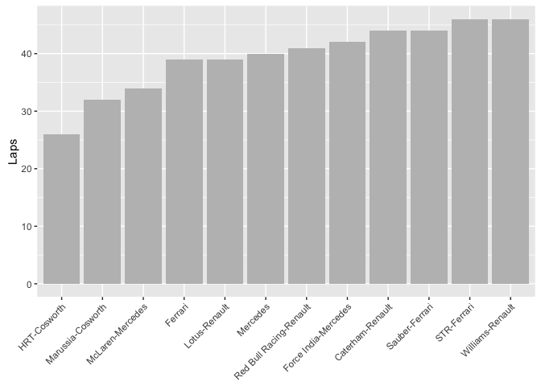
<p class="caption">Stacked bar chart showing total lap count by team</p>
</div>

As you might imagine, if we had a single dataframe containing the number of laps completed by drivers from each team from across several practice sessions, we could use this sort of chart to display the total number of laps of running achieved by each team throughout practice.

Let's flip back again to the laptimes chart: how else might we try to identify not only the gap between drivers, but also their positions, by driver name? One way is to use a horizontal x-axis that identifies the laptime, and then place a marker for each driver, identifying them by name. This essentially reduces the data to a single dimension data set. In the chart below, we space driver names and markers according to lap time. Note how we rotate the driver names to make the chart more readable as well explicitly indicating the relative laptimes.


```r
g = ggplot(dd) + geom_point(aes(x=percent, y="Time"))
g = g + geom_text(aes(x=percent, y="Name", label=driverName), angle=90, size=3)
g + theme_classic() + xlab('Lap time relative to fastest lap (%)') + ylab(NULL)
```

<div class="figure">
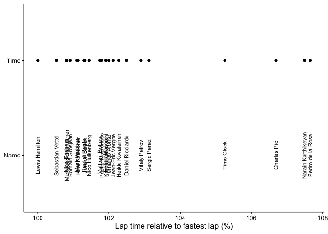
<p class="caption">Chart showing separation of lap times</p>
</div>

Whilst there are some problems with this chart (for example, some occlusion of overlapping names) the linear dot plot highlights just how close the drivers are to each other in terms of lap time. 

X> ### Comparing Team Performances
X> How would you modify the above chart to display the team names rather than driver names, organising the names using a vertical rather than horizontal profile? Can you think of a way of making the names more readable?
X> Where laptimes are so close to each other that they merge into each other, how might you more clearly distinguish between marks that overlap each other?

We can use team names rather than driver names by setting the text label to the `team` column. To rotate the chart, we can use `coord_flip()`, and also remove the label rotation within the `geom_text()` element.

One way of making the names more readable is to split the data into separate columns, for example putting cars placed in odd numbered positions in one column and those placed in even numbered columns in a second column. To cope with overlapping symbols that mark out the time points, we might use a different symbol type, such as an unfilled or empty circle.


```r
#Basic dot plot - shape=1 is an empty circle
#See for example: http://www.cookbook-r.com/Graphs/Shapes_and_line_types/
g=ggplot(dd) + geom_point(aes(x=time,y="Time"),shape=1)
#Split the drivers into two groups - odd position number and even position number
#Use each group as a separate y-axis categorical value
g = g + geom_text(data=subset(dd, subset=(pos %% 2!=0)),
                  aes(x=time, y="1,3,5,...", label=team), size=3)
g = g + geom_text(data=subset(dd, subset=(pos %% 2==0)),
                  aes(x=time, y="2,4,6,...", label=team), size=3)
#Tweak the theme
g = g + theme_classic() + ylab(NULL) + xlab('Laptime (s)')
#Add in some intercept lines using the values we used before
g = g + geom_vline(xintercept=98.65, col='grey')
g = g + geom_vline(xintercept=99.6, col='grey')
g = g + geom_vline(xintercept=100.7, col='grey')
g = g + geom_vline(xintercept=101.3, col='grey')
#Flip the co-ordinates
g=g+coord_flip() 
g
```

<div class="figure">
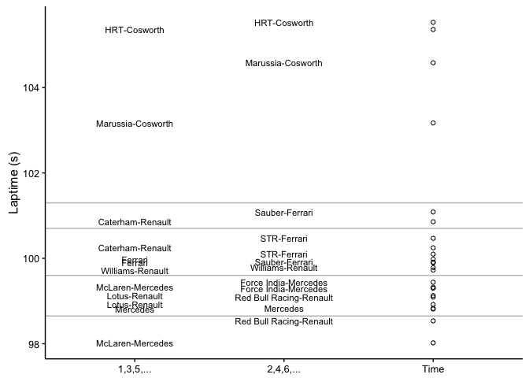
<p class="caption">Flipped and dodged chart showing separation of lap times</p>
</div>

If team names are close to each other on a horizontal line or vertically, then those cars are close in terms of time, even if not directly next to each other in terms of position. By using an empty circle rather than a filled circle to identify the lap times, we can more clearly see very close laptimes. We might even further distinguish between times associated with the dodged left-hand and right-hand labels using different symbol types.

Once again, the grouping elements are also emphasised by visual proximity, something we can additionally reinforce using the grey splitter lines. Although the grouping is to some extent arbitrary, it may be useful as a storytelling or journalistic device.

Note that another way of dodging the names might be to assign drivers in the same team to different columns, although we would have to decide on what basis to put a particular driver into a given column.

Something else that jumps out from this particular example is that the team names are actually a combination of the manufacturer and engine supplier. (Where the name is not hyphenated the manufacturer *is* the engine supplier, as in the case of Ferrari and Mercedes). This suggests we can generate two additional data columns: *car manufacturer*, which is what we typically think of as the team name; and *engine supplier*.


```r
#For each row, split the team name on a '-' 
#and take the last item in the resulting list
dd=ddply(dd,
         .(driverName),
         mutate,
         engine = tail(strsplit(team,'-')[[1]], n=1) )

head(dd,n=3)
```

```
##   driverNum    time laps year natGap   gap     race pos         driverName
## 1        23 105.360    8 2012  7.339 7.339 MALAYSIA  23 Narain Karthikeyan
## 2        25 104.580   14 2012  6.559 6.559 MALAYSIA  22        Charles Pic
## 3         3  99.323   15 2012  1.302 1.302 MALAYSIA   9      Jenson Button
##                team  natTime  percent    top5   engine
## 1      HRT-Cosworth 1:45.360 107.4872 notTop5 Cosworth
## 2 Marussia-Cosworth 1:44.580 106.6914 notTop5 Cosworth
## 3  McLaren-Mercedes 1:39.323 101.3283 notTop5 Mercedes
```

We can quickly count how many teams run each engine. First, identify the unique engine/team combinations:


```r
engineTeams = unique(dd[, c('engine','team')])
engineTeams
```

```
##      engine                    team
## 1  Cosworth            HRT-Cosworth
## 2  Cosworth       Marussia-Cosworth
## 3  Mercedes        McLaren-Mercedes
## 4   Ferrari                 Ferrari
## 5   Renault           Lotus-Renault
## 8   Renault        Caterham-Renault
## 10 Mercedes                Mercedes
## 11 Mercedes    Force India-Mercedes
## 12  Renault Red Bull Racing-Renault
## 13  Ferrari          Sauber-Ferrari
## 17  Ferrari             STR-Ferrari
## 20  Renault        Williams-Renault
```

Then count the number of occurrences of each engine:


```r
#Use the plyr count() function
count(engineTeams, 'engine')
```

```
##     engine freq
## 1 Cosworth    2
## 2  Ferrari    3
## 3 Mercedes    3
## 4  Renault    4
```

We can also generate a summary report of the total, mean (average) and median number of laps completed by each car running each engine type:


```r
ddply(dd, .(engine), summarise,
      totLaps = sum(laps), meanLaps = mean(laps), medianLaps = median(laps))
```

```
##     engine totLaps meanLaps medianLaps
## 1 Cosworth      58 14.50000       16.0
## 2  Ferrari     129 21.50000       23.0
## 3 Mercedes     116 19.33333       19.0
## 4  Renault     170 21.25000       21.5
```

Let's also make use of the engine type to colour our laptime ordering chart. In addition, tidy up the x-axis by removing the ticks and the tick labels.


```r
#Basic dot plot
g=ggplot(dd) + geom_point(aes(x=time,y="Time"),shape=1)
#Split the drivers into two groups - odd position number and even position number
#Use each group as a separate y-axis categorical value
#Add in an additional colour aesthetic tied to engine type
g = g + geom_text(data=subset(dd, subset=(pos %% 2!=0)),
                  aes(x=time,y="1,3,5,...", col=engine, label=team), size=3)
g = g + geom_text(data=subset(dd, subset=(pos %% 2==0)),
                  aes(x=time, y="2,4,6,...", col=engine, label=team), size=3)
#Tweak the theme
g = g + theme_classic() + ylab(NULL)
#Add in some intercept lines using the values we used before
g = g + geom_vline(xintercept=98.65, col='grey')
g = g + geom_vline(xintercept=99.6, col='grey')
g = g + geom_vline(xintercept=100.7, col='grey')
g = g + geom_vline(xintercept=101.3, col='grey')
#Flip the co-ordinates
g = g + coord_flip()
#Remove the x-axis ticks and tick labels
g = g + theme(axis.ticks.x=element_blank(), axis.text.x=element_blank()) 
g
```

<div class="figure">
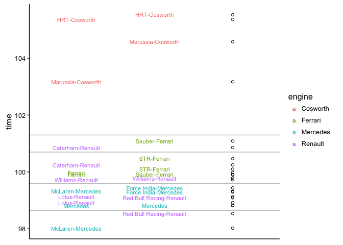
<p class="caption">Highlighting engine manufacturer using the colour dimension</p>
</div>

Although only an informal sort of analysis, our eye suggests that in this case Mercedes and Renault powered cars were competitive with each other, Ferrari powered cars were slightly behind, and the Cosworth powered teams were in a league of their own, though in the wrong direction!

*The black and white print edition of this chart is unfortunately not so informative. Different typographic styles could perhaps help to distinguish between the different engine suppliers.*

X> ### Finding Gaps
X> One of the things the above chart requires is the explicit *manual* placement of the lines that separate identifiable-to-the-eye groupings. It would be nice if we could come up with some sort of heuristic to automatically place these. For example, we might identify gaps between consecutive positions above a particular threshold (using something like a *second* difference value, `ddx$deltadelta = c(0, diff(ddx$delta))` perhaps?) and place a line mid-way through the gap. To prevent grouping singletons, we would also need to count how many cars are in each grouping and perhaps *not* draw a line if there is less than particular number of cars in a group, or the difference between consecutive gaps (a *third difference*, calculated against gap values) falls below some threshold value.
X> Automated class interval identifying clustering techniques such as the *Jenks Natural Breaks* algorithm for partitioning one dimensional datasets.

Hopefully these examples show how even the simplest data tables can be mined to produce a wide variety of different summary reports in both tabular and graphical form.

## Sector Times (Prior to 2015)

As has already been mentioned, whilst the F1 website did provide sector time information from the practice sessions, when the results moved to the FIA website in 2015 the sector times for the practice sessions stopped being published. However, sector times for qualifying and race sessions associated with the current season continue to be made available from the FIA website as well as via the official PDF timing sheets. Consequently, analysis of F1 sector times for the practice sessions is now only possible for previous years using archived data grabbed originally from the F1 website prior to its redesign.

The data in the archived, historical practice session sectors tables contains the sector number, the driver number, their  position in the session classification, their name, and their best recorded sector time in that session.

`dbGetQuery(f1, ("SELECT * FROM p1Sectors LIMIT 5"))`

| sector|race      |driverName         |year |sectortime |driverNum |pos |
|------:|:---------|:------------------|:----|:----------|:---------|:---|
|      1|AUSTRALIA |Jenson Button      |2012 |29.184     |3         |1   |
|      1|AUSTRALIA |Lewis Hamilton     |2012 |29.190     |4         |2   |
|      1|AUSTRALIA |Nico Rosberg       |2012 |29.514     |8         |3   |
|      1|AUSTRALIA |Michael Schumacher |2012 |29.583     |7         |4   |
|      1|AUSTRALIA |Mark Webber        |2012 |29.645     |2         |5   |

As Ricardo Divila writes in *Going with your gut*, his RaceCar Engineering column from June 2014 (p5), *"[s]ectors that repeat are ones without problems for drivers - the ones that vary are the difficult ones and show where car setup problems lie."* Unfortunately, the FIA don't publish the full history of sector times, so this form of insight is not available to us. (Prior to 2014, the free FIA timing app had been a source of scrapeable sector times via third party timing apps that have reverse engineered the live timing data feed. As of the start of the 2014 season, this data seems no longer to be streamed through the free app.)

We work with what we do have, however. Inspecting the structure of the sector time data, we see that not all the columns are typed as naturally as we might like:


```r
str(dbGetQuery(f1, ("SELECT * FROM p1Sectors LIMIT 5")))
```

```
## 'data.frame':	5 obs. of  7 variables:
##  $ sector    : int  1 1 1 1 1
##  $ race      : chr  "AUSTRALIA" "AUSTRALIA" "AUSTRALIA" "AUSTRALIA" ...
##  $ driverName: chr  "Jenson Button" "Lewis Hamilton" "Nico Rosberg" "Michael Schumacher" ...
##  $ year      : chr  "2012" "2012" "2012" "2012" ...
##  $ sectortime: chr  "29.184" "29.190" "29.514" "29.583" ...
##  $ driverNum : chr  "3" "4" "8" "7" ...
##  $ pos       : chr  "1" "2" "3" "4" ...
```

To correct this we need to cast the column types explicitly:


```r
p1sectors=dbGetQuery(f1, ("SELECT * FROM p1Sectors"))
p1sectors$sectortime=as.double(p1sectors$sectortime)
p1sectors$pos=as.integer(p1sectors$year)
p1sectors$pos=as.integer(p1sectors$pos)
str(p1sectors)
```

```
## 'data.frame':	2911 obs. of  7 variables:
##  $ sector    : int  1 1 1 1 1 1 1 1 1 1 ...
##  $ race      : chr  "AUSTRALIA" "AUSTRALIA" "AUSTRALIA" "AUSTRALIA" ...
##  $ driverName: chr  "Jenson Button" "Lewis Hamilton" "Nico Rosberg" "Michael Schumacher" ...
##  $ year      : chr  "2012" "2012" "2012" "2012" ...
##  $ sectortime: num  29.2 29.2 29.5 29.6 29.6 ...
##  $ driverNum : chr  "3" "4" "8" "7" ...
##  $ pos       : int  2012 2012 2012 2012 2012 2012 2012 2012 2012 2012 ...
```

Using the individual sector times, we can calculate the *ultimate lap* for each driver as the sum of their best sector times.

To do this we need to generate the sum of the sector times recorded for each driver in each race of each year.

In pseudo-code, we might imagine a recipe for achieving this sort of operation taking the form:

```
for each year:
  for each race:
    for each driver:
      calculate the sum of the driver's sector times
```

An alternative way to approach the same calculation is to adopt a *split-apply-combine* strategy, as described in *Hadley Wickham, "The split-apply-combine strategy for data analysis", Journal of Statistical Software 40, no. 1 (2011): 1-29*. Using the `plyr` library, we can call on a particular function, `ddply`, that allows us to split a data frame into groups based on the values of one or more columns, and then perform a summarising operation across the members of each grouping.

In this case, we need to split the data into groups corresponding to the data rows associated with each particular driver in each particular race of each year. This should result in three rows for each group, one row for each of the three sectors. The summarising operation we then need to perform is to summarise the data in each group by calculating the sum of the sector times within that grouping.


```r
library(plyr)
ultimate=function(d) {
  ddply(d, c("year","race","driverName"),
        summarise,
        ultimate = sum(sectortime, na.rm=T))
}
ult = ultimate(p1sectors)
```

|year |race      |driverName          | ultimate|
|:----|:---------|:-------------------|--------:|
|2012 |ABU DHABI |Daniel Ricciardo    |  106.490|
|2012 |ABU DHABI |Felipe Massa        |  105.179|
|2012 |ABU DHABI |Fernando Alonso     |  104.313|
|2012 |ABU DHABI |Giedo van der Garde |  124.504|
|2012 |ABU DHABI |Heikki Kovalainen   |  107.317|
|2012 |ABU DHABI |Jean-Eric Vergne    |  106.673|

We can then compare the ultimate laptimes for each driver in a session to the best laptime they recorded in the session. (Note that it may not be possible to drive such an ultimate lap - the best sector time achieved for a particular sector may require taking a line that jeopardises another.)

Let's just check the data we can pull in from the session results tables:


```r
p1results = dbGetQuery(f1, ("SELECT * FROM p1Results"))
p1results$laps = as.integer(p1results$laps)
str(p1results)
```

```
## 'data.frame':	986 obs. of  11 variables:
##  $ driverNum : chr  "3" "4" "7" "5" ...
##  $ time      : num  87.6 87.8 88.2 88.4 88.5 ...
##  $ laps      : int  11 14 17 21 21 22 23 16 8 26 ...
##  $ year      : chr  "2012" "2012" "2012" "2012" ...
##  $ natGap    : num  0 0.245 0.675 0.8 0.907 ...
##  $ gap       : num  0 0.245 0.675 0.8 0.907 ...
##  $ race      : chr  "AUSTRALIA" "AUSTRALIA" "AUSTRALIA" "AUSTRALIA" ...
##  $ pos       : chr  "1" "2" "3" "4" ...
##  $ driverName: chr  "Jenson Button" "Lewis Hamilton" "Michael Schumacher" "Fernando Alonso" ...
##  $ team      : chr  "McLaren-Mercedes" "McLaren-Mercedes" "Mercedes" "Ferrari" ...
##  $ natTime   : chr  "1:27.560" "1:27.805" "1:28.235" "1:28.360" ...
```

### Graphically Comparing Ultimate and Actual Laptimes

One way of comparing the ultimate lap time with actual laptime for each driver in a particular race is to plot the result on to a two dimensional scatterplot. The easiest way to plot this is from a dataframe that contains the data corresponding to the ultimate lap time in one column and the actual laptime in another.

At the moment, we have the data in two separate tables, *ult* and *p1results*. We can merge the data into a single dataframe using the *year*, *race* and *driverName* columns as merge keys:


```r
p1results_merge = merge(p1results, ult, by=c("year","race","driverName"))
head(p1results_merge, n=5)
```

```
##   year      race          driverName driverNum    time laps natGap   gap
## 1 2012 ABU DHABI    Daniel Ricciardo        16 106.649   24  3.364 3.364
## 2 2012 ABU DHABI        Felipe Massa         6 105.567   24  2.282 2.282
## 3 2012 ABU DHABI     Fernando Alonso         5 104.366   21  1.081 1.081
## 4 2012 ABU DHABI Giedo van der Garde        21   0.000    3  0.000 0.000
## 5 2012 ABU DHABI   Heikki Kovalainen        20 107.418   23  4.133 4.133
##   pos             team  natTime ultimate
## 1  17      STR-Ferrari 1:46.649  106.490
## 2  11          Ferrari 1:45.567  105.179
## 3   4          Ferrari 1:44.366  104.313
## 4  24 Caterham-Renault  No time  124.504
## 5  19 Caterham-Renault 1:47.418  107.317
```

We can then plot directly from the merged dataset. Let's take a subset of the data, focusing on the 2012 Australian Grand Prix:


```r
gp_2012_aus_p1_results = subset(p1results_merge,year=='2012' & race=="AUSTRALIA")
#Remove the year and race columns from the display
```

     driverName          driverNum       time   laps   natGap      gap  pos   team                natTime     ultimate
---  ------------------  ----------  --------  -----  -------  -------  ----  ------------------  ---------  ---------
25   Bruno Senna         19            89.953     21    2.393    2.393  14    Williams-Renault    1:29.953      89.832
26   Charles Pic         25           100.256     11   12.696   12.696  22    Marussia-Cosworth   1:40.256      99.901
27   Daniel Ricciardo    16            88.908     23    1.348    1.348  7     STR-Ferrari         1:28.908      88.701
28   Felipe Massa        6             90.743     11    3.183    3.183  18    Ferrari             1:30.743      90.212
29   Fernando Alonso     5             88.360     21    0.800    0.800  4     Ferrari             1:28.360      88.360
30   Heikki Kovalainen   20            90.586     16    3.026    3.026  17    Caterham-Renault    1:30.586      90.494


```r
library(ggplot2)
ggplot(gp_2012_aus_p1_results) + geom_point(aes(x=time, y=ultimate))
```

<div class="figure">
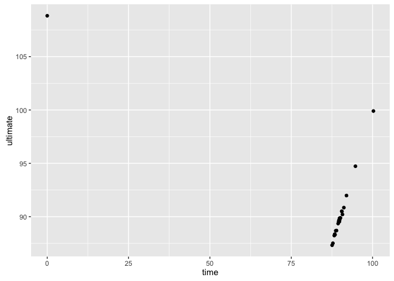
<p class="caption">Raw scatterplot showing ultimate versus actual laptime for each driver</p>
</div>

So what's wrong with this chart? Two things immediately come to mind. Firstly, there is an outlier that skews the lower limit of the horizontal *x-axis*: one of the drivers appears not to have a session time recorded. Unfortunately, which don't know which driver this time occurs for, which leads to the second problem: which point corresponds to which driver? 

One way of addressing the outlier problem is to filter out drivers for whom no time is recorded in the session (if they do record a time, they will also necessarily have separate sector times, and hence an ultimate laptime, recorded). We can also check that the time is not recorded as absent, that is, as `NA`.


```r
gp_2012_aus_p1_results = subset(gp_2012_aus_p1_results, time>0 & !is.na(time) )
```

To address the other issue, that of not knowing which driver each point refers to, we can instead use a text plot. This requires using an extra aesthetic parameter, `label`, that identifies which column's values should be displayed as the text label for each plotted marker.


```r
g = ggplot(gp_2012_aus_p1_results, aes(x=time, y=ultimate, label=driverName))
g + geom_text()
```

<div class="figure">

<p class="caption">Raw text plot showing ultimate vs best laptime for each driver by name</p>
</div>

As a finished product, this chart obviously has some issues: the labels are large, and overlap, making them, and their registration point (that is, the co-ordinate value they are located at) unclear; the labels also overflow the chart's plotting area; and so on. However, as a quick, preliminary sketch, it does provide us with something we can start to work with and gain information from.

So for example, the chart suggests that the ultimate times broadly follow the session times, which makes sense. However, it's virtually impossible to tell whether a driver's session time matched their ultimate time, or whether it was some way away from it. Several factors contribute to this lack of clarity:

* we can't tell what is being used as the registration point for each label - that is, which part of the label marks the `(time, ultimate)` co-ordinates.
* the length of the labels covers a wide range. If the registration point is the mid-point of the label, where is that exactly?
* the font size used for the labels is quite large, meaning that labels obscure each other;
* the name labels have overflowed the plotting area;
* some of the labels appear to fall outside the area displayed by the chart, making them difficult to read;
* it's hard to tell where the line corresponding to equal ultimate and session laptimes lies. The grid is probably too coarse grained to be able to take accurate measurements for each marker, even if we could tell where the registration point is.

Let's work through the problems one at a time. *ggplot* supports layering in plots, with the layer order determined by the order in which layers are added to the plot. By default, the first layer is the lowest layer, the last layer the highest. We can mark the registration point using a `geom_point()` layer.

Let's add the point *underneath* the corresponding label. This means adding the `geom_point()` to a lower level than the `geom_text()` by adding it to the *ggplot* chart *before* the `geom_text()`. To make things easier to read, we might also reduce the size of the text labels.

Whilst we could identify the values to be used as *x* and *y* aesthetics in each layer, we can also declare them in the base plot and allow their values to be inherited by the chart layers

We can also assign the plot to a variable, and build it up a layer at a time, before plotting the final compound chart.


```r
g = ggplot(gp_2012_aus_p1_results, aes(x=time, y=ultimate))

#Add the points layer
g = g + geom_point()

#Add the text layer on top of the chart
g = g + geom_text(aes(label=driverName), size=3)

#Plot the chart
g
```

<div class="figure">
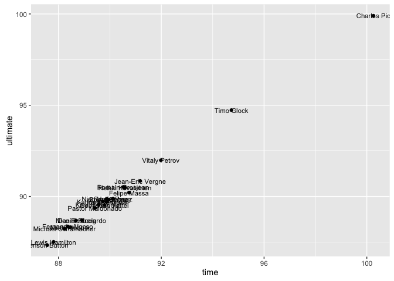
<p class="caption">Ultimate vs actual laptime with point and text label layers</p>
</div>

A> ## Interactive Charts
A>
A> Interactive charts provide one way of getting around certain layout issues by allowing the user to select or highlight particular areas of the chart or elements within it in order to display additional information, such as x/y co-ordinate values for a selected point.
A> Interactive Javascript charts can be produced from a variety of R packages such as [rCharts](http://rcharts.io/) or [HTMLWidgets](http://www.htmlwidgets.org/), but they will not be described further within this book...

To find the line on which the best laptime *equals* the ultimate laptime, we need to draw a line x=y. In ggplot, we can use a `geom_abline()` to draw such a line. By default, the colour of the line is black, but that will dominate the chart somewhat so I am going to give it a grey colour. The `expand()` argument to `scale_x_continuous()` provides multiplicative and additive expansion constants that allow the text labels to be placed some distance away from the chart's axes.


```r
g + geom_abline(col='grey') + scale_x_continuous(expand=c(0,2))
```

<div class="figure">
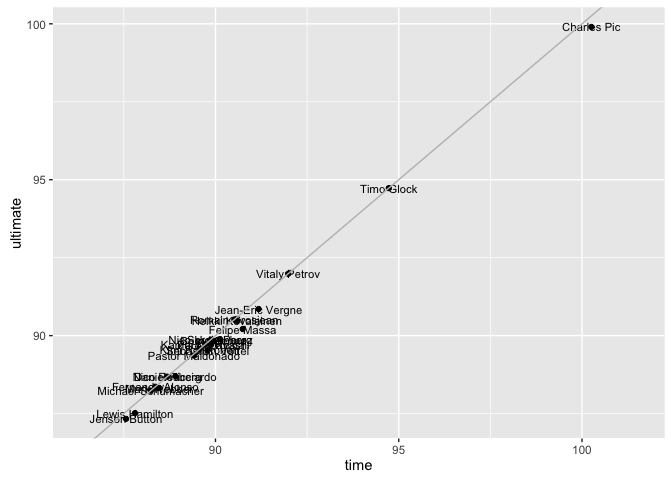
<p class="caption">Addition of line showing equivalent ultimate and actual laptimes</p>
</div>

Note that this line is added in the layer *above* the previous chart elements, so the line will be placed *on top of* the marked points. If we want the *geom_point()* elements to sit on top of the equivalence line, we need to add the *geom_point()* layer to the chart *after* the *geom_abline()* component.

It may seem picky, but it's important to take care when reading a chart so that you read it as you intended. This is one of the great challenges of data visualisation - producing charts that have what we might term a "natural reading" that is makes sense 'at a glance' and doesn't catch out the unwary reader. 

In the above example, it may make sense to think of the best laptime as equaling or *falling short* of the ultimate laptime. If the point lies on the equivalence line, the laptime equals the the ultimate time. So how do we read this chart to find how far off the ultimate time a particular laptime was?

Consider this example - laptime = 100, ultimate time =95.

Would the chart be any easier to interpret if we were to swap the axes, so that the `ultimate` time was reported along the horizontal *x-axis* and recorded times on the vertical *y-axis*? Which provides the most "natural" reading?

#### Improving the Readability of the Ultimate vs. Actual Laptime Chart

The close times, both ultimate and actual, that are recorded for each of the drivers makes the chart difficult to read as the driver name labels overlap and occlude each other. The `ggrepel` add-on to `ggplot2` provides a new function, `geom_text_repel()` that allows labels to *repel* each other so that they don't overlap. Short line segments connect the each label to its *registration point* (that is, the x/y co-ordinate it would ordinarily be located at).


```r
#At the time of writing, the pacckage needs to be installed from github
#install.packages("devtools")
#devtools::install_github("slowkow/ggrepel")
library(ggrepel)

g = ggplot(gp_2012_aus_p1_results, aes(x=time, y=ultimate))
#Add the points layer
g = g + geom_point()

#Add a dodged text layer on top of the chart
g + geom_text_repel(aes(label=driverName), size=3)
```

<div class="figure">
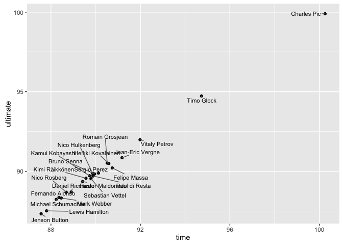
<p class="caption">Using the ggrepel library to avoid text label overlaps</p>
</div>

Whilst it is easy to label every point in a chart, and tools such as `geom_text_repel()` allow us to avoid the problem of overlapping labels, text plot charts can soon become cluttered, particularly if there is a large number of points or labelled points are close to each other. In some cases, it may make sense to only label points that we are interested in, or that have an interesting property or feature associated with them. For example, if we are looking for drivers that have missed their ultimate laptime by a considerable margin, having labels for *each* driver displayed confuses the view.How about if instead we just label the drivers who miss the ultimate laptime by more than a specified amount, such as a two or three tenths or more?


```r
g = ggplot(gp_2012_aus_p1_results, aes(x=time, y=ultimate))
#Add a line to show where the actual and ultimate times are equivalent
g = g + geom_abline(col='grey')
#Mark each laptime on the layer above that equivalence line
g = g + geom_point()
#Add the text layer on top of the chart for drivers that miss their ultimate
#laptime by at least 0.3s
#We can also reduce the size of the text label a little
g = g + geom_text(data=subset(gp_2012_aus_p1_results, (time-ultimate)>=0.3),
                  aes(label=driverName), size=3)
g = g + xlab('Laptime (s)') + ylab('Ultimate laptime (s)')
#Extend the x axis limits to prevent labels at the extremes overflowing
tmp.x = gp_2012_aus_p1_results$time
g + scale_x_continuous(limits=c(min(tmp.x)-1, max(tmp.x)+1))
```

<div class="figure">
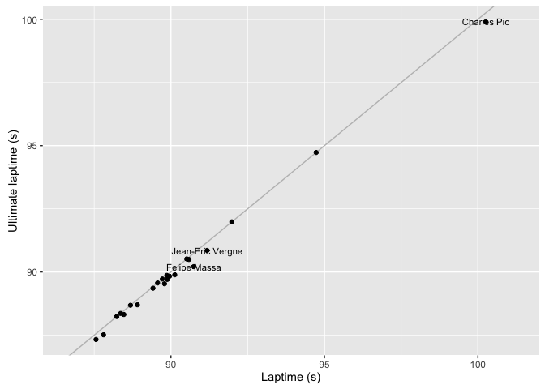
<p class="caption">Highlighting drivers more than 0.3s away from their ultimate laptime</p>
</div>

In addition to using times for the x and y axes, we could also plot rankings, where the axis marks are discretely spaced rather than plotted against a continuous number line. Within a particular class of laptime, such as the ultimate time, we might even plot the ultimate rank on one axis against the ultimate laptime on the other, providing yet another view on to how drivers compared in their ultimate lap performances.

*`ggplot2` is a very flexible charting library, supporting a range of co-ordinate transformations that can be used to create a wide variety of chart types. For example, if you are feeling adventurous, you could try plotting a radar chart showing team ranking for each sector, perhaps inspired by this post on
[creating “radar chart” (a.k.a. star plot; spider plot) using ggplot2 in R](http://stackoverflow.com/questions/9614433/creating-radar-chart-a-k-a-star-plot-spider-plot-using-ggplot2-in-r) on Stack Overflow.*

As well as exploring alternative chart types, we can also generate a range of other reference laptimes against which we can compare performances. For example, setting:


```r
r=gp_2012_aus_p1_results
```

we can generate:

* the best overall session laptime, `min(r$time)`: 87.56;
* the best overall session laptime in a team, `min(r[r$team=='Williams-Renault',]$time)`: 89.415;
* the best ultimate lap in a team: `min(r[r$team=='Williams-Renault',]$ultimate)`: 89.358;

If we go back to the original textualisation data, we can calculate yet more reference times, although this may require joining one data set with another, either by merging datasets in R, or by using more complex queries onto the original database.

For example, we might look for the ultimate lap for a team (based on the best recorded sector times across a team) or the ultimate session lap, based on the best sector times recorded across all drivers.

## Summary

In this chapter, we have started to explore a wide range of summary reports on the practice sessions. For example, we have generates scatterplots showing laptimes against classification rank and vertical and horizontal bar charts to show laptime differences between consecutively classified cars. We have also started to look at the generation of novel custom charts, such as the charts that depict laptime differences relative to the fastest lap in a session, or the charts that start to explore team performance.

An analysis of best sector times allows to ask whether each driver managed to drive their ultimate lap during a session, or whether their performance fell short of it and they left time on the track, to mix metaphors! Unfortunately, as of the start of the 2015 season, sector times for F1 practice sessions are no longer available, so we must limit our sector time based analyses to just the qualifying and race sessions.

Stylistically, many of the charts still appear to have low production values - labels overlap or even overflow a chart's borders. In the following chapters, you will see several strategies for overcoming these failings and improving not only the visual attractiveness of similar charts, but also their readability and usefulness.
