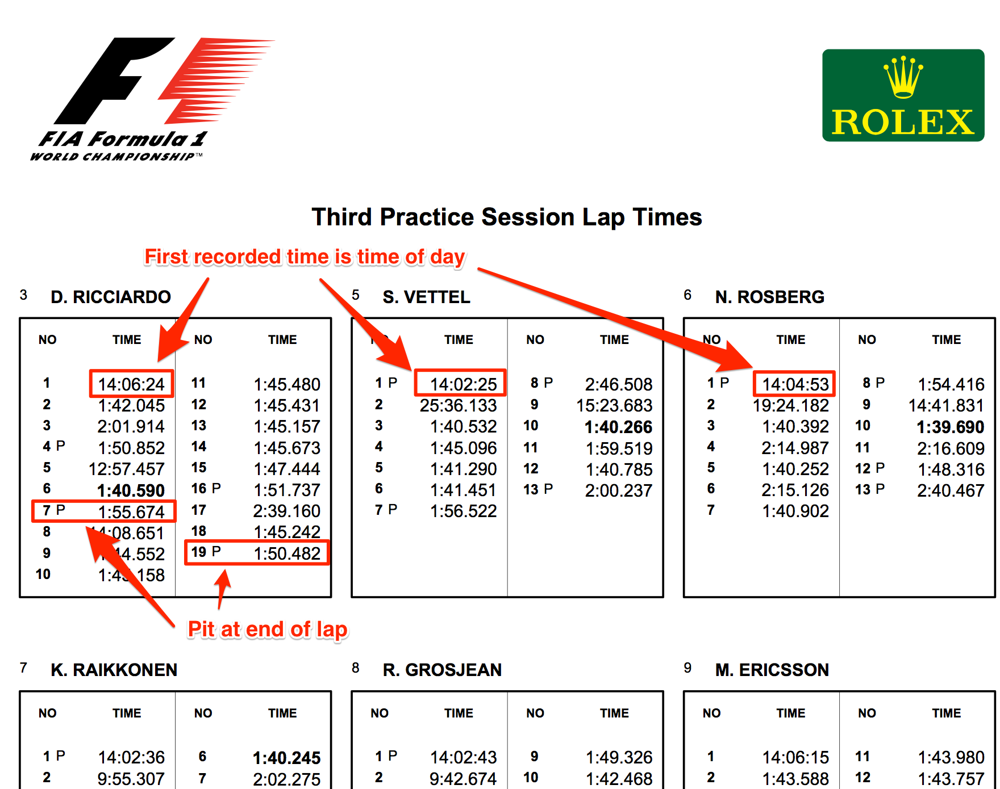
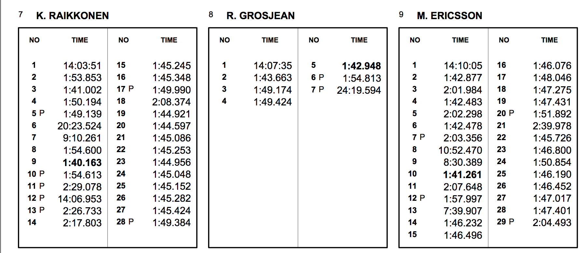
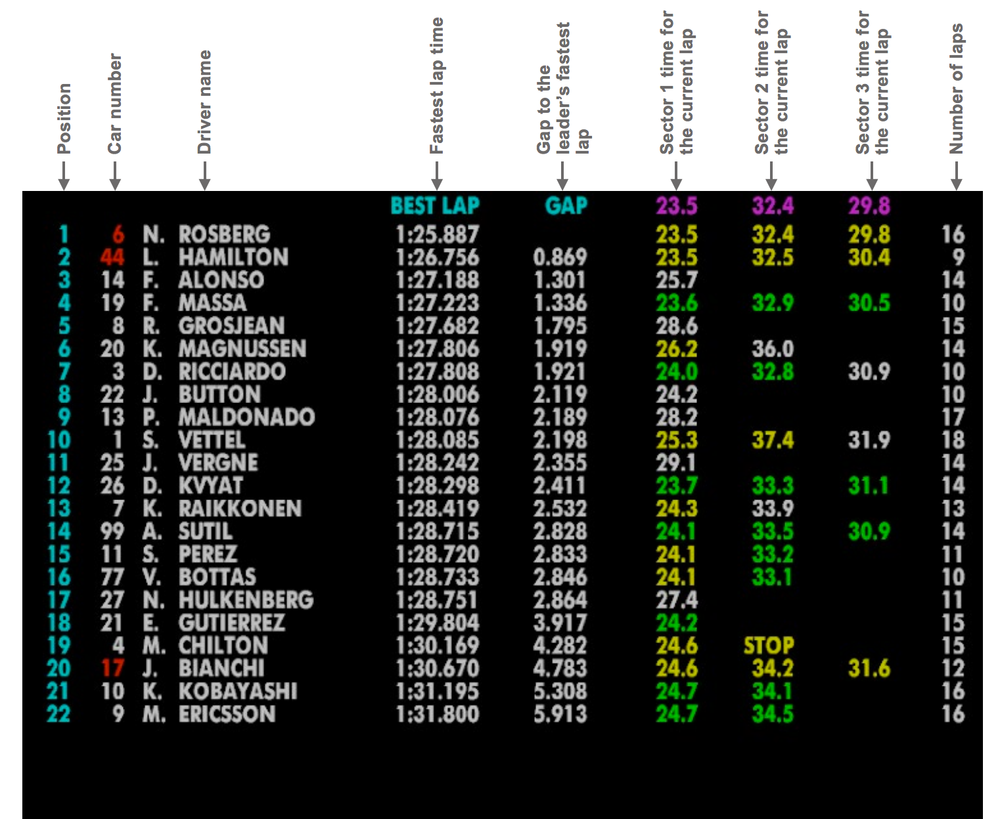
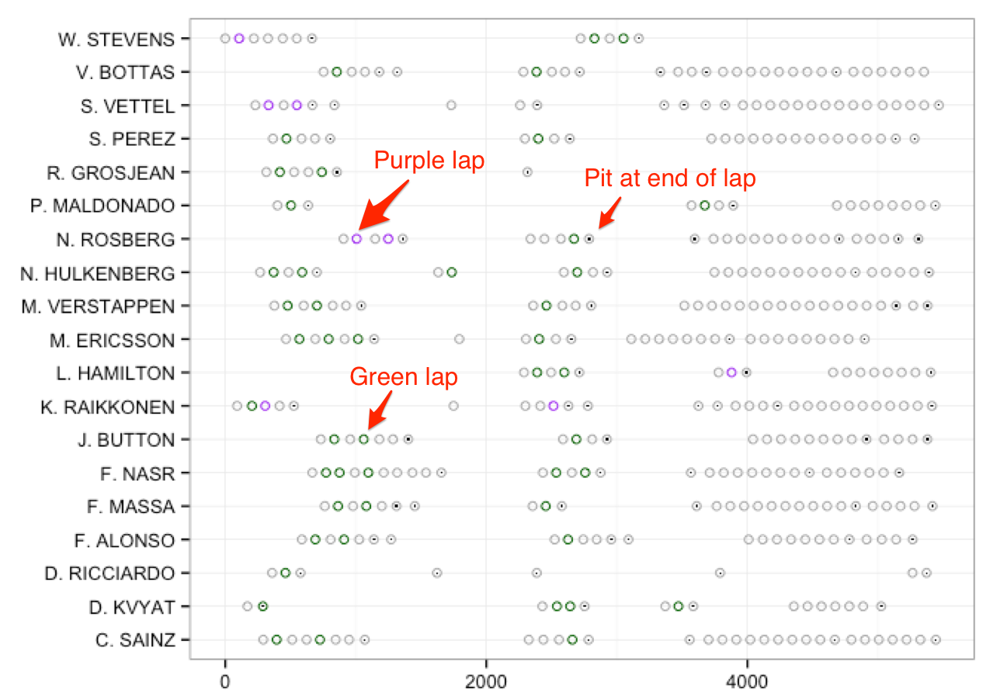
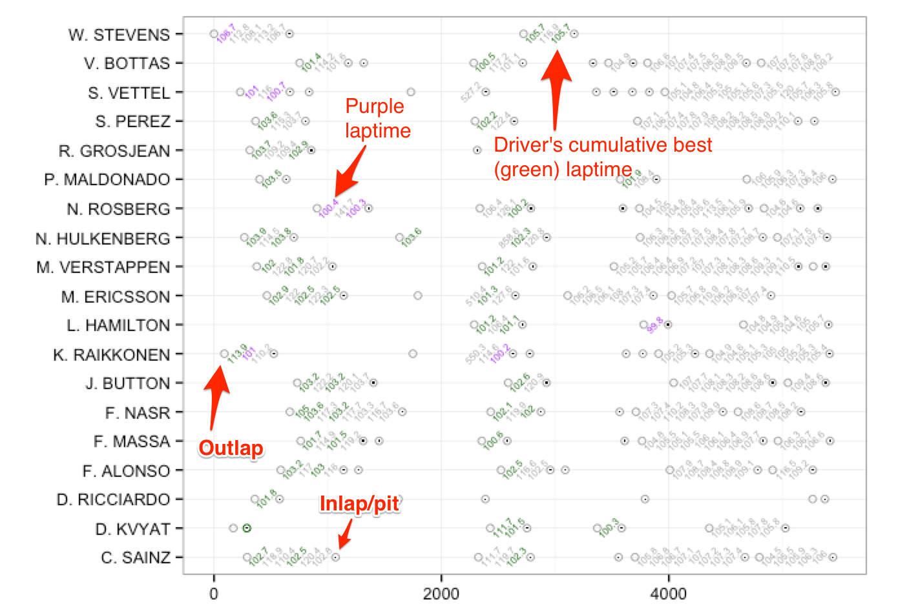

---
output:
  html_document:
    keep_md: yes
---
```{r setup, echo = F, message=F}
require(knitr)
opts_chunk$set(fig.path = "images/practiceutil-")
```

# Practice Session Utilisation

For the teams, the three practice sessions that open up a race weekend provide an opportunity to set the car up for the weekend. For the data junkie, timing sheets published by the FIA provide details of all the laptimes recorded by each driver. Using this data, we can chart the extent to which each driver made use of the session, perhaps start to generate some sort of performance model from their long run laptimes, and look at how well each driver's laptimes compare to their ideal lap for the session.

*Unfortunately, practice session laptimes are not published in a convenient form __as data__. Instead, the data must be scraped from the FIA timing sheets, either using a custom written scraper, or a PDF data scraping tool such as [PDFTables (online service)](https://pdftables.com/) or [Tabula (free/open source desktop tool)](http://tabula.technology/).*

On the practice session timing sheets, the first "laptime" is actually the time of day the driver completed their first lap of the session.



If we find the earliest recorded time during the session, we can use it as a zero basetime against which to record the time into the session at which each laptime was recorded. That is, we take the time of day recorded by the driver who first recorded a laptime during the session (even if that was just a sighting lap from which they returned straight to the pits) as a baseline session time of 0 and then calculate all other start times relative to that. When talking about *time into the session*, this is relative to the baseline time, *rather than the time the lights went green on the session* (that data does not appear in the timing sheets).

A PDF scraper can be used to extract timing data from the session laptimes timing sheet ([example data file](https://gist.githubusercontent.com/psychemedia/11187809/raw/f12015test.csv)). We can then present the data in the following form:

```{r}
#Data available at:
#https://gist.githubusercontent.com/psychemedia/11187809/raw/f12015test.csv
ptimes = read.csv("f12015test.csv")
```

```{r echo=FALSE}
kable(head(ptimes),format='markdown')
```

The `lapNumber` is the lap count within the session for each driver; the `laptime` is the laptime in minutes,  seconds and milliseconds *apart from the first time recorded for each driver*, which is the time (in hours, minutes, seconds) relative to the time of day first recorded in the session; the `name` and `number` are the driver's name and racing number; the `pit` flag says whether the driver pitted on that lap; and the `stime` is the laptime (or, for the first lap, the time since the first recorded time in the session) measured in seconds and milliseconds.

We can augment the scraped data with three letter driver codes using a recipe such as the following:

```{r}
ptimes$name=factor(ptimes$name)
#http://en.wikipedia.org/wiki/Template:F1stat
driverCodes=c("L. HAMILTON"= "HAM", "S. VETTEL"= "VET", "N. ROSBERG"= "ROS",
              "D. RICCIARDO"= "RIC", "D. KVYAT"= "KVY", "M. VERSTAPPEN"= "VES",
              "F. MASSA" = "MAS", "R. GROSJEAN"= "GRO", "V. BOTTAS"= "BOT",
              "M. ERICSSON"= "ERI", "K. RAIKKONEN"= "RAI", 
              "P. MALDONADO" = "MAL", "N. HULKENBERG"= "HUL", 
              "S. PEREZ"= "PER", "C. SAINZ"= "SAI", "F. NASR"= "NAS",
              "J. BUTTON" = "BUT", "F. ALONSO"= "ALO", "R. MERHI"= "MER",
              "W. STEVENS"="STE", "S. VANDOORNE"='VAN', 'L. STROLL'='STR', 'K. MAGNUSSEN'='MAG', 
              'A. GIOVINAZZI'='GIO', 'E. OCON'='OCO', 'J. PALMER'='PAL')
driverCode=function(name) unname(driverCodes[name])
ptimes['code']=apply(ptimes['name'],2,function(x) driverCode(x))
```

"Lewis Hamilton"= "HAM", "Sebastian Vettel"= "VET", "Nico Rosberg"= "ROS", "Daniel Ricciardo"= "RIC",
              "Daniil Kvyat"= "KVY", "Max Verstappen"= "VES", "Felipe Massa" = "MAS", "Romain Grosjean"= "GRO",
              "Valtteri Bottas"= "BOT", "Marcus Ericsson"= "ERI", "Kimi Raikkonen"= "RAI", "Pastor Maldonado" = "MAL",
              "Nico Hulkenberg"= "HUL", "Sergio Perez"= "PER", "Carlos Sainz Jr."= "SAI", "Felipe Nasr"= "NAS",
              "Jenson Button" = "BUT", "Fernando Alonso"= "ALO", "Roberto Merhi Muntan"= "MER",
              "Will Stevens"="STE",'Stoffel Vandoorne'='VAN','Lance Stroll'='STR','Kevin Magnussen'='MAG',
              "Antonio Giovinazzi"='GIO','Esteban Ocon'='OCO','Jolyon Palmer'='PAL'
              
Whilst the scraped data may appear to offer slim pickings at first glance, we can actually derive several additional columns from it, including a reckoning of the stints completed by each driver, the lap number in each stint, the best laptime recorded so far by a particular driver ("green" times), and the best laptime recorded overall so far in to a session ("purple" lap times).

*Note - for the purposes of charts the session utilisation charts, there are several different approaches we may take towards displaying green laps. For example, we might display each driver's best time in the session overall as their only green lap (unless they also get the session best overall time, which we'd display as purple), which helps us identify a driver's best time in the session; or we might display their best time in each stint as green; or we might display their best time so far in the session as green, which would allow us to see progression throughout the session.*

X> ## Exercise
X>
X> At first glance, the practice laptime data may appear to offer slim pickings as a basis for producing a wide range of informative charts. But there is actually quite a lot of additional data we can derive from it, such as green or purple laptimes, howsoever defined.
X>
X> What other information do you think you might be able to derive just from the raw laptime data?

## Session Utilisation Charts

Session utilisation charts use a chart design that is intended to provide an *at a glance* overview of how each driver used the track during a particular session. The chart plots when drivers complete a lap against elapsed session time, clearly showing run durations, as well as pit, green and purple laptime information.

To begin with, we can easily generate an accumulated session time for each driver to record the time into the session they recorded each laptime. This is simply a cumulative sum of laptimes (`stime`) taken over the laptimes, sorted by lap number, recorded by each driver.

```{r}
library(plyr)
ptimes=arrange(ptimes,name,lapNumber)
ptimes=ddply(ptimes,.(name),transform,cuml=cumsum(stime))
```
```{r echo=FALSE}
head(ptimes)
```

Using the accumulated session time, we can plot a basic *session utilisation chart* that shows when each driver completed a lap time in the session.

```{r sessionUtilisation-basic,fig.cap="Simple session utilisation chart", message=FALSE, warning=FALSE}
library(ggplot2)
g=ggplot(ptimes) + geom_point(aes(x=cuml, y=name), pch=1)
g = g + xlab(NULL)+ylab(NULL)
g
```

The spacing *between* marks along a row indicates the time between the completion of one lap and the next; that is, the lap time, or lap + pit time.

We can clearly see how the laps completed by each driver are grouped together in separate stints. In a later section, we'll see how we might automatically label the laps in each stint with a corresponding stint number.

We can further annotate the session utilisation chart by explicitly recognising those laps on which a particular driver pitted.

For convenience, convert the `pit` *True/False* flag to a proper R boolean value:

```{r}
ptimes['pit'] = ptimes['pit']=='True'
```

*Although the above formulation may look a little clumsy, it is just a simple assignment of a (calculated) Boolean value. The value that is assigned is a `True` or `False` value based on a test of the `ptimes['pit']` value is set to the string value `'True'`.*

We can now annotate the previous session utilisation chart with another layer that indicates whether a driver pitted at the end of that particular lap by means of a solid, black filled, circle symbol:

```{r sessionUtilisation-withpits,fig.cap="Add highlights to identify those laps on which a driver pitted"}
g+geom_point(data=ptimes[ptimes['pit']==TRUE,],aes(x=cuml,y=name))
```

Looking at the chart, there appear to be a couple of anomalies, such as in the case of Raikkonen and Ericsson where we see a couple of apparently long lap times (wide spacings along the x-axis) associated with isolated laps (one lap stints) that do not appear to finish with a pit stop (that is, a solid, black circle). (We might reasonably expect a long lap time to follow a pit stop, because this out lap time will include the time spent in the pits. If we have a stint that appears following a stint that did not appear to end with a pit stop, it suggests that the car spent a long time out on track, perhaps as a result of one or more practice starts; or was perhaps recovered and did not cross a timing line that identified a pit event; or maybe the session was red flagged and timing of laps suspended as cars are forced to return to the pits.) We can check back with the original timesheet to check that the visualised view does, in fact, represent a fair depiction of the original data:



Indeed, we see Ericsson's isolated lap 8 is longlived without apparently ending in a pit stop, as is Raikkonen's lap 6. To find out what actually happened at the end of those laps, we'd need to check other sources of information. One thing we might note from the session utilisation chart in this particular case is that all these "incomplete stints" appear at about the same time in the session. Checking back against session live reports for the particular session depicted above, we see that indeed the session was red flagged around that time.

A> ## Colour Codes in Motorsport Timing Screens
A>
A> Over the years, conventional colours have come to be used on motorsport timing screens. The following description is taken from an old version of the f1.com website and describes the conventions used for the timing screens at that time:
A>
A> *_Yellow_ Default display colour.*
A> *_Red_ Indicates cars exiting and entering the pits. When a car leaves the pits the word OUT is displayed in the time column. The car number and driver name appears in red until that car goes through the first sector when it will revert to its normal colour. When a car enters the pits the words IN PIT are displayed in the time column. The car number and driver name is shown in red and reverts to its normal colour after a short period of time.*
A> *_White_ Indicates the most recent information available for that driver (e.g. a white sector time is the information for the sector just completed).*
A> *_Green_ Indicates a personal best for that driver and may relate to individual sector times as well as a lap time.*
A> *_Magenta_ Indicates the overall best in that session and may relate to individual sector times as well as a lap time.*
A> *_Grey_ Used in qualifying only. Indicates drivers who have been knocked out in the first or second qualifying phase and are therefore no longer eligible to participate in the session.*
A> *_STOP_ Appears in place of the sector information in the event of a car not completing that sector, indicating that in all probability the car has stopped on the circuit.*
A> *_OUT_ Appears in place of the sector information to indicate that a car has just exited the pits.*
A> *_IN PIT_ Appears in place of the sector information to indicate a car has just entered the pits. A line showing the personal best time in each sector for that car in the current session is displayed in yellow after the car has been in the pits for 15 seconds.*
A>
A> The screenshot below shows an example timing screen, taken from the Tata F1 Innovation Connectivity Prize Challenge Brief, 2014



## Finding Purple and Green Times

Another way of annotating the original laptime data is to find the "cumulative" (rolling) best (quickest) time for each driver in the session (that is, the smallest laptime so far (rolling minimum laptime) for each driver in that session) and highlight it as such. Noting that the first laptime will be an outlap rather than a recorded flying lap time, and further that this value will be set to zero for the driver who was first to collect a time in the session, we omit the first laptime for each driver and instead set it to a high dummy value.

```{r}
#Sort by driver and driver's lap number
ptimes=arrange(ptimes, name, lapNumber)
#Find best time so far in each session for each driver
ptimes=ddply(ptimes,
                 .(name),
                 transform,
                 driverbest=cummin(c(9999, stime[2:length(stime)])))
```

If we now sort by accumulated session time in which the rows are ordered according to the order in which the laps were completed across all drivers, we can identify "purple" times (that is, the best of all the drivers' best laps so far, which is to say, the fastest lap time set so far in the session) and "green" laptimes (a driver's personal best laptime in the session that isn't a purple time).

```{r}
ptimes=arrange(ptimes, cuml)
ptimes['purple']=sapply(ptimes['driverbest'], cummin)
#TO CHECK - do we need to trap green with  & !df['pit'] & !df['outlap'] ?
ptimes['colourx']=ifelse(ptimes['stime']==ptimes['purple'],
                            'purple',
                            ifelse(ptimes['stime']==ptimes['driverbest'],
                                   'green',
                                   'black'))
ptimes=arrange(ptimes, name, lapNumber)
```

Once again, we reset the order of the rows once we have done.

We can now replot the session utilisation chart to show green and purple laptimes, as well as identifying those laps on which the car also came into the pits. 

```{r purplegreen_utilisation, fig.cap='Adding colour to the session utilisation chart: green and purple laps'}
g = ggplot(ptimes)
#Layer showing green/purple laps
g = g + geom_point(aes(x=cuml, y=name, color=factor(colourx)), pch=1)
g = g + scale_colour_manual(values=c('darkgrey','darkgreen','purple'))
#Overplot with a layer showing pit laps
g = g + geom_point(data=ptimes[ptimes['pit']==TRUE,],
                   aes(x=cuml, y=name), pch='.')
g = g + xlab(NULL) + ylab(NULL) + guides(colour=FALSE) + theme_bw()
g
```

To clarify the chart, three key features of it are the colour coded display of green and purple laps, and identification of the pit stop laps:



For black and white (that is, monochrome greyscale) plots, we might choose to use different symbols to represent the green and purple times recorded across the session, or overplot the circles with small labels representing those distinguished times.

```{r purplegreen_utilisation_bw, fig.cap='Annotating the chart for use as a monochrome greyscale figure.'}
g + geom_text(data=ptimes[ptimes['colourx']=='purple',],
              aes(x=cuml, y=name),
              label='p',size=4, color=factor('purple'))
```

## Stint Detection

During a practice session, cars are likely to engage in several rounds of running, or *stints*, interrupted by pit events so that work can be carried out on the car.

By defining a stint as a contiguous sets of laps uninterrupted by a pit event and finishing with a pit event, we can use the pit flags as a marker that allows us to  generate a set of stint numbers for each driver and then label each lap with the corresponding stint number.

One method for generating stint number is to sort each driver's laps by *decreasing* lap number (that is, *reverse* the order of each driver's laps), then subtract an accumulated count of pit events for that driver across laps from that driver's total number of pit events. (When summing over `TRUE` and `FALSE` values, `TRUE` counts as 1 and `FALSE` counts as 0.) Adding one to this value then gives a stint count indexed on an initial stint number of 1.

```{r}
#Reverse order by lapnumber for each driver
ptimes=arrange(ptimes, name, -lapNumber)
#Calculate stint number based on a pitflag counts
ptimes=ddply(ptimes,
                 .(name),
                 transform,
                 stint=1+sum(pit)-cumsum(pit))
```

Ordering the rows by driver and increasing lap number (the normal sort order for each driver), we can then number the laps in each stint:

```{r}
ptimes=arrange(ptimes, name, lapNumber)
#Group the rows by driver and stint and number the lap in each stint accordingly
ptimes=ddply(ptimes,
                 .(name, stint),
                 transform,
                 lapInStint=1:length(stint))
```

We can then use the pit flag identifier and stint lapcount to identify outlaps (that is, laps that a driver started from the pit):

```{r}
ptimes=arrange(ptimes,name, lapNumber)
ptimes= ddply(ptimes,
                  .(name),
                  transform,
                  outlap=c(FALSE, head(pit,-1)))
#We also need to capture as an outlap the first lap of the session
ptimes['outlap']= ptimes['outlap'] | ptimes['lapInStint']==1
```

A graphical view allows us to quickly check the identification of outlaps.

```{r outlap_demo, fig.cap='Annotating the chart to display outlaps.'}
g + geom_text(data=ptimes[ptimes['outlap']==TRUE,],
              aes(x=cuml, y=name),
              label='O',size=5)
```

*Note that an __inlap__ is a lap on which the pit flag is set to `TRUE`.*

We can find the number of laps in each stint in a variety of ways. For example, we can group on driver and stint and report the maximum `lapInStint` value for each driver stint:

```{r echo}
head( ddply( ptimes,
             .(name, stint),
             summarise,
             lapsInStint=max(lapInStint) ) )
```

Alternatively, we might group on name and stint and count the number of rows (laps) in each group:

```{r}
head( ddply(ptimes,
            .(name,stint),
            summarise,
            lapsInStint=length(stint)) )
```

We could even co-opt the code developed in the chapter on *Streakiness* used to identify streaks by finding "streaks" in stint number (though I am not sure *why* we would want to adopt this more complex approach!)

```{r}
source('streakiness.R')
sn=ptimes[ptimes$name=='C. SAINZ',]
streaks(sn$stint)
```

If we look at the stints detected for Ericsson, which as we saw previously looked as if it contained an anomalous singleton lap on his eighth lap, we see that the lack of the pit flag means that single lap stint was not recognised as such.

```{r}
sn=ptimes[ptimes$code=='ERI',]
streaks(sn$stint)
```

Perhaps we need to further elaborate on the stint detection decision by identify a stint as ending *either* when it finishes with a pit event, *or* it is followed by a lap that exceeds a particular duration that does not end in a pit event? (That is, if we can "see" a gap separating stints in the session utilisation chart, perhaps we should also recognise a significant gap in terms of session time between two consecutive laps as indicative of a separation of the laps into two stints?) One obvious question that arises when taking this approach is: *what period of time indicates a significant gap?* In the following example, I use the heuristic of *twice the purple lap time*.

```{r}
ptimes['outlap']= ptimes['outlap'] |  ptimes['lapInStint']==1 | 
                      ( ptimes['stime'] > 2.0 * min(ptimes['purple']) & (!ptimes['pit']) )
```

We can now *recalculate* the stints based on the change we made to the outlap definition (that is, that an outlap is also classed as a lap more than twice the duration of the session best laptime; note that if a car completes a lap particularly slowly and doesn't pit, it will be incorrectly classified as an outlap):

```{r}
ptimes=arrange(ptimes, name, lapNumber)
ptimes=ddply(ptimes,
                 .(name),
                 transform,
                 stint=cumsum(outlap))
ptimes=ddply(ptimes,
                 .(name, stint),
                 transform,
                 lapInStint=1:length(stint))
sn=ptimes[ptimes$code=='ERI',]
streaks(sn$stint)
```

### Contextualising the Streak Detection Code - Stint Summary Reports

The streak detection code identifies streaks, but otherwise returns data that is free of useful context, such as driver identifier. We can recover some of the context by denormalising the data further by combining it with a driver identifier and stint number:

```{r}
stints=data.frame()
for (name in levels(ptimes$name)){
    dft=ptimes[ptimes$name==name,]
    dft=streaks(dft$stint)
    dft['name']=name
    dft=dft[c('name','start','end','l')]
    stints=rbind(stints,dft)
}
#Number the stints for each driver
stints=ddply(stints,.(name),transform,stintNumber=1:length(l))
head( stints )
```

We can now generate simple reports that describe just the number of stints completed by each driver:

```{r}
#number of stints
stintcount=ddply(stints,.(name),nrow)
stintcount=rename(stintcount, c("V1" = "Stint Count"))
```
```{r echo=FALSE}
head(stintcount)
```

What these reports don't reveal is those "extended stints" in which a driver was perhaps completing a race simulation that included a practice pit stop. Should these be classed as one stint? Or should we define another "stint group" column that attempts to combine separate stints that appear to be connected by practice pit stop into a corresponding stint group?

### Generating Text from a Stint Summary Report

As well as producing tabular data reports, we can generate natural language text reports that summarise various aspects of the data.

For example, suppose we set a variable to the name of a particular driver:

```{r}
name='C. SAINZ'
```

We can then use inline R code within an Rmd file as the basis for a textualisation of several data elements. For example, the sentence:

*` r name` completed ` r sum(abs(stints[stints['name']==name,]['l']))` laps over ` r nrow(stints[stints['name']==name,])` stints, with a longest run of ` r max(abs(stints[stints['name']==name,]['l']))` laps.*

is rendered as: *`r name` completed `r sum(abs(stints[stints['name']==name,]['l']))` laps over `r nrow(stints[stints['name']==name,])` stints, with a longest run of `r max(abs(stints[stints['name']==name,]['l']))` laps.*

We can also loop through the rows in a dataframe to generate a natural language report from each row. For example:

```{r results='asis'}
stints['name']=factor(stints$name)
for (name in levels(stints$name)){
  text="*`r name` completed `r sum(abs(stints[stints['name']==name,]['l']))` laps over `r nrow(stints[stints['name']==name,])` stints, with a longest run of `r max(abs(stints[stints['name']==name,]['l']))` laps.*"
  cat(paste0(knit_child(text=text,quiet=TRUE),'\n'))
}
```

As well as using a string based template, we could also import a more elaborate template directly from a file, by dropping the `text` parameter to `knit_child()` and simply passing in the name of an Rmd file containing the required sentence, paragraph or document template.

A> ### Natural Language Generation (NLG)
A>
A> *Natural Language Generation (NLG)* refers the generation of human readable, natural language texts by automated means. One of the easiest ways to get started with NLG is to use templates to create texts directly from data sources, replacing "blanks" in a text with meaningful values extracted from a data set. A slightly more elaborate form of templating involved the use of conditional *if-then* rules to qualify values (for example, transforming a quantity *-7* to the phrase *a decrease of 7*).
A> NLG techniques have already been used for several years in the production of automated sports reports and are now becoming mainstream, for example, in [baseball reporting](http://www.poynter.org/news/mediawire/344335/resistance-is-futile-ap-to-use-computers-to-cover-baseball-games/), creating hype in some communities about the rise of "robot journalists".

### Finding LapTimes Associated With Long-Run Stints

One of the ways in which teams frequently try to make use of second practice is to complete one or more *long runs* in which a driver stays out for 10 laps or more, collecting data about tyre degradation and presumably helping teams to tune energy management over the course of a lap.

It can be useful to plot the laptimes for just long runs so we can start to see how well the cars are performing, comparing not just one driver with another but also seeing how a particular car behaves over time.

To chart long runs, we need to do a couple of things:

- identify which stints are long run stints (that is, which stints exceed a certain number of laps);
- pull out the lap times for each driver that correspond to their long run laptimes.

```{r}
longruns=merge(stints[abs(stints['l'])>=8,],
               ptimes,by.x=c('name','stintNumber'),
               by.y=c('name','stint'))
longruns=arrange(longruns,name,lapNumber)
```

We can then plot the run of laptimes associated with each of the long run stints completed by each driver, omitting the outlap and inlap times (and perhaps any other unrepresentative laptimes during the stint) to get a better estimate of how laptimes evolved over the course of each stint.

```{r longruns_line, fig.cap='Faceted line charts showing long run laptimes for each driver'}
#Remove the unrepresentative outlap times
g= ggplot(longruns[!longruns['outlap'] & !longruns['pit'],])
g=g+geom_line(aes(x=lapInStint, y=stime, group=stintNumber,
                colour=factor(stintNumber)))
g+facet_wrap(~name)
```

To compare drivers more directly, we might use a single chart:

```{r longruns_line_combined, fig.cap='Faceted line charts showing long run laptimes for each driver'}
drivers=c('L. HAMILTON', 'N. ROSBERG', 'K. RAIKKONEN','S. VETTEL' )
g= ggplot(longruns[!longruns['outlap'] & !longruns['pit'] & longruns$name %in% drivers ,])
g+geom_line(aes(x=lapInStint, y=stime, group=interaction(stintNumber,name),
                colour=interaction(stintNumber,name)))
```

With long run stints identified, we can then start to produce a range of simple graphical models for the different drivers. The `geom_smooth()` function generates best fit lines (with associated error limits) according to a specified modeling function.

For example, using a simple linear model, we can get a simple relationship for laptime degradation across a stint.

```{r longruns_line_model_lm, fig.cap='Linear model fit for long run laptimes for each driver'}
drivers=c('L. HAMILTON', 'N. ROSBERG', 'K. RAIKKONEN','S. VETTEL' )
g= ggplot(longruns[!longruns['outlap'] & !longruns['pit'] & longruns$name %in% drivers & longruns['stime']<1.07*min(longruns['purple']),],
          aes(x=lapInStint, y=stime,colour=interaction(stintNumber,name)))
g+geom_smooth(method = "lm",
              aes( group=interaction(stintNumber,name))) + geom_point(aes(shape=interaction(stintNumber,name)))+ scale_colour_brewer(palette="Set1")
```

Alternatively, we might we to explore higher order models, such as a quadratic model.

```{r longruns_line_model_secondOrder, fig.cap='Quadratic model fit for long run laptimes for each driver', warning=FALSE}
g= ggplot(longruns[!longruns['outlap'] & !longruns['pit'] & longruns$name %in% drivers & longruns['stime']<1.07*min(longruns['purple']),],
          aes(x=lapInStint, y=stime,colour=interaction(stintNumber,name)))
g+geom_smooth(method = "lm", formula = y ~ poly(x, 2),
              aes( group=interaction(stintNumber,name))) + geom_point(aes(shape=interaction(stintNumber,name)))+ scale_colour_brewer(palette="Set1")
```

By removing unrepresentative laptimes by detecting and excluding outliers from long stint laptime sets, perhaps even replacing them with representative, interpolated times, we might be able to generate improved models based around these more representative laptimes. 

## Revisiting the Session Utilisation Chart - Annotations

To add a further layer of information to the session utilisation chart, we might use text labels to show the laptimes, generously rounded down (as is the convention) to the nearest tenth of a second, for laps that are not out-laps or in-laps. (The rounding also reduces clutter on the chart.) The R `round()` function can be used to round to the nearest tenth, but to round *down* we use the floor function, which rounds down to the nearest integer, in combination with a *10 multiplier (to bring tenths of seconds into scope as part of an integer value) followed by a /10 divisor (to get back to time in seconds and tenths).

```{r purplegreen_utilisation_laptime, fig.cap='Adding laptimes to the session utilisation chart'}
g = ggplot(ptimes)
#Layer showing in-laps (laps on which a driver pitted) and out-laps
g = g + geom_point(data=ptimes[ptimes['outlap'] | ptimes['pit'],],
                   aes(x=cuml, y=name, color=factor(colourx)), pch=1)
#Further annotation to explicitly identify pit laps (in-laps)
g = g + geom_point(data=ptimes[ptimes['pit']==TRUE,],
                   aes(x=cuml, y=name),pch='.')
#Layer showing full laps with rounded laptimes and green/purple lap highlights
g = g + geom_text(data=ptimes[!ptimes['outlap'] & !ptimes['pit'],],
                  aes(x=cuml, y=name, 
                      label=floor(stime*10)/10, 
                      color=factor(colourx)),
                  size=2, angle=45)
g = g + scale_colour_manual(values=c('darkgrey','darkgreen','purple'))

g = g + xlab(NULL) + ylab(NULL) + guides(colour=FALSE) + theme_bw()
g
```

In this case, we use text, colour and symbols to communicate a variety of information about the context of each recorded lap or laptime.

{width=60%,float=left}


The chart could be further enhanced by using different font styles (such as italics, or bold font) to add even more emphasis to green or purple times.

The open circle markers identify outlaps; the circle markers with a spot in the middle represent inlaps, at the end of which the car pitted.

Whilst this chart is quite dense, and does not fare so well when rendered in black and white (greyscale), it does allow us to see stints and green and purple laps, as well as letting us review laptimes within a stint. On long runs where a car pits and then quickly returns to the track, it might be the case that a driver has done a practice pitstop. In such a case, it might be interesting to try to retrieve the time spent in the pit lane, as well as the times recorded for the in- and out- laps.

The chart is also missing information about the session classification and the gaps to session best time and the position ahead. This information is published via the timing sheets, but we can also generate it from the laptime data directly.

## Session Summary Annotations

Whilst the scatterplot area of the session utilisation chart is now perhaps at the limits of readability in terms of the amount of detail that is starting to appear *within* the chart, there remains an opportunity for us to annotate the margins of the chart with derived session summary information or information taken from the session classification report.

For example, one for of information we can derive is the gap between the best laptime of each driver and the driver with the fastest lap in the session or the gap between consecutively ordered driver best laptimes.

```{r}
#Find the gap to the session best time and the gap between consecutive positions
ptimes=arrange(ptimes,name,lapNumber)
spurple=min(ptimes['purple'])
ptimesClass=ddply(ptimes[ptimes['driverbest']<9999,], .(name), summarise,
                  driverbest=min(driverbest), gap=min(driverbest)-spurple)
ptimesClass=arrange(ptimesClass,driverbest)
ptimesClass['diff']=c(0,diff(ptimesClass$gap))
ptimesClass$pos=1:nrow(ptimesClass)
ptimesClass
```

This information can then be used to annotate the session utilisation chart to provide an added, session summary, dimension to the margin of the chart.

```{r session_utilisation_margin,fig.cap='Adding session summary information to the margin of the session utilisation chart', fig.width=9, fig.height=5}
g=g+geom_text(data=ptimesClass,
              aes(x=-800,y=name,label=pos),size=2,fontface='bold')
g=g+geom_text(data=ptimesClass,
              aes(x=-400,y=name,
                  label=paste(round(gap,3)," (",round(diff,3),")",sep='')),
              size=2)
g
```

At the moment, the chart is alphabetically ordered on the y-axis, although this is perhaps not the best ordering, as the marginal information highlights. Alternatives include: by number of laps, by number of stints, by fastest lap, by time of day of first lap, by time of day of last lap.

We can manipulate the y-axis order of the chart by refactoring the levels of the driver names according the position rank.

```{r session_utilisation_driver_ordered, fig.cap='Ordering drivers by laptime classification on the session utilisation chart', fig.width=9, fig.height=5}
#Order the chart by driver session position
levels(ptimes$name) = factor(ptimesClass$name,
                         levels = levels(ptimesClass$name[order(ptimesClass$pos)]))
g+scale_y_discrete(limits=rev(levels(ptimes$name)))
```

Further annotations to the chart might then include a count of the laps completed by each driver, and a statement of their fastest time in the session. Or vertical lines (either solid, or dashed) could be overplotted onto the chart might to mark out times when purple times are achieved. It would also be useful if the chart carried information about times when the circuit was under yellow or red flag conditions, but this information cannot reliably be derived from the timing sheets.

## Session Utilisation Lap Delta Charts

One of the messages commentators look for in the practice session laptime data is some sort of indication of the rate of drop off in laptime throughout a stint. This sort of information can be obtained from statistical models, as the simple graphical long stint analysis hinted at. But commentators and race engineers are also well versed in extracting this sort of difference information from timing screens. So can we try to capture some of that sort of information on the session utilisation chart? 

The basic annotated session utilisation chart we have considered so far just shows the raw (rounded) laptime, which means the reader has to mentally calculate the differences between consecutive laptimes. But perhaps we can make use of alternative "toggle" views of the chart that use a similar layout but that show complementary information about each point compared to the original?

One possible "toggle view" of the session utilisation chart is a chart in which we show the first full laptime of a stint as such, and then for each consecutive lap display the time difference to the previous lap, rather than just the laptime associated with each lap.

Let's start by calculating the difference for each driver in turn between consecutive laps on each of their stints, adding a colour channel to identify additional information about the time (e.g. was it a purple time, an decrease on the previous laptime, and so on).

```{r}
ptimes=ddply(ptimes,.(name,stint),transform,diff=c(0,diff(stime)))
ptimes['coloury']=ifelse(ptimes$colourx=='black',
                             ifelse(ptimes$diff>=0.0,'red','yellow'),
                             ptimes$colourx)
```

Charting this data allows us to see how each driver's lap compared in terms of laptime difference with their previous lap.

```{r sessionUtilisation_toggle_diff, fig.cap='Laptime delta toggle view of the session utilisation chart', fig.width=9, fig.height=5}
g = ggplot(ptimes)
#Layer showing in-laps (laps on which a driver pitted) and out-laps
g = g + geom_point(data=ptimes[ptimes['outlap'] | ptimes['pit'],],
                   aes(x=cuml, y=name, color=factor(colourx)), pch=1)
#Further annotation to explicitly identify pit laps (in-laps)
g = g + geom_point(data=ptimes[ptimes['pit']==TRUE,],
                   aes(x=cuml, y=name),pch='.')
#Layer showing start of stint laptimes and green/purple lap highlights
g=g+geom_text(data=ptimes[ptimes['lapInStint']==2 & !ptimes['pit'],],
                  aes(x=cuml, y=name, 
                      label=stime,#floor(stime*10)/10,
                      color=factor(colourx)),
                  size=2, angle=45)
#Layer showing stint laptime deltas and green/purple lap highlights
g = g + geom_text(data=ptimes[ptimes['lapInStint']>2 & !ptimes['pit'],],
                  aes(x=cuml, y=name, 
                      label=round(diff,2), 
                      color=factor(coloury)),
                  size=2, angle=45)
g = g + scale_colour_manual(values=c('darkgrey','darkgreen','purple','red','blue'))

g + xlab(NULL) + ylab(NULL) + guides(colour=FALSE) + theme_bw()
```

We use colour as an additional channel to show whether or not the difference was a positive or negative one in terms of improved laptime, although in the above chart the difference is also identified by the presence, or otherwise, of the minus sign: a negative number indicates that that lap was *faster* than the previous laptime (i.e. the laptime was *less* than the previous laptime). It could also be argued that we should negate the differences for this sort of signed displayed so that an negative number indicates that the laptime was that much time *worse* than the previous lap.


## Summary
In this chapter, we have started to explore the idea of *session utilisation charts* that use practice session laptime data to show how each particular driver made use of a particular practice session. These charts can be used to provide an "at a glance" summary of track utilisation for a whole practice session across all drivers involved.

The laptime data can itself be processed to identify separate stints, consecutive laps separated by a pit stop, as well as outlaps and inlaps at the start and end of each stint accordingly.

The charts can be enriched by using a blend of symbols to show inlaps and outlaps as such, and text labels to show the times of fully completed laps. Colour is used to further highlight each driver's cumulative  best laptime across a session, as well as purple laps as they are recorded through a session.

The chart margins can also be used to display additional *session summary* data, such as the gap to the best laptime recorded in the session, or the gap to the to car classified one position ahead.

This chapter also introduced what I have termed *toggle views* of a chart. These are views in which the spatial layout is preserved but alternative label displays are used. (The phrase is derived from interactive displays where we might naturally toggle (that is, switch) between views of a chart.) In the case of the session utilisation charts, a toggle chart view was created to show consecutive laptime differences for each driver within each of their stints.

## Useful Functions Derived From This Chapter

```{r}
#A function to augment raw laptime from practice and qualifying sessions
## with derived data columns
library(plyr)
rawLap_augment_laptimes = function(df){
  df['code']=apply(df['name'],2,function(x) driverCode(x))
  
  df=ddply(df,.(name),transform,cuml=cumsum(stime))
  df['pit']=df['pit']=='True'
  df=arrange(df,name, -lapNumber)
  df=ddply(df,.(name),transform,stint=1+sum(pit)-cumsum(pit))
  df=arrange(df,name, lapNumber)
  df=ddply(df,.(name,stint),transform,lapInStint=1:length(stint))
  df=arrange(df,name, lapNumber)
  df=ddply(df,.(name),transform,driverbest=cummin(c(9999,stime[2:length(stime)])))
  df=arrange(df,cuml)
  df['purple']=sapply(df['driverbest'],cummin)
  df['colourx']=ifelse(df['stime']==df['purple'],
                               'purple',
                                ifelse(df['stime']==df['driverbest'],
                                       'green',
                                       'black'))
  df=arrange(df,name, lapNumber)
  df= ddply(df,.(name),transform,outlap=c(FALSE, head(pit,-1)))
  df['outlap']= df['outlap'] | df['lapInStint']==1 | (df['stime'] > 2.0 * min(df['purple']) & (!df['pit']) )
  df=ddply(df,
           .(name),
           transform,
           stint=cumsum(outlap),
           lapInStint=1:length(stint))
  df=ddply(df,
           .(name, stint),
           transform,
           lapInStint=1:length(stint))
  df
}
```

```{r}
plot_session_utilisation_chart = function (df){
  g = ggplot(df)
  #Layer showing in-laps (laps on which a driver pitted) and out-laps
  g = g + geom_point(data=df[df['outlap'] | df['pit'],],
                     aes(x=cuml, y=name, color=factor(colourx)), pch=1)
  #Further annotation to explicitly identify pit laps (in-laps)
  g = g + geom_point(data=df[df['pit']==TRUE,],
                     aes(x=cuml, y=name), pch='.')
  #Layer showing full laps with rounded laptimes and green/purple lap highlights
  g = g + geom_text(data=df[!df['outlap'] & !df['pit'],],
                    aes(x=cuml, y=name, 
                        label=floor(stime*10)/10, 
                        color=factor(colourx)),
                    size=2, angle=45)
  g = g + scale_colour_manual(values=c('darkgrey','darkgreen','purple'))
  
  g + xlab(NULL) + ylab(NULL) + guides(colour=FALSE) + theme_bw()
}
```