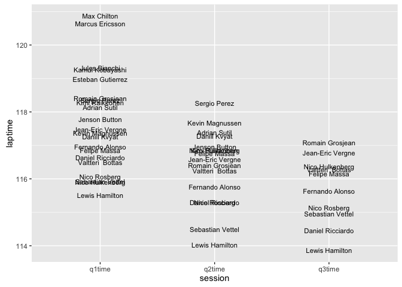

# A Quick Look at Qualifying

The qualifying session differs from the other race weekend sessions in that the session is split into three parts, with results available from each part for the participating drivers. The number of drivers progressing from one part of qualifying to the next is, in part, determined by the number of race entrants. Prior to 2015, *16* cars progressed from the first round of qualifying ("Q1") to to the second ("Q2"). With a smaller grid size in 2015, the number of cars making it into Q2 was reduced to 15. The top 10 cars from Q2 then progress to the final round of qualifying, Q3.

The final qualifying session classification determines the grid position for the race for each driver (penalties aside) and as such may be a predictor of the race winner, and is determined by the rank position of each driver from the last round of qualifying they competed in. (So the top 10 from Q3 make up the provisional first 10 places on the grid. The 11th to 15th (or 16th) cars from Q2 take up the corresponding positions in the grid. Add the cars that failed to make it out of Q1 are provisionally placed on the grid according to their Q1 classification.)

When trying to predict target cutoff times for each of the qualifying sessions (that is, the times that separate drivers who progress to the next round of qualifying from those that don't), the third practice times may give a useful steer. We will explore just how good a predictor the P3 times are for qualifying split times in a later chapter.

As with the practice sessions, we can get results data from the *ergast* database and results, speeds and sector times from the F1 (historical data) and FIA (data as of 2015) websites. To begin with, let's look at various ways in which we can summarise the results of the qualifying sessions. I'm going to use the F1/FIA data - so let's see which table we need.


```r
library(DBI)
f1 =dbConnect(RSQLite::SQLite(), './/f1com_results_archive.sqlite')
## list all tables
dbListTables(f1)
```

```
## [1] "QualiResultsto2005" "Sectors"            "Speeds"            
## [4] "pResults"           "qualiResults"       "raceFastlaps"      
## [7] "racePits"           "raceResults"
```

The data we want is in the *qualiResults* table. Let's have a quick look at a sample of the data from the 2014 Chinese Grand Prix, omitting the *year* and *race* columns.


```r
qualiResults=dbGetQuery(f1,
                        'SELECT * FROM qualiResults 
                        WHERE race="CHINA" AND year="2014"')
```


|  q1time|driverNum |pos |  q2time|q3natTime | q3time|q2natTime |qlaps |team                    |q1natTime |driverName       |
|-------:|:---------|:---|-------:|:---------|------:|:---------|:-----|:-----------------------|:---------|:----------------|
| 115.926|1         |3   | 114.499|1:54.960  | 114.96|1:54.499  |23    |Red Bull Racing-Renault |1:55.926  |Sebastian Vettel |
| 119.260|10        |18  |      NA|          |     NA|          |10    |Caterham-Renault        |1:59.260  |Kamui Kobayashi  |
| 118.362|11        |16  | 118.264|          |     NA|1:58.264  |17    |Force India-Mercedes    |1:58.362  |Sergio Perez     |

Note that we could make this a little more reusable by splitting out the arguments and wrapping the query in a function. For example:


```r
f1.getQualiResults =function (race='CHINA',year='2014'){
  q=paste('SELECT * FROM qualiResults 
          WHERE race="',race,'" AND year="', year,'"', sep='')
  dbGetQuery(f1,q)
  }
#Call the function using an expression of the form:
## f1.getQualiResults('AUSTRALIA','2013')
```

By inspection of the data table, we see that there are separate columns for the best time recorded by each driver in each part of qualifying, and a rank position for the session overall. One way of plotting the results data on a single chart is to use the session number (Q1, Q2 or Q3) as a categorical horizontal x-axis value, and the time (or rank) achieved by a driver in a particular session on the vertical y-axis. This allows us to see how the drivers were ranked in each part of qualifying, which drivers progressed from one session to the next, and how their classified lap times evolved individually.

## Qualifying Progression Charts

The easiest way to generate what we might term a *qualifying progression chart* is to assemble the data in to a *tidy data* form, such that the session time (or rank) is in one column, and the session identifier in another. We can use the *melt()* command to reshape the data into this form.


```r
library(reshape2)

#Generate a new table with columns relating to:
# -- driverNum, driverName, session and session laptime
qm=melt(qualiResults,
        id=c('driverNum','driverName'),
        measure=c('q1time','q2time','q3time'),
        variable.name='session',
        value.name='laptime')

#Make sure that the laptime values are treated as numeric quantities
qm$laptime=as.numeric(qm$laptime)
#If a laptime is recorded as 0 seconds, set it to NA
qm[qm == 0] <- NA
#Drop any rows with NA laptime values
qm=qm[with(qm,!is.na(laptime)),]
#This should give us an appropriate number of drivers in Q2 (depending on the number of cars)
# and 10 drivers in Q3, assuming all the drivers set times in each part of qualifying
#If a driver doesn't set a time in a session they are in, we may need to rethink...
```


|driverNum |driverName       |session | laptime|
|:---------|:----------------|:-------|-------:|
|1         |Sebastian Vettel |q1time  | 115.926|
|10        |Kamui Kobayashi  |q1time  | 119.260|
|11        |Sergio Perez     |q1time  | 118.362|

With the data in shape, let's have a look at it. To start with, we'll order drivers by laptime within each session.


```r
library(ggplot2)

ggplot(qm)+geom_text(aes(x=session,y=laptime,label=driverName),size=3)
```

<div class="figure">

<p class="caption">Text plot showing relative qualifying session times</p>
</div>

This chart shows several things directly, and the potential to show many more. For example, it *does* show:

* how laptimes improved session on session;
* how there is separation (or not) between drivers within each part of qualifying.

However, it *does not* readily show which drivers did not make it through from one session to the next, nor where the split time was that separates the drivers who make it through from those who don't. (Remember, at the end of Q1, only the top 15 or 16 drivers go on to Q2, and from there only the top 10 make it into Q3.)

The chart also suffers when drivers' laptimes are very close, as they are quite likely to be in qualifying, by the presence of overlapping driver name labels.

We can use lines to act as connectors that show how any particular driver faired in their attempt to progress from one qualifying session to the next.


```r
g = ggplot(qm,aes(x=session,y=laptime)) 
g = g+ geom_line(aes(group=driverName),colour='darkgrey')
g+geom_text(aes(label=driverName),size=3)
```

<div class="figure">

<p class="caption">Text plot of qualifying session times with driver connector lines</p>
</div>

That's a slight improvement, but there are still questions around overlap and the highlighting of drivers that didn't make the cut.

One way we can get round the overlap problem is to introduce an equal amount of separation between the driver names by plotting them against position (that is, rank) values rather than laptime. The upside of such an approach is the clear separation of labels, the downside a loss of information about separation in terms of laptime. Perhaps we could combine the approaches?

## Improving the Qualifying Session Progression Tables

In many reporting situations we may be as keen to know who went *out* in a particular session as much as who got through to the next session. So let's distinguish the drivers who didn't make the cut in the first and second qualifying sessions, along with the drivers who did get through to Q3.

If we group the laptimes by session, in decreasing position order, we can rank each row within the group.


```r
library(plyr)
qm=ddply(qm,'session',mutate,qspos=rank(laptime))
```

|driverNum |driverName       |session | laptime| qspos|
|:---------|:----------------|:-------|-------:|-----:|
|8         |Romain Grosjean  |q2time  | 116.407|     7|
|99        |Adrian Sutil     |q2time  | 117.393|    14|
|1         |Sebastian Vettel |q3time  | 114.960|     3|
|14        |Fernando Alonso  |q3time  | 115.637|     5|
|19        |Felipe Massa     |q3time  | 116.147|     6|
|25        |Jean-Eric Vergne |q3time  | 116.773|     9|
|27        |Nico Hulkenberg  |q3time  | 116.366|     8|
|3         |Daniel Ricciardo |q3time  | 114.455|     2|
|44        |Lewis Hamilton   |q3time  | 113.860|     1|
|6         |Nico Rosberg     |q3time  | 115.143|     4|
|77        |Valtteri  Bottas |q3time  | 116.282|     7|
|8         |Romain Grosjean  |q3time  | 117.079|    10|

With the rank position available within each session, we can highlight the drivers likely to be of interest in each part of qualifying. Using a plain white background increases the contrast and improves the clarity of the graphic.


```r
g = ggplot(qm,aes(x=session,y=laptime)) 
g = g+ geom_line(aes(group=driverName),colour='darkgrey')

#Highlight the drivers of interest in each session
g= g+geom_text(aes(label=driverName,
                   colour=(((qspos<=16 & session=='q1time') |
                              (qspos<=10 & session=='q2time') |
                              (session=='q3time') ))
                   ), size=3)
#Define the colouring for the text labels
g=g+scale_colour_manual(values=c('slategrey','blue'))
#Hide the legend for the colouring
g=g+guides(colour=FALSE)
g+xlab(NULL)+ylab(NULL)+theme_bw()
```

<div class="figure">

<p class="caption">Session times table, with highlights</p>
</div>

(Note, if we had included overall position in the *qm* dataframe originally we could have used the *pos* value to highlight the values earlier. Even though positions may change between drivers moving from session to session, the fact that they made it through to a particular session will be given by their overall position in qualifying as a whole.)

The above chart is reminiscent of, although far more cluttered than, a very clean chart type known as a *slopegraph* originally proposed by Edward Tufte.

It is possibly worth exploring additional toggle views of this chart using separate time measures, such as the gap to leader or the difference to the car classified one place ahead in the session. For example:

- *diff*: for each session, given rank ordered drivers by session classification, find `c(time_of_first_car, diff(laptime))`; that is, find the gap to the car ahead;
- *gap*: for each session, for rank ordered drivers by session classification, find `c(time_of_first_car, difference_to_first)`; that is, find the gap to the first placed driver in the session.

Whilst these sorts of chart are *always* likely to be plagued by the label overlap problem for drivers recording similar laptimes, we can do something about the overlap of labels and the connecting lines. The trick to doing this is to generate a *slopegraph* in which we split the lines into line segments drawn between the categorical name columns.

However, moving to a ranked view leads to one obvious downside: if a particular driver's best session laptime increases (that is, *gets worse*) moving from one session to another, whilst other drivers improve their best time, we lose that information, along with any insights it might provide as to how much higher placed the driver may have been in a later session if they had maintained their form of an earlier session.

## Qualifying Session Rank Position Summary Chart - Towards the Slopegraph

Whilst slopegraphs strictly defined use a continuous vertical y-axis so that differences in value can be visualised across categorical groups arranged along the horizontal x-axis, a scheme similar to the one used in the session table shown above, we have already seen how the vertical arrangement of items can often lead to labels being overlapped.

An alternative approach is to scale the y-axis, for example according to rank. Using session rank to order each driver by session, we can generate a visual summary of how the drivers were classified across each of the qualifying sessions. That is, we can summarise the qualifying session by putting together a session results summary chart that shows the position of each driver at the end of each qualifying session in the form of a *qualifying sessions classification rank chart*. Let's additionally tweak the legend to tidy it up a bit, by putting the names into two columns.


```r
g=ggplot(qm)+geom_line(aes(x=session,y=qspos,group=driverNum,col=driverName))
g+guides(col=guide_legend(ncol=2))
```

<div class="figure">

<p class="caption">Custom line chart showing rank by qualifying session</p>
</div>

### Viewing the Qualifying Session Progression Table as a Slopegraph

The multicolumn view used in the qualifying session progression charts is cluttered in part by the way we overlay text labels on top of a continuous line chart. If we introduce breaks or gaps in the line, we can get a much clearer view of the labels, and more clearly see how the labels in one column are connected to the labels in another.  

We can generate the ranked times for each session as follows:


```r
qualiResults=arrange(qualiResults,q1time)
qualiResults['q1pos']=rank(qualiResults['q1time'],na.last='keep')
qualiResults=arrange(qualiResults,q2time)
qualiResults['q2pos']=rank(qualiResults['q2time'],na.last='keep')
qualiResults=arrange(qualiResults,q3time)
qualiResults['q3pos']=rank(qualiResults['q3time'],na.last='keep')
```

The ranked slopegraph is then constructed by generating a stacked (ranked) list of drivers for each session, and then connecting each driver's time using a line segment. Colour highlights are used to identify the 'names of interest' in each session. For Q1 and Q2 I deem these to be the drivers that *miss* the cut-off.

To make the function more general, we can optionally pass in the cut-off limits for each session; in order to access the `cutoff` variable, we need to pass in an appropriate environmental scope to the *ggplot* `aes()` function. Similarly, to account for different label widths, we can pass in the `spacer` parameter value to adjust the line segment widths.


```r
slopeblank=theme(panel.border = element_blank(),
                   panel.grid.major = element_blank(),
                   panel.grid.minor = element_blank(),
                   axis.line = element_blank(),
                   axis.ticks = element_blank(),
                   axis.text = element_blank())

core_qualifying_rank_slopegraph= function(qualiResults,qm,
                                          spacer=0.25,cutoff=c(16,10)){  
  #http://stackoverflow.com/questions/10659133/local-variables-within-aes
  .e = environment()
  g=ggplot(qualiResults,aes(x=session,y=laptime), environment = .e)
  g= g+geom_text(data=qm[qm['session']=='q1time',],
                 aes(x=1,y=qspos,label=driverName,
                     colour=(qspos>cutoff[1] )
                 ), size=3)
  g= g+geom_text(data=qm[qm['session']=='q2time',],
                 aes(x=2,y=qspos,label=driverName,
                     colour=(qspos>cutoff[2] )
                 ), size=3)
  
  g= g+geom_text(data=qm[qm['session']=='q3time',],
                 aes(x=3,y=qspos,label=driverName,
                     colour=TRUE
                 ), size=3)
  g=g+geom_segment(data=qualiResults[!is.na(qualiResults['q2time']),],
                   x=1+spacer,xend=2-spacer,
                   aes(y=q1pos,yend=q2pos,group=driverName),
                   colour='slategrey')
  g=g+geom_segment(data=qualiResults[!is.na(qualiResults['q3time']),],
                   x=2+spacer,xend=3-spacer,
                   aes(y=q2pos,yend=q3pos,group=driverName),
                   colour='slategrey')
  g=g+scale_colour_manual(values=c('slategrey','blue'))
  g=g+guides(colour=FALSE)
  g+theme_bw()+xlab(NULL)+ylab(NULL)+xlim(0.5,3.5)+slopeblank
}
```

Defining the chart generator as a function makes the production of charts a one-line affair.


```r
core_qualifying_rank_slopegraph(qualiResults,qm)
```


We can also generate this style of chart directly from data pulled from the *ergast* API, although to do so we need to make a few mappings of column names so that we can reuse the chart generating function directly.


```r
source('ergastR-core.R')
#quali.ergast=qualiResults.df(2015,2)

qr=qualiResults.df(2015,1)

#Transform the data so that we can use it in the original function

#1. Rename columns so they work with the original charting function
#q1time, q2time, q3time,q1pos,q2pos,q3pos,driverName,qspos
qr=rename(qr, c("Q1_time"="q1time", "Q2_time"="q2time", "Q3_time"="q3time",
                "Q1_rank"="q1pos", "Q2_rank"="q2pos", "Q3_rank"="q3pos",
                "position"="qspos","code"="driverName"))
```

```r
#2. Generate qm equivalent by melting elements of qualifying results dataframe
#driverName, qspos, session (q1time, q2time, q3time)
qrm=melt(qr,
        id=c('driverName'),
        measure=c('q1time','q2time','q3time'),
        variable.name='session',
        value.name='laptime')
qrm$driverName=paste(qrm$driverName," (",qrm$laptime,")",sep='')
qrm=ddply(qrm,'session',mutate,qspos=rank(laptime))
```

```r
#Make sure that the laptime values are treated as numeric quantities
qrm$laptime=as.numeric(qrm$laptime)
#If a laptime is recorded as 0 seconds, set it to NA
qrm[qrm == 0] <- NA
#Drop any rows with NA laptime values
qrm=qrm[with(qrm,!is.na(laptime)),]
```


```r
core_qualifying_rank_slopegraph(qr,qrm,spacer=0.21)
```


## Rank-Real Plots
One of the problems when using a laptime basis for the vertical y-axis in the qualifying session progression chart is that the labels can often overlap. One way round this might be to use *two* vertical scales to display the information: a base axis ranging 1..N for N drivers, against which we plot each driver name, equally spaced; and a second axis, scaled against the first, that relates to laptime.

The chart can then contain *two* sorts of element - name/identifier columns, containing names/driver codes against an equally spaced categorical (integer) axis, and qualifying session time columns, against a real laptime axis, with the times simply represented as points. Lines can then associate names with time points, and the progression of time points for each driver can also be connected using lines.

## Ultimate Laps
As the aim of the qualifying session is to put together the fastest lap, it can be useful to know whether the best laptime achieved by each driver was actually the same as their ultimate lap. Where the two differ, *if* a driver *had* hooked up their ultimate lap, might the final outcome in terms of grid position have been any different? 

Until 2015, sector times were published in the results area of the official Formula One website. With the redesign of that site at the start of 2015, sector times disappeared from the public areas of the website at least. However, best sector times for each driver are still available (at the time of writing at least) in the form of FIA media release timing sheets.

## Summary
In this chapter we have started to look in at some of the data associated with qualifying, focusing in particular on how drivers progressed with the qualifying sessions. Two complementary ways of positioning the ordered driver list for each part of qualifying are possible. The first employs a continuous axis representing the best recorded laptime by each driver within a session; the second utilises a discrete axis representing the driver rank within each part of qualifying.

The continuous axis, laptime based arrangement allows us to see how close drivers were to each other within a session in terms of laptime, as well as allowing us to monitor best laptime evolution across sessions. However, the chart suffered from overlapping labels where drivers' laptimes were close to each other. The discrete, rank based axis ensures that labels are always well spaced and visible, and also allows us to easily recover the overall session classification, but at the expense of losing information relating to laptimes.

