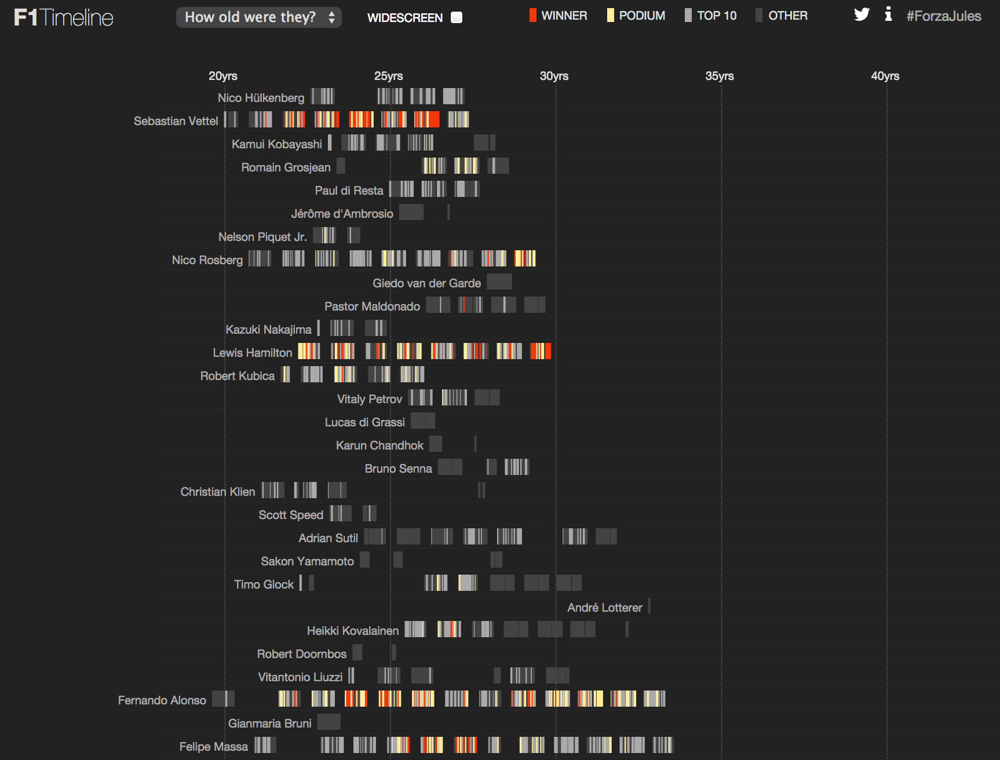

---
output:
  html_document:
    keep_md: yes
---
```{r setup, echo = F, message=F}
require(knitr)
options(knitr.table.format = 'markdown')
opts_chunk$set(fig.path = "images/streakiness-")
```
# Streakiness

*This chapter was originally inspired by the **Exploring Streaky Performances** chapter of **[Analyzing Baseball Data with R](http://baseballwithr.wordpress.com/about/)** (2013) by Max Marchi & Jim Albert. See also: Albert, Jim. "Streaky hitting in baseball." Journal of Quantitative Analysis in Sports 4.1 (2008).*

In the search for "interesting things to talk about", references to winning streaks or other streaks in performance are a trusty standby of many sports commentators and writers. In Formula One, there are plenty of options to consider: from runs in which a particular driver starts from pole position, or finishes with a win or a podium place, to streaks in consecutive races with a points finish or even just race completions. We can also look to team performances - the number of consecutive races where a team locked out the front row of the grid, perhaps, or the number of races in a row where a team finished with both drivers on the podium.

The *ergast* database contains the data we need to identify these sorts of behaviour, though as you'll see, we typically need to process it a little first.

```{r message=FALSE}
library(DBI)
ergastdb =dbConnect(RSQLite::SQLite(), './ergastdb13.sqlite')
```

Let's start by grabbing some data for a particular driver, specifically the *year*, *round*, *race name*, *grid position*, *final classification* and *points scored* for each race the driver participated in over the course of their career, or (optionally) during a specific championship season:

```{r}
getDriver=function(driverRef,year=''){
  if (year!='') 
    year_q=paste(' AND year in (',
                 paste(c(year),collapse=','),
                 ')',sep='')
  else year_q=' '
  dbGetQuery(ergastdb,
             paste('SELECT year, round, c.name, grid, position, points 
                   FROM results r JOIN drivers d JOIN races rc JOIN circuits c 
                   WHERE driverRef="',driverRef,'" 
                   AND d.driverId=r.driverId 
                   AND r.raceId=rc.raceId 
                   AND rc.circuitId=c.circuitId 
                   ',year_q,'
                   ORDER BY year, round',
                   sep=''))
}

alonso=getDriver('alonso')
#We can also query for a driver's race positions for a single year
#getDriver('alonso',2013)
#Or set of years
#getDriver('alonso', c(2012,2013))
kable(head(alonso,n=3),format='markdown')
```

There are several columns we will take an interest in: the *year* and *round* columns will be used to sort the races so we can look for streaks or runs of behaviour across consecutive races, and even from one season to the next. The *position* and *grid* columns contain data relevant to particular events, such as front row starts or podium finishes.

X> ## Performance Streaks
X>
X> What performance streaks do you think might be of interest to an F1 stats fan, or perhaps a pub quiz questionmaster?
X> I've given some crude examples in the opening paragraph of this chapter, but can you think of some rather more well defined questions, and how you might set about trying to answer them?

One typical sort of question might relate to a particular driver or team, such as *"what is the longest run of podium finishes that Fernando Alonso has ever had in F1 in a particular season?"*. This requires us to look for streaks within a particular year, but also for every year in which the driver competed.

Another typical question might be *"who has had the longest run of wins, and how many was it?"* This question actually requires some refinement: does it mean within a particular season, or does in mean over consecutive races more generally, rolling over from one season to the next?

Questions might also relate to runs that span seasons: *"which team has had the longest run of podiums over consecutive seasons at Silverstone?"*, for example. Or they may add an additional constraint, by requiring that runs take place in a particular part of a season: who has has the most consecutive wins at the start of a season, for example, or at the end of a season?

Whilst not necessarily *useful* questions - and some might even argue as to whether they even count as *interesting* ones! - trying to answer questions such as these provides us with a data-related recreational activity that lets us polish our data wrangling skills in a harmless way, if nothing else!

## Spotting Runs

The function used by Marchi & Albert to detect streaks takes a list of 1s and 0s that describe the outcome of a particular event we want to detect streaky behaviour in, and then calculates how long each run of 1s is, listing them as the result.

The function I am going to use counts runs of both 1s and 0s, distinguishing between which is which by use of numerical sign (plus for runs of ones, minus for runs of zeroes). The function also returns the row numbers in the original dataset that correspond to the start and end of the run.

The following functions generate result flags that we can use to detect different sorts of feature - front row of the grid start, or podium finish, for example - and hence different sorts of run.

```{r}
podium=function(pos) {if (!is.na(pos) & pos<4) 1 else 0}
frontrow=function(pos) {if (!is.na(pos) & pos<=2) 1 else 0}
topNfinish=function(pos,N) {if (!is.na(pos) & pos<=N) 1 else 0}
unclassified=function(pos) {if (is.na(pos)) 1 else 0}
inpoints=function(points) {if (points>0) 1 else 0}
```

We can apply these functions as follows:

```{r}
alonso$podium=mapply(podium,alonso$position)
alonso$frontrow=mapply(frontrow,alonso$grid)
alonso$top5=mapply(topNfinish,alonso$position,5)

kable(tail(alonso,n=4),row.names = FALSE)
```

As you can see from the above table, the *podium* flag is set to one when the driver is on the podium, the *topN* flag denotes whether the driver finished with the top however many drivers, and so on.

To detect runs, we generate a list of results ordered by increasing year and round and look for sequences of 1s or 0s, counting the number of consecutive 1s (or 0s) in a row, and also identifying (using a positive or negative sign) whether a run applied to a streak of 1s or a streak of 0s.

```{r}
#y contains a list of result flags
#val defines polarity
streaks=function(y,val=0){
  #Start by initialising run length to 0
  run=0
  #Define a list to capture all the runs, in sequence
  runs=c()
  #Initialise a variable that contains the previous result
  prev=y[1]
  #The last flag identifies the last result as part of a run
  last=TRUE
  #Search through each result flag
  for (i in y) {
    #Is the current result is the same as the previous one?
    if (i!=prev) {
      #If not, record the length of the previous run, and its polarity
      runs=c(runs,run*(if (prev==val) -1 else 1))
      #Initialise the next run length
      run=0
      #This result is the first in a new run
      last=FALSE
    } else {
      #We are still in a run
      last=TRUE
    }
    #Keep track of what the previous result flag was
    prev=i
    #Increase the length of the run counter
    run=run+1
  }
  #If the last result was part of a run, record that run
  if  (last | (run==1)) runs=c(runs,run*(if (prev==val) -1 else 1))
  #Create a dataframe from run list
  ss=data.frame(l=runs)
  #Tally how many results in total have been counted after each run
  #That is, record the result number for the last result in each run
  ss$end=cumsum(abs(ss$l))
  #Identify the result number for the start of each run
  ss$start=ss$end-abs(ss$l)+1
  #Reorder the columns
  ss[,c("start","end","l")]
}
```

Let's see whether there were any notable streaks of top5 placements in Alonso's career to the end of 2013:

```{r}
alonso = getDriver('alonso', 2012)
alonso$top5 = mapply(topNfinish, alonso$position, 5)

kable( streaks(alonso$top5) )
```

This suggests that Alonso finished in the top 5 for the first two races of the season, out of the top 5 for the next two, in the top 5 for the 7 races from round 5 to round 11 inclusive, then patchy runs until a set of 5 good finishes at the end of the season. 

Let's see if we can confirm it with a plot of his finishing positions:

```{r alonso2012pos,fig.cap="Alonso's finishing positions for each round of 2012",warning=FALSE,message=FALSE}
library(ggplot2)
g = ggplot(alonso, aes(x=round, y=position)) + geom_line()
g = g + geom_point(aes(colour=factor(top5)), size=5, show_guide = FALSE)
g + geom_hline(yintercept=5.5, colour ="grey")
```

That looks about right:-)

## Generating Streak Reports

The following function packages up the *streaks* function with some logic that applies the appropriate results flag function to generate a streaks dataframe. It then annotates this dataframe with the information about the first and last races in the streak (by race name and year) as well as the name of the race that broke the streak (that is, the race that immediately follows the end of the streak).

```{r}
streakReview=function(driverRef,years='',length=5,typ=2,mode='podium',topN=''){
  #The definitions are a bit messy...
  #If we set a topN parameter, force the topN mode
  if (topN!='') mode='topN'
  
  #Get the driver details
  driver=getDriver(driverRef,years)
  
  #Calculate the desired 0/1 stream based on the mode property
  if (mode=='podium') driver$mode=mapply(podium,driver$position)
  else if (mode=='frontrow') driver$mode=mapply(frontrow,driver$grid)
  else if (mode=='topN') driver$mode=mapply(topNfinish,driver$position,topN)
  else if (mode=='unclassified') driver$mode=mapply(unclassified,driver$position)
  else if (mode=='inpoints') driver$mode=mapply(inpoints,driver$points)
  else return(data.frame())
  
  #Calculate the streaks in the desired mode property
  streak=streaks(driver$mode)
  
  #Annotate the streak with start (first), end (last) and broken-by information
  streak$startc= mapply(function(x) driver[x,'name'],streak$start) 
  streak$endc= mapply(function(x) driver[x,'name'],streak$end) 
  streak$starty= mapply(function(x) driver[x,'year'],streak$start) 
  streak$endy= mapply(function(x) driver[x,'year'],streak$end)
  nd=nrow(driver)
  streak$brokenbyy=mapply(function(x) if (nd<x+1) NA else driver[x+1,'year'],
                          streak$end)
  streak$brokenbyc= mapply(function(x) if (nd<x+1) NA else driver[x+1,'name'],
                           streak$end)
  
  #The typ argument lets us get all streaks, 1s streaks, or 0s streaks
  #greater than or equal to a specified length 
  if (typ==2) streak[abs(streak["l"])>=length,]
  else if (typ==1) streak[abs(streak["l"])>=length & streak["l"]>0,]
  else streak[abs(streak["l"])>=length & streak["l"]<0,]
}
alonso=streakReview("alonso",length=1)
kable( head(alonso,n=5) )
```

The following table shows long streak runs of podium finishes (positive *l*) and periods without making the podium (negative *l*) for Fernando Alonso:

```{r}
kable( head(alonso[order(-abs(alonso$l)),]), row.names=FALSE )
```

So for example, for 15 consecutive races starting with Istanbul Park in 2005 up until, and including, the Circuit Gilles Villeneuve in 2006, Alonso made the podium; the run was broken when he finished out of the top 3 at the 2006 Indianapolis Motor Speedway. He's also suffered lean periods, such as the first 14 races of races of 2008 or the first 13 races of 2009, both of which were broken by podium finishes at the Marina Bay Street Circuit.

We can check that the code is generating streaks correctly by comparing the results it gives with articles such as [*The greatest winning streaks in F1 history*](http://www.enterf1.com/blog/166-the-greatest-winning-streaks-in-f1-history) or Wikipedia's [*list of Formula One driver records*](http://en.wikipedia.org/wiki/List_of_Formula_One_driver_records).


A> ## Fact Checking News Reports
A>
A> In the run up to the 2014 United States Grand Prix at the Circuit of the Americas, the Guardian newspaper reported how Lewis Hamilton "is attempting to become the first British driver since Nigel Mansell in 1992 to win five races in a row" ([Guardian, "Futures of Force India and Sauber become subject of speculation"](http://www.theguardian.com/sport/2014/oct/31/future-force-india-sauber-subject-speculation-formula-one)).
A>
A> News fragments such as provide a good opportunity to try out, and extend, our data wrangling approaches. In this case, how would you generate a report that lists all the in-season winning streaks of length five or more by driver and nationality?
A>
A> Also see if you can generate a query that allows you to state a driver's nationality and minimum winning streak length, and get back a list of drivers of that meet those conditions.
A>
A> ### Hint condition
A>
A> One approach I considered was to get a list of *driverId* values for drivers who had had a minimum number of wins in a particular season and then use these values as the basis for streakiness searches.
A> {lang="R"}
A> ~~~~~~~~
A> multiwinners.gb = dbGetQuery(ergastdb,'SELECT driverRef, d.driverId, nationality, MAX(wins), year
A>  FROM driverStandings ds JOIN races r JOIN drivers d 
A>  WHERE ds.raceId=r.raceId AND ds.driverId=d.driverId 
A>    AND ds.driverId IN (SELECT DISTINCT driverId FROM drivers WHERE nationality="British")
A>  GROUP by year,d.driverId HAVING MAX(wins)>=5')
A> ~~~~~~~~
A>
A> We can then use something like *ddply()* to call the *streakReview()* function using the *driverRef* and *year* values (e.g. `ddply(multiwinners.gb, .(driverRef,year), function(x) streakReview(x$driverRef, length=5, topN=1, years=x$year, typ=1))`)

## Streak Maps

Having generated the streaks data, how might we visualise it? One way is to use a horizontal *stacked bar chart* with the following properties:

* the stacked elements correspond to consecutive runs;
* the size of each stacked element is proportional to the length of the run;
* the fill colour of each element reflects the state of the results flag used to calculate the run.

We note that the *l* value in the dataframe returned from the `streakReview()` function provides all the information we need: its magnitude helps set the element size, and its sign the fill colour.

```{r alonso-streak,fig.cap="Visualising Alonso's podium streaks with a horizontal filled bar chart",message=FALSE}
g = ggplot(alonso, aes(x="dummy", y=abs(l), fill=(l>0)))
g=g+geom_bar(stat='identity')+xlab(NULL)+ylab('Career race number')
g+coord_flip()+scale_fill_manual(values=c('pink','blue'))+theme_bw()
```

One problem with this chart is that it does not show season breaks, or the extent to which races were back to back races or races with a break in-between. To depict such information, we would need to have an x-axis that is more representative of time, for example basing it on year and week number in which each race took place.

A> ## F1 Timeline - Peter Cook
A> In a striking visualisation built on top of the *ergast* database, Peter Cook's interactive *F1 Timeline* provides a view over the race positions achieved by F1 drivers according to their age, with the drivers also ordered reverse chronologically in terms of when they first competed in F1.
A> 
A> 
A>
A> Peter Cook's notes also describe the design philosophy and implementation details behind the visualisation.

X> ## Creating your own F1 Timeline
X> In his [F1 Timeline: Design](http://animateddata.co.uk/articles/f1-timeline-design/) notes, Peter Cook describes an initial sketch using a simple scatterplot in which "*[e]ach row represents a driver and [a] circle a race result. Time progresses from left to right. Black indicates a win, dark grey a podium etc.*"
X>
X> Driver ages are calculated from dates of birth recorded in the *ergast* drivers table, and (where values are missing) other sources. Using the *ergast* data, how would you create a version of Cook's initial sketch chart using *driver age* on the x-axis?
X> 
X> If you're feeling even more adventurous, try to create your own static version of the *F1 Timeline* for drivers who competed in the 2013 season.


## Team Streaks

Searching for streaks in performance around a single thing, such as a particular driver or team, is one thing. But can we also search for streaks based on the performance of both members of a team? Could we, for example, identify races in which a team got a one-two on the podium (that is, taking first and second positions in the same race), or locked out the front row of the grid?

### One-Two and Double Podium Streaks

To find out if two drivers of the same team are both in the top 2 positions we need to identify races where there are two different members of the same team in the top 2 positions of the same race. One way of thinking about this is to combine *two* copies of the results table, each providing the position for one of the drivers. By JOINing the tables appropriately - making sure the *driverId*s returned from each copy of the results table are different but their *constructorId* and *raceId* are the same - we can pull back results where one team member is in first position in a particular race and the other is in second. Finally, we join in the race table so that we can access the race name, year and round.

```{r}
dbGetQuery(ergastdb,
                  'SELECT r.name,r.year,round,constructorRef 
                  FROM results r1 JOIN results r2 JOIN races r JOIN constructors c 
                  WHERE r1.constructorId=r2.constructorId 
                  AND r1.driverId!=r2.driverId 
                  AND r1.raceId=r2.raceId
                  AND r1.position=1 AND r2.position=2 
                  AND r.raceId=r1.raceId 
                  AND c.constructorId=r1.constructorId
                  ORDER BY r.year DESC, round DESC
                  LIMIT 5')
```


Another, more efficient approach, is to do some counting. For example, we can group the results by team for each race, and then count the number of drivers who finished in the team in the top two, discounting drivers who were not placed. If we count two drivers with non-null positions in the top two places, we know we've got a one-two. If we bring in the constructor table, we can pull in the constructor reference too. 

```{r}
onetwo=dbGetQuery(ergastdb,
                  'SELECT r.name,r.year,round,constructorRef 
                  FROM results res JOIN races r JOIN constructors c 
                  WHERE r.raceId=res.raceId 
                  AND c.constructorId=res.constructorId 
                  AND res.position NOT NULL AND res.position<3
                  GROUP BY res.raceId,res.constructorid
                  HAVING COUNT(res.driverId)=2
                  ORDER BY r.year DESC, round DESC')
kable(head(onetwo))
```

This query also returns details of the races where a team got a one-two. To calculate one-two streaks, we can again use the results flag approach using a conditional *CASE* element in the SELECT part of the query. This statement sets the flag value to 1 if neither position in the team is NULL (the count of position values is 2) and both positions are less than or equal to 2nd place, otherwise it sets the flag to 0.

```{r}
onetwoFlag=dbGetQuery(ergastdb,
           'SELECT r.name,r.year,round,constructorRef,
           CASE WHEN (MAX(res.position)<=2 AND COUNT(res.position)=2) 
                THEN 1 ELSE 0 END AS onetwo
           FROM results res JOIN races r JOIN constructors c
           WHERE r.raceId=res.raceId
           AND c.constructorId=res.constructorId 
           AND constructorRef="red_bull" 
           GROUP BY res.raceId,res.constructorid 
           ORDER BY r.year DESC, round DESC')

kable(head(onetwoFlag))
```

We can tweak the previous query to find races where a team has a double podium (i.e. both drivers finish on the podium):

 
```{r,results='asis'}
doublepodiumFlag = dbGetQuery(ergastdb,
           'SELECT DISTINCT r.name, year, round, constructorRef, 
              CASE WHEN (COUNT(res.position)=2 and MAX(res.position)<=3) 
                THEN 1 ELSE 0 END AS doublePodium 
           FROM results res JOIN races r JOIN constructors c 
           WHERE r.raceId=res.raceId 
           AND c.constructorId=res.constructorId 
           AND year=2009 AND constructorRef="red_bull" 
           GROUP BY res.raceId,res.constructorid 
           ORDER BY year DESC, round DESC')
kable(head(doublepodiumFlag,n=6))
```

It is straightforward enough to modify this query to identify when both drivers are in the top N positions, whether both drivers are classified - or neither are - and so on.

### Grid lockouts

Another team run we can look out for are front row lockouts on the grid, where both of a team's cars are on the front row (that is, between them the team has taken the first and second grid positions).
 
```{r, results="asis"}
lockout = dbGetQuery(ergastdb,
                     'SELECT r.name,year,round,constructorRef 
                     FROM results res JOIN races r JOIN constructors c 
                     WHERE r.raceId=res.raceId 
                     AND res.grid<3 
                     AND c.constructorId=res.constructorId 
                     GROUP BY res.raceId,res.constructorid 
                     HAVING COUNT(res.driverId)=2 
                     ORDER BY year DESC, round DESC')
kable(head(lockout,n=5))
```

Again, we can modify this query in order to list all races but flag those in which a team locks out the front row of the grid.

```{r results='asis'}
lockoutFlag= dbGetQuery(ergastdb,
                        'SELECT DISTINCT r.name,year,round, constructorRef,
                            CASE WHEN (MAX(res.grid)=2 AND COUNT(res.position)=2)
                              THEN 1 ELSE 0 END AS gridLockout 
                        FROM results res JOIN races r JOIN constructors c 
                        WHERE r.raceId=res.raceId
                        AND c.constructorId=res.constructorId 
                        AND constructorRef="red_bull" 
                        GROUP BY res.raceId,res.constructorid 
                        ORDER BY year DESC, round DESC')
kable(head(lockoutFlag))
```

Having set the `lockoutFlag` indicator, we then generate a streak report, remembering to sort the dataframe appropriately before attempting to detect any streaks.

## Time to N'th Win

At the start of a driver's Formula One career, they are likely to have a run of finishes that don't include taking the winner's trophy. Such a run of not-first-place finishes also identifies the time to the first win.

However, to calculate the time to the first win, we don't necessarily need to calculate the length of an initial not-winning streak. For example, the first win can be identified quite straightforwardly using a query that searches for all wins by a particular driver, orders them by ascending date and then limits the result to just the top row:

```{r}
dbGetQuery(ergastdb,
           'SELECT driverRef, code, dob, year, round, r.name, c.name, date
           FROM drivers d JOIN results rs JOIN races r JOIN circuits c
           WHERE rs.driverId=d.driverId 
           AND rs.position=1 AND r.raceId=rs.raceId 
           AND c.circuitId=r.circuitId 
           AND driverRef="alonso"
           ORDER BY date LIMIT 1')
```

We can tweak this query to give us the *N*'th win by adding an offset equal to *N-1*. So for example, we can find Alonso's fifth win as follows:
 
```{r}
dbGetQuery(ergastdb,
           'SELECT driverRef, code, dob, year, round, r.name, c.name, date
           FROM drivers d JOIN results rs JOIN races r JOIN circuits c
           WHERE rs.driverId=d.driverId 
           AND rs.position=1 AND r.raceId=rs.raceId 
           AND c.circuitId=r.circuitId 
           AND driverRef="alonso"
           ORDER BY date
           LIMIT 1 OFFSET 4')
```

But how would you use a customisation of this query to find the number of races a driver had competed in before his first win? Or N'th win?

How would you generalise it to find the number of races he had competed in before gaining his first win?

X> ## Finding Streaky Runs
X>
X> Using the datawrangling strategies developed above, or others of your own devising, explore the *ergast* dataset to find examples of runs and streaks in driver and team performance.

## Looking for Streaks Elsewhere
The method described in this chapter for discovering streaks - generate an indicator flag for a feature of interest, look for runs in it - is a general one and can be applied to datasets other than just results.

For example, the method might equally be applied to discovering the number of *consecutive laps led* by a driver in a particular race, over the course of a season, or even across the whole of their F1 career.

## Summary

We have seen one way of calculating streaky behaviour in a driver's or team's performance by setting a results flag that identifies some performance feature (such as finishing first, or finishing on pole, or both cars in a team finishing on the podium) and then counting consecutive appearances of the same value of the flag.

What we haven't done are any statistical tests to see whether these runs are "unlikely" in any particular sense of the word, or might be expected by chance given the results profile of the driver of his complete career or the team over several seasons. The interested reader who would like to explore such statistical comparisons further might find the works by Albert, and Marchi & Albert, that were referred to at the start of this chapter provide a useful starting point for such an investigation.