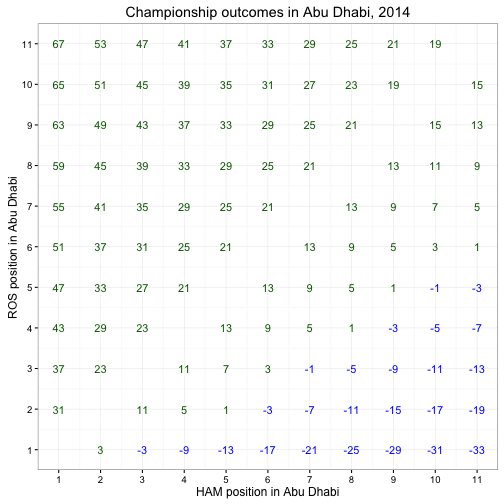

# End of Season Showdown

To keep television audiences interested in F1 throughout a season, the hope is that the Drivers' Championship in particular will go down to the wire, not being decided until the last race of the season. Even without the double points mechanism introduced for the last race of the championship for the 2014 season, Lewis Hamilton's 17 point lead over Nico Rosberg meant that Rosberg could have won the championship with a first or second place finish had Hamilton finished out of the points. With the double points mechanism, however, several other scenarios were possible.

In this chapter, we'll look at a simple model that shows the different championship results for each finishing combination.

## Modeling the Points Effects of the Final Championship Race

To start with, we generate a list of the standard points allocations for each finishing position.


```r
points=data.frame(pos=1:11,val=c(25,18,15,12,10,8,6,4,2,1,0))
```

To work out which driver would have won for each possible result in the double points scoring final race, we need to find out the points difference between each of the finishing positions. We can represent this information using a square matrix, where the rows represent the finishing position of one of the drivers, and the columns the finishing position of the other driver. The matrix values represent the points difference for the corresponding finishing combination. The diagonal elements, which would represent both cars receiving the same classification, are ignored.


```r
pdiff.final=matrix(ncol = nrow(points), nrow = nrow(points))
for (i in 1:nrow(points)){
  for (j in 1:nrow(points))
    if (i==j) pdiff.final[[i,j]]=NA
    else pdiff.final[[i,j]]=2*points[[i,2]]-2*points[[j,2]]
}

pdiff.final
```

```
##       [,1] [,2] [,3] [,4] [,5] [,6] [,7] [,8] [,9] [,10] [,11]
##  [1,]   NA   14   20   26   30   34   38   42   46    48    50
##  [2,]  -14   NA    6   12   16   20   24   28   32    34    36
##  [3,]  -20   -6   NA    6   10   14   18   22   26    28    30
##  [4,]  -26  -12   -6   NA    4    8   12   16   20    22    24
##  [5,]  -30  -16  -10   -4   NA    4    8   12   16    18    20
##  [6,]  -34  -20  -14   -8   -4   NA    4    8   12    14    16
##  [7,]  -38  -24  -18  -12   -8   -4   NA    4    8    10    12
##  [8,]  -42  -28  -22  -16  -12   -8   -4   NA    4     6     8
##  [9,]  -46  -32  -26  -20  -16  -12   -8   -4   NA     2     4
## [10,]  -48  -34  -28  -22  -18  -14  -10   -6   -2    NA     2
## [11,]  -50  -36  -30  -24  -20  -16  -12   -8   -4    -2    NA
```

Matrix co-ordinates are described using the convention *(rows, columns)* with the top left element represented as cell (1,1). Reading this matrix, we see that if one driver finished in second place and the other in fourth, the difference in points that they will receive given by locations *(2,4)* or *(4,2)* is 6 points.

You should note that there is some asymmetry in the matrix, with the upper right corner displayed as a positive points difference, and the lower left hand corner containing negative points differences. If we associate Rosberg with the columns (that is, the horizontal access) and Hamilton with the rows (that is, the vertical axis) we can see that if Hamilton finishes 4th and Rosberg finished 7th (location *(4,7)*) the points difference is +12, which we read as Hamilton gaining 12 points more than Rosberg.

If Rosberg finishes 2nd and Hamilton finishes out of the points, modeled as position 11, we read the value at *(11,2)* as -36, which is to say, Hamilton loses 36 points to Rosberg.

Going in to the final round, Hamilton led Rosberg by 17 points - that is, Hamilton was *+17* points up on Rosberg. If we add this amount into each cell, we can see what the points difference would be after each possible combination of race classifications in the final race.


```r
pdiff.final+Vectorize(17)
```

```
##       [,1] [,2] [,3] [,4] [,5] [,6] [,7] [,8] [,9] [,10] [,11]
##  [1,]   NA   31   37   43   47   51   55   59   63    65    67
##  [2,]    3   NA   23   29   33   37   41   45   49    51    53
##  [3,]   -3   11   NA   23   27   31   35   39   43    45    47
##  [4,]   -9    5   11   NA   21   25   29   33   37    39    41
##  [5,]  -13    1    7   13   NA   21   25   29   33    35    37
##  [6,]  -17   -3    3    9   13   NA   21   25   29    31    33
##  [7,]  -21   -7   -1    5    9   13   NA   21   25    27    29
##  [8,]  -25  -11   -5    1    5    9   13   NA   21    23    25
##  [9,]  -29  -15   -9   -3    1    5    9   13   NA    19    21
## [10,]  -31  -17  -11   -5   -1    3    7   11   15    NA    19
## [11,]  -33  -19  -13   -7   -3    1    5    9   13    15    NA
```

Reading this, we see if Rosberg finished in first place, cells *(N,1)*, and if Hamilton finished in second, Hamilton would be *+3* up on Rosberg after the race and take the championship; but if Hamilton finished third, he'd be three points down (*-3*) and would lose the championship.

If Hamilton finished seventh and Rosberg finished third, cell *(7,3)* shows a result of *-1* - Rosberg would have lost by a single point.

## Visualising the Outcome

We can provide a more eyecatching view over the data by using colour or additional emphasis to each cell according to which driver would take the championship win.


```r
library(reshape)
library(ggplot2)

results = melt(pdiff.final+Vectorize(17))

g = ggplot(results)
g = g + geom_text(aes(X1, X2,
                      label=value,
                      col=factor(sign(as.integer(as.character(value))))))
g = g + xlab('HAM position in Abu Dhabi')+ ylab('ROS position in Abu Dhabi')
g = g + labs(title="Championship outcomes in Abu Dhabi, 2014")
g = g + scale_color_manual(values = c('blue','darkgreen'))
g = g + theme_bw() +theme(legend.position="none")
g = g + scale_x_continuous(breaks=seq(1, 11, 1))
g + scale_y_continuous(breaks=seq(1, 11, 1))
```

 


## Summary

In this chapter, we have seen a simple way of modeling the outcome of a Drivers' Championship race between two drivers with a chance at the championship as they go in to the final race of the season.

An output chart identifies which driver will win or lose given different finishing combinations, as well as the number of points they'll win or lose by.
