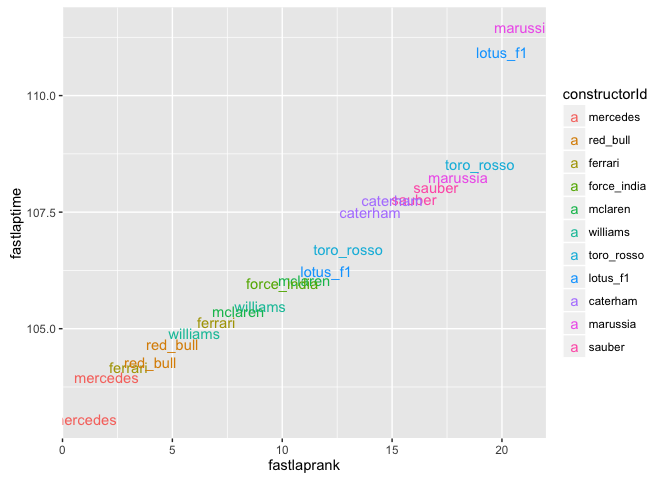

# Getting the data from the *ergast* Motor Racing Database API

We can access the contents of the *ergast* motor racing database in three distinct ways:

* online, as tabular results in an HTML web page, for seasonal data up to and including the current season and results up to and including the last race;
* online, via the *ergast* API, for seasonal data up to and including the current season and results up to and including the last race;
* via a downloaded image of the database for results to the end of the last completed season.

There are also several third party applications that have been built on top of the *ergast* data. For further details, see the [ergast Application Gallery](http://ergast.com/mrd/gallery).

Although it can be instructive to review the information available on the *ergast* website directly, as well as the applications that other people have built, we are more interested in accessing the actual data, whether by the API or the database. Whilst it doesn't really matter where we get the data from for the point of view of analysis, the API and the database offer slightly different *affordances* when it comes to actually getting data out in a particular form. For example, the API requires a network connection for live data requests or to populate a cache (a local stored copy of data returned from an API request), whereas the database can be run offline but requires a database management system to serve the data in response to database requests. The API also provides data results that combines data from several separate database tables right from the start, whereas with the database we need to work out ourselves how to combine data from several separate data tables.

For convenience, I will tend to refer to *accessing the ergast API* when I mean calling the online API, and *accessing the ergast database* when it comes to querying a local database. However, you should not need to have to install the database for the majority of examples covered in this book - the API will work fine (and is more timely, for example, when trying to access qualifying data over the course of a race weekend). On the other hand, if you are looking for an opportunity to learn a little bit about databases and how to query them, now might be a good time to start!

## Accessing Data from the *ergast* API

If you have a web connection, one of the most convenient ways of accessing the *ergast* data is via the *ergast* API. An API is an *application programming interface* that allows applications to pull data directly from a remote service, such as a database management system, via a programmable interface. The provision of an API means that we can write a short programme to pull data directly from the *ergast* database that lives at *ergast.com* via the *ergast* API.

You can inspect the data published by the *ergast* API by following the example method call links from the API documentation webpages. Clicking through on a link for a particular example API call leads to a web page that previews the data associated with that call in one or more HTML tables.

The *ergast* API also publishes data as a JSON or XML data feed, obtained by adding a `.json` or `.xml` suffix respectively to the base web address for a particular API call. Handling the data directly is a little bit fiddly, so I have started to put together a small library to make it easier to access this data, as well as enriching it. This type of library is often referred to as a *wrapper* in that it "wraps" the original HTTP/JSON API with a set of native R functions. *For more details, see the appendix.* The library can be found in the file [ergastR-core.R](https://gist.github.com/psychemedia/11187809#file-ergastr-core-r) at the URL specified in the footnote and currently contains the following functions:

* *driversData.df(YEAR)*: information about the drivers competing in a given year;
* *racesData.df(YEAR)*: details of the races that took place or are scheduled to take place in a given year;
* *resultsData.df(YEAR,RACENUMBER)*: results of races by year and race number;
* *qualiResults.df(YEAR?,RACENUMBER?,DRIVERID?,CONSTRUCTORID?)*: qualifying results selected according to defined parameters;
* *raceWinner(YEAR,RACENUMBER)*: the winner of a race specified by year and race number;
* *pitsData(YEAR,,RACENUMBER)*: details of each pit event during the race;
* *driverResults.df(YEAR,DRIVERID)*: results for a specified driver for a specified year;
* *lapsData.df(YEAR,RACENUMBER)*: information about laptimes during a particular race;
* *lapsDataDriver.df(YEAR,RACENUMBER,DRIVERID)*: information about laptimes during a particular race for a particular driver;
* *driverCareerStandings.df(DRIVERID)*: information about the career standing in terms of end of season classifications for a particular driver;
* *seasonStandings(YEAR,RACE?)*: drivers' championship standings at the end of the year (for a previous season) or, for the current year, the current standings, or (optionally), the standings end of a particular race;
* *constructorStandings.df(YEAR,RACE?)*: constructors' championship standings at the end of the year (for a previous season) or, for the current year, the current standings, or (optionally), the end of a particular race.

Where a variable is qualified with a *?*, the question mark/query symbol identifies the corresponding variable as an *optional* element; that is, you do not need to provide it explicitly, in which case a default behaviour will result.

### Introducing some of the simple *ergastR* functions

To load the core *ergastR* functions in, [download the *raw* file](https://gist.github.com/psychemedia/11187809#file-ergastr-core-r) to the current working directory, and use the `source('ergastR-core.R')` command to load in the file. Alternatively, load the `devtools` package and use the `source_url()` function.


```r
#If the R file is in the current working directory
source('ergastR-core.R')
#Example of specifying the path to the file located on my own computer
#The ~ symbol denotes my home/default directory
#source('~/Dropbox/wranglingf1datawithr/src/ergastR-core.R')

#You can also load the file in from the online gist
#Use the source_url() function from the devtools package
#Note that you may need to install the devtools package first
#library(devtools)
#url='https://gist.githubusercontent.com/psychemedia/11187809/raw/ergastR-core.R'
#source_url(url)
```

Let's look at a preview of each table in turn. We can do this using the R function *head()*, which displays just the first few rows (10 by default) of a dataframe.  For example, *head(df)* previews the first 10 rows for the dataframe *df*. To alter the number of rows displayed, for example to 5, use the construction *head(df,**n=5**)*. To view the rows at the end of the table, you can use the *tail()* command in a similar way.


```r
#USAGE: driversData.df(YEAR)
drivers.df = driversData.df(2014)

#The knitr library contains a handy function, kable(), for generating tabular markdown
#We can use it in an Rmd script by setting an Rmd chunk
#with the option {r results='asis'}
#Note that /format='markdown'/ is actually the default output for kable.
kable(head(drivers.df),row.names=F,format="markdown")
```


|driverId      |name     |code |permNumber |
|:-------------|:--------|:----|:----------|
|alonso        |Alonso   |ALO  |14         |
|jules_bianchi |Bianchi  |BIA  |17         |
|bottas        |Bottas   |BOT  |77         |
|button        |Button   |BUT  |22         |
|chilton       |Chilton  |CHI  |4          |
|ericsson      |Ericsson |ERI  |9          |

In the *ergast* database, the `driverId` is used to distinguish each driver. The `driversData.df()` function can thus be used to provide additional information about drivers from their `driverId`, such as their new permanent number and their three letter driver code.

When it comes to identifying races, we need two pieces of information. The `year` and the `round`. We can look up races by year by calling `racesData.df()` with the year of interest:


```r
#USAGE: racesData.df(YEAR)
races.df = racesData.df(2014)
```

|round |racename              |circuitId   |
|:-----|:---------------------|:-----------|
|1     |Australian Grand Prix |albert_park |
|2     |Malaysian Grand Prix  |sepang      |
|3     |Bahrain Grand Prix    |bahrain     |
|4     |Chinese Grand Prix    |shanghai    |
|5     |Spanish Grand Prix    |catalunya   |
|6     |Monaco Grand Prix     |monaco      |

Knowing the round number we are interested in then allows us to look up data about a particular race. For example, let's look at the first few lines of the results data for the 2014 Malaysian Grand Prix, which happened to be round 2 of that year:


```r
#USAGE: resultsData.df(YEAR,RACENUMBER)
results.df = resultsData.df(2014,2)
```

| carNum| pos|driverId   |constructorId | grid| laps|status   | fastlapnum| fastlaptime| fastlaprank|
|------:|---:|:----------|:-------------|----:|----:|:--------|----------:|-----------:|-----------:|
|     44|   1|hamilton   |mercedes      |    1|   56|Finished |         53|     103.066|           1|
|      6|   2|rosberg    |mercedes      |    3|   56|Finished |         55|     103.960|           2|
|      1|   3|vettel     |red_bull      |    2|   56|Finished |         51|     104.289|           4|
|     14|   4|alonso     |ferrari       |    4|   56|Finished |         47|     104.165|           3|
|     27|   5|hulkenberg |force_india   |    7|   56|Finished |         38|     105.982|          10|
|     22|   6|button     |mclaren       |   10|   56|Finished |         47|     106.039|          11|

Having access to laptime data is essential for many race reports. In later chapters, we will see a wide variety of ways in which can put this form of data to use, such as generating race history charts, that capture the dynamics of a complete race, or battle charts that show a race from a particular driver's perspective.

The `lapsData.df()` function returns laptime data for each driver during a particular race.


```r
#USAGE: lapsData.df(YEAR,RACENUMBER)
laps.df = lapsData.df(2014,2)
head(laps.df)
```

```
##   lap driverId position  strtime rawtime    cuml   diff
## 1   1 hamilton        1 1:51.824 111.824 111.824     NA
## 2   2 hamilton        1 1:47.501 107.501 219.325 -4.323
## 3   3 hamilton        1 1:47.763 107.763 327.088  0.262
## 4   4 hamilton        1 1:48.375 108.375 435.463  0.612
## 5   5 hamilton        1 1:47.428 107.428 542.891 -0.947
## 6   6 hamilton        1 1:47.532 107.532 650.423  0.104
```

Note that the `cuml` and `diff` columns are not returned by the *ergast* API - I have generated them by ordering the laps for each driver by increasing lap number and then calculating the cumulative live time and the difference between consecutive lap times for each driver separately. *We will see how to do this in a later section.*

We can look up the winner of that race using the `raceWinner()` function:


```r
#USAGE: raceWinner(YEAR,RACENUMBER)
winner = raceWinner(2014,2)
winner
```

```
## [1] "hamilton"
```

The `raceWinner()` function makes a specific call to the *ergast* API to pull back the driverId for a particular position in a particular year's race.

X> **Exercise**
X>
X> Try out some of the other functions contained in *ergastR-core.R*, such as `driverResults.df(YEAR,DRIVERID)` or `lapsDataDriver.df(YEAR,RACENUMBER,DRIVERID)`.

### Making Function Calls to the *ergast* API 
To inspect the construction of the `raceWinner()` function, we just enter its name without any argument brackets:


```r
raceWinner
```

```
## function (year, raceNum) 
## {
##     dataPath = paste(year, raceNum, "results", "1", sep = "/")
##     wURL = paste(API_PATH, dataPath, ".json", sep = "")
##     wd = fromJSON(wURL, simplify = FALSE)
##     wd$MRData$RaceTable$Races[[1]]$Results[[1]]$Driver$driverId
## }
```

If you want to edit the function, enter `fix(FUNCTION_NAME)`; for example, `fix(raceWinner)`.

We see how the URL for the corresponding request takes the form `http://ergast.com/api/f1/YEAR/RACENUMBER/POSITION.json` (API_PATH is set to *http://ergast.com/api/f1/*). For the winner, the construction of the URL thus includes the term **1**.json).We could create a more general function that makes a call for information relating to an arbitrary position, not just first place by parameterising this part of the URL's construction.
 
That is, we might try something of the form:


```r
#Pass in a race position, by default setting it to first place
racePosition = function (year, raceNum, racePos=1) {
  dataPath=paste(year,raceNum,"results",racePos,sep='/')
  wURL=paste(API_PATH,dataPath,".json",sep='')

  wd = fromJSON(wURL, simplify = FALSE)
  wd$MRData$RaceTable$Races[[1]]$Results[[1]]$Driver$driverId
}

#For the 2014 championship, second round, show who was classified in third place
racePosition(2014,2,3)
```

```
## [1] "vettel"
```

As and when you develop new fragments of R code, it often makes sense to wrap them up into a function to make the code easier to reuse. By adding *parameters* to a function, you can write create *general* functions that return *specific* results dependent on the parameters you pass into them. For data analysis, we often want to write very small pieces of code, or particular functions, that do very specific things, rather than writing very large software programmes. Writing small code fragments in this way, and embedding them in explanatory or discursive text, is an approach referred to as *literate programming*. Perhaps  we need to start to think of programming-as-coding as more to do with writing short haikus than long epics?! 

If you compare the two functions above, `raceWinner` and `racePosition`, you will see how they resemble each other almost completely. By learning to *read* code functions, you can often recognise bits that can be modified to create new functions, or more generalised ones. We have taken the latter approach in the above case, replacing a specific character in the first function with a parameter in the second. (That is, we have further *parameterised* the original function.)

Many code libraries are released under what are known as *open licenses*, which means that you are free to use them, repurpose them, and extend them yourself. When developing your own code, it often makes to sense to build on top of openly licensed code that already does elements of what you want, rather than starting from scratch every time.

### Indexing in to a dataframe

The `racePosition()` function lets us pull back the details of the driver who finished a particular race in a particular year in a particular position. Another way of finding the driver who finished a particular race in a particular position is by indexing into the results dataframe as defined by the *ergast* API call `resultsData.df(YEAR, RACENUMBER)`.

You may recall that we can index into an R dataframe using the construction `df[ROW_SELECTOR, COLUMN_SELECTOR]`. Let's see if we can filter our dataframe by selecting the *row* corresponding to a particular position, and the column that contains the driver ID.


```r
results.df[results.df$pos==1,c('driverId')]
```

```
## [1] hamilton
## 22 Levels: vettel ricciardo chilton rosberg raikkonen ... sutil
```

*Don't worry about the reporting of the other factor levels in the result that is displayed. If we call on the particular result, only the requested value is returned; for example, I can embed the driver ID that is returned here using an __inline code__ expression which returns the value: hamilton.*

### Merging dataframes in R

As you might imagine, one of the very powerful tools we have to hand when working in R is the ability to merge two dataframes, in whole or in part.

We can *merge* data from two different tables if they each contain a column whose unique values match each other. For example, the `results.df` dataframe contains a column `driverId` that contains a unique ID for each driver (*hamiliton*, *vettel*, and so on). The `driverId` column in the `drivers.df` dataframe pulls from the same set of values, and contains additional information about each driver in its other columns. If we want to augment `results.df` with an additional column that contains the three letter driver code for each driver, we can do that using R's `merge()` function, assigning the result back to `results.df`.

```
#We can pull just the columns we want from drivers.df
#We want all rows from drivers.df,
#but just the 'driverId' and 'code' columns
head( drivers.df[,c('driverId','code')] )
```

|          |driverId      |code |
|:---------|:-------------|:----|
|driverId  |alonso        |ALO  |
|driverId1 |jules_bianchi |BIA  |
|driverId2 |bottas        |BOT  |
|driverId3 |button        |BUT  |
|driverId4 |chilton       |CHI  |
|driverId5 |ericsson      |ERI  |

To merge the dataframes, we specify which dataframes we wish to merge and the column on which to merge. The *order* in which we identify the dataframes is important because there are actually several different sorts of merge possible that take into account what to do if the merge column in the first table contains a slightly different set of unique values than does the merge column in the second table. These correspond to the `INNER JOIN` and `OUTER JOIN` methods of relational algebra, as used in query languages such as SQL, for example. *We will review the consequences of non-matching merge column values in a later section.*


```r
results.df = merge( results.df, drivers.df[,c('driverId','code')], by='driverId')
```

|driverId | carNum| pos|constructorId | grid| laps|status   | fastlapnum| fastlaptime| fastlaprank|code |
|:--------|------:|---:|:-------------|----:|----:|:--------|----------:|-----------:|-----------:|:----|
|alonso   |     14|   4|ferrari       |    4|   56|Finished |         47|     104.165|           3|ALO  |
|bottas   |     77|   8|williams      |   18|   56|Finished |         31|     105.475|           9|BOT  |
|button   |     22|   6|mclaren       |   10|   56|Finished |         47|     106.039|          11|BUT  |

If the columns you want to merge on actually have *different* names, they can be specified explicitly. The first dataframe is referred to as the *x* dataframe and the second one as the *y* dataframe; the merge columns names are then declared explicitly:


```r
#Filter the drivers.df dataframe to just the driverId and code columns
driverIds.df = drivers.df[,c('driverId','code')]
#The "x" dataframe is the first one we pass in, the "y" dataframe the second
laps.df = merge( laps.df, driverIds.df, by.x='driverId', by.y='driverId')
head( laps.df, n=3 )
```

```
##   driverId lap position  strtime rawtime    cuml   diff code
## 1   alonso   1        5 1:56.440 116.440 116.440     NA  ALO
## 2   alonso   2        5 1:49.154 109.154 225.594 -7.286  ALO
## 3   alonso   3        5 1:48.219 108.219 333.813 -0.935  ALO
```

Having the three letter code available in the dataframe directly means we can access it easily when it comes to producing a chart. For example, we might plot the fastest lap time against the fastest lap rank, using the code to identify each point:


```r
#Load in the required charting library
library(ggplot2)
```

```
## Warning: package 'ggplot2' was built under R version 3.2.3
```

```r
#A text plot is a scatterplot with text labels at each scatterplot point
g = ggplot(results.df) + geom_text(aes( x=fastlaprank, y=fastlaptime, label=code))
g
```

```
## Warning: Removed 1 rows containing missing values (geom_text).
```

 

The warning tells us that data from one row in the dataframe was not plotted, presumably because one or other of the x or y values was missing (that is, set to NA).

Although it's just a simple chart, we can see how the drivers' fastest laptimes split into several groups. Are these actually grouped by team? Let's see...

Rather than use the driver code for the labels, let's use `constructorId`, further colouring the labels based on the value of the `constructorId`.


```r
g = ggplot(results.df)
g = g + geom_text(aes( x=fastlaprank, y=fastlaptime,
                       label=constructorId, col=constructorId))
g
```

 

We can also generate line charts - for example, here's a quick look at the lap times recorded in a particular race:


```r
ggplot(laps.df) + geom_line(aes(x=lap , y=rawtime, group=driverId))
```

 

We'll see later how we can tidy up charts like these by adding in a chart title, tweaking the axis labels and playing with the overall chart style.

A> ###The Grammar of Graphics
A>
A> The *gg* in `ggplot` actually stands for *The Grammar of Graphics*, a formal approach to describing the design of data charts that make sense logically, as well as visually, in a grammatically sensible way.
A> *The Grammar of Graphics* was originally developed by Leland Wilkinson and is described in a book of the same name. The `ggplot2` R package, which contains the `ggplot` *R* library, was originally developed by Hadley Wickham as an implementation of many of the ideas proposed in Wilkinson's book.
A> For more information see *Wilkinson, L. (2006) __The grammar of graphics__, Springer Science & Business Media*, or [Wickham, H. (2010) *A layered grammar of graphics*, Journal of Computational and Graphical Statistics 19.1 (2010) 3-28](http://www.tandfonline.com/doi/abs/10.1198/jcgs.2009.07098#.VmTCzWThCGQ) [subscription content].  

For now, you can see how quick it is to start sketching out graphical views of data using the `ggplot2` package, if the data is in the right shape and format to start with.

## Summary

In this chapter, we have seen how we can make calls to the *ergast* API using some predefined R functions contained in the [ergastR-core.R source file](https://gist.github.com/psychemedia/11187809#file-ergastr-core-r). The R functions in this file *wrap* the original *ergast* API with typically dataframe returning functions that you can use directly in your own R programmes.

In particular, we have seen how we can pull back data covering the drivers or races involved in a particular championship; the results for a particular race; the winning driver from a particular race (and by extension of that function, the driver finishing in a any specified position of a given race); the lap times for a particular race; and the careerwise standings for a particular driver in terms of their position at the end of each season in which they competed.

Whilst the source file does not cover the whole of the *ergast* API (though perhaps future versions will!) it does provide a good starting point in the form of access to some of the key data sets. By inspecting the current functions, and looking at the data returned from unwrapped *ergast* API functions, you may find you are able to extend, and probably even improve on, the library by yourself.

We also saw how to filter and merge dataframes, putting some simple combined data into a shape that we could plot using the *ggplot2* package. Whilst the charts we generated were quite scruffy, they hopefully gave you a taste of what's possible. The chapters that follow are filled with a wide range of different visualisation techniques, as well as covering in rather more detail several ways of making you charts look rather tidier!

X> #### Exercises
X> 
X> *The functions in **ergastR-core.R** are a little scrappy and could be defined so that they more closely resemble the *ergast* API definition as described  the API URLs. They should also really be put into a proper R package. I don't know how to do this (yet!) so if you'd like to help - or take on - the development of a properly defined *ergast* API R package, please let me know...*
