#Team Review 2014 - McLaren 


```r
source('ergastR-core.R')
```


```r
button=driverResults.df('2014','button')
#button
```


```r
magnussen=driverResults.df('2014','kevin_magnussen')
#magnussen
```


```r
hamilton=driverResults.df('2014','hamilton')
#hamilton
```


```r
rosberg=driverResults.df('2014','rosberg')
#rosberg
```


```r
library(ggplot2)
newpoints=data.frame(x=c(25,18,15,12,10,8,6,4,2,1,0),y=c(18,15,12,10,8,6,4,2,1,0,0))
raceoff=merge(button[,c('points','position','positionText','round')],magnussen[,c('points','position','positionText','round')],by='round')
raceoff$topd2=(raceoff$position.x>raceoff$position.y)

#Hack final round points
raceoff[raceoff['round']==19,]$points.x=raceoff[raceoff['round']==19,]$points.x/2
raceoff[raceoff['round']==19,]$points.y=raceoff[raceoff['round']==19,]$points.y/2
raceoff=ddply(raceoff, .(round),transform,
              d1pos=max(position.x,position.y),
              d2pos=min(position.x,position.y),
              d1points=max(points.x,points.y),
              d2points=min(points.x,points.y))
  
library(plyr)
raceoff.summary=ddply(raceoff,.(points.x,points.y),summarise,cnt=length(round))
raceoff.team.summary=ddply(raceoff,.(d1points,d2points),summarise,cnt=length(round))
```


```r
pointsPerformanceChart=function(raceoff,raceoff.team.summary,constructorRef){
  ggplot(raceoff.team.summary,aes(x=d1points,y=d2points))+stat_smooth(data=raceoff,aes(x=d1points,y=d2points),se=F,col='magenta')+geom_line(data=newpoints,aes(x=x,y=y),col='red',linetype='dotted')+geom_point(aes(size=cnt),col='pink')+geom_text(aes(label=cnt),size=2)+xlab('Highest placed driver points')+ylab('Lower placed driver points') +scale_size_continuous(range=c(3,8))+ggtitle(constructorRef)+scale_y_continuous(breaks = newpoints$x,minor_breaks=NULL) +scale_x_continuous(breaks = newpoints$x,minor_breaks=NULL)+coord_fixed()+guides(size=FALSE)+theme_bw()
}
```


```r
pointsPerformanceChart(raceoff,raceoff.team.summary,'McLaren')
```

```
## geom_smooth: method="auto" and size of largest group is <1000, so using loess. Use 'method = x' to change the smoothing method.
```

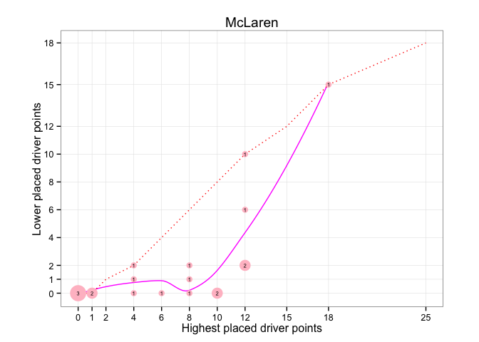 


```r
pointsDualPerformanceChart=function(raceoff,raceoff.summary,title,d1,d2){
  ggplot(raceoff.summary,aes(x=points.x,y=points.y))+stat_smooth(data=raceoff,aes(x=d1points,y=d2points),se=F,col='magenta')+geom_line(data=newpoints,aes(x=x,y=y),col='red',linetype='dotted')+geom_line(data=newpoints,aes(x=rev(y),y=rev(x)),col='blue',linetype='dotted')+stat_abline(col='grey')+geom_point(aes(size=cnt),col='pink')+geom_text(aes(label=cnt),size=2)+scale_size(range=c(2,6),name="Count")+xlab(d1)+ylab(d2)+ggtitle(title)+scale_y_continuous(breaks = newpoints$x,minor_breaks=NULL) +scale_x_continuous(breaks = newpoints$x,minor_breaks=NULL)+coord_fixed()+theme_bw()+guides(size=FALSE)
  }
```


"If we are going to make a mark, it may as well be a meaningful one. The simplest - and most useful - meaningful mark is a digit." John W Tukey, "Some Graphic and Semigraphic Displays", commenting on stem-and-leaf plots, in T A Bancroft,ed., Statistical Papers in Honot of George W Snedecor,1972, p296, quoted in Edward R. Tufte, Envisioning Information, 1990, p46.


```r
pointsDualPerformanceChart(raceoff,raceoff.summary,"Points Awarded by Race, McLaren, 2014",'BUT','MAG')
```

```
## geom_smooth: method="auto" and size of largest group is <1000, so using loess. Use 'method = x' to change the smoothing method.
```

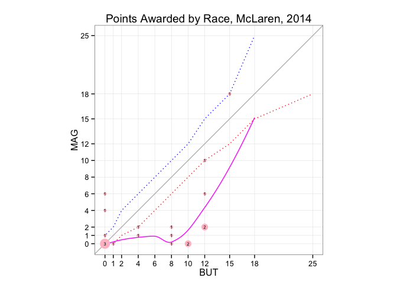 


```r
driverPos=function(raceoff,d1,d2){
  ggplot(raceoff,aes(x=round))+geom_hline(yintercept=3.5,colour='grey',linetype='dotted')+geom_hline(yintercept=10.5,colour='grey',linetype='dashed')+geom_hline(yintercept=0.5,colour='grey',linetype='dotted')+geom_hline(yintercept=22.5,colour='grey',linetype='dotted')+geom_text(aes(y=position.x,fontface=ifelse((positionText.x=='R'), 'italic' , 'plain')),label=d1,size=3)+geom_text(aes(y=position.y,fontface=ifelse((positionText.y=='R'), 'italic' , 'plain')),label=d2,size=3)+xlab('Round')+ylab('Position')+geom_segment(aes(x=round,xend=round,y=d1pos-0.25,yend=d2pos+0.25,col=topd2)) +guides(colour=FALSE)+scale_x_continuous(breaks = 1:22,minor_breaks=NULL)+scale_y_reverse(breaks = c(1,5,10,15,20),minor_breaks=1:22)+theme_bw()
  }

driverPoints=function(raceoff,d1,d2){
  ggplot(raceoff,aes(x=round))+geom_hline(yintercept=0.5,colour='grey',linetype='dotted')+geom_hline(yintercept=24.5,colour='grey',linetype='dotted')+geom_text(aes(y=points.x),label=d1,size=3)+geom_text(aes(y=points.y),label=d2,size=3)+xlab('Round')+ylab('Points')+geom_segment(aes(x=round,xend=round,y=d1points-0.25,yend=d2points+0.25,col=topd2)) +guides(colour=FALSE)+scale_x_continuous(breaks = 1:22,minor_breaks=NULL)+scale_y_continuous(breaks = newpoints$x,minor_breaks=NULL,limits=c(0.2,25))+theme_bw()
  }
```


```r
driverPoints(raceoff,'BUT','MAG')
```

```
## Warning: Removed 6 rows containing missing values (geom_text).
```

```
## Warning: Removed 7 rows containing missing values (geom_text).
```

```
## Warning: Removed 3 rows containing missing values (geom_segment).
```

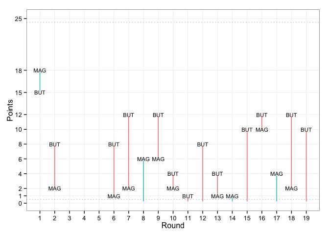 


If we further annotate these charts with a text label that identifies the qualifying and grid position of each driver, we can provide an even more complete summary of how the drivers compared over the qualifying and race sessions. To maximise the use of space, we can drop the name labels and instead just rely on the colour field to identify which driver was higher placed at the end of the race.

...

Need a 'last classified position' line...
...


```r
driverPos(raceoff,'BUT','MAG')
```

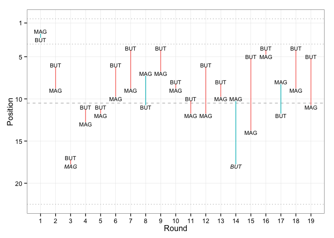 

                      

```r
ggplot(raceoff,aes(x=round))+geom_text(aes(y=points.x),label='BUT',size=3)+geom_text(aes(y=points.y),label='MAG',size=3)+xlab('Round')+ylab('Points')+geom_segment(aes(x=round,xend=round,y=d1points-0.25,yend=d2points+0.25,col=topd2))+ylim(0.2,25)+scale_y_continuous(breaks = newpoints$x,minor_breaks=NULL)+guides(colour=FALSE)
```

```
## Scale for 'y' is already present. Adding another scale for 'y', which will replace the existing scale.
```

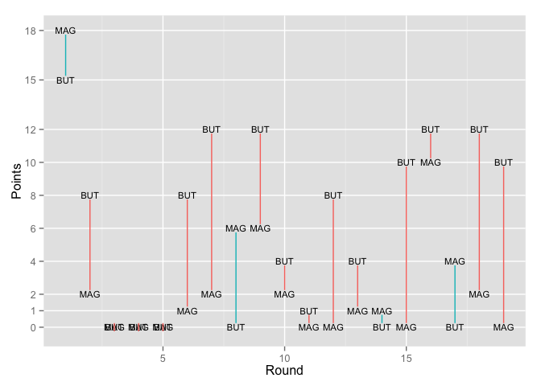 


```r
ggplot(raceoff.team.summary,aes(x=d1points,y=d2points))+stat_smooth(se=F,col='magenta')+geom_line(data=newpoints,aes(x=x,y=y),col='red',linetype='dotted')+geom_point(aes(size=cnt))+xlab('Highest placed driver points')+ylab('Lower placed driver points') +scale_size_continuous(range=c(2,6),limits = c(1, 3),breaks = c(1,2,3))+ggtitle('McLaren')+scale_y_continuous(breaks = newpoints$x,minor_breaks=NULL) +scale_x_continuous(breaks = newpoints$x,minor_breaks=NULL)+coord_fixed()
```

```
## geom_smooth: method="auto" and size of largest group is <1000, so using loess. Use 'method = x' to change the smoothing method.
```

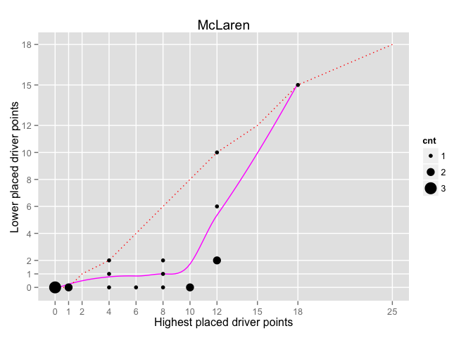 


```r
ggplot(raceoff.summary,aes(x=points.x,y=points.y))+stat_smooth(se=F,col='magenta')+geom_line(data=newpoints,aes(x=x,y=y),col='red')+geom_line(data=newpoints,aes(x=rev(y),y=rev(x)),col='blue')+stat_abline(col='grey')+geom_point(aes(size=cnt))+xlab('BUT')+ylab('MAG') +scale_size_continuous(range=c(2,6),limits = c(1, 3), breaks = c(1,2,3),name="Count")+ggtitle("Points awarded, McLaren, 2014")+scale_y_continuous(breaks = newpoints$x,minor_breaks=NULL) +scale_x_continuous(breaks = newpoints$x,minor_breaks=NULL)+coord_fixed()
```

```
## geom_smooth: method="auto" and size of largest group is <1000, so using loess. Use 'method = x' to change the smoothing method.
```

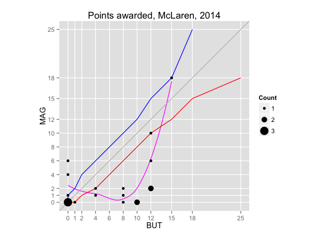 


```r
poslist=data.frame(x=1:23,y=2:24)
raceoff.summary=ddply(raceoff,.(position.x,position.y),summarise,cnt=length(round))
raceoff.team.summary=ddply(raceoff,.(d1points,d2points),summarise,cnt=length(round))


ggplot(raceoff.summary,aes(x=position.x,y=position.y))+stat_smooth(se=F,col='magenta')+geom_line(data=poslist,aes(x=x,y=y),col='red')+geom_line(data=poslist,aes(x=y,y=x),col='blue')+stat_abline(col='grey')+geom_point(aes(size=cnt))+scale_size(range=c(2,6))+scale_x_reverse()+scale_y_reverse()+xlab('BUT')+ylab('MAG')+scale_size_continuous(range=c(2,6),limits = c(1, 25), breaks = c(1,2,3))
```

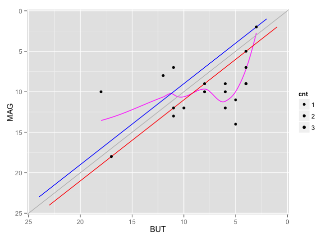 


```r
raceoff=merge(hamilton[,c('points','position','positionText','round')],rosberg[,c('points','position','positionText','round')],by='round')
raceoff$topd2=(raceoff$position.x>raceoff$position.y)
#Hack final round points
raceoff[raceoff['round']==19,]$points.x=raceoff[raceoff['round']==19,]$points.x/2
raceoff[raceoff['round']==19,]$points.y=raceoff[raceoff['round']==19,]$points.y/2
raceoff=ddply(raceoff, .(round),transform,
              d1pos=max(position.x,position.y),
              d2pos=min(position.x,position.y),
              d1points=max(points.x,points.y),
              d2points=min(points.x,points.y))

raceoff.summary=ddply(raceoff,.(points.x,points.y),summarise,cnt=length(round))
raceoff.team.summary=ddply(raceoff,.(d1points,d2points),summarise,cnt=length(round))
```

```r
pointsPerformanceChart(raceoff,raceoff.team.summary,'Mercedes')
```

```
## geom_smooth: method="auto" and size of largest group is <1000, so using loess. Use 'method = x' to change the smoothing method.
```

```
## Warning in simpleLoess(y, x, w, span, degree, parametric, drop.square,
## normalize, : pseudoinverse used at 14.95
```

```
## Warning in simpleLoess(y, x, w, span, degree, parametric, drop.square,
## normalize, : neighborhood radius 10.05
```

```
## Warning in simpleLoess(y, x, w, span, degree, parametric, drop.square,
## normalize, : reciprocal condition number 3.3211e-17
```

```
## Warning in simpleLoess(y, x, w, span, degree, parametric, drop.square,
## normalize, : at 25.05
```

```
## Warning in simpleLoess(y, x, w, span, degree, parametric, drop.square,
## normalize, : radius 0.0025
```

```
## Warning in simpleLoess(y, x, w, span, degree, parametric, drop.square,
## normalize, : all data on boundary of neighborhood. make span bigger
```

```
## Warning in simpleLoess(y, x, w, span, degree, parametric, drop.square,
## normalize, : There are other near singularities as well. 0.0025
```

```
## Warning in simpleLoess(y, x, w, span, degree, parametric, drop.square,
## normalize, : zero-width neighborhood. make span bigger
```

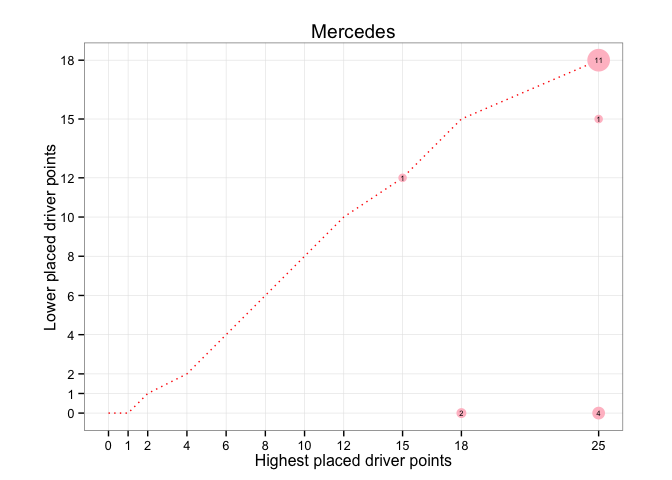 


```r
ggplot(raceoff,aes(x=round))+geom_text(aes(y=points.x),label='HAM',size=3)+geom_text(aes(y=points.y),label='ROS',size=3)+xlab('Round')+ylab('Points')+geom_segment(aes(x=round,xend=round,y=d1points-0.25,yend=d2points+0.25,col=topd2))+scale_y_continuous(breaks = newpoints$x,minor_breaks=NULL) +guides(colour=FALSE)+scale_x_continuous(breaks = 1:22,minor_breaks=NULL)
```

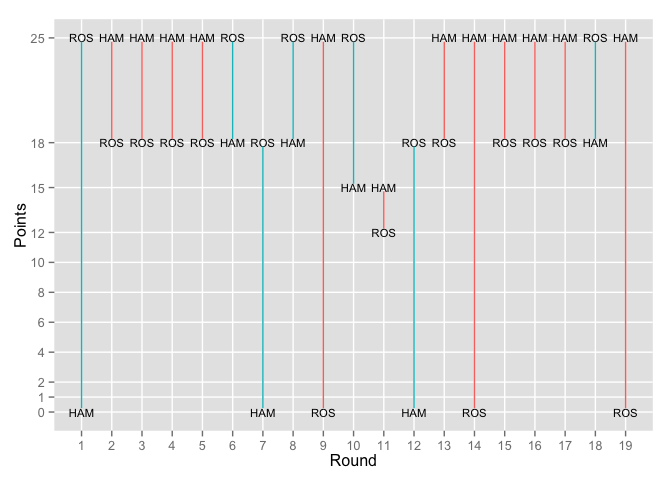 


```r
driverPoints(raceoff,'HAM','ROS')
```

```
## Warning: Removed 3 rows containing missing values (geom_text).
```

```
## Warning: Removed 3 rows containing missing values (geom_text).
```

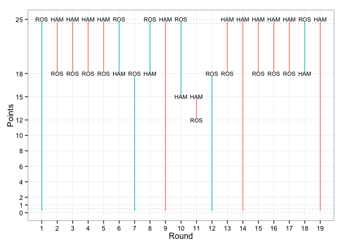 


```r
driverPos(raceoff,'HAM','ROS')
```

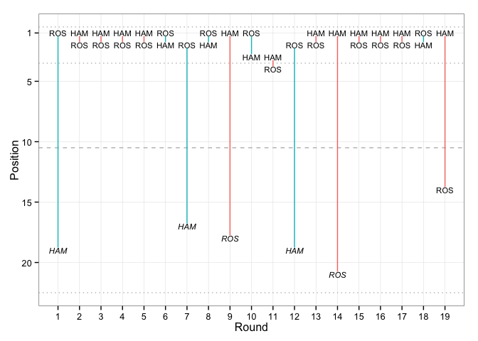 


```r
pointsDualPerformanceChart(raceoff,raceoff.summary,"Points Awarded by Race, Mercedes, 2014",'HAM','ROS')
```

```
## geom_smooth: method="auto" and size of largest group is <1000, so using loess. Use 'method = x' to change the smoothing method.
```

```
## Warning in simpleLoess(y, x, w, span, degree, parametric, drop.square,
## normalize, : pseudoinverse used at 14.95
```

```
## Warning in simpleLoess(y, x, w, span, degree, parametric, drop.square,
## normalize, : neighborhood radius 10.05
```

```
## Warning in simpleLoess(y, x, w, span, degree, parametric, drop.square,
## normalize, : reciprocal condition number 3.3211e-17
```

```
## Warning in simpleLoess(y, x, w, span, degree, parametric, drop.square,
## normalize, : at 25.05
```

```
## Warning in simpleLoess(y, x, w, span, degree, parametric, drop.square,
## normalize, : radius 0.0025
```

```
## Warning in simpleLoess(y, x, w, span, degree, parametric, drop.square,
## normalize, : all data on boundary of neighborhood. make span bigger
```

```
## Warning in simpleLoess(y, x, w, span, degree, parametric, drop.square,
## normalize, : There are other near singularities as well. 0.0025
```

```
## Warning in simpleLoess(y, x, w, span, degree, parametric, drop.square,
## normalize, : zero-width neighborhood. make span bigger
```

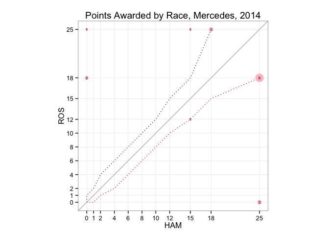 


```r
raceoff.summary=ddply(raceoff,.(position.x,position.y),summarise,cnt=length(round))

ggplot(raceoff.summary,aes(x=position.x,y=position.y))+stat_smooth(se=F,col='magenta')+geom_line(data=poslist,aes(x=x,y=y),col='red')+geom_line(data=poslist,aes(x=y,y=x),col='blue')+stat_abline(col='grey')+geom_point(aes(size=cnt))+scale_size(range=c(2,6))+scale_x_reverse()+scale_y_reverse()+xlab('HAM')+ylab('ROS')+guides(size=FALSE)
```

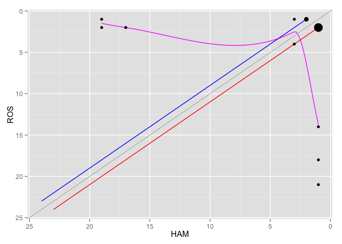 
