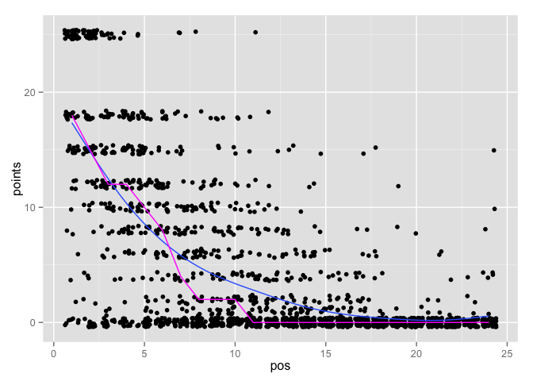
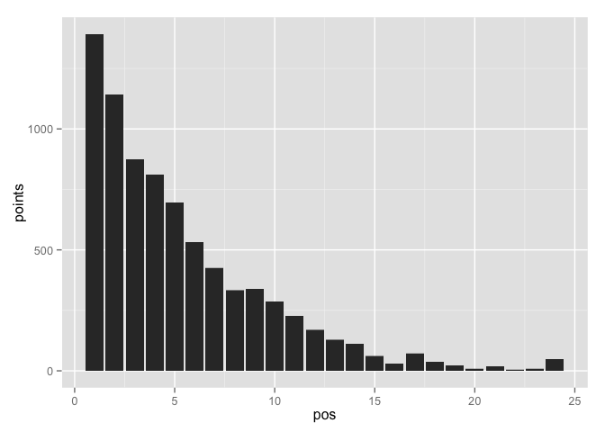
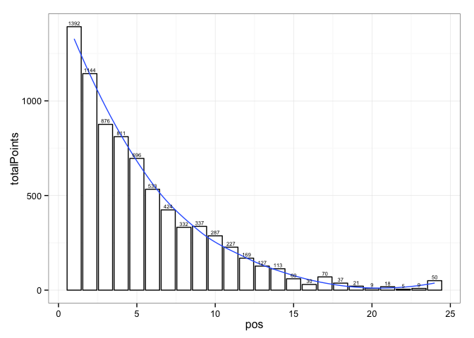
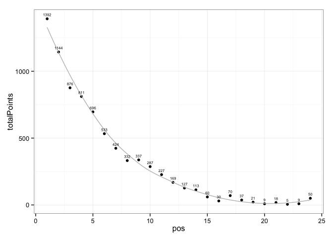
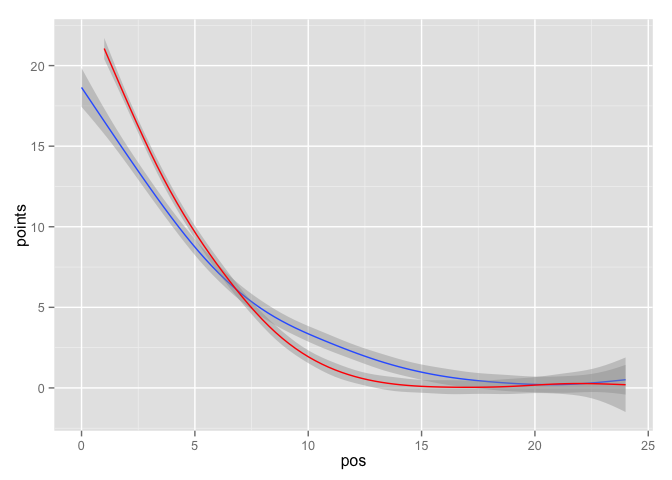

# Points, Prizes and Competition

As a money game, the Formula One prize money awarded to teams at the end of the season is dependent on each team's ranking in the Constructors' Championship and its performance in previous years (Joe Saward, ["How much money does Marussia gain from 2013?"](http://joesaward.wordpress.com/2013/11/27/how-much-money-does-marussia-gain-from-2013/), [Why customer cars and third cars are wrong](http://joesaward.wordpress.com/2014/10/27/why-customer-cars-and-third-cars-are-are-wrong/) and [The F1 financial structure explained (in four sentences)](http://joesaward.wordpress.com/2014/11/05/the-f1-financial-structure-explained-in-four-sentences/)). As the Constructors' Championship is decided based on the total number of points awarded to a team over the course of a season, this makes *points* a valuable currency - as long as you have more of them than the teams you are directly competing against.

The points mechanism also drives the season long competitive aspect that fans follow via the Drivers' and Constructors' World Championship standings. Alongside the question of who will win a particular race is how the Drivers' Championship in particular will stand at the end of the race.

Over the years, the points schemes have been modified in order to make these championships more interesting as competitions that last the length of the season, rather than being decided part way through it. The thinking presumably goes that if a competition has been won by the end of the European season, there may be less inclination for an audience to watch the last few races. The 2014 season's doubling of the points haul in the final race of the season was presumably introduced to keep championship hopes alive in the tail end of the season; and as financial stresses took their toll on the the on smaller teams towards the end of that season, the possibility arose of teams running third cars that wouldn't be eligible to score points, but that could prevent other teams taking the points; (any points that would otherwise have been awarded to a non-third car finishing in the same position are voided). Such a situation raised all sorts of possibilities about points voiding strategies a team might try to employ, possibilities that we might be able to model.

In a later chapter, we'll see how well teams and drivers actually compare in trying to maximise their points haul for the team over a series of races. We'll also look at how the different points allocation schemes over the year might have rewarded teams and drivers differently over the years if the racing results had been the same but the points schemes were different.

In this chapter, I take inspiration from an idea I first came across in *The Numbers Game* by Chris Anderson and David Sally, where those authors looked at the points values in Europe's top football leagues (that is, *soccer* leagues) according to the number of goals scored by a team in each match (p. 99). Goals are scored per match, teams win points on a per match basi, leading to the question: *if a team scores N goals in a match, how many points is it likely to get from that match?*

A complementary question that occurred to me for the case of F1 was this: *can we look at how "valuable" particular grid positions typically are in terms of the amount of points they tend to result in?* With different numbers of points being awarded for different positions, we can also explore the extent to which the points take from particular grid positions matches the points take we might expect if each car finished the race according to its original grid position.

To begin with, let's concentrate on championships from 2010 to 2013, where the point allocation was 25 points for first place, 18 for second, then 15,12,10,8,6,4,2,1 respectively for positions third to tenth. All other placings, as well as unclassified results, scored 0 points.

Let's see how many races there were in that period:


```r
library(DBI)
ergastdb = dbConnect(RSQLite::SQLite(), './ergastdb13.sqlite')

dbGetQuery(ergastdb,
           'SELECT count(distinct(raceId)) AS numRaces 
           FROM races WHERE year>=2010 AND year<=2013')
```

```
##   numRaces
## 1       77
```

We'll start by exploring the distribution of points by  grid position for the 2010-2013 period using a variety of graphical techniques, framed around a series of questions.

For example, for each grid position, how many points were awarded for cars starting in each position? We can use a jittered scatterplot to view each result in a single chart. We can also try to fit a linear model to the data to see how points allocation per grid position varies in general terms according to such a model.


```r
require(ggplot2)
results=dbGetQuery(ergastdb,
                   'SELECT grid as pos, points 
                   FROM races r JOIN results rs 
                   WHERE r.raceId=rs.raceId
                   AND year>=2010 AND year<=2013')
## ?how about checking that driver is placed?
##dbGetQuery(ergastdb,'select grid as pos,position,points from races r join results rs where  r.raceId=rs.raceId and year>2010 and position NOT NULL')

g=ggplot(results[results['pos']>0,],aes(x=pos,y=points))+geom_jitter()
g=g+stat_smooth(se=FALSE)
g+stat_summary(fun.y=median,geom='line',colour='magenta')
```

 

The first thing we notice from this chart is how varied the distribution of points per grid position is. There is a very definite concentration of maximum points scored by cars that start on the front row of the grid, and, not surprisingly, lower points predominantly taken by cars starting from the back half of the grid, with a few exceptions.

The fitted line suggests that on average pole position will typically earn about 18 points, smoothly decreasing from there, with a slight upturn for the lowest placed car reflecting two hight scoring finishes from back of the grid starts. However, the distribution of points away from the line may makes us wary of reading too much into it as a useful guide.

The magenta line shows the *median* number of points received from each starting position. This line shows us that to stand at least a fifty-fifty chance of getting into the points, you need to start in the top 10 positions on the grid.

Another way of visually summarising the count of each points finish from a particular grid starting position is to use a symbol sized proportionally to the count.


```r
ggplot(results[results['pos']>0,],aes(x=pos,y=points))+stat_sum(aes(size = ..n..))+stat_smooth(se=FALSE)
```

 

A close reading of the chart shows the 10th position scoring well at the two points level (the circle is larger than for any other grid position), although getting an accurate value from the symbol size is difficult. We can *explicitly* describe how many times a particular points score was made from a given grid position start by using a text label to display a count of the number of times each combination occurred. To try to emphasise the differences in size of the counts, we can scale the size according to the square root of the count.


```r
library(plyr)
#Count the occurrence of particular points scores per grid position
results2=ddply(results,.(pos,points),summarise,cnt=length(pos))
#Plot the result using the square root of the count to scale the text label size
g=ggplot(results2, aes(x=pos, y=points)) 
#As a percentage
#g=g+ geom_text(aes(label = format(100*cnt/nrow(results[results['pos']==1,]),digits=1), size=sqrt(cnt)))
g=g+ geom_text(aes(label = cnt, size=sqrt(cnt)))
#Use a simple theme so it's easier to see the smallest labels
g+theme_bw()+theme(legend.position="none")
```

 

Now we can see how the car starting tenth on the grid scores two points 13 times over the sample period. Drivers starting from 10th also score 0 points fewer times than those starting in 8th or 9th, 27 times (the same as starting from 7th) compared to 33 times for 8th and 31 for 9th.

We can also clearly see how significant an advantage starting in pole position, or indeed, on the front row of the grid, is. In all, drivers starting from the front row collect the full 25 points in 37 + 24 = 61 of the races. They also score 0 points in relatively few situations.

To look at the total - or mean - points haul per grid position, we can use a stacked bar chart.


```r
mediator_mean <- function(x){
  return(data.frame(y = mean(x), label = format(mean(x),digits=2)))
}

mediator_median <- function(x){
  return(data.frame(y = median(x), label = format(median(x),digits=2)))
}

ggplot(results[results['pos']>0,],aes(x=pos,y=points))+stat_summary(fun.y="mean", geom="bar") +stat_summary(fun.data = mediator_mean, geom = "text", vjust=-0.4, size=2)
```

 


```r
ggplot(results[results['pos']>0,],aes(x=pos,y=points))+geom_bar(stat='identity')
```

 

points2010=c(25,18,15,12,10,8,6,4,2,1)
points2003=c( 10,8,6,5,4,3,2,1)
points1991=c( 10,6,4,3,2,1)
#This helper function will generate a points list of a desired length
#Positions out of the points score 0
#if we don't pass in a points list, return a position list
pointsGen = function (pointslist='',len=30) if (length(pointslist)==1) seq(1,len) else c(pointslist,rep(0,len-length(pointslist)))
df=data.frame(position=pointsGen(),points2010=pointsGen(points2010),points2003=pointsGen(points2003),points1991=pointsGen(points1991))
df

results=merge(results,df[,c('position','points2010')],by.x='pos',by.y='position')

results['percent_take']=100*results['points']/results['points2010']
results[sapply(results['percent_take'], is.infinite) | is.na(results['percent_take']),]['percent_take']=0
results['delta']=results['points']-results['points2010']

pointsHaul=ddply(results, .(pos), summarize, totalPoints=sum(points),available=sum(points2010),meanPoints=mean(points),meanPercent=mean(percent_take),meanDelta=mean(delta))


```r
pointsHaul=ddply(results, .(pos), summarize, totalPoints=sum(points))
pointsHaul
```

```
##    pos totalPoints
## 1    0           0
## 2    1        1392
## 3    2        1144
## 4    3         876
## 5    4         811
## 6    5         696
## 7    6         533
## 8    7         424
## 9    8         332
## 10   9         337
## 11  10         287
## 12  11         227
## 13  12         169
## 14  13         127
## 15  14         113
## 16  15          60
## 17  16          30
## 18  17          70
## 19  18          37
## 20  19          21
## 21  20           9
## 22  21          18
## 23  22           5
## 24  23           9
## 25  24          50
```


```r
g=ggplot(pointsHaul[pointsHaul['pos']>0,],aes(x=pos,y=totalPoints))+geom_bar(stat='identity',fill='white',colour='black') +stat_smooth(se=FALSE)
g=g+geom_text(aes(label=totalPoints),
            vjust=-0.4,
            size=2)
g+theme_bw()
```

```
## geom_smooth: method="auto" and size of largest group is <1000, so using loess. Use 'method = x' to change the smoothing method.
```

 


```r
g=ggplot(pointsHaul[pointsHaul['pos']>0,],aes(x=pos,y=totalPoints))+geom_point() +stat_smooth(se=FALSE,col='grey')
g=g+geom_text(aes(label=totalPoints),
            vjust=-1,
            size=2)
g+theme_bw()
```

```
## geom_smooth: method="auto" and size of largest group is <1000, so using loess. Use 'method = x' to change the smoothing method.
```

 


g=ggplot(pointsHaul[pointsHaul['pos']>0,],aes(x=pos,y=meanPercent))+geom_point() 
g+theme_bw()

g=ggplot(pointsHaul[pointsHaul['pos']>0,],aes(x=pos,y=meanPoints))+geom_point() 
g+theme_bw()

What percentage of points available from the position did the starting positions take (ignoring half points effects).


??curve that says over 95% of starts in that position will get get that number of points  - percentile plot?

SO suppose I want to know the minimum number of points a driver is likely to get from a given position at least x% of the time. As a fraction, (100 - x)/100.

So if I want to know the mininum number of points likely to be scored in at least 80% of races??

?? qn=ddply(results,.(pos),summarise,q95=quantile(points,0.2))

points on average by grid pos 

 meanpointsperpos=ddply(results3,.(pos),summarize,mp=mean(points),medianp=median(points))
ggplot(meanpointsperpos,aes(pos,mp))+geom_bar(stat='identity')
ggplot(meanpointsperpos,aes(pos,medianp))+geom_bar(stat='identity')

ll=loess(points~pos,results)
plot(predict(ll, data.frame(pos = seq(1, 22, 1)), se = TRUE)$fit)

plot(-diff(predict(ll, data.frame(pos = seq(1, 22, 1)), se = TRUE)$fit))


Points by position
ggplot(results)+geom_bar(aes(x=pos),binwidth=1)+facet_wrap(~points)

heatmap points by position
http://learnr.wordpress.com/2010/01/26/ggplot2-quick-heatmap-plotting/

library(scales)
#rx=ddply(results,.(pos,points),summarise,cnt=length(pos))
rx=ddply(rx, .(pos), transform, rescale = rescale(cnt))
ggplot(rx, aes(factor(pos), factor(points))) + geom_tile(aes(fill = rescale),  colour = "white") + scale_fill_gradient(low = "white", high = "steelblue")+theme(panel.background=element_rect(fill = 'black'))


```r
results2=dbGetQuery(ergastdb,'select l.position as pos,points from races r join results rs join laptimes l where l.driverId=rs.driverId and l.raceId=rs.raceId and r.raceId=rs.raceId and year>2010 and lap=40')

ggplot()+stat_smooth(data=results,aes(x=pos,y=points))+stat_smooth(data=results2,aes(x=pos,y=points),col='red')
```

```
## geom_smooth: method="auto" and size of largest group is >=1000, so using gam with formula: y ~ s(x, bs = "cs"). Use 'method = x' to change the smoothing method.
## geom_smooth: method="auto" and size of largest group is >=1000, so using gam with formula: y ~ s(x, bs = "cs"). Use 'method = x' to change the smoothing method.
```

 
 position value charts
 
In their description of the points value of goals scored, Anderson and Sally also considered the *marginal points* produced per goal (p. 101), for example going from 0 to 1 goal, 1 to 2 goals, 2 to 3 goals and so on. That analysis was particularly relevant in the football context becuase it provides a way of valuing a player for his goal related points contribution based on which incremental goal or goals he scored in a match.

In the F1 context, we might look to the marginal points value of grid positions to see to what extent it makes sense for a driver to fight for an additional grid position based on the likely marginal points benefit of moving up a place. This sort of calculation might also highlight the extent to which there appear to be any clean vs. dirty side of the grid effects on expected points haul for given grid positions.


```r
library(plyr)
results3=dbGetQuery(ergastdb,'select grid as pos,points,r.raceId from races r join results rs where r.raceId=rs.raceId and year>2010')
deltapoints=ddply(results3,.(raceId),summarize, diff(points))
```

eg http://www.significancemagazine.org/details/webexclusive/878673/Formula-Fun-Comparing-F1-scoring-systems.html

To show the effect on ranking of different points allocations, we can use a particularly elegant chart known as a *slopegraph*. Originally designed by Edward Tufte, slopegraphs 


Rule Changes and Competitive Balance in Formula One Motor Racing
http://peer.ccsd.cnrs.fr/docs/00/58/20/85/PDF/PEER_stage2_10.1080%252F00036840701349182.pdf

Judde, Chris, Ross Booth, and Robert Brooks. "Second Place Is First of the Losers An Analysis of Competitive Balance in Formula One." Journal of Sports Economics 14.4 (2013): 411-439.

Langen, Martin; Krauskopf, Thomas (2010) : The election of a world
champion, CAWM discussion paper / Centrum für Angewandte Wirtschaftsforschung Münster,
No. 39
http://www.econstor.eu/bitstream/10419/51366/1/672458268.pdf

http://en.wikipedia.org/wiki/List_of_Formula_One_World_Championship_points_scoring_systems

McCarthy, Laurence M., and Kurt W. Rotthoff. "Incentives on the Starting Grid in Formula One Racing." (2013).

Dole, C. A. "Risk Taking in NASCAR: An Examination of Compensating Behavior and Tournament Theory in Racing." Journal of Economics and Economic Education Research 8.2 (2007).

Frick, Bernd, and Brad R. Humphreys. Prize structure and performance: Evidence from nascar. No. 2011-12. 2011.

different points regimes http://gweax.de/f1/ - but also itneresting to compare points in the season at which the drivers and/or team championship was decided; use 'race to championship' graphic?

number of races left * max points < difference between 1st and 2nd place after round N

dbGetQuery(ergastdb, 'SELECT year,round,MAX(points),MIN(points),MAX(points)-MIN(points),(SELECT MAX(r2.round) FROM driverStandings ds2 JOIN races r2 WHERE ds2.raceId=r2.raceId AND r2.year=r.year)-round AS x,CASE WHEN (MAX(points)-MIN(points))>(25*((SELECT MAX(r2.round) FROM driverStandings ds2 JOIN races r2 WHERE ds2.raceId=r2.raceId AND r2.year=r.year)-round)) THEN 1 ELSE 0 END AS over FROM  driverStandings ds JOIN races r WHERE ds.raceId=r.raceId AND position<=2 AND year>2010 GROUP BY year,round ORDER BY year,round')


also need to add in the max points

Can leader of drivers or team championship change after each race?

Let's create a dataframe that allows us to map from position to points for various points regimes.


```r
#Define points regimes using ordered lists of points for points scoring positions
points2010=c(25,18,15,12,10,8,6,4,2,1)
points2003=c( 10,8,6,5,4,3,2,1)
points1991=c( 10,6,4,3,2,1)

#This helper function will generate a points list of a desired length
#Positions out of the points score 0
#if we don't pass in a points list, return a position list
pointsGen = function (pointslist='',len=30) if (length(pointslist)==1) seq(1,len) else c(pointslist,rep(0,len-length(pointslist)))

#Example
print( pointsGen() )
```

```
##  [1]  1  2  3  4  5  6  7  8  9 10 11 12 13 14 15 16 17 18 19 20 21 22 23
## [24] 24 25 26 27 28 29 30
```

```r
print( pointsGen(points2010) )
```

```
##  [1] 25 18 15 12 10  8  6  4  2  1  0  0  0  0  0  0  0  0  0  0  0  0  0
## [24]  0  0  0  0  0  0  0
```

Generate a dataframe containing different points regimes so we can apply them as required.

```r
df=data.frame(position=pointsGen(),points2010=pointsGen(points2010),points2003=pointsGen(points2003),points1991=pointsGen(points1991))
```

dfx=dbGetQuery(ergastdb,'select * from races r JOIN results rs WHERE r.raceId=rs.raceId and year =2012 and round =2')


ddply(dfx,.(round), transform, year2010=sapply(position, function(x) if (is.na(x)) subset(df,select='points2010')[length(dfx),] else subset(df,select='points2010')[df$position==x,]))

Could we have a position change in championship after a race?

dbGetQuery(ergastdb,'SELECT year, round, MAX(points) AS P1, MIN(points) AS P2,MAX(points) - MIN(points) as deltapoints,  25/(MAX(points)-MIN(points)) AS excitement, CASE WHEN (MAX(points)-MIN(points))<=25 THEN 1 ELSE 0 END AS changeable,CASE WHEN (MAX(points)-MIN(points))<=7 THEN 1 ELSE 0 END AS changeable2 FROM driverStandings ds JOIN races r WHERE ds.raceId=r.raceId AND position <=2 and year>=2010 GROUP BY year,round')

dbGetQuery(ergastdb,'SELECT year, round, MAX(points) AS P1, MIN(points) AS P2,MAX(points) - MIN(points) as deltapoints,  43/(MAX(points)-MIN(points)) AS excitement, CASE WHEN (MAX(points)-MIN(points))<=43 THEN 1 ELSE 0 END AS changeable,CASE WHEN (MAX(points)-MIN(points))<=16 THEN 1 ELSE 0 END AS changeable2 FROM constructorStandings cs JOIN races r WHERE cs.raceId=r.raceId AND position <=2 and year>=2010 GROUP BY year,round')


Could a driver do s/thing in this race that means he can win the championship in the next race?

payments - http://joesaward.wordpress.com/2013/11/27/how-much-money-does-marussia-gain-from-2013/

#Helper function to display database query result as a formatted table
kdb=function(q){ kable(dbGetQuery(ergastdb,q)) }
