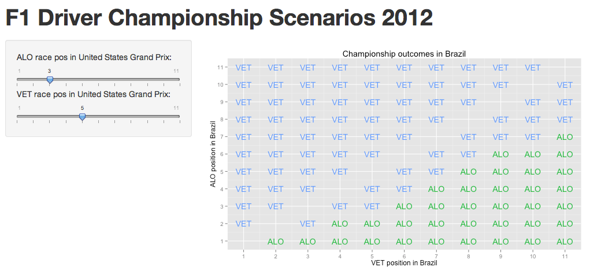

A Simple Shiny Explorer - The Race to the Championship
========================================================

With the final two rounds of the 2012 Championship, Sebastian Vettel and Fernando Alonso were separated by just 10 points, with third placed Kimi Raikkonen over 50 points behind Vettel, and therefore out of the running for the driver's World Champion position.


```r
require(devtools)
source_url("https://gist.githubusercontent.com/psychemedia/11187809/raw/ergastR-core.R")

kable(head(seasonStandings(2012, 18), n = 3))
```

|  year|driverId   |  pos|  points|  wins|car       |
|-----:|:----------|----:|-------:|-----:|:---------|
|  2012|vettel     |    1|     255|     5|red_bull  |
|  2012|alonso     |    2|     245|     3|ferrari   |
|  2012|raikkonen  |    3|     198|     1|lotus_f1  |


There are essentially two steps (with an optional middle third step) to a Shiny model:

- a file (*ui.R*) containing  
- a file (*server.R*) containing
- an optional file (*global.R*) 


work out the points difference between VET and ALO for all their possible points combinations in the US Grand Prix;
calculate the points difference going into the Brazilian Grand Prix;
calculate the possible outcomes depending on placements in the Brazilian Grand Prix (essentially, an application of the algorithm I did in the original post).
The Shiny app requires two bits of code – a UI in file ui.R, in which I define two sliders that allow me to set the actual (or anticpated, or possible;-) race classifications in the US for Vettel and Alonso:



pseudocode

source('~/Dropbox/wranglingf1datawithr/src/ergastR-core.R')


#The current points standings
vetPoints=255
aloPoints=245
 
#The points awarded for each place in the top 10; 0 points otherwise
points=[25,18,15,12,10,8,6,4,2,1,0]
 
#Print a header row (there's probably a more elegant way of doing this...;-)
for x in ['VET\ALO',1,2,3,4,5,6,7,8,9,10,'11+']: print str(x)+'\t',
print ''
 
#I'm going to construct a grid, VET's position down the rows, ALO across the columns
for i in range(len(points)):
    #Build up each row - start with VET's classification
    row=[str(i+1)]
    #Now for the columns - that is, ALO's classification
    for j in range(len(points)):
        #Work out the points if VET is placed i+1  and ALO at j+1 (i and j start at 0)
        #Find the difference between the points scores
        #If the difference is >= 25 (the biggest points diff ALO could achieve in Brazil), VET wins
        if ((vetPoints+points[i])-(aloPoints+points[j])>=25):
            row.append("VET")
        else: row.append("?")
    #Print the row a slightly tidier way...
    print '\t'.join(row)
    
    
    
    
    
    
library(shiny)
 
shinyUI(pageWithSidebar(
   
  # Application title
  headerPanel("F1 Driver Championship Scenarios 2012"),
   
  # Sidebar with a slider input for number of observations
  sidebarPanel(
    sliderInput("alo", 
                "ALO race pos in United States Grand Prix:", 
                min = 1, 
                max = 11, 
                value = 1),
    sliderInput("vet", 
                "VET race pos in United States Grand Prix:", 
                min = 1, 
                max = 11, 
                value = 2)
  ),
   
  # Show a plot of the generated model
  mainPanel(
    plotOutput("distPlot")
  )
))


library(shiny)
library(ggplot2)
library(reshape)
 
# Define server logic required to generate and plot a random distribution
shinyServer(function(input, output) {
  points=data.frame(pos=1:11,val=c(25,18,15,12,10,8,6,4,2,1,0))
  points[[1,2]]
  a=245
  v=255
   
  pospoints=function(a,v,pdiff,points){
    pp=matrix(ncol = nrow(points), nrow = nrow(points))
    for (i in 1:nrow(points)){
      for (j in 1:nrow(points))
        pp[[i,j]]=v-a+pdiff[[i,j]]
    }
    pp
  }
   
  pdiff=matrix(ncol = nrow(points), nrow = nrow(points))
  for (i in 1:nrow(points)){
    for (j in 1:nrow(points))
      pdiff[[i,j]]=points[[i,2]]-points[[j,2]]
  }
   
  ppx=pospoints(a,v,pdiff,points)
   
  winmdiff=function(vadiff,pdiff,points){
    win=matrix(ncol = nrow(points), nrow = nrow(points))
    for (i in 1:nrow(points)){
      for (j in 1:nrow(points))
        if (i==j) win[[i,j]]=''
        else if ((vadiff+pdiff[[i,j]])>=0) win[[i,j]]='VET'
        else win[[i,j]]='ALO'
    }
    win
  }
   
  # Function that generates a plot of the distribution. The function
  # is wrapped in a call to reactivePlot to indicate that:
  #
  #  1) It is "reactive" and therefore should be automatically 
  #     re-executed when inputs change
  #  2) Its output type is a plot 
  #
  output$distPlot <- renderPlot({
    wmd=winmdiff(ppx[[input$vet,input$alo]],pdiff,points)
    wmdm=melt(wmd)
    g=ggplot(wmdm)+geom_text(aes(X1,X2,label=value,col=value))
    g=g+xlab('VET position in Brazil')+ ylab('ALO position in Brazil')
    g=g+labs(title="Championship outcomes in Brazil")
    g=g+ theme(legend.position="none")
    g=g+scale_x_continuous(breaks=seq(1, 11, 1))+scale_y_continuous(breaks=seq(1, 11, 1))
    print(g)
  })
})


https://github.com/psychemedia/f1DataJunkie/tree/master/f1djR/shinychamp

https://gist.github.com/psychemedia/6cead2633fdc8d158542
