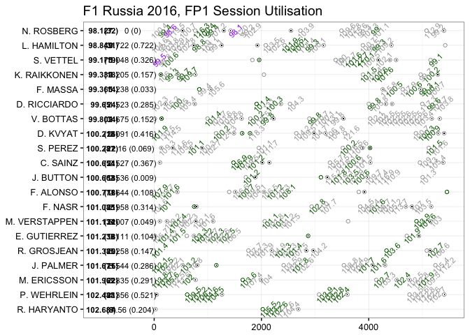
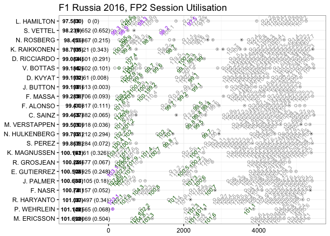
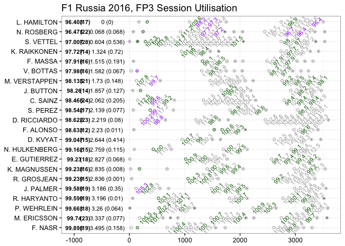
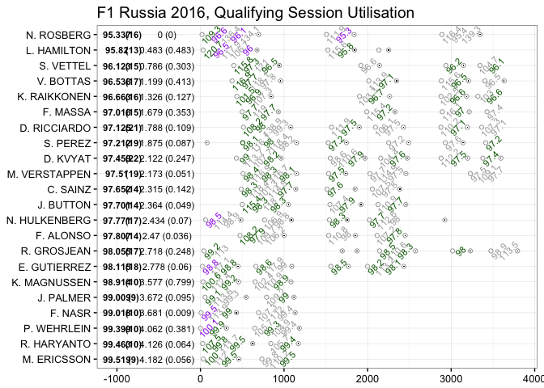
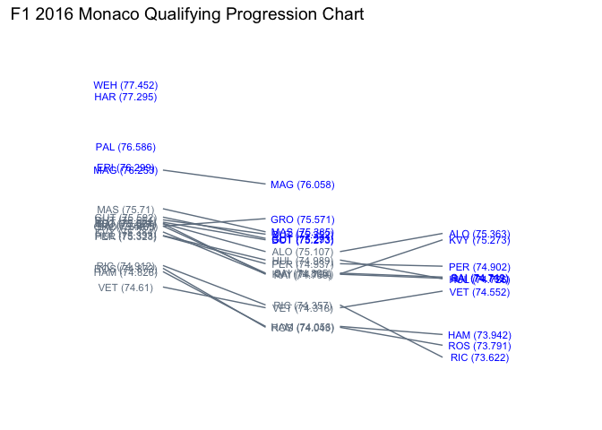

```r
source("practiceQualiLaps.R")
library('ggplot2')
```


```r
suPlot=function(dd,stub=''){
  g=ggplot(dd) + geom_point(aes(x=time,y="Time"),shape=1)
  g=augmented_session_utilisation_chart(aug_laps,3)
  g+ggtitle(paste('F1',stub,'Session Utilisation'))
}
```


```r
tla_lookup=read.delim("~/Dropbox/various/tla_lookup_2016.txt")

plaps_1= read.csv("~/Dropbox/various/RUS_FP1_2016.csv")
plaps_1=merge(plaps_1,tla_lookup,by.x='number',by.y='CAR')
aug_laps=rawLap_augment_laptimes(plaps_1)
suPlot(aug_laps,'Russia 2016, FP1')
```




```r
plaps_2= read.csv("~/Dropbox/various/RUS_FP2_2016.csv")
plaps_2=merge(plaps_2,tla_lookup,by.x='number',by.y='CAR')
aug_laps=rawLap_augment_laptimes(plaps_2)
suPlot(aug_laps,'Russia 2016, FP2')
```




```r
plaps_3= read.csv("~/Dropbox/various/RUS_FP3_2016.csv")
plaps_3=merge(plaps_3,tla_lookup,by.x='number',by.y='CAR')
aug_laps=rawLap_augment_laptimes(plaps_3)
suPlot(aug_laps,'Russia 2016, FP3')
```




```r
plaps_q= read.csv("~/Dropbox/various/rus16_qualilaptimes.csv")
plaps_q=merge(plaps_q,tla_lookup,by.x='number',by.y='CAR')
aug_laps=rawLap_augment_quali(plaps_q)
suPlot(aug_laps,'Russia 2016, Qualifying')
```




quali_utilisation

g=ggplot(dd) + geom_point(aes(x=time,y="Time"),shape=1)
g=augmented_session_utilisation_chart(aug_laps,3)
g+ggtitle('F1 Bahrain 2016, Qualifying Session Utilisation')

st=stintFinder(aug_laps)
longruns=longrunFinder(st,aug_laps,4)
longrunsplot_min(longruns)
longrunsplot_model(longruns,'lm',cutoffpc=1.3)
longrunsplot_model(longruns[longruns['stime']<96,],'lm')


bah_2016_fp2_sectors <- read.delim("~/tmp/bah_2016_fp2_sectors.tsv")
View(bah_2016_fp2_sectors)
dd=bah_2016_fp2_sectors
dd['time']=dd['BS1']+dd['BS2']+dd['BS3']
g=ggplot(dd) + geom_point(aes(x=time,y="Time"),shape=1)
#Split the drivers into two groups - odd position number and even position number
#Use each group as a separate y-axis categorical value
g = g + geom_vline(xintercept=92.93,colour='grey',linetype='dotted')
g = g + geom_vline(xintercept=93.47, colour='grey',linetype='dotted')

g = g + geom_text(data=subset(dd, subset=(pos %% 2!=0)),
                  aes(x=time, y="1,3,5,...", label=paste(TLA,' (',TEAM,')',sep='')), size=3)
g = g + geom_text(data=subset(dd, subset=(pos %% 2==0)),
                  aes(x=time, y="2,4,6,...", label=paste(TLA,' (',TEAM,')',sep='')), size=3)
#Tweak the theme
g = g + theme_classic() + ylab(NULL) + xlab('Laptime (s)')
#Add in some intercept lines using the values we used before
g=g+coord_flip() 
g+ggtitle('F1 2016 Bahrain FP2')


g+ggtitle('F1 2016 Bahrain FP2')
g = g + geom_vline(xintercept=94.0, col='grey')
#Flip the co-ordinates
g=g+coord_flip() 
g


library(ggrepel)
g=ggplot(bah_2016_fp2_sectors)
g+geom_point(aes(x=BS3,y=BSP3))+geom_text_repel(aes(x=BS3,y=BSP3,label=paste(TLA,' (',TEAM,')',sep='')), size=3)+ggtitle('2016 F1 Bahrain FP2 Sector Speeds and Times, Sector 3')+ylab('Speed (km/h)')+xlab('Sector time (s)')+theme_bw()


BAH_2015_fp2['pit']= BAH_2015_fp2['pit']=='True'


source('streakiness.R')
stints=data.frame()
for (name in levels(aug_laps$name)){
dft=aug_laps[aug_laps$name==name,]
dft=streaks(dft$stint)
dft['name']=name
dft=dft[c('name','start','end','l')]
stints=rbind(stints,dft)
}
#Number the stints for each driver
stints=ddply(stints,.(name),transform,stintNumber=1:length(l))


longruns=merge(stints[abs(stints['l'])>=8,], aug_laps,by.x=c('name','stintNumber'), by.y=c('name','stint'))
longruns=arrange(longruns,name,lapNumber)

ddply( aug_laps, .(name, stint),summarise, lapsInStint=max(lapInStint) ) 

g= ggplot(longruns[!longruns['outlap'] & !longruns['pit'],])
g=g+geom_line(aes(x=lapInStint, y=stime, group=stintNumber, colour=factor(stintNumber)))
g+facet_wrap(~name)


drivers=c('L. HAMILTON', 'N. ROSBERG', 'K. RAIKKONEN','S. VETTEL' )
g= ggplot(longruns[!longruns['outlap'] & !longruns['pit'] & longruns$name %in% drivers & longruns['stime']<1.07*min(longruns['purple']),], aes(x=lapInStint, y=stime,colour=interaction(stintNumber,name)))
g+geom_smooth(method = "lm", aes( group=interaction(stintNumber,name))) + geom_point(aes(shape=interaction(stintNumber,name)))+ scale_colour_brewer(palette="Set1")

g= ggplot(longruns[!longruns['outlap'] & !longruns['pit'] & longruns$name %in% drivers & longruns['stime']<1.12*min(longruns['purple']),], aes(x=lapInStint, y=stime,colour=interaction(stintNumber,name)))
g+geom_smooth(method = "lm", aes( group=interaction(stintNumber,name))) + geom_point(aes(shape=interaction(stintNumber,name)))+ scale_colour_brewer(palette="Set1")

source("fia_classification_scraper.R")


```r
source('ergastR-core.R')
#qr=qualiResults.df(2016,2)

#source('fia_classification_scraper.R')
source('qualicharts.R')
source('ergastR-core.R')
qr=qualiResults.df(2016,6)
qr=quali_progression_ergast_tx(qr)
qrm=quali_progression_ergast_melt(qr)

core_qualifying_rank_slopegraph(qr,qrm,spacer=0.21)+ggtitle('F1 2016 Monaco Qualifying Progression Chart')
```


```r
core_qualifying_time_slopegraph(qr,qrm,spacer=0.21)+ggtitle('F1 2016 Monaco Qualifying Progression Chart')+ylim(73,78)
```

```
## Warning: Removed 1 rows containing missing values (geom_text).
```


#EVent detection

Q1 to Q2 
Button and Sainz failed to improve on their Q1 times

Q2 to Q3
Bottas and Hulkenberg failed to improve on their Q2 times


```r
 qsr=subset(qr, subset=(q1time<q2time))
 qsr['driverName']=factor(qsr[['driverName']])
 cat(paste0(knit_child(text="Going from Q1 to Q2:\n",quiet=TRUE),'\n'))
```

```
## 
## Going from Q1 to Q2:
```

```r
 for (name in levels(qsr$driverName)) {
 text="* `r name` failed to improve his time, recording `r qsr[qsr['driverName']==name,]['q2time']` compared to `r qsr[qsr['driverName']==name,]['q1time']` (`r qsr[qsr['driverName']==name,]['q2time']-qsr[qsr['driverName']==name,]['q1time']`s slower)"
cat(paste0(knit_child(text=text,quiet=TRUE),'\n')) }
```

```
## 
## * GRO failed to improve his time, recording 75.571 compared to 75.465 (0.106s slower)
```

```r
 qsr=subset(qr, subset=(q2time<q3time))
 qsr['driverName']=factor(qsr[['driverName']])
 cat(paste0(knit_child(text="Going from Q2 to Q3:\n",quiet=TRUE),'\n'))
```

```
## 
## Going from Q2 to Q3:
```

```r
 for (name in levels(qsr$driverName)) {
 text="* `r name` failed to improve his time, recording `r qsr[qsr['driverName']==name,]['q3time']` compared to `r qsr[qsr['driverName']==name,]['q2time']` (`r qsr[qsr['driverName']==name,]['q3time']-qsr[qsr['driverName']==name,]['q2time']`s slower)"
cat(paste0(knit_child(text=text,quiet=TRUE),'\n')) }
```

```
## 
## * VET failed to improve his time, recording 74.552 compared to 74.318 (0.234s slower)
## 
## * KVY failed to improve his time, recording 75.273 compared to 74.794 (0.479s slower)
## 
## * ALO failed to improve his time, recording 75.363 compared to 75.107 (0.256s slower)
```
 
Order change going from q2 to q3, along with laptime improvment (-ve is a better time in q3)

```r
 txt='select qr1.driverName, (qr1.q3time-qr1.q2time) imp1,  qr2.driverName,(qr2.q3time-qr2.q2time) imp2  from qr as qr1 join qr as qr2 where qr1.driverName!=qr2.driverName and qr1.q2pos>qr2.q2pos and qr1.q3pos<qr2.q3pos'
#sqldf(txt)
```
 
 
 stints['name']=factor(stints$name)
 
#for (name in levels(stints$name)){
#text="*r name completed r sum(abs(stints[stints['name']==name,]['l'])) laps over r #nrow(stints[stints['name']==name,]) stints, with a longest run of r #max(abs(stints[stints['name']==name,]['l'])) laps.*"
print(text)}
cat(paste0(knit_child(text=text,quiet=TRUE),'\n')) }
