```r
source("practiceQualiLaps.R")
```

```
## Warning: package 'ggplot2' was built under R version 3.2.4
```


```r
qlaps= read.csv("~/tmp/gbr_qualiLaptimes.csv")
qlaps= read.csv("~/tmp/BAH_QUALI_2016.csv")
```

quali_utilisation

```r
qlapsa=rawLap_augment_laptimes(qlaps)
augmented_session_utilisation_chart(qlapsa,3)
```

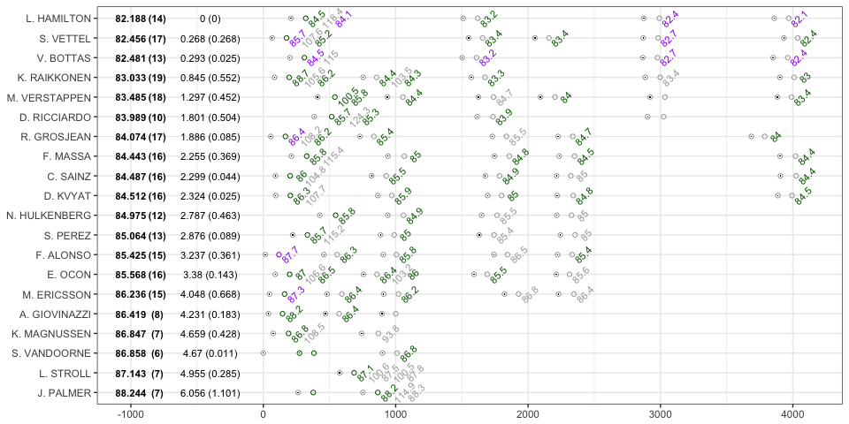

Re: the below - need to go from official timing sheets - website is random junk...

```r
source('fia_classification_scraper.R')
```

```
## Loading required package: xml2
```

```r
source('qualicharts.R')
##Session classifications page
xx=pageGrabber('http://www.fia.com/events/fia-formula-one-world-championship/season-2015/session-classifications-8')
```

```
## Warning: 'html' is deprecated.
## Use 'read_html' instead.
## See help("Deprecated")
```

quali_slopegraph

```r
qr=quali_progression_ergast_tx(ergastifyQualiClass(fiaSessionClassQualifyingTidy(fiaTableGrabber(xx,4))))
qrm=quali_progression_ergast_melt(qr)
core_qualifying_rank_slopegraph(qr,qrm,spacer=0.21)
```

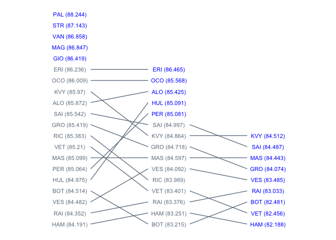

quali_slopegraph_time

```r
core_qualifying_time_slopegraph(qr,qrm,spacer=0.21)+ylim(92,96)
```

```
## Warning: Removed 2 rows containing missing values (geom_text).
```


quali_utilisationb

```r
source('qualicharts.R')
qlapsb=rawLap_augment_quali(qlaps)
qlapsb=quali_purplePatch(qlapsb)
g=plot_session_utilisation_chart(qlapsb,3)

qlapsc= read.csv("~/tmp/gbr_qualiClass.csv")
qlapsc$pos=as.integer(qlapsc$pos)
levels(qlapsc$name) =qlapsc$name[order(qlapsc$pos)]
g=g+scale_y_discrete(limits=rev(levels(qlapsc$name)))
g
```

```
## Warning: Removed 24 rows containing missing values (geom_point).
```

```
## Warning: Removed 12 rows containing missing values (geom_point).
```

```
## Warning: Removed 12 rows containing missing values (geom_text).
```

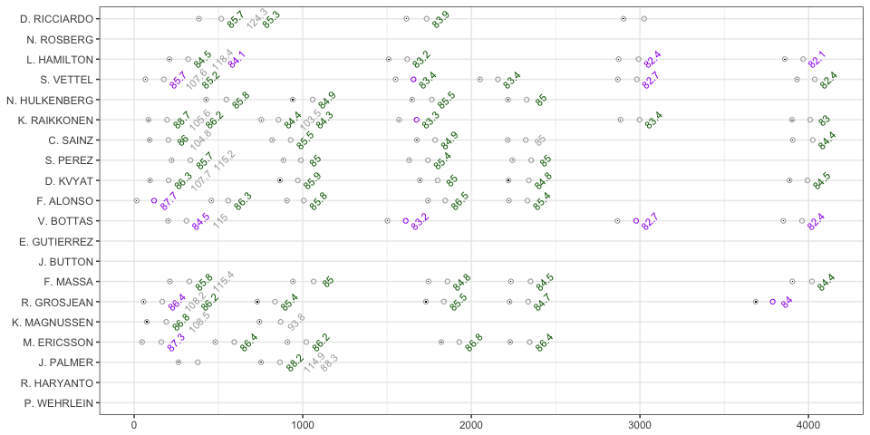

TEST

```r
library(grid)
library(gridExtra)
```

```
## Warning: package 'gridExtra' was built under R version 3.2.4
```

```r
grid.arrange(g, nrow=1,
             #top="My title", 
             bottom = textGrob("To learn how to create this chart: f1datajunkie.com",
                               gp = gpar(fontface=3, fontsize=9),
                               hjust=1, x=1))
```

```
## Warning: Removed 24 rows containing missing values (geom_point).
```

```
## Warning: Removed 12 rows containing missing values (geom_point).
```

```
## Warning: Removed 12 rows containing missing values (geom_text).
```

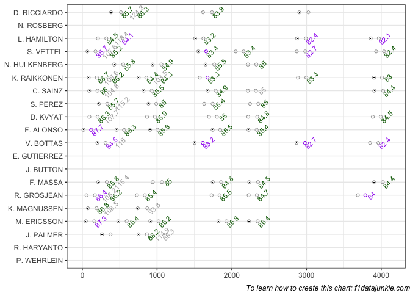

qualisessionplot

```r
qlapsb=quali_purplePatch(qlapsb)
#TO DO
#The rank ordering and gap calculations need changing for qualifying
quali_session_times_plots(qlapsb)
```

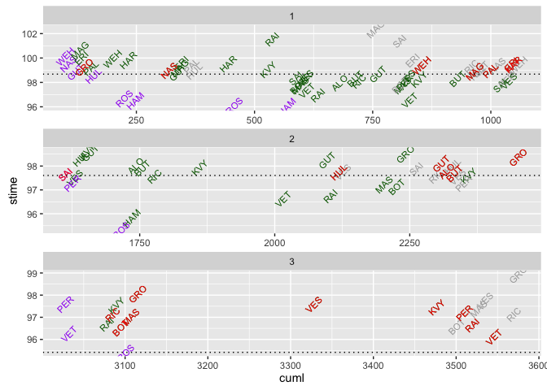

quali1_cutoff

```r
quali_session_times_plots(qlapsb[qlapsb['qsession']==1,],FALSE,FALSE,TRUE,c(15,8,2))+theme_bw()
```

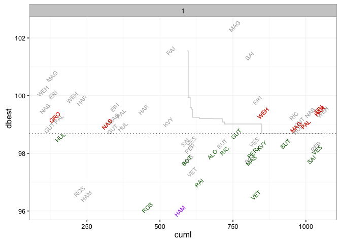

quali2_cutoff

```r
quali_session_times_plots(qlapsb[qlapsb['qsession']==2,],FALSE,FALSE,TRUE,c(15,8,2))+theme_bw()
```

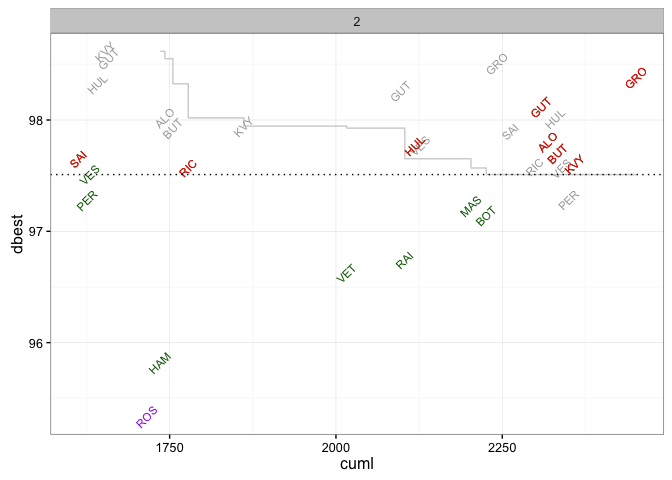

quali3_cutoff

```r
quali_session_times_plots(qlapsb[qlapsb['qsession']==3,],FALSE,FALSE,TRUE,c(15,8,2))+theme_bw()
```

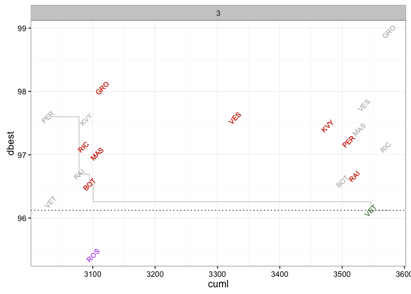


```r
#qr=qualiResults.df(2015,2)
#qr=quali_progression_ergast_tx(qr)
#qrm=quali_progression_ergast_melt(qr)
#core_qualifying_rank_slopegraph(qr,qrm,spacer=0.21)
```


```r
source("code_battlemap.R")
lapTimes=lapsData.df(2016,1)
lapTimes=battlemap_encoder(lapTimes)
```


```r
#Grab some data
#lapTimes =lapsData.df(2015,7)
 
#Process the laptimes
#lapTimes=battlemap_encoder(lapTimes)
 
#Find the accumulated race time at the start of each leader's lap
lapTimes=ddply(lapTimes,.(leadlap),transform,lstart=min(acctime))
 
#Find the on-track gap to leader
lapTimes['trackdiff']=lapTimes['acctime']-lapTimes['lstart']
 
#Construct a dataframe that contains the difference between the 
#leader accumulated laptime on current lap and next lap
#i.e. how far behind current lap leader is next-lap leader?
ll=data.frame(t=diff(lapTimes[lapTimes['position']==1,'acctime']))
#Generate a de facto lap count
ll['n']=1:nrow(ll)
#Grab the code of the lap leader on the next lap
ll['c']=lapTimes[lapTimes['position']==1 & lapTimes['lap']>1,'code']
 
#Plot the on-track gap to leader versus leader lap
g = ggplot(lapTimes) 
g=g+geom_text(data=lapTimes[lapTimes['position']==1,],aes(x=-3,y=leadlap,label=code),size=2)
g = g + geom_point(aes(x=trackdiff,y=leadlap,col=(lap==leadlap)), pch=1)
g = g + geom_point(data=lapTimes[lapTimes['driverId']=='bottas',],
                  aes(x=trackdiff,y=leadlap), pch='+')
g = g + geom_text(data=lapTimes[lapTimes['lapsbehind']>0,],
                  aes(x=trackdiff,y=leadlap, label=lapsbehind),size=3)
g = g + geom_point(data=ll,aes(x=t, y=n), pch='x')
g = g + geom_text(data=ll,aes(x=t+3, y=n,label=c), size=2)
g = g + geom_vline(aes(xintercept=19), linetype=3)
g+xlim(-4,125)+ guides(colour=FALSE)
```

```
## Warning: Removed 14 rows containing missing values (geom_point).
```

```
## Warning: Removed 1 rows containing missing values (geom_point).
```

```
## Warning: Removed 1 rows containing missing values (geom_text).
```

```
## Warning: Removed 2 rows containing missing values (geom_point).
```

```
## Warning: Removed 2 rows containing missing values (geom_text).
```

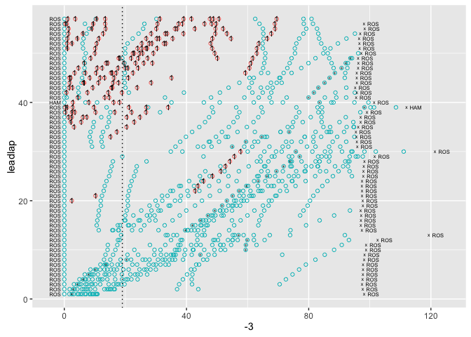

Find purple times:


lapTimes=arrange(lapTimes,acctime)
#Purple time can't be on an inlap or an outlap
#?? and outlap is the lap after  pitstop:
p=pitsData.df(2015,9)
#merge pitdata with lapsdata
lapTimesp=merge(lapTimes,p,by = c('lap','driverId'),all.x=T)
#flag pit laps
lapTimesp$ps = ifelse(is.na(lapTimesp$milliseconds), F, T)
#do an offset on the laps that are pitstops for each driver
lapTimesp=ddply(lapTimesp, .(driverId),transform,outlap=c(FALSE, head(ps,-1)))

#identify lap before pit lap
lapTimesp=arrange(lapTimesp,-acctime)
#lapTimesp['prelap']=c(FALSE, diff(lapTimesp[['ps']])==-1)
lapTimesp=ddply(lapTimesp, .(driverId),transform,prelap=c(FALSE, head(ps,-1)))
lapTimesp=arrange(lapTimesp,acctime)

library(sqldf)
#find undercut

d1 outlap on lap X, d2 outlap on lap X+1
d1 prelap on lap X-2, d1 !=d2
d1 pos on X-2 > d2 pos on X-2
d1 pos on X+1 < d2 pos on X+1

#donlt use this?
ss=sqldf('select d1a.driverId,d2a.driverId,d1a.lap,d1a.position,d2a.position, d1b.lap,d1b.position,d2b.position from lapTimesp d1a, lapTimesp d1b, lapTimesp d2a, lapTimesp d2b where d1a.driverId=d1b.driverId and d2a.driverId=d2b.driverId and d1a.driverId!=d2a.driverId and d1a.prelap and d1a.lap=d2a.lap and d2b.outlap and d2b.lap=d1b.lap and d1a.lap=d1b.lap-3 and d1a.position>d2a.position and d1b.position < d2b.position')


#use this?
#This one gives us a window of laps within which the undercut must take place
#the 2 outlap lap is at least 3 more than the 1 prelap (0:prelap/., 1:ps/.,2:outlap/ps 3:./outlap)
ss=sqldf('select d1a.driverId,d2a.driverId,d1a.lap,d1a.position,d2a.position, d1b.lap,d1b.position,d2b.position from lapTimesp d1a, lapTimesp d1b, lapTimesp d2a, lapTimesp d2b where d1a.driverId=d1b.driverId and d2a.driverId=d2b.driverId and d1a.driverId!=d2a.driverId and d1a.prelap and d1a.lap=d2a.lap and d2b.outlap and d2b.lap=d1b.lap and (d1a.lap+3<=d1b.lap and d1b.lap<=d1a.lap+2+5) and d1a.position>d2a.position and d1b.position < d2b.position')

#also other strategy of staying out longer time from behind and then coming out in front?

lapTimes['ptime']=cummin(lapTimes['rawtime']+900*lapTimes['pitflag']++900*lapTimes['outlapflag'])
lapTimes['purple']=(lapTimes['ptime']==lapTimes['rawtime'])
g+ geom_point(data=lapTimes[lapTimes['ptime']==TRUE,],aes(x=trackdiff,y=leadlap),colour='purple', pch=1)


```r
g = ggplot(lapTimes)
g=g+geom_text(data=lapTimes[lapTimes['position']==1,],aes(x=-1,y=leadlap,label=code),size=2)
g = g + geom_point(aes(x=trackdiff,y=leadlap,col=(lap==leadlap)), pch=1)
g = g + geom_point(data=lapTimes[lapTimes['driverId']=='vettel',],
                  aes(x=trackdiff,y=leadlap), pch='+')
g = g + geom_text(data=lapTimes[lapTimes['lapsbehind']>0,],
                  aes(x=trackdiff,y=leadlap, label=lapsbehind),size=3)
g = g + geom_vline(aes(xintercept=19), linetype=3)
g+xlim(-3,25)+ guides(colour=FALSE)
```

```
## Warning: Removed 577 rows containing missing values (geom_point).
```

```
## Warning: Removed 24 rows containing missing values (geom_text).
```

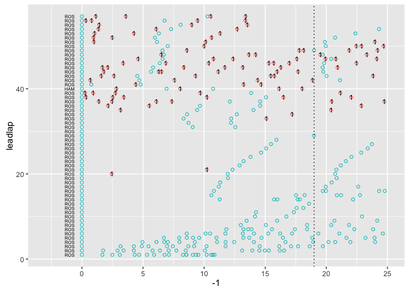
BOT

```r
battlemapFull_byDriver(lapTimes,'BOT',"2016 Australia - BOT's Race",c(-100,100))
```

```
## Scale for 'colour' is already present. Adding another scale for
## 'colour', which will replace the existing scale.
```

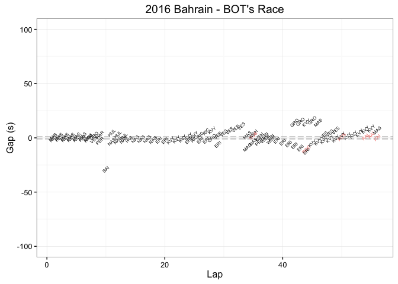

VET

```r
battlemapFull_byDriver(lapTimes,'VET',"2015 Silverstone - VET's Race",c(-23,23))
```

```
## Scale for 'colour' is already present. Adding another scale for
## 'colour', which will replace the existing scale.
```

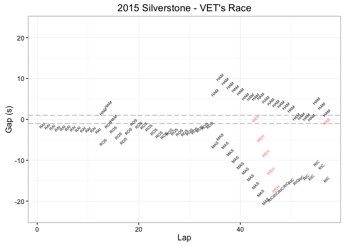

ROS

```r
battlemapFull_byDriver(lapTimes,'ROS',"2016 Australia - ROS's Race",c(-25,15))
```

```
## Scale for 'colour' is already present. Adding another scale for
## 'colour', which will replace the existing scale.
```

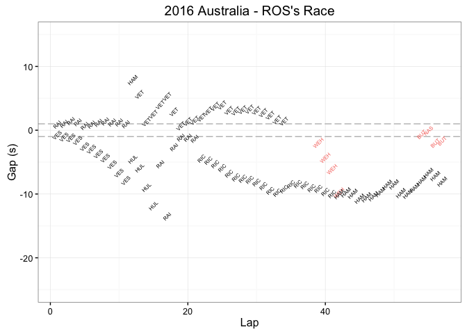


HAM

```r
battlemapFull_byDriver(lapTimes,'HAM',"2016 Australia - HAM's Race",c(-20,15))
```

```
## Scale for 'colour' is already present. Adding another scale for
## 'colour', which will replace the existing scale.
```

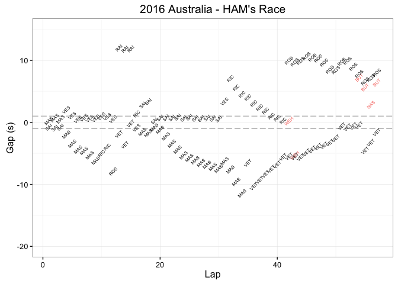

MAS

```r
battlemapFull_byDriver(lapTimes,'MAS',"2015 Silverstone - MAS's Race",c(-28,15))
```

```
## Scale for 'colour' is already present. Adding another scale for
## 'colour', which will replace the existing scale.
```

```
## Warning: Removed 11 rows containing missing values (geom_text).
```

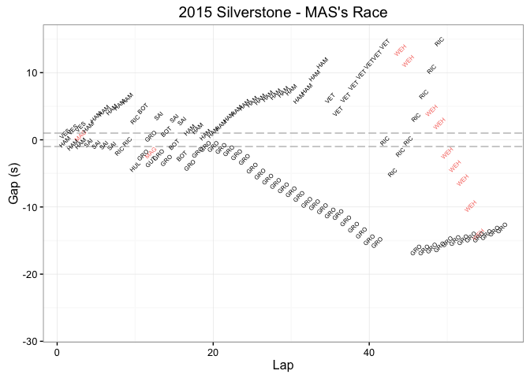


```r
battlemapFull_byDriver(lapTimes,'RAI',"2015 Silverstone - RAI's Race")
```

```
## Scale for 'colour' is already present. Adding another scale for
## 'colour', which will replace the existing scale.
```

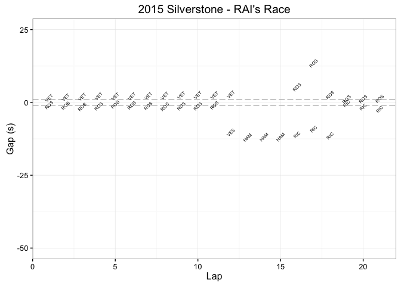


```r
battlemapFull_byDriver(lapTimes,'VES',"2015 Australia - VES's Race")
```

```
## Scale for 'colour' is already present. Adding another scale for
## 'colour', which will replace the existing scale.
```

```
## Warning: Removed 1 rows containing missing values (geom_text).

## Warning: Removed 1 rows containing missing values (geom_text).
```

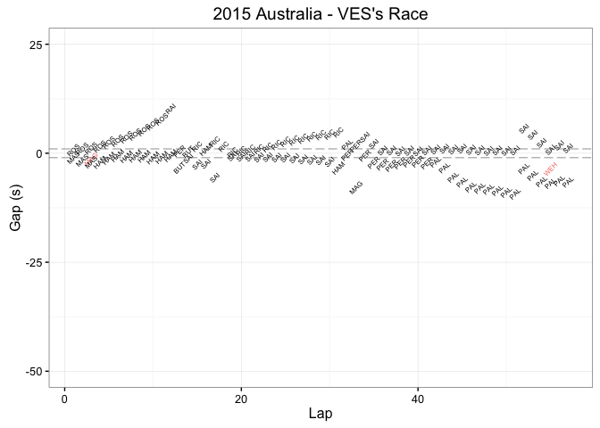


```r
#battlemapFull_byDriver(lapTimes,'GRO',"2015 Silverstone - GRO's Race")
```


```r
#battlemapFull_byDriver(lapTimes,'ALO',"2015 Silverstone - ALO's Race",c(-26,20))
```


```r
battlemapFull_byDriver(lapTimes,'SAI',"2015 Silverstone - SAI's Race",c(-26,20))
```

```
## Scale for 'colour' is already present. Adding another scale for
## 'colour', which will replace the existing scale.
```

```
## Warning: Removed 1 rows containing missing values (geom_text).

## Warning: Removed 1 rows containing missing values (geom_text).

## Warning: Removed 1 rows containing missing values (geom_text).

## Warning: Removed 1 rows containing missing values (geom_text).
```

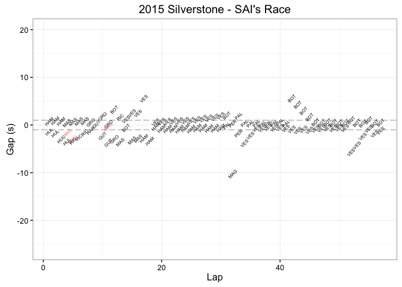


```r
battlemapFull_byDriver(lapTimes,'RIC',"2016 Australia - RIC's Race",c(-26,20))
```

```
## Scale for 'colour' is already present. Adding another scale for
## 'colour', which will replace the existing scale.
```

```
## Warning: Removed 5 rows containing missing values (geom_text).
```

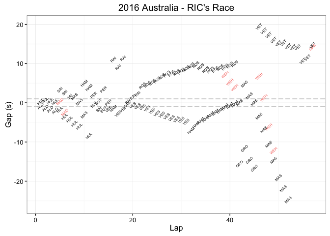


```r
battlemapFull_byDriver(lapTimes,'PAL',"2016 Australia - PAL's Race",c(-26,20))
```

```
## Scale for 'colour' is already present. Adding another scale for
## 'colour', which will replace the existing scale.
```

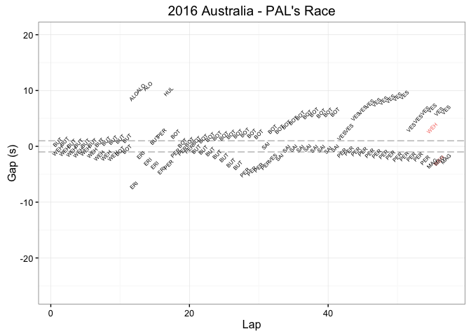


```r
battlemapFull_byDriver(lapTimes,'HUL',"2015 Silverstone - HUL's Race",c(-30,20))
```

```
## Scale for 'colour' is already present. Adding another scale for
## 'colour', which will replace the existing scale.
```

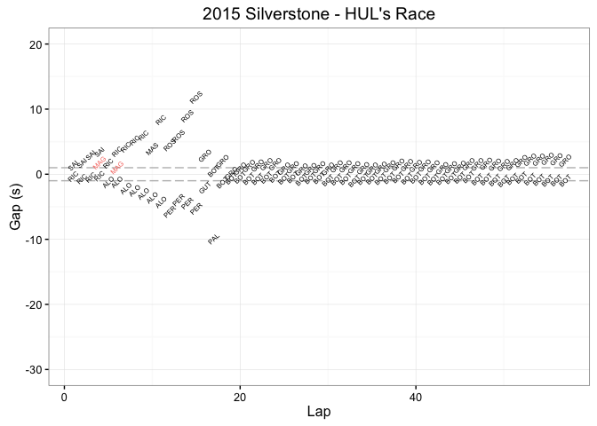


```r
#battlemapFull_byDriver(lapTimes,'KVY',"2015 Silverstone - KVY's Race",c(-20,25))
```

